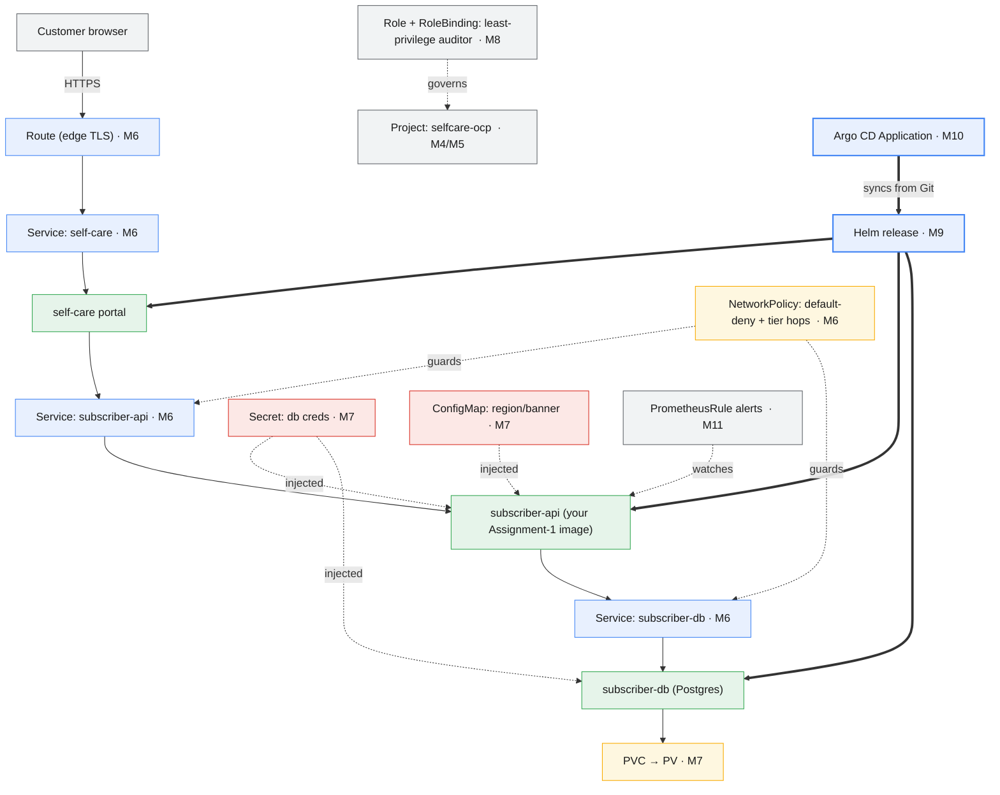

# Assignment 6 — Capstone: The Self-Care Stack on OpenShift

> **Capstone · Modules 4–11**
> **Telecom scenario:** Assignment 5 proved the self-care portal works as a
> Kubernetes-native service on minikube. Mobily now wants it **promoted to the
> real platform**: a production-shaped, three-tier service —
> **self-care portal → subscriber-api → subscriber-db** — reachable on a real
> OpenShift **Route**, running under the platform's security model, governed by
> RBAC, packaged as a **Helm** release, delivered by **GitOps**, and watched by
> **monitoring and logging**. This assignment is the integration point for
> everything **OpenShift adds on top of Kubernetes**: architecture &
> administration (M4–M5), networking (M6), storage & security (M7), authN/RBAC
> (M8), packaging (M9), GitOps/CI-CD (M10), and observability (M11).
>
> **Deliberately not repeated here:** container fundamentals, raw Pods,
> Deployments/Services mechanics, ConfigMaps/Secrets basics, and rolling
> updates/rollbacks — those are **Assignment 5's** territory (Modules 1–3) and
> are assumed as prerequisite skill, not re-taught. **Also out of scope:** etcd
> backup/restore, node cordon/drain, and `must-gather`-style troubleshooting —
> those are **Module 12's** day-2 territory. Its own (ungraded) course capstone
> lab takes *this exact stack* one step further: snapshot it, break it,
> diagnose it, and recover it. This assignment is what you hand Module 12 to
> break.

| | |
|---|---|
| **Maps to** | Everything in Modules 4–11 |
| **Prerequisite** | Assignment 5 (Modules 1–3 capstone) — same `selfcare-api` image, same skills, now on OpenShift |
| **Tools** | `oc` (OpenShift CLI) + `helm` |
| **Provided** | [`app/`](./app) (your `selfcare-api` image from Assignment 1) |
| **Difficulty** | ⭐⭐⭐⭐ Capstone · ~4–5 hrs (fine to split across two sessions) |
| **Weight** | 100 pts — the Modules 4–11 capstone assessment |

---

## Learning objectives

Integrate the OpenShift-specific half of the course the way Assignment 5
integrated the Kubernetes half. By the end you can take one tested container
image and turn it into a real OpenShift-native service: tenanted and quota'd
(M4–M5), exposed externally over TLS and locked down internally (M6), storing
secrets and data the platform's way (M7), governed by least-privilege RBAC
(M8), packaged and released with Helm (M9), delivered by GitOps instead of
`oc apply` (M10), and observable through alerts and logs (M11).

## Prerequisites

```bash
oc version --client        # 4.x expected
oc whoami                  # confirm you're logged in to the training cluster
oc get co | head           # ClusterOperators healthy? (a quick M4/M5 sanity check)
helm version                # 3.x expected
```

You need your own pushed `selfcare-api` image from **Assignment 1, Part D**
(`docker.io/<your-registry-user>/selfcare-api:1.0.0`, or the Quay.io
equivalent) — this capstone deploys the exact artifact you built and tested
there. If you no longer have it, rebuild and push it now; don't rebuild it
*for* OpenShift — the whole point of Module 1's digest-pinning is that the
same bytes run everywhere.

---

## The architecture — everything OpenShift adds



## Build target

```
capstone-ocp/
  helm/selfcare-capstone/
    Chart.yaml
    values.yaml
    templates/
      secret.yaml
      configmap.yaml
      pvc.yaml
      deployment-db.yaml
      deployment-api.yaml
      deployment-portal.yaml
      service-db.yaml
      service-api.yaml
      service-portal.yaml
      route.yaml
      networkpolicy.yaml
  rbac/
    role.yaml
    rolebinding.yaml
  admin/
    resourcequota.yaml
    limitrange.yaml
  observability/
    prometheusrule.yaml
  gitops/
    application.yaml
  runbook.md
```

---

## Tasks

### Phase 1 — Tenancy, cluster orientation & image promotion (M4–M5) (10 pts)

1. `oc get co` — confirm ClusterOperators are `Available=True, Degraded=False`.
   Explain in one sentence what a ClusterOperator is and how it differs from a
   plain Kubernetes controller.
2. `oc new-project selfcare-ocp`. Explain what a **Project** adds on top of a
   raw Kubernetes **Namespace**.
3. `resourcequota.yaml` — cap the project's total pods/CPU/memory.
   `limitrange.yaml` — set default container requests/limits so an un-sized
   Pod spec still gets sane values. This is the admin-lite side of running a
   shared cluster.
4. Confirm your Assignment-1 image is pullable in this project (reference it
   directly in the Deployment built in Phase 2 and watch it pull). In one or
   two sentences: how does an **ImageStream** (which OpenShift can wrap around
   this same external image with `oc import-image`) differ from referencing
   the registry path directly, and when would you reach for one?

### Phase 2 — Three-tier workload with storage & security (M7) (15 pts)

5. `secret.yaml` — `subscriber-db-creds` (username/password, placeholders).
   `configmap.yaml` — `SELFCARE_REGION`, `SELFCARE_BANNER`.
6. `pvc.yaml` — `subscriber-db-data`, `ReadWriteOnce`, 2Gi.
7. Three Deployments: `subscriber-db` (a Postgres image), `subscriber-api`
   (**your** `selfcare-api` image, `envFrom` the ConfigMap **and** Secret,
   `SELFCARE_API_KEY` also drawn from the Secret), `self-care` (a portal
   stand-in — plain `httpd-24` is fine; you are not writing a UI for this
   course). Deployment/probe/resource mechanics are assumed from Assignment 5
   — spend your effort here on the config/storage wiring, not re-deriving how
   a Deployment works.
8. Confirm every Pod runs under the default **restricted-v2 SCC** without you
   doing anything special: `oc get pod -o jsonpath='{.items[*].spec.securityContext}'`
   should show a non-root `runAsUser`/`runAsNonRoot: true` assigned by the
   platform. Why did Assignment 1's choice of the `ubi9/python-39` base image
   (which already runs as a non-root UID) make this a non-event here?

### Phase 3 — Networking: Route + NetworkPolicy (M6) (15 pts)

9. A `Service` per tier (ClusterIP — mechanics from Assignment 5). A
   **Route** (`edge` TLS) on `self-care` **only** — `subscriber-api` and
   `subscriber-db` stay internal.
10. Reach the portal by its Route host:
    `curl -sk https://$(oc get route self-care -o jsonpath='{.spec.host}')`.
11. `networkpolicy.yaml` — a **default-deny** policy for the project, plus
    two allow rules: `self-care → subscriber-api` and
    `subscriber-api → subscriber-db`, each on the exact port. Prove the
    isolation: exec into the portal Pod and show it **cannot** reach
    `subscriber-db` directly, only through `subscriber-api`.
12. Written: how does a **Route** differ from a Kubernetes **Ingress**, and
    why did only `self-care` get one?

### Phase 4 — AuthN & RBAC (M8) (10 pts)

13. `role.yaml` — a `Role` `selfcare-auditor` granting `get/list/watch` on
    `pods`, `services`, `deployments`, and `routes` — nothing else.
    `rolebinding.yaml` binds it to a group `selfcare-auditors` (or a second
    test user if you have one).
14. Prove least privilege with `oc auth can-i`: the bound identity **can**
    `list pods` but **cannot** `delete deployments`, in this Project.
15. Written: why a namespaced `Role`/`RoleBinding` here instead of a
    `ClusterRole`/`ClusterRoleBinding`? When would this auditor need the
    cluster-scoped version instead?

### Phase 5 — Package & operate with Helm (M9) (18 pts)

16. `helm create selfcare-capstone`, then replace/add templates so the chart
    renders **all** of Phases 2–3's objects (Secret, ConfigMap, PVC, three
    Deployments, three Services, the Route, the NetworkPolicies) from
    `values.yaml` (image references, replica counts, region/banner, route
    host).
17. `helm lint` (must pass) and `helm template` it **offline** — confirm the
    rendered `subscriber-api` replica count and image reference match your
    values.
18. `helm install selfcare ./helm/selfcare-capstone`. Then `helm upgrade`
    with a changed value (e.g. `--set subscriberApi.replicaCount=3`) and
    confirm the change lands **without hand-editing any manifest**.
19. **Operate a release, not a raw Deployment:** build/push
    `selfcare-api:1.1.0` (image mechanics from Assignment 1/3), point
    `subscriberApi.image` at it via `helm upgrade`, and prove **zero dropped
    requests** through the Route during the release (curl-loop). Then
    `helm rollback` to the previous revision and confirm `/version` is back to
    `1.0.0` — this is the Helm-managed equivalent of Assignment 3's
    `rollout undo`, now at the release level instead of the Deployment level.
20. Written: this course also covers **Operators** (OLM) for packaging. Why
    would a real Mobily platform team install `subscriber-db` from an
    **Operator** (e.g. a Postgres Operator) instead of the plain Deployment
    you wrote in Phase 2, once it's out of a training exercise?

### Phase 6 — GitOps with Argo CD (M10) (12 pts)

21. Commit the `helm/selfcare-capstone/` chart to a Git repo (your fork of
    this course repo, or any repo you control).
22. `application.yaml` — an Argo CD `Application` pointing at that path,
    targeting your `selfcare-ocp` Project, with
    `syncPolicy.automated.selfHeal: true`.
23. Confirm `oc get application selfcare -n openshift-gitops` reports
    **Synced / Healthy**.
24. **Prove self-heal:** delete the Route by hand
    (`oc delete route self-care`). Show Argo CD recreates it without you
    re-applying anything, and explain in writing why this is safer than a
    human re-running `oc apply` from memory.

### Phase 7 — Observability: monitoring & logging (M11) (15 pts)

25. `prometheusrule.yaml` — one alert that fires when `subscriber-api` has
    **zero available replicas** for 2+ minutes, and one that fires on
    **repeated pod restarts**. (This uses cluster-level metrics already
    scraped by OpenShift monitoring — `subscriber-api` doesn't expose its own
    `/metrics`, so this is availability/restart alerting, not app-metric
    alerting. Needs **User Workload Monitoring** enabled — pair with your
    instructor if it isn't.)
26. Trigger one of the two alerts on purpose
    (e.g. `oc scale deploy/subscriber-api --replicas=0`), watch it fire in
    the console's **Alerting** view, then fix it and confirm it clears.
27. Use `oc logs` against `subscriber-api` to find the access-log line for
    **one specific MSISDN lookup** you made in Phase 2/3. Written: what would
    change about this query if the pod had already been rescheduled — and how
    does a cluster-wide logging stack (Module 11's guide) solve that?

### Phase 8 — Runbook (5 pts)

28. Write `runbook.md`: how to deploy this stack from scratch (`helm install`
    + the Argo CD `Application`), how to roll back a release, the three `oc`
    commands you'd run first if the portal's Route returned `503`, and where
    config vs. secrets vs. RBAC live in this stack.

---

## Deliverables

The full `capstone-ocp/` folder plus `submission-06.md` containing: the
architecture (a short Mermaid diagram or 3-line text is fine), command
transcripts for each phase, the `oc auth can-i` proof, the NetworkPolicy
isolation proof, the Argo CD `Synced/Healthy` output and self-heal proof, the
fired-then-cleared alert, the zero-downtime curl-loop, the `helm rollback`
evidence, written answers to every "Written" task, and your `runbook.md`.

---

## Validation (self-check)

```bash
HOST=$(oc get route self-care -n selfcare-ocp -o jsonpath='{.spec.host}')

# Phase 2 — all tiers Ready:
oc get deploy -n selfcare-ocp -o custom-columns=NAME:.metadata.name,READY:.status.readyReplicas

# Phase 2 — restricted-v2, non-root, no special SCC requested:
oc get pod -n selfcare-ocp -o jsonpath='{.items[0].spec.securityContext.runAsNonRoot}'   # true

# Phase 3 — reachable via the Route, with endpoints behind it:
curl -sk "https://$HOST/healthz" | grep -q ok && echo "PASS route"
oc get endpoints self-care -n selfcare-ocp -o jsonpath='{.subsets}' | grep -q addresses && echo "PASS endpoints"

# Phase 3 — NetworkPolicy blocks the portal from reaching the db directly:
oc exec -n selfcare-ocp deploy/self-care -- sh -c 'curl -m 3 -s subscriber-db:5432' ; echo "exit=$? (nonzero = blocked, expected)"

# Phase 4 — least privilege:
oc auth can-i list pods -n selfcare-ocp --as=selfcare-auditors            # yes (group-bound)
oc auth can-i delete deployments -n selfcare-ocp --as=selfcare-auditors   # no

# Phase 5 — Helm chart is valid offline:
helm lint ./helm/selfcare-capstone

# Phase 6 — GitOps:
oc get application selfcare -n openshift-gitops     # Synced  Healthy

# Phase 7 — alert defined:
oc get prometheusrule -n selfcare-ocp

# Phase 5/19 — zero-downtime release upgrade (run during `helm upgrade` in another shell):
end=$((SECONDS+45)); bad=0
while [ $SECONDS -lt $end ]; do
  c=$(curl -sk -o /dev/null -w '%{http_code}' "https://$HOST/healthz")
  [ "$c" = "200" ] || bad=$((bad+1)); sleep 0.2
done; echo "failed=$bad"     # PASS when 0
```

---

## Grading rubric (100 pts)

| Phase | Criteria | Pts |
|---|---|---|
| 1 | ClusterOperators checked; Project + ResourceQuota + LimitRange in place, both explained; ImageStream question answered | 10 |
| 2 | 3-tier stack Ready; Secret/ConfigMap wired; PVC bound; restricted-v2 SCC compliance shown + explained | 15 |
| 3 | Route reachable; only the portal exposed; NetworkPolicy isolation proven; Route-vs-Ingress explained | 15 |
| 4 | Least-privilege Role/RoleBinding proven with `oc auth can-i`; scoping question answered | 10 |
| 5 | Chart lints and renders offline; install/upgrade via values only; zero-downtime release + rollback; Operator-vs-Helm question answered | 18 |
| 6 | Argo CD reports Synced/Healthy; self-heal proven and explained | 12 |
| 7 | Both alerts defined; one triggered and cleared; log query performed; cluster-logging question answered | 15 |
| 8 | Clear, correct runbook | 5 |
| **Total** | | **100** |

> Deductions: any committed real secret/credential (−10, automatic); a stack
> only reachable via `port-forward`/never through the Route (−5); a release
> upgrade that drops requests (−5); RBAC proof that grants more than
> `get/list/watch` (−5).

---

## Stretch goals (not graded)

- Swap `subscriber-db` for an Operator-installed Postgres (OperatorHub, if
  your cluster's catalog has one) instead of a plain Deployment, and compare
  the day-2 experience (backups, minor-version upgrades) to what you
  hand-rolled.
- Add a second Argo CD environment (`selfcare-staging`) from the same chart
  with different `values-staging.yaml` — one chart, two environments, no
  duplicated YAML.
- Use **OpenShift Service Mesh** to canary `subscriber-api` 1.1.0 at 10% of
  traffic before a full rollout (M10's traffic-management content).
- Preview **Module 12**: what would an **OADP** backup of this Project
  protect that the Argo CD Git source does not?

---

<details>
<summary><strong>✅ Reference solution — key manifests</strong> (attempt first)</summary>

**admin/resourcequota.yaml + admin/limitrange.yaml**
```yaml
apiVersion: v1
kind: ResourceQuota
metadata: { name: selfcare-quota, namespace: selfcare-ocp }
spec:
  hard:
    pods: "20"
    requests.cpu: "2"
    requests.memory: 2Gi
    limits.cpu: "4"
    limits.memory: 4Gi
---
apiVersion: v1
kind: LimitRange
metadata: { name: selfcare-limits, namespace: selfcare-ocp }
spec:
  limits:
    - type: Container
      default: { cpu: 250m, memory: 128Mi }
      defaultRequest: { cpu: 50m, memory: 64Mi }
```

**helm/selfcare-capstone/templates/secret.yaml + configmap.yaml (snippet)**
```yaml
apiVersion: v1
kind: Secret
metadata: { name: subscriber-db-creds, namespace: {{ .Release.Namespace }} }
type: Opaque
stringData:
  username: {{ .Values.db.username | quote }}
  password: {{ .Values.db.password | quote }}   # placeholder in values.yaml — never a real password
---
apiVersion: v1
kind: ConfigMap
metadata: { name: selfcare-config, namespace: {{ .Release.Namespace }} }
data:
  SELFCARE_REGION: {{ .Values.region | quote }}
  SELFCARE_BANNER: {{ .Values.banner | quote }}
```

**helm/selfcare-capstone/templates/deployment-api.yaml (snippet)**
```yaml
apiVersion: apps/v1
kind: Deployment
metadata: { name: subscriber-api, namespace: {{ .Release.Namespace }}, labels: { app: subscriber-api } }
spec:
  replicas: {{ .Values.subscriberApi.replicaCount }}
  selector: { matchLabels: { app: subscriber-api } }
  strategy: { type: RollingUpdate, rollingUpdate: { maxUnavailable: 0, maxSurge: 1 } }
  template:
    metadata: { labels: { app: subscriber-api } }
    spec:
      containers:
        - name: subscriber-api
          image: "{{ .Values.subscriberApi.image }}"
          envFrom:
            - configMapRef: { name: selfcare-config }
            - secretRef: { name: subscriber-db-creds }
          readinessProbe: { httpGet: { path: /healthz, port: 8080 }, initialDelaySeconds: 2 }
          livenessProbe:  { httpGet: { path: /healthz, port: 8080 }, initialDelaySeconds: 5 }
          resources:
            requests: { cpu: 50m, memory: 64Mi }
            limits:   { cpu: 250m, memory: 128Mi }
```

**helm/selfcare-capstone/templates/route.yaml**
```yaml
apiVersion: route.openshift.io/v1
kind: Route
metadata: { name: self-care, namespace: {{ .Release.Namespace }} }
spec:
  {{- if .Values.route.host }}
  host: {{ .Values.route.host }}
  {{- end }}
  port: { targetPort: 80 }
  tls: { termination: edge }
  to: { kind: Service, name: self-care }
```

**helm/selfcare-capstone/templates/networkpolicy.yaml**
```yaml
apiVersion: networking.k8s.io/v1
kind: NetworkPolicy
metadata: { name: default-deny-all, namespace: {{ .Release.Namespace }} }
spec: { podSelector: {}, policyTypes: [Ingress] }
---
apiVersion: networking.k8s.io/v1
kind: NetworkPolicy
metadata: { name: allow-portal-to-api, namespace: {{ .Release.Namespace }} }
spec:
  podSelector: { matchLabels: { app: subscriber-api } }
  ingress:
    - from: [{ podSelector: { matchLabels: { app: self-care } } }]
      ports: [{ protocol: TCP, port: 8080 }]
---
apiVersion: networking.k8s.io/v1
kind: NetworkPolicy
metadata: { name: allow-api-to-db, namespace: {{ .Release.Namespace }} }
spec:
  podSelector: { matchLabels: { app: subscriber-db } }
  ingress:
    - from: [{ podSelector: { matchLabels: { app: subscriber-api } } }]
      ports: [{ protocol: TCP, port: 5432 }]
```

**rbac/role.yaml + rolebinding.yaml**
```yaml
apiVersion: rbac.authorization.k8s.io/v1
kind: Role
metadata: { name: selfcare-auditor, namespace: selfcare-ocp }
rules:
  - apiGroups: [""]        resources: [pods, services]    verbs: [get, list, watch]
  - apiGroups: ["apps"]    resources: [deployments]        verbs: [get, list, watch]
  - apiGroups: ["route.openshift.io"] resources: [routes]  verbs: [get, list, watch]
---
apiVersion: rbac.authorization.k8s.io/v1
kind: RoleBinding
metadata: { name: selfcare-auditor-binding, namespace: selfcare-ocp }
roleRef: { apiGroup: rbac.authorization.k8s.io, kind: Role, name: selfcare-auditor }
subjects:
  - apiGroup: rbac.authorization.k8s.io
    kind: Group
    name: selfcare-auditors
```

**observability/prometheusrule.yaml**
```yaml
apiVersion: monitoring.coreos.com/v1
kind: PrometheusRule
metadata: { name: subscriber-api-alerts, namespace: selfcare-ocp }
spec:
  groups:
    - name: selfcare-capstone
      rules:
        - alert: SubscriberAPIDown
          expr: kube_deployment_status_replicas_available{namespace="selfcare-ocp", deployment="subscriber-api"} < 1
          for: 2m
          labels: { severity: critical }
          annotations: { summary: "subscriber-api has no available replicas" }
        - alert: SubscriberAPICrashLooping
          expr: increase(kube_pod_container_status_restarts_total{namespace="selfcare-ocp", pod=~"subscriber-api-.*"}[15m]) > 3
          labels: { severity: warning }
          annotations: { summary: "subscriber-api pod restarting repeatedly" }
```

**gitops/application.yaml**
```yaml
apiVersion: argoproj.io/v1alpha1
kind: Application
metadata: { name: selfcare, namespace: openshift-gitops }
spec:
  project: default
  source:
    repoURL: https://github.com/<you>/mobily-ocp.git
    path: assessments/capstone-ocp/helm/selfcare-capstone
    targetRevision: main
  destination: { server: https://kubernetes.default.svc, namespace: selfcare-ocp }
  syncPolicy: { automated: { prune: true, selfHeal: true } }
```

```bash
# Phase 1
oc get co
oc new-project selfcare-ocp
oc apply -f admin/resourcequota.yaml -f admin/limitrange.yaml

# Phase 2–3 via Helm (Phase 5 builds the chart; apply it here to stand the stack up)
helm install selfcare ./helm/selfcare-capstone \
  --set subscriberApi.image=docker.io/<your-registry-user>/selfcare-api:1.0.0
oc get deploy,svc,route,networkpolicy -n selfcare-ocp

# Phase 3 validation
HOST=$(oc get route self-care -n selfcare-ocp -o jsonpath='{.spec.host}')
curl -sk https://$HOST/healthz
oc exec -n selfcare-ocp deploy/self-care -- sh -c 'curl -m 3 -s subscriber-db:5432' ; echo "exit=$?"

# Phase 4
oc apply -f rbac/role.yaml -f rbac/rolebinding.yaml
oc auth can-i list pods -n selfcare-ocp --as=selfcare-auditors
oc auth can-i delete deployments -n selfcare-ocp --as=selfcare-auditors

# Phase 5 (offline, before install)
helm lint ./helm/selfcare-capstone
helm template selfcare ./helm/selfcare-capstone | grep -E 'replicas:|image:'
helm upgrade selfcare ./helm/selfcare-capstone --set subscriberApi.replicaCount=3

# Phase 5/19 — release upgrade + rollback
podman build --no-cache --build-arg APP_VERSION=1.1.0 -t selfcare-api:1.1.0 assessments/app
podman push selfcare-api:1.1.0 docker.io/<your-registry-user>/selfcare-api:1.1.0
helm upgrade selfcare ./helm/selfcare-capstone \
  --set subscriberApi.image=docker.io/<your-registry-user>/selfcare-api:1.1.0   # watch with the curl loop
helm rollback selfcare 1
helm history selfcare

# Phase 6
oc apply -f gitops/application.yaml
oc get application selfcare -n openshift-gitops
oc delete route self-care -n selfcare-ocp   # self-heal proof
sleep 30 && oc get route self-care -n selfcare-ocp   # Argo CD recreated it

# Phase 7
oc apply -f observability/prometheusrule.yaml
oc scale deploy/subscriber-api -n selfcare-ocp --replicas=0   # trigger SubscriberAPIDown
oc scale deploy/subscriber-api -n selfcare-ocp --replicas=2   # clear it
oc logs -n selfcare-ocp deploy/subscriber-api | grep 966500000001
```

**Key point:** every object here is new territory — this assignment's whole
point is that **OpenShift composes on top of** the Kubernetes skills
Assignment 5 already proved you have. A Project quota'd and RBAC-governed
(M4/M5/M8) hosts a Route-and-NetworkPolicy-shaped network (M6) around Pods
that get their identity from the platform's SCC and their config from
Secrets/ConfigMaps on durable storage (M7), the whole thing packaged as one
Helm release (M9) that Git — not you — keeps in sync (M10), while alerts and
logs tell you whether it's actually healthy (M11). That composition **is**
what "running OpenShift" means.
</details>

---

> **◐ Partially verified — 2026-07-09.** Every manifest shape above
> (ResourceQuota, LimitRange, Secret, PVC, all three Deployments, all three
> Services, the edge-TLS Route, both NetworkPolicies, the Role/RoleBinding, and
> the `oc auth can-i` syntax) was rendered for real with
> `oc create --dry-run=client -o yaml` against a live OpenShift session on
> this course's training cluster (oc 4.22 client / 4.18 server) — that YAML is
> real output, not hand-typed. The default SCC (`restricted-v2`, non-root,
> non-privileged) and its effect (an existing pod's `securityContext` showing
> `runAsNonRoot: true`) were confirmed live on the same cluster. **Not**
> live-tested in this pass: standing up a scratch project (out of scope for
> authoring this document), the Helm chart (`helm` is not installed in this
> authoring environment — its templates mirror the oc-verified shapes but were
> not `helm template`-rendered), the Argo CD `Application` (the GitOps
> Operator's install is cluster-admin, per Module 10), and the
> `PrometheusRule` alert firing (needs User Workload Monitoring enabled).
> Validate those live in your own Project — pair with your instructor for the
> Argo CD and UWM prerequisites.
