# Module 1 — Container Fundamentals & Runtime Refresher

> **Course:** OpenShift Container Platform
> **Module objective:** Understand containerization principles and the runtime
> foundations that Kubernetes and OpenShift are built on — core concepts,
> architecture, and cloud-native application deployment models.

---

## Table of contents

1. [Why this module matters](#1-why-this-module-matters)
2. [Evolution of application deployment](#2-evolution-of-application-deployment)
3. [Virtual Machines vs Containers](#3-virtual-machines-vs-containers)
4. [Container architecture & OCI concepts](#4-container-architecture--oci-concepts)
5. [Images, registries & the container lifecycle](#5-images-registries--the-container-lifecycle)
6. [Docker and Podman overview](#6-docker-and-podman-overview)
7. [Container networking fundamentals](#7-container-networking-fundamentals)
8. [Container storage fundamentals](#8-container-storage-fundamentals)
9. [Bridging to Kubernetes & OpenShift](#9-bridging-to-kubernetes--openshift)
10. [Key takeaways](#10-key-takeaways)
11. [Glossary](#11-glossary)
12. [References](#12-references)

> **How to read the diagrams:** Diagrams are written in [Mermaid](https://mermaid.js.org/),
> which renders automatically in GitHub, VS Code (with a Mermaid extension), and most
> modern Markdown viewers. If a diagram appears as code, install/enable a Mermaid
> preview to see the rendered version.

---

## 1. Why this module matters

OpenShift is an **enterprise Kubernetes platform**, and Kubernetes is a
**container orchestrator**. You cannot reason about pods, deployments, scaling,
or scheduling without first understanding the unit they all manage: the
**container**.

This module builds the mental model from the ground up:

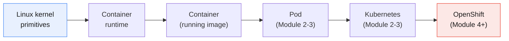

Everything to the right of "container" is **orchestration** — automating where
containers run, how they are connected, scaled, healed, and updated. Master the
left side here, and the rest of the course becomes far easier.

---

## 2. Evolution of application deployment

Understanding _why_ containers exist requires looking at the problems each
previous era left unsolved.

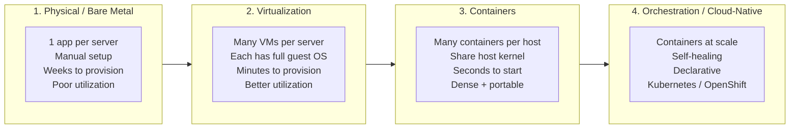

| Era                | What ran the app     | Isolation unit            | Boot time  | Density              | Key pain solved                                           | New pain introduced                           |
| ------------------ | -------------------- | ------------------------- | ---------- | -------------------- | --------------------------------------------------------- | --------------------------------------------- |
| **Bare metal**     | Physical server      | The whole machine         | Days/weeks | 1 app/server         | —                                                         | Wasted capacity, slow, hard to scale          |
| **Virtualization** | Hypervisor + VM      | Virtual machine           | Minutes    | Several VMs/host     | Utilization, faster provisioning                          | Heavy (each VM = full OS), GBs in size        |
| **Containers**     | Container runtime    | Process + namespaces      | Seconds    | Dozens–hundreds/host | Lightweight, portable, fast, "works on my machine" solved | Managing _many_ containers manually           |
| **Orchestration**  | Kubernetes/OpenShift | Pod (group of containers) | Seconds    | Cluster-wide         | Scheduling, scaling, healing, networking at scale         | Platform complexity (the rest of this course) |

### The core insight

Each era **shrank the unit of deployment and sped up its lifecycle**:

- Bare metal → an app was tied to a _physical machine_.
- VMs → an app was tied to a _virtual machine_ (still a full OS).
- Containers → an app is packaged as an _image_ and runs as an _isolated
  process_, carrying its own dependencies but sharing the host kernel.

> **The "works on my machine" problem.** Before containers, an app worked in dev
> but failed in production because the environments differed (library versions,
> OS packages, config). A container image **packages the application together
> with its dependencies**, so the same artifact runs identically from a laptop to
> a production cluster. This portability is the single biggest reason containers
> won.

---

## 3. Virtual Machines vs Containers

This is the most important comparison in the module. Both provide **isolation**,
but they isolate at completely different layers.

### Architectural difference

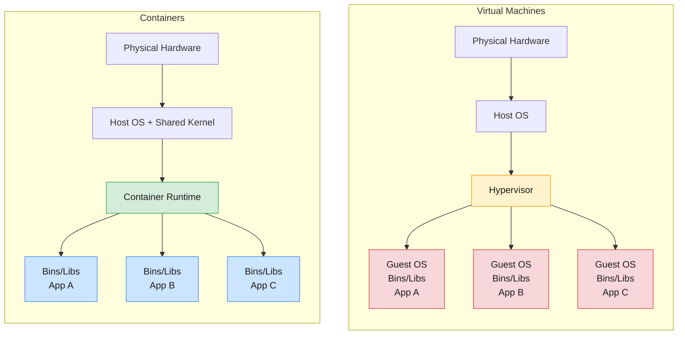

**The decisive difference:** A VM virtualizes **hardware** and each VM ships a
**full guest operating system (its own kernel)**. A container virtualizes the
**operating system** — all containers **share the host's single kernel** and
ship only the application plus its user-space dependencies (bins/libs).

That one difference cascades into every practical distinction below.

### Side-by-side comparison

| Dimension              | Virtual Machine                      | Container                                                            |
| ---------------------- | ------------------------------------ | -------------------------------------------------------------------- |
| **Isolation boundary** | Hardware (via hypervisor)            | OS / process (via kernel namespaces + cgroups)                       |
| **Guest OS**           | Full OS + own kernel per VM          | None — shares host kernel                                            |
| **Size**               | Gigabytes                            | Megabytes                                                            |
| **Startup time**       | Seconds–minutes                      | Milliseconds–seconds                                                 |
| **Density per host**   | Few–dozens                           | Dozens–hundreds                                                      |
| **Overhead**           | High (full OS per VM)                | Low (thin process wrapper)                                           |
| **Isolation strength** | Stronger (hardware-level)            | Strong, but weaker than VMs (shared kernel)                          |
| **Portability**        | Heavy images, less portable          | Lightweight, highly portable                                         |
| **OS flexibility**     | Any OS (Windows on Linux host, etc.) | Must match host kernel family (Linux containers need a Linux kernel) |
| **Typical use**        | Mixed OS, strong isolation, legacy   | Microservices, cloud-native, CI/CD, scale                            |

### Important nuances (often missed)

- **Containers are not "lightweight VMs."** A container is fundamentally an
  **isolated process** on the host, dressed up to _believe_ it has its own
  filesystem, network, and process tree. There is no second kernel.
- **Shared kernel = security trade-off.** Because containers share the host
  kernel, a kernel vulnerability can have a wider blast radius than with VMs.
  This is exactly why OpenShift adds extra guardrails such as **Security Context
  Constraints (SCC)** — covered in Module 7.
- **They are complementary, not rivals.** In the real world, containers usually
  run _inside_ VMs. An OpenShift cluster's nodes are very often VMs, and pods
  (containers) run on those nodes. You get VM-level isolation between tenants/nodes
  and container-level density within each node.

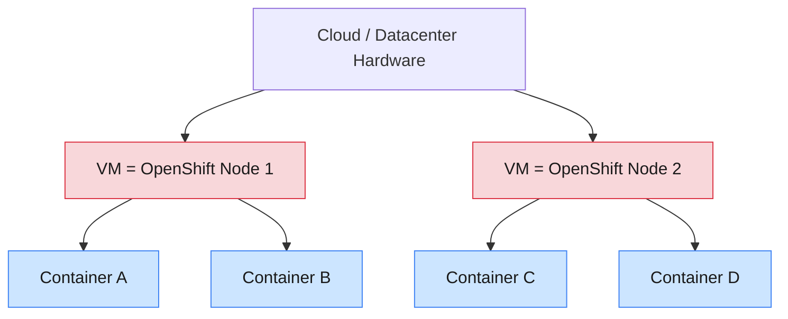

> **Real-world framing:** "VMs vs containers" is rarely an either/or decision.
> The modern stack is **containers on top of VMs**.

---

## 4. Container architecture & OCI concepts

A container feels like a tiny isolated machine, but it is really an ordinary
Linux process constrained by a set of **kernel features**. There is no magic —
just three pillars.

### 4.1 The Linux kernel primitives behind every container

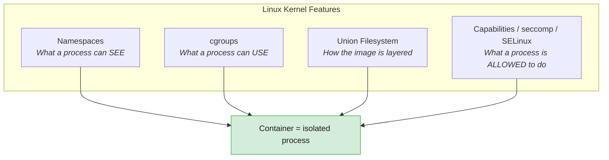

| Pillar                         | Purpose                                                                       | Examples                                                                                                |
| ------------------------------ | ----------------------------------------------------------------------------- | ------------------------------------------------------------------------------------------------------- |
| **Namespaces**                 | **Isolation** — give the process its own private view of the system           | `pid` (process tree), `net` (network stack), `mnt` (filesystem mounts), `uts` (hostname), `ipc`, `user` |
| **cgroups** (control groups)   | **Resource limits** — cap and meter CPU, memory, I/O                          | "this container gets max 512 MB RAM and 0.5 CPU"                                                        |
| **Union / overlay filesystem** | **Layered images** — stack read-only image layers under a thin writable layer | `overlay2`, copy-on-write                                                                               |
| **Security primitives**        | **Confinement** — reduce what the process can do                              | Linux capabilities, seccomp profiles, SELinux/AppArmor                                                  |

> **Analogy:**
>
> - **Namespaces** = the walls of a room — the process can only see what's inside.
> - **cgroups** = the electricity/water meter — it controls how much it can consume.
> - **Security primitives** = the house rules — what it's permitted to touch.
>   Together they turn a normal process into a "container."

### 4.2 The OCI standard — why containers are portable across tools

Early on, "container" meant "Docker." To prevent vendor lock-in, the industry
formed the **Open Container Initiative (OCI)** — a set of open specifications so
that an image built by one tool runs on any compliant runtime.

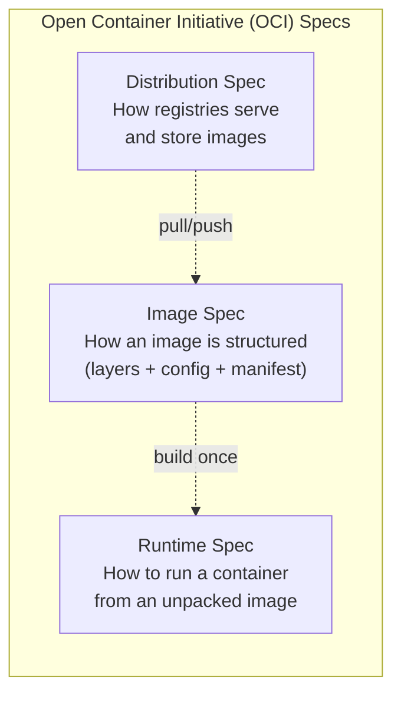

| OCI spec                       | Defines                                                        | Why it matters                                              |
| ------------------------------ | -------------------------------------------------------------- | ----------------------------------------------------------- |
| **Image Specification**        | The on-disk format of an image: layers, config, manifest       | An image from Docker, Podman, or Buildah is interchangeable |
| **Runtime Specification**      | How a runtime turns an unpacked image into a running container | Any OCI runtime (`runc`, `crun`) can run it                 |
| **Distribution Specification** | The API registries use to store/serve images                   | Docker Hub, Quay, GitHub, AWS ECR all interoperate          |

> **Why this matters for OpenShift:** OpenShift does **not** use the Docker
> daemon. It uses **CRI-O**, an OCI-compliant runtime. Because everything is
> OCI-standard, an image you build with Docker on your laptop runs unchanged on
> OpenShift. Standards are what make the whole ecosystem portable.

### 4.3 The container runtime stack

There isn't one "runtime" — there's a layered stack, and the terms are often
confused. From high-level to low-level:

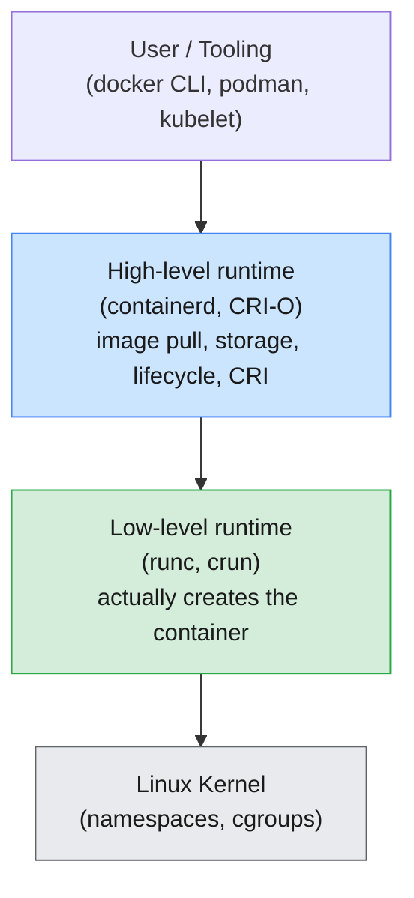

| Layer                  | Role                                                                                                                                    | Examples                                                     |
| ---------------------- | --------------------------------------------------------------------------------------------------------------------------------------- | ------------------------------------------------------------ |
| **High-level runtime** | Manages images, storage, networking hand-off, and the container lifecycle; implements Kubernetes' **CRI** (Container Runtime Interface) | `containerd` (Docker/most k8s), **`CRI-O`** (OpenShift)      |
| **Low-level runtime**  | The OCI runtime that actually talks to the kernel to spawn the isolated process                                                         | `runc` (default), `crun` (lighter, used by OpenShift/Podman) |
| **Kernel**             | Provides the namespaces and cgroups that make isolation real                                                                            | Linux kernel                                                 |

> **CRI (Container Runtime Interface)** is the standard plug between Kubernetes
> and the runtime. It's why Kubernetes/OpenShift can use CRI-O instead of Docker
> without applications noticing. (This is discussed again in Module 4 — RHCOS and
> CRI-O.)

---

## 5. Images, registries & the container lifecycle

### 5.1 Image vs container — the most important distinction

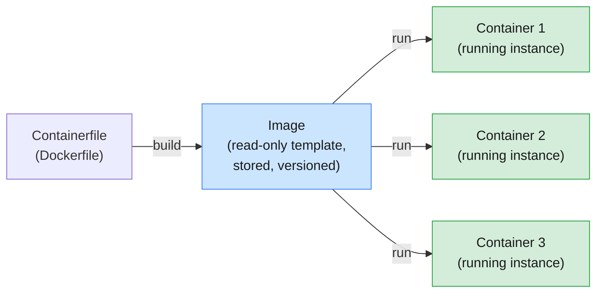

- An **image** is a **read-only template** — a packaged snapshot of a filesystem
  plus metadata (what command to run, env vars, ports). It is **immutable**.
- A **container** is a **running (or stopped) instance** of an image, with a thin
  writable layer on top.

> **The class/object analogy:** an _image_ is like a **class**; a _container_ is
> an **object (instance)** of that class. One image → many containers.

### 5.2 Images are built from layers

Each instruction in a Containerfile produces a **layer**. Layers are stacked via
a union filesystem; they are **cached and shared** between images.

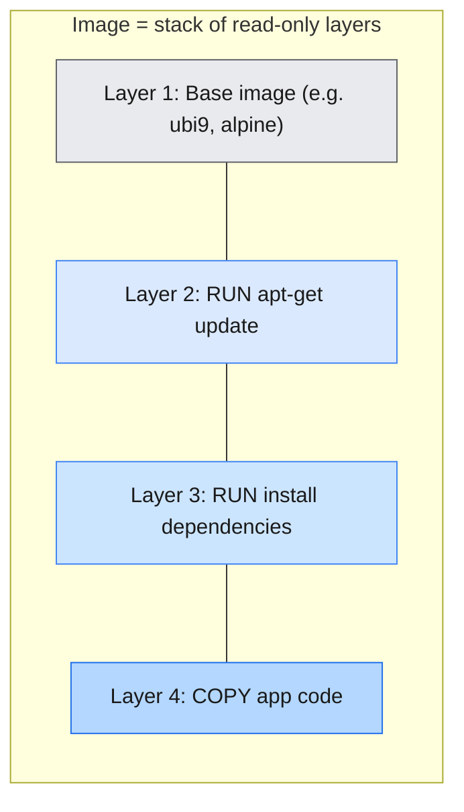

**Why layering is powerful:**

- **Storage efficiency** — 10 images sharing the same base layer store that base
  **once** on disk.
- **Faster builds** — unchanged layers are pulled from cache; only changed layers
  rebuild. (This is why the order of instructions in a Containerfile matters —
  put rarely-changing steps first.)
- **Faster transfers** — registries only pull layers you don't already have.

### 5.3 What's inside an image (manifest, config, layers)

An OCI image is not a single file — it's a bundle:

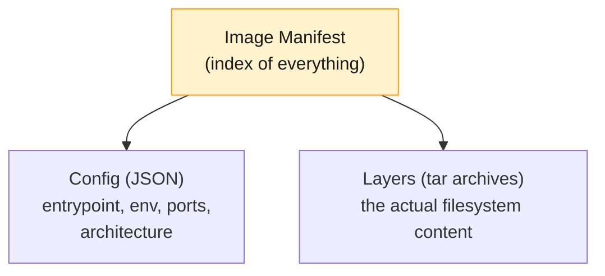

### 5.4 Tags vs digests — naming and identity

A full image reference looks like this:

```
registry.example.com/myteam/myapp:1.4.2
└──────────┬───────┘ └──┬──┘ └─┬─┘ └─┬─┘
        registry        repo   image  tag
```

| Identifier | Example                       | Properties                                                                      |
| ---------- | ----------------------------- | ------------------------------------------------------------------------------- |
| **Tag**    | `myapp:1.4.2`, `myapp:latest` | Human-friendly, **mutable** — `latest` can point to different content over time |
| **Digest** | `myapp@sha256:9f86d0...`      | A **content hash** — **immutable**, always refers to the exact same bytes       |

> **Production best practice:** avoid `:latest` for deployments. It's ambiguous
> and not reproducible — "what was actually running?" becomes unanswerable. Pin to
> a specific version tag or, for guaranteed immutability, a **digest**. OpenShift
> can even resolve and lock images to digests automatically.

### 5.5 Registries

A **registry** is the storage and distribution service for images — like a
"package repository" for containers.

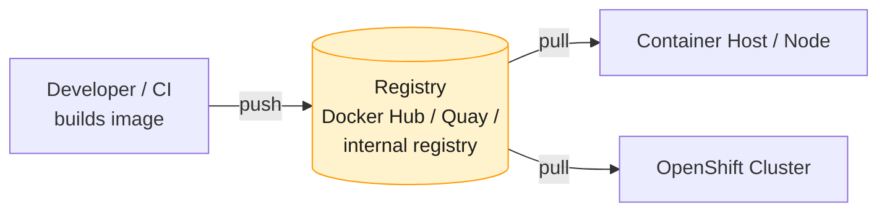

| Registry               | Notes                                                                |
| ---------------------- | -------------------------------------------------------------------- |
| **Docker Hub**         | The default public registry; used in this module's labs              |
| **Quay.io**            | Red Hat's registry; rich security scanning; common with OpenShift    |
| **registry.redhat.io** | Official Red Hat images (e.g. UBI — Universal Base Images)           |
| **Cloud registries**   | AWS ECR, Azure ACR, Google Artifact Registry                         |
| **Internal registry**  | Private registries; OpenShift ships with its own integrated registry |

- **Public** registries serve open images; **private** registries require
  authentication (a "pull secret") and host proprietary images.

### 5.6 The container lifecycle

A container moves through well-defined states from creation to removal:

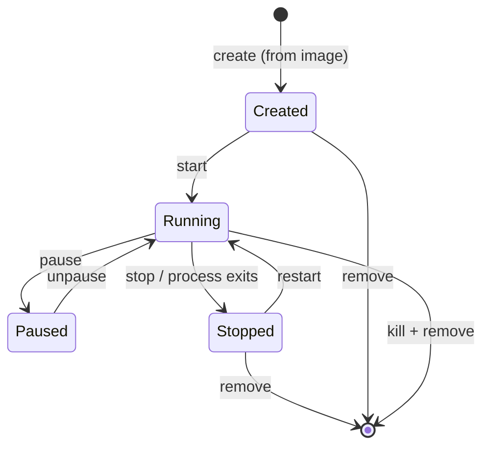

| State                | Meaning                                                                             |
| -------------------- | ----------------------------------------------------------------------------------- |
| **Created**          | Container exists (writable layer, config ready) but its main process hasn't started |
| **Running**          | The main process is executing                                                       |
| **Paused**           | Processes frozen (via cgroups freezer), state kept in memory                        |
| **Stopped / Exited** | Main process ended (cleanly or via stop); filesystem still present                  |
| **Removed**          | Container and its writable layer deleted                                            |

> **Critical concept — containers are ephemeral.** When a container is removed,
> its **writable layer is destroyed** and any data written there is **lost**.
> Containers are designed to be disposable and replaceable. Persisting data
> requires **volumes** (Section 8) — and at cluster scale, Persistent Volumes
> (Module 7).

### 5.7 The build → ship → run model

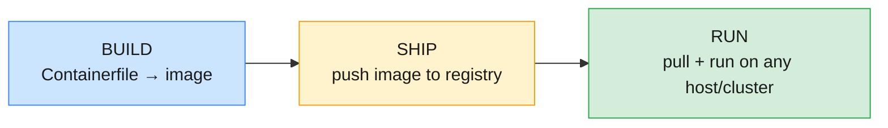

This three-step model — **build once, ship anywhere, run consistently** — is the
heart of the cloud-native workflow and underpins CI/CD and GitOps later in the
course (Modules 9–10).

---

## 6. Docker and Podman overview

Docker popularized containers; Podman is the daemonless, rootless tool that aligns
closely with how Red Hat / OpenShift work. Understanding both — and _why they
differ_ — clarifies what runs under OpenShift.

### 6.1 Docker architecture

Docker uses a **client–server** model with a long-running **daemon** (`dockerd`).

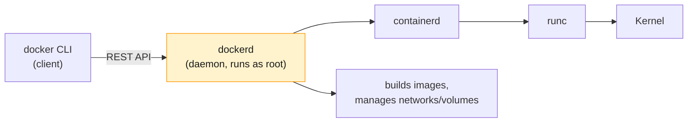

- A single privileged daemon does everything: builds images, pulls/pushes,
  manages networks and volumes, runs containers.
- **Drawbacks:** the daemon is a **single point of failure**, runs as **root**
  (a large attack surface), and is the **parent of every container** (restarting
  it disrupts them).

### 6.2 Podman architecture

Podman (**Pod** Man**ager**) is **daemonless** — each command forks the container
directly. No central long-running root service.

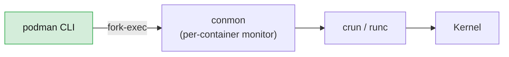

**Podman advantages:**

- **Daemonless** — no single point of failure; containers outlive any management
  process.
- **Rootless** — can run containers as an unprivileged user (uses the `user`
  namespace), a major security improvement.
- **Docker-compatible CLI** — `alias docker=podman` works for most commands.
- **Understands pods natively** — Podman can group containers into a **pod**
  (shared network namespace), mirroring the Kubernetes pod concept and even
  generating Kubernetes YAML.

### 6.3 Docker vs Podman

| Aspect                      | Docker                  | Podman                                |
| --------------------------- | ----------------------- | ------------------------------------- |
| **Architecture**            | Client + central daemon | Daemonless (fork/exec)                |
| **Runs as root?**           | Daemon needs root       | Supports **rootless**                 |
| **Single point of failure** | Yes (the daemon)        | No                                    |
| **CLI**                     | `docker`                | `podman` (same syntax)                |
| **Pods**                    | No native concept       | Native pods                           |
| **Builds images**           | Built-in                | Via **Buildah** (often used together) |
| **Ecosystem fit**           | Docker ecosystem        | Red Hat / OpenShift ecosystem         |

### 6.4 The Red Hat container toolset

Red Hat splits the "one big daemon" into focused, daemonless tools — relevant
because OpenShift is a Red Hat product:

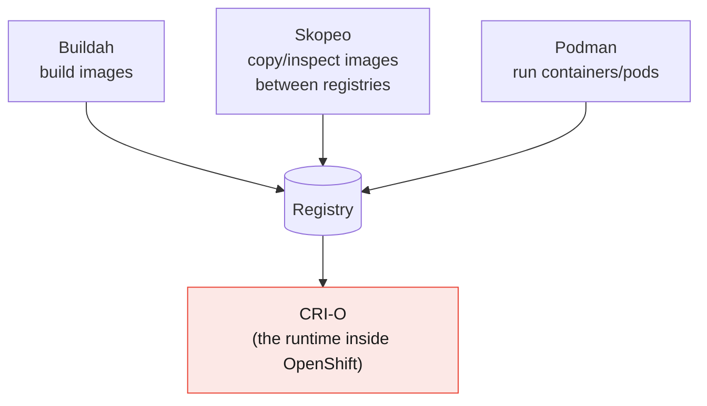

| Tool        | Job                                                                     |
| ----------- | ----------------------------------------------------------------------- |
| **Podman**  | Run and manage containers/pods (the `docker` replacement)               |
| **Buildah** | Build OCI images (often without a Containerfile)                        |
| **Skopeo**  | Inspect and copy images between registries without pulling them locally |
| **CRI-O**   | The lightweight OCI runtime Kubernetes/**OpenShift** uses to run pods   |

> **Key takeaway for the course:** OpenShift does **not** run the Docker daemon.
> Nodes run **CRI-O**. The Docker/Podman skills you build here transfer directly
> because everything is **OCI-standard** — but be aware that in production, the
> runtime under your pods is CRI-O, not Docker.

---

## 7. Container networking fundamentals

Each container gets its own isolated network view via the **network namespace** —
its own interfaces, IP, routing table, and ports.

### 7.1 How a container gets connected

On a single host, the runtime typically connects containers to a **virtual
bridge** using **veth (virtual ethernet) pairs** — like a virtual network cable
between the container and the host's bridge.

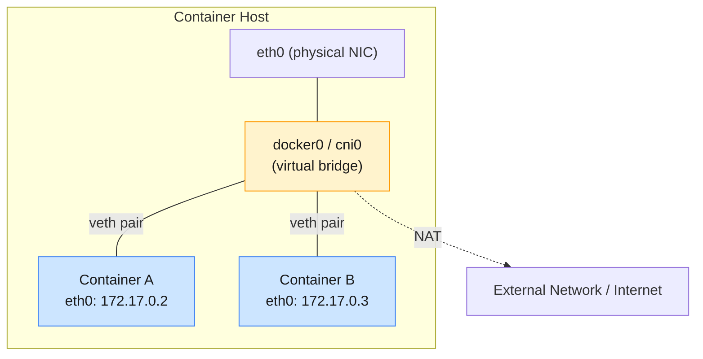

- Containers on the same bridge can reach each other directly by IP.
- Outbound traffic to the internet is usually **NAT**'d through the host.
- Inbound external access requires **port publishing** (mapping a host port to a
  container port).

### 7.2 Standard single-host network modes

| Mode                 | Behavior                                                                            | Use case                           |
| -------------------- | ----------------------------------------------------------------------------------- | ---------------------------------- |
| **bridge** (default) | Private internal network via virtual bridge; needs port mapping for external access | Most single-host containers        |
| **host**             | Container shares the host's network namespace directly (no isolation, no NAT)       | Maximum performance, special cases |
| **none**             | No networking at all                                                                | Fully isolated/batch workloads     |
| **overlay**          | Virtual network spanning **multiple hosts**                                         | Multi-host clusters                |

### 7.3 Port publishing

Because bridged containers are on a private network, you expose a service by
mapping a host port to the container port:

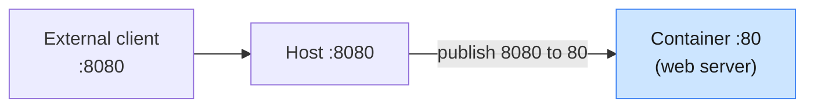

> **Where this goes next:** Manually wiring bridges and ports doesn't scale to
> hundreds of containers across many nodes. Kubernetes/OpenShift solve this with
> the **CNI (Container Network Interface)** plugin model and a flat,
> cluster-wide network where **every pod gets its own routable IP** — implemented
> in OpenShift by **OVN-Kubernetes**. **Services** and **Routes** then provide
> stable access (Module 6). The fundamentals here — namespaces, veth, bridges,
> port mapping — are exactly what those higher-level abstractions automate.

---

## 8. Container storage fundamentals

Storage is where the **ephemeral nature** of containers becomes a design concern.

### 8.1 The layered, copy-on-write filesystem

A running container's filesystem = **read-only image layers** + **one thin
writable layer** on top, merged by the union filesystem.

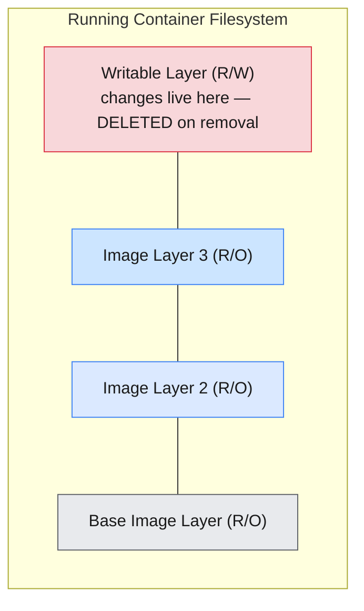

- **Copy-on-write (CoW):** image layers are never modified. When a container
  writes to a file from a lower layer, it's **copied up** into the writable layer
  first, then changed.
- **Multiple containers from one image share the read-only layers** — only the
  thin writable layer is per-container, which is what makes containers so
  lightweight to start.

> ⚠️ **The data-loss trap:** the writable layer is **tied to the container's
> lifecycle**. Remove the container → the writable layer and all its data are
> **gone**. Never store data you care about in the container's writable layer.

### 8.2 Persisting data — volumes and mounts

To keep data beyond a container's life, mount external storage into it:

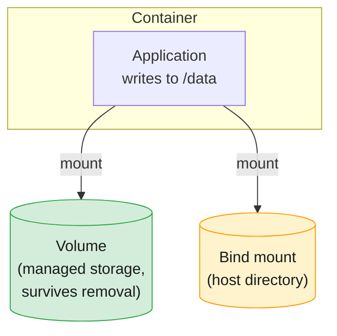

| Type           | What it is                                                             | Lifecycle                                           | Typical use                            |
| -------------- | ---------------------------------------------------------------------- | --------------------------------------------------- | -------------------------------------- |
| **Volume**     | Storage managed by the runtime, outside the container's writable layer | **Independent** of the container — survives removal | Databases, app state (preferred)       |
| **Bind mount** | A specific host directory mounted into the container                   | Tied to the host path                               | Dev (live-editing source), config      |
| **tmpfs**      | In-memory storage                                                      | Vanishes on stop                                    | Secrets/scratch you never want on disk |

### 8.3 Storage drivers

The **storage driver** implements the layered CoW filesystem. The modern default
is **`overlay2`** (used by Docker, Podman, and CRI-O). You rarely configure it
directly, but knowing the layered model explains the behaviors above.

> **Where this goes next:** A single-host "volume" is not enough for a cluster
> where a pod may be rescheduled to a different node. OpenShift abstracts storage
> into **Persistent Volumes (PV)**, **Persistent Volume Claims (PVC)**, and
> **Storage Classes** with dynamic provisioning — so storage follows the workload
> across the cluster (Module 7). The principle is identical to what you see here:
> **separate the data's lifecycle from the container's lifecycle.**

---

## 9. Bridging to Kubernetes & OpenShift

Containers solve **packaging and isolation** for a _single_ unit on a _single_
host. They do **not** answer the operational questions that arise at scale:

| Question containers leave open                      | Solved by orchestration (later modules)     |
| --------------------------------------------------- | ------------------------------------------- |
| If a container crashes, who restarts it?            | Self-healing controllers (Module 3)         |
| How do I run 50 copies across 10 machines?          | Scheduling & ReplicaSets (Modules 2–3)      |
| How do containers on different hosts talk?          | Cluster networking / CNI / OVN-K (Module 6) |
| How do I roll out a new version with zero downtime? | Deployments & rolling updates (Module 3)    |
| How is data kept when a container moves nodes?      | Persistent Volumes (Module 7)               |
| Who controls _who_ can do _what_?                   | RBAC & SCC (Modules 7–8)                    |

```mermaid
flowchart LR
    C["Containers<br/>(this module)<br/>package + isolate"] --> K["Kubernetes<br/>orchestrate at scale"]
    K --> O["OpenShift<br/>enterprise platform:<br/>security, CI/CD, GitOps,<br/>routes, monitoring"]
    style C fill:#cce5ff,stroke:#4285f4,stroke-width:1px,color:#1a1a1a
    style K fill:#fff3cd,stroke:#ff9800,stroke-width:1px,color:#1a1a1a
    style O fill:#fce8e6,stroke:#ea4335,stroke-width:1px,color:#1a1a1a
```

**What carries forward from this module:**

- The **container** is the atom; in Kubernetes it lives inside a **pod**.
- **OCI standards** are why OpenShift can use **CRI-O** instead of Docker
  transparently.
- The **ephemeral writable layer** motivates **Persistent Volumes**.
- **Network/storage namespaces** are what cluster **CNI** plugins and **CSI**
  drivers automate.
- The **build → ship → run** model becomes **CI/CD and GitOps**.

---

## 10. Key takeaways

1. **Each deployment era shrank the unit and sped up the lifecycle:** physical →
   VM → container → orchestrated container.
2. **VMs virtualize hardware (full OS each); containers virtualize the OS (shared
   kernel).** Containers are lightweight isolated _processes_, not mini-VMs — and
   in practice run _inside_ VMs.
3. **A container is a Linux process** constrained by **namespaces** (isolation),
   **cgroups** (resources), a **union filesystem** (layers), and **security
   primitives** (confinement).
4. **OCI standards** (image, runtime, distribution) make images portable across
   Docker, Podman, Buildah, and CRI-O — the foundation of OpenShift portability.
5. **Image = immutable template; container = running instance.** One image → many
   containers. Images are **layered and shared** for efficiency.
6. **Registries** store and distribute images; prefer pinned tags/digests over
   `latest` for reproducibility.
7. **Containers are ephemeral** — the writable layer dies with the container; use
   **volumes** for persistence.
8. **Podman/Buildah/Skopeo** (daemonless, rootless) reflect the Red Hat model;
   OpenShift runs **CRI-O** under the hood, not the Docker daemon.
9. Container **networking** (namespaces, bridges, veth, port mapping) and
   **storage** (CoW layers, volumes) are exactly what Kubernetes/OpenShift
   automate at cluster scale.

---

## 11. Glossary

| Term                           | Definition                                                                     |
| ------------------------------ | ------------------------------------------------------------------------------ |
| **Image**                      | Immutable, layered, read-only template packaging an app and its dependencies   |
| **Container**                  | A running (or stopped) instance of an image — an isolated process              |
| **Containerfile / Dockerfile** | Text file of instructions used to build an image                               |
| **Layer**                      | A read-only filesystem diff produced by a build instruction; cached and shared |
| **Registry**                   | Service that stores and distributes images (Docker Hub, Quay, etc.)            |
| **Tag**                        | Mutable human-readable image label (e.g. `:1.4.2`, `:latest`)                  |
| **Digest**                     | Immutable content hash identifying exact image bytes (`@sha256:...`)           |
| **Namespace (Linux)**          | Kernel feature giving a process an isolated view of a resource                 |
| **cgroup**                     | Kernel feature limiting/metering a process's resource usage                    |
| **Union / overlay filesystem** | Mechanism stacking read-only layers under a writable layer                     |
| **Copy-on-write (CoW)**        | Copying a file into the writable layer only when first modified                |
| **OCI**                        | Open Container Initiative — open specs for image, runtime, distribution        |
| **runc / crun**                | Low-level OCI runtimes that create the container via the kernel                |
| **containerd / CRI-O**         | High-level runtimes managing image and container lifecycle                     |
| **CRI**                        | Container Runtime Interface — standard between Kubernetes and the runtime      |
| **CNI**                        | Container Network Interface — pluggable cluster networking model               |
| **Daemonless**                 | Architecture (Podman) with no central long-running service                     |
| **Rootless**                   | Running containers as an unprivileged user                                     |
| **Volume**                     | Persistent storage whose lifecycle is independent of the container             |
| **veth pair**                  | Virtual ethernet link connecting a container to a host bridge                  |
| **UBI**                        | Red Hat Universal Base Image — freely redistributable base images              |

---

## 12. References

- Open Container Initiative — <https://opencontainers.org/>
- OCI Image / Runtime / Distribution specs — <https://github.com/opencontainers>
- Docker documentation — <https://docs.docker.com/>
- Podman — <https://podman.io/> · Buildah — <https://buildah.io/> · Skopeo — <https://github.com/containers/skopeo>
- CRI-O — <https://cri-o.io/>
- Kubernetes Container Runtime Interface (CRI) — <https://kubernetes.io/docs/concepts/architecture/cri/>
- Red Hat Universal Base Images (UBI) — <https://catalog.redhat.com/software/base-images>
- "What's a Linux container?" (Red Hat) — <https://www.redhat.com/en/topics/containers/whats-a-linux-container>

---

> **Next module:** _Module 2 — Kubernetes Foundations and Architecture_, where the
> container becomes a **pod** and we introduce the control plane (API server,
> etcd, scheduler, controller manager) and worker-node components (kubelet,
> runtime, kube-proxy).
