# Module 2 — Kubernetes Foundations & Architecture

> **Course:** OpenShift Container Platform
> **Module objective:** Understand what Kubernetes is, the problems it solves
> beyond single-host containers, its core terminology and object model, and the
> **cluster architecture** — the control-plane and worker-node components
> (kube-apiserver, etcd, scheduler, controllers, DNS, kubelet, container runtime,
> kube-proxy) that make declarative orchestration work. This is the foundation
> every later OpenShift module builds on.

---

## Table of contents

1. [Why this module matters](#1-why-this-module-matters)
2. [From containers to orchestration](#2-from-containers-to-orchestration)
3. [Kubernetes terminology & the object model](#3-kubernetes-terminology--the-object-model)
4. [Cluster architecture at a glance](#4-cluster-architecture-at-a-glance)
5. [Control-plane components](#5-control-plane-components)
6. [Worker-node components](#6-worker-node-components)
7. [The declarative model & the reconciliation loop](#7-the-declarative-model--the-reconciliation-loop)
8. [Anatomy of a request: what happens when you create a pod](#8-anatomy-of-a-request-what-happens-when-you-create-a-pod)
9. [Kubernetes networking model (first look)](#9-kubernetes-networking-model-first-look)
10. [Bridging to OpenShift](#10-bridging-to-openshift)
11. [Key takeaways](#11-key-takeaways)
12. [Glossary](#12-glossary)
13. [References](#13-references)

> **How to read the diagrams:** Diagrams are written in [Mermaid](https://mermaid.js.org/),
> which renders automatically in GitHub, VS Code (with a Mermaid extension), and most
> modern Markdown viewers. If a diagram appears as code, install/enable a Mermaid
> preview to see the rendered version.

---

## 1. Why this module matters

In Module 1 you learned that a **container** packages an application with its
dependencies and runs it as an isolated process. That solves _packaging and
isolation_ for **one unit on one host**. It does **not** answer the questions
that appear the moment you run real workloads in production:

- If a container crashes at 3 a.m., who restarts it?
- How do I run 40 identical copies of a billing service across 12 machines — and
  keep exactly 40 running as machines come and go?
- How does a container on host A reach a container on host B?
- How do I push a new version with zero downtime, and roll back if it misbehaves?

**Kubernetes** is the open-source system that answers all of these. It is a
**container orchestrator**: you declare the desired state of your workloads, and
Kubernetes continuously works to make reality match that declaration —
scheduling containers onto machines, restarting them when they fail, scaling
them, networking them, and updating them.

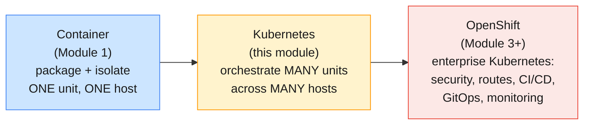

> **Why this matters for OpenShift:** OpenShift **is** Kubernetes — a certified
> Kubernetes distribution with Red Hat's enterprise additions layered on top.
> Every OpenShift concept you will meet (projects, routes, SCCs, BuildConfigs,
> Operators) sits on the control-plane and node architecture in this module. If
> the architecture here is solid, OpenShift becomes "Kubernetes plus convenience."

> **Telecom framing.** Throughout this course we model a fictional mobile
> operator. Picture a **subscriber-lookup API**, a **CDR (Call Detail Record)
> processor**, an **SMS gateway**, and a **self-care portal**. These are the kinds
> of services that must stay up 24/7, scale with traffic peaks, and survive
> machine failures — exactly the problems Kubernetes was built to solve.

---

## 2. From containers to orchestration

### 2.1 What Kubernetes actually does for you

A useful way to think about Kubernetes is as a **distributed operating system
for your datacenter**. A normal OS schedules _processes_ onto _CPU cores_ and
manages their memory; Kubernetes schedules _containers_ onto _machines_ and
manages their resources, networking, and lifecycle — across the whole cluster.

| Capability             | What it means in practice                                                   | Telecom example                                                          |
| ---------------------- | --------------------------------------------------------------------------- | ------------------------------------------------------------------------ |
| **Scheduling**         | Decide _which machine_ each container runs on, based on resources & rules    | Place the CDR processor only on nodes with fast local SSD                 |
| **Self-healing**       | Restart failed containers; reschedule pods off dead nodes                    | A crashed SMS-gateway pod is restarted automatically                     |
| **Horizontal scaling** | Add/remove identical copies to match load                                   | Scale the subscriber API from 4 → 20 pods during an evening usage peak   |
| **Service discovery**  | Give workloads stable names & IPs so they can find each other               | The portal reaches `subscriber-api` by name, not a hard-coded pod IP     |
| **Load balancing**     | Spread traffic across the healthy copies of a service                       | Requests fan out evenly across all subscriber-API pods                   |
| **Rolling updates**    | Replace old versions with new ones gradually, with automatic rollback        | Deploy tariff-catalog v2 with zero dropped requests                      |
| **Declarative config** | You describe the _end state_; the system figures out the steps              | "I want 10 replicas of v2" — Kubernetes makes it so                      |
| **Secret/config mgmt** | Inject configuration and credentials without rebuilding images              | Provide the DB password to the billing service at runtime                |

### 2.2 The single most important idea: desired state

Almost everything in Kubernetes follows one pattern. You do **not** issue
imperative commands like "start a container here, now start another there." You
**declare the desired state** ("I want 10 replicas of this image, reachable on
port 8080"), store that declaration in the cluster, and a set of background
controllers **continuously reconcile** actual state toward it.

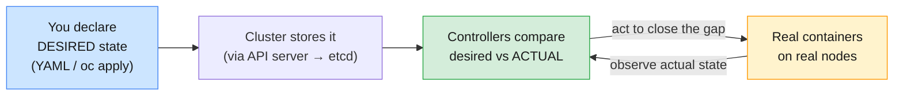

This **declarative + reconciliation** model (Section 7) is the backbone of the
whole system. Hold onto it — every component below exists to serve it.

---

## 3. Kubernetes terminology & the object model

Before the architecture, you need the vocabulary. Kubernetes manages **objects**
— persistent records of intent stored in the cluster. You create, read, update,
and delete them through the API.

### 3.1 The core objects, from smallest to largest

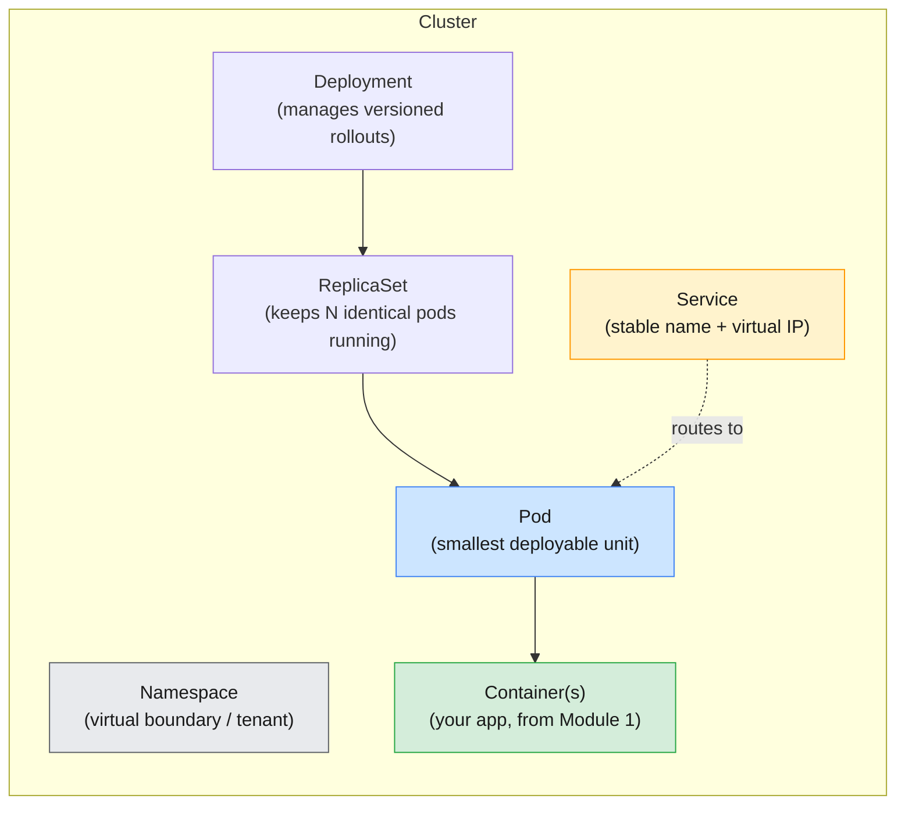

| Object          | One-line definition                                                                    | Telecom example                                            |
| --------------- | -------------------------------------------------------------------------------------- | ---------------------------------------------------------- |
| **Pod**         | The smallest deployable unit — one or more **co-located** containers sharing network & storage | One pod running the subscriber-API container               |
| **ReplicaSet**  | Ensures a specified number of identical pod replicas are running at all times           | "Always keep 5 subscriber-API pods"                        |
| **Deployment**  | Manages ReplicaSets to provide **declarative updates**, rollouts, and rollbacks         | Roll subscriber-API from v1 → v2 with no downtime          |
| **Service**     | A stable virtual IP + DNS name that load-balances across a set of pods                  | `subscriber-api` resolves to whichever pods are healthy    |
| **Namespace**   | A virtual cluster boundary for isolating and organizing resources                       | Separate `billing`, `messaging`, `selfcare` namespaces     |
| **ConfigMap**   | Non-secret configuration injected into pods                                            | Feature flags, log levels, upstream URLs                   |
| **Secret**      | Sensitive data (passwords, tokens) injected into pods                                  | The billing database password                              |
| **Volume / PVC**| Storage attached to pods; a **PersistentVolumeClaim** requests durable storage          | The CDR processor's working directory                      |
| **Node**        | A worker machine (VM or physical) that runs pods                                       | One of 12 worker machines in the cluster                   |

> **The pod is the atom.** In Module 1 the container was the atom; in Kubernetes
> the smallest thing you schedule is the **pod**. A pod usually holds **one**
> application container, optionally accompanied by helper "sidecar" containers.
> All containers in a pod share the same network namespace (same IP, same
> localhost) and can share storage volumes — they are always scheduled together
> onto the same node. (Pods get a full module of their own next.)

### 3.2 Why a pod, and not just a container?

A pod is a thin wrapper that adds the things a bare container lacks for
orchestration: a **shared network identity**, **shared storage**, and a unit of
**co-scheduling**. The classic use is a main container plus a tightly-coupled
helper:

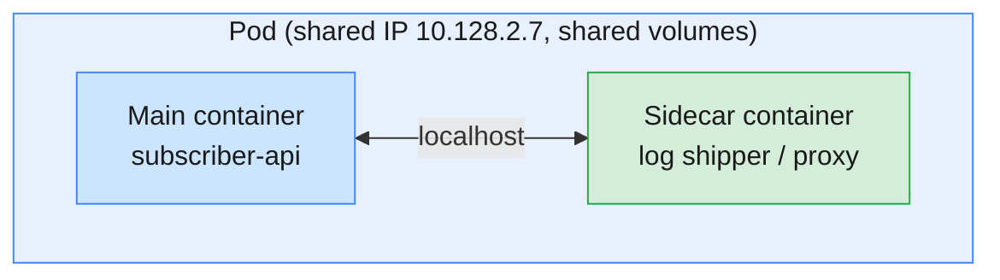

Because both containers share `localhost`, the sidecar can read the main app's
logs or proxy its traffic with zero network hops. This is why the pod — not the
container — is the unit Kubernetes schedules.

### 3.3 Every object has the same shape

A great mental shortcut: **every** Kubernetes object is described by the same
four top-level fields. Once you can read one manifest, you can read them all.

```yaml
apiVersion: apps/v1        # which API group/version defines this object
kind: Deployment           # what type of object this is
metadata:                  # name, namespace, labels, annotations
  name: subscriber-api
  namespace: selfcare
spec:                      # DESIRED state — what YOU want
  replicas: 5
  selector:
    matchLabels: { app: subscriber-api }
  template:
    metadata:
      labels: { app: subscriber-api }
    spec:
      containers:
        - name: api
          image: registry.example.com/mobily/subscriber-api:1.4.2
          ports:
            - containerPort: 8080
# status:                  # ACTUAL state — what the cluster reports back
#   (managed by Kubernetes, not by you)
```

| Field        | Who writes it | Meaning                                                       |
| ------------ | ------------- | ------------------------------------------------------------- |
| `apiVersion` | You           | The API group + version that defines this kind of object      |
| `kind`       | You           | The object type (Pod, Deployment, Service…)                   |
| `metadata`   | You           | Identity: name, namespace, **labels**, annotations            |
| `spec`       | You           | **Desired state** — your declaration of intent                |
| `status`     | Kubernetes    | **Actual state** — continuously updated by the system         |

> **`spec` vs `status` is the declarative model in miniature.** You own `spec`
> (what you want); Kubernetes owns `status` (what currently is). The controllers'
> entire job is to drive `status` toward `spec`.

### 3.4 Labels & selectors — the glue

Kubernetes does **not** wire objects together by hard references. Instead it uses
**labels** (key/value tags on objects) and **selectors** (queries over those
labels). A Service doesn't list pod IPs; it says "send traffic to any pod labeled
`app=subscriber-api`." As pods come and go, the set updates automatically.

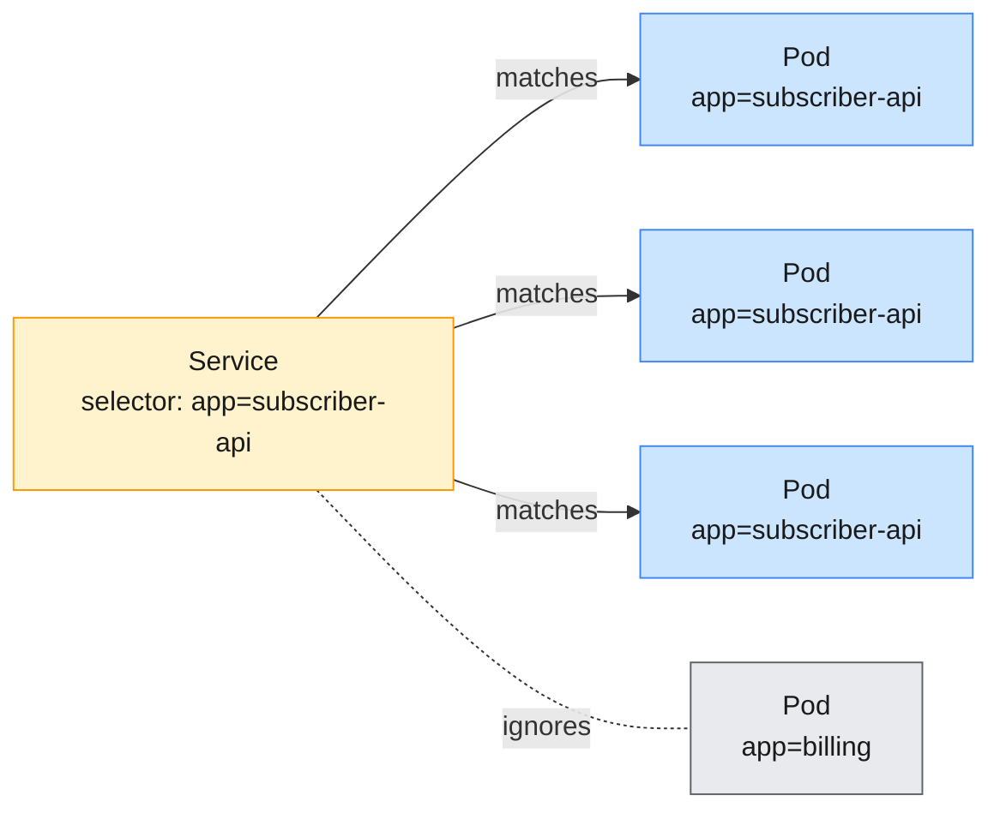

This **loose coupling via labels** is what makes the system flexible and
self-adjusting — and it is everywhere (Services → pods, Deployments → pods,
network policies, scheduling rules).

---

## 4. Cluster architecture at a glance

A Kubernetes cluster has two kinds of machines, each running a distinct set of
components:

- The **control plane** — the "brain." It makes global decisions (scheduling),
  stores cluster state, and detects/responds to events. It is the management
  layer.
- The **worker nodes** — the "muscle." They actually run your pods. Each node
  runs an agent (kubelet), a container runtime, and a network proxy.

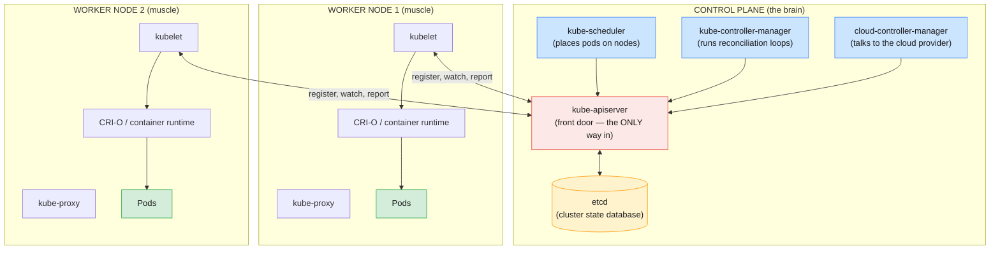

### The two golden rules of the architecture

1. **Everything goes through the API server.** No component ever talks to etcd or
   to another component directly to change state. The scheduler, controllers,
   kubelets, and you (`oc`/`kubectl`) **all** communicate through the
   kube-apiserver. It is the single front door and the single source of truth's
   gatekeeper.
2. **etcd is the only place state lives.** Every other component is effectively
   **stateless** — it can crash and restart, then rebuild its view by reading
   from the API server (backed by etcd). This is why the control plane is so
   resilient.

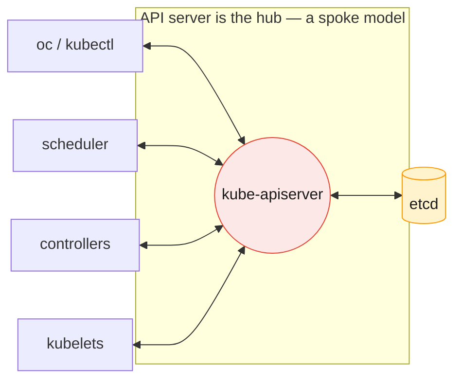

> **High availability.** Production clusters (and OpenShift by default) run **3**
> control-plane nodes, each with its own apiserver and etcd member. etcd uses the
> **Raft** consensus protocol and needs a **quorum** (majority) to accept writes —
> which is why you want an **odd** number (3 or 5). Lose 1 of 3 and the cluster
> keeps working; lose 2 of 3 and etcd goes read-only to protect consistency.

---

## 5. Control-plane components

Now we open up each control-plane component: what it does, why it exists, and how
it participates in the desired-state model.

### 5.1 kube-apiserver — the front door

The **API server** is the central management component and the **only** component
that talks to etcd. Everything else — humans, controllers, the scheduler,
kubelets — interacts with the cluster **exclusively** through its REST API.

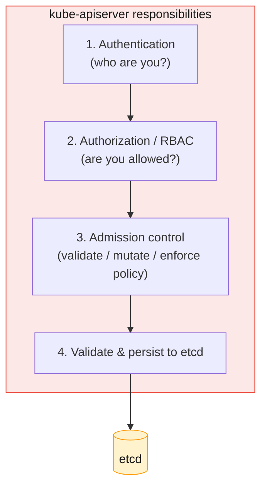

**What it does:**

- Exposes the **REST API** for every Kubernetes object (the API behind every
  `oc`/`kubectl` command).
- Performs **authentication** (verify identity), **authorization** (RBAC — is
  this action permitted?), and **admission control** (a pipeline of plugins that
  can validate, mutate, or reject requests — e.g. inject defaults, enforce
  policy).
- **Validates** objects against their schema and **persists** them to etcd.
- Serves the **watch** mechanism: other components subscribe to streams of
  changes ("tell me whenever a pod in this namespace changes") rather than
  polling.

> **Why a single front door is a feature, not a bottleneck.** Centralizing access
> means **one** place to enforce security (authn/authz), **one** place to validate
> data, and **one** consistent API for everyone. The API server is **stateless**
> and horizontally scalable — in HA setups you run several behind a load balancer.

> **OpenShift note:** OpenShift adds its **own** API server alongside the
> Kubernetes one to serve OpenShift-specific resources (Routes, Projects,
> BuildConfigs, ImageStreams, SCCs). Same pattern — just more object types behind
> the same kind of front door.

### 5.2 etcd — the cluster's source of truth

**etcd** is a distributed, consistent **key-value store**. It holds the **entire
state** of the cluster: every object's spec and status, every config, every
secret. If you backed up etcd and restored it, you would restore the whole
cluster.

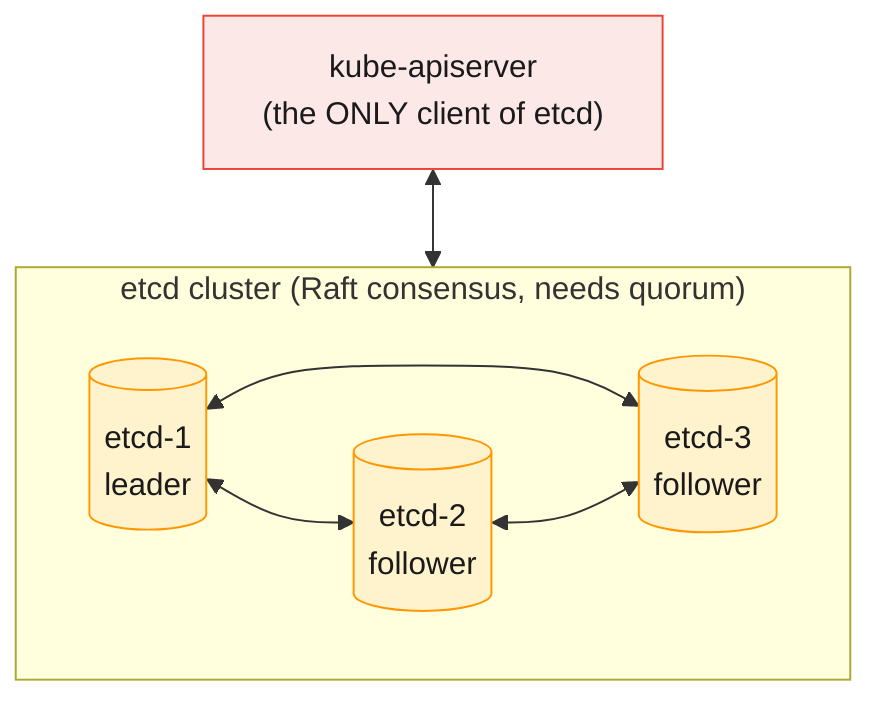

**Key properties:**

- **Strongly consistent** — every read returns the latest agreed-upon write
  (via the **Raft** consensus algorithm). Consistency over availability: if
  quorum is lost, etcd refuses writes rather than risk divergence.
- **Watchable** — clients can watch keys for changes; this is what powers the API
  server's watch streams and, transitively, every controller.
- **The thing you back up.** Because etcd holds all cluster state, **etcd backups
  are your cluster backups** (a major theme of the Module 12 backup/restore
  capstone).

> ⚠️ **Critical operational fact:** Only the **API server** talks to etcd.
> Operators never write to etcd by hand. Protect it (encryption at rest, TLS,
> regular snapshots) — losing etcd without a backup means losing the cluster's
> entire desired state.

### 5.3 kube-scheduler — placing pods on nodes

When a pod is created, it initially has **no node assigned**. The **scheduler**
watches for these unscheduled pods and decides **which node** each should run on,
then records that decision via the API server. It **chooses**, it does not
**run** — the kubelet on the chosen node does the running.

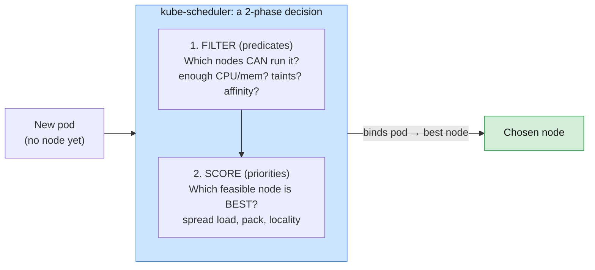

**How it decides (two phases):**

1. **Filtering (predicates):** eliminate nodes that **cannot** host the pod —
   insufficient CPU/memory, missing required labels, unsatisfied
   **taints/tolerations**, node/pod **affinity** rules, port conflicts.
2. **Scoring (priorities):** rank the remaining feasible nodes and pick the best —
   e.g. spread pods of the same app across nodes for resilience, prefer nodes with
   the image already cached, balance utilization.

Inputs the scheduler weighs include **resource requests/limits**, **node
selectors & affinity/anti-affinity**, **taints & tolerations**, and **data
locality**. (These scheduling controls get a full treatment in the
application-lifecycle/scheduler material later in the course.)

> **Telecom example:** The CDR processor declares a `requests` of 2 CPU / 4 GiB
> and a node-affinity for nodes labeled `disk=ssd`. The scheduler filters to
> SSD nodes with ≥2 free CPU, then scores them to spread CDR pods across racks for
> fault tolerance.

> **It only schedules.** The scheduler's output is a **binding** (pod↔node)
> written back through the API server. It never contacts the node directly — the
> node's kubelet notices the assignment via its watch and takes over.

### 5.4 kube-controller-manager — the reconciliation engine

The **controller manager** runs the cluster's **controllers** — the background
control loops that embody "drive actual state toward desired state." It's a
single binary that bundles many logical controllers.

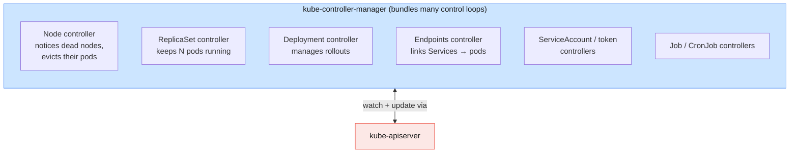

Each controller follows the **same loop**: _observe_ current state (via watches),
_compare_ to desired state, _act_ to close the gap, repeat — forever.

| Controller (examples)    | Watches for…                          | Acts by…                                                      |
| ------------------------ | ------------------------------------- | ------------------------------------------------------------- |
| **Node controller**      | Nodes going unhealthy/unreachable     | Marking the node NotReady and evicting/rescheduling its pods  |
| **ReplicaSet controller**| Pod count drifting from desired       | Creating or deleting pods to hit the target replica count     |
| **Deployment controller**| Changes to a Deployment's spec        | Creating new ReplicaSets and orchestrating rolling updates    |
| **Endpoints controller** | Pods matching a Service's selector    | Maintaining the list of healthy pod IPs behind the Service    |
| **Job / CronJob**        | Batch/scheduled work                  | Running pods to completion, on schedule                       |

> **This is where self-healing lives.** Kill a pod and the ReplicaSet controller
> sees `actual=4, desired=5`, and creates one. Kill a node and the node controller
> reschedules its pods elsewhere. No human, no script — just control loops
> reconciling toward your declared intent. **This is the heart of Kubernetes.**

### 5.5 cloud-controller-manager — the cloud integration point

The **cloud-controller-manager** isolates all the logic that talks to a specific
**cloud provider** (AWS, Azure, GCP, etc.), so the core controllers stay
cloud-agnostic. It handles things like provisioning cloud **load balancers** for
Services of type `LoadBalancer`, attaching cloud **storage volumes**, and
updating node metadata (zone/region) from the cloud API. On bare-metal clusters
it may be absent or minimal.

### 5.6 DNS — cluster service discovery (CoreDNS / "Kube-DNS")

A cluster add-on (historically **kube-dns**, now **CoreDNS**) provides
**in-cluster DNS**. Every Service gets a DNS name, so workloads find each other by
**name** instead of by ephemeral IP.

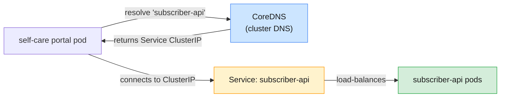

A Service named `subscriber-api` in namespace `selfcare` is reachable at
`subscriber-api.selfcare.svc.cluster.local` (and just `subscriber-api` from within
the same namespace). This is **service discovery**: stable names that survive pod
churn — pods restart with new IPs constantly, but the name never changes.

> **Why DNS belongs in this module:** service discovery by name is what makes a
> dynamic, self-healing system usable. Without it, every pod restart (new IP)
> would break callers. CoreDNS turns "find the subscriber API" from an IP-chasing
> problem into a stable name lookup.

---

## 6. Worker-node components

The control plane decides **what** should run; **worker nodes** are where it
actually runs. Every worker node runs three components.

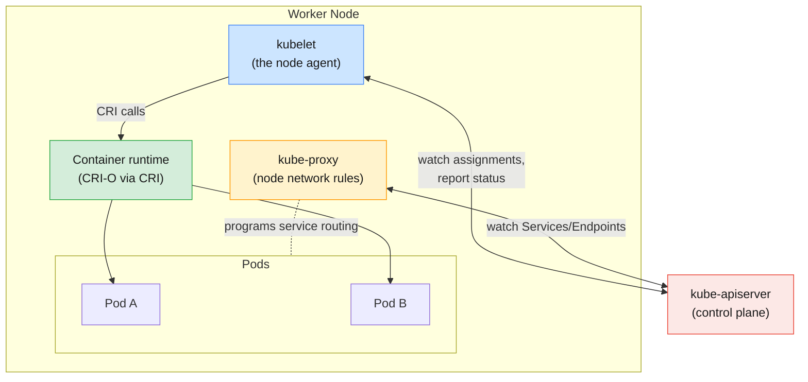

### 6.1 kubelet — the node's agent

The **kubelet** is the primary agent running on every node. It is the bridge
between the control plane and the containers actually running on that machine.

**What it does:**

- **Registers** the node with the cluster and reports node capacity/health.
- **Watches** the API server for pods **assigned to its node** (the scheduler's
  bindings).
- **Drives the container runtime** (via the **CRI**) to pull images and
  start/stop containers so the node's actual pods match what's assigned.
- Runs **health probes** (liveness/readiness/startup) and acts on them — e.g.
  restart a container that fails its liveness probe.
- **Reports pod & container status** back to the API server (feeding `status`).

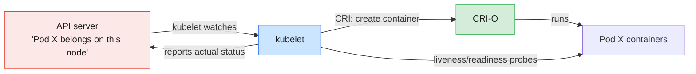

> **The kubelet is the reconciliation loop at the node level.** Just as
> controllers reconcile cluster state, the kubelet reconciles **its node's** state:
> "these pods are assigned to me — are they actually running and healthy? If not,
> fix it." It only manages pods it was told to manage; it does not schedule.

### 6.2 The container runtime (CRI-O) via the CRI

The **container runtime** is what actually pulls images and runs containers — the
Module 1 machinery (high-level runtime → low-level runtime → kernel). The kubelet
never speaks a runtime's native API directly; it speaks the **CRI (Container
Runtime Interface)**, a standard gRPC contract. Any CRI-compliant runtime plugs in.

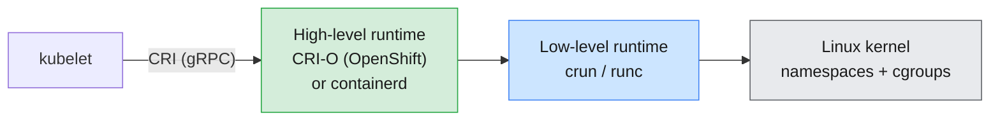

| Layer                  | Role                                                          | Examples                         |
| ---------------------- | ------------------------------------------------------------ | -------------------------------- |
| **CRI**                | The standard plug between kubelet and runtime                | gRPC API                         |
| **High-level runtime** | Image pull, storage, container lifecycle, implements CRI     | **CRI-O** (OpenShift), containerd|
| **Low-level runtime**  | Actually creates the isolated process via the kernel         | crun (OpenShift), runc           |

> **OpenShift uses CRI-O.** This is the direct payoff of Module 1's OCI lesson:
> because images are OCI-standard and the runtime is pluggable via the CRI, an
> image built with Docker/Podman on a laptop runs unchanged under CRI-O on
> OpenShift. The CRI is **why** Kubernetes was able to drop the Docker daemon
> ("dockershim removal") without breaking workloads.

### 6.3 kube-proxy — making Services reachable on the node

A **Service** is a stable virtual IP, but something has to make that virtual IP
actually route to real pod IPs **on each node**. That something is **kube-proxy**.
It watches Services and their **Endpoints** (the current healthy pod IPs) and
programs the node's networking — typically via **iptables** or **IPVS** rules — so
traffic to a Service's ClusterIP is transparently load-balanced to a backing pod.

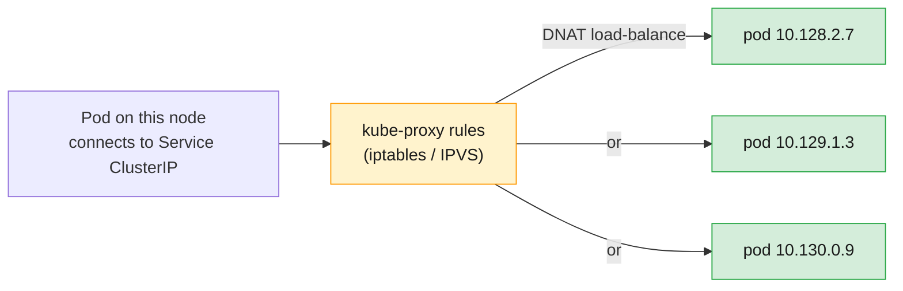

> **kube-proxy implements Service load-balancing at the kernel level.** It is not
> a userspace proxy in the data path (in the common iptables/IPVS modes) — it
> **programs rules** and the kernel does the forwarding, which is fast.

> **OpenShift note:** On modern OpenShift the default network plugin is
> **OVN-Kubernetes**, which can handle service routing functions itself; the
> *concept* — turn a stable Service IP into balanced traffic to live pods — is
> exactly what you must understand here. Networking gets its own module later.

---

## 7. The declarative model & the reconciliation loop

Step back and assemble the pieces. The genius of Kubernetes is that the same
simple pattern repeats at every level.

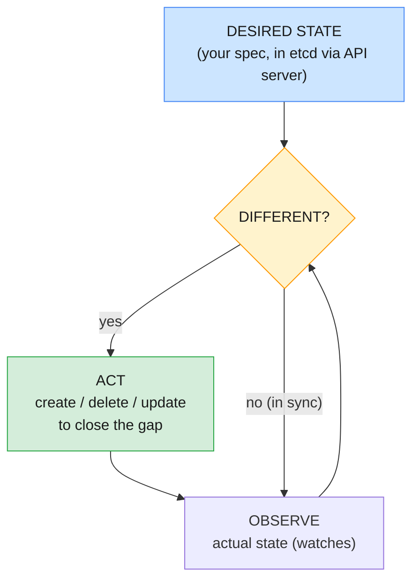

This loop runs **independently** in many places at once:

- The **ReplicaSet controller** reconciles _pod count_ → desired replicas.
- The **Deployment controller** reconciles _ReplicaSets_ → desired rollout.
- The **node controller** reconciles _node health_ → evicts pods off dead nodes.
- The **kubelet** reconciles _its node's containers_ → assigned pods.
- The **endpoints controller** reconciles _Service backends_ → matching pods.

### Why declarative beats imperative

| Imperative ("do these steps")                         | Declarative ("here is the end state")                          |
| ----------------------------------------------------- | -------------------------------------------------------------- |
| You script every action and ordering                  | You describe the goal; the system finds the path               |
| Drift accumulates; no one re-checks after the fact    | **Continuously self-correcting** — drift is auto-repaired      |
| Failure mid-script leaves an unknown state            | The loop simply keeps trying until reality matches             |
| Hard to review "what is supposed to be running?"      | The manifest **is** the answer; store it in Git (→ GitOps)     |

> **This is also why GitOps works (Module 10).** If desired state is just declared
> data, you can keep it in **Git** as the single source of truth, and a controller
> continuously reconciles the cluster to match the repo. Declarative state is the
> seed from which GitOps grows.

---

## 8. Anatomy of a request: what happens when you create a pod

Tie every component together by tracing one command end-to-end. Suppose you run
`oc apply` (or `kubectl create`) for a Deployment of the subscriber API.

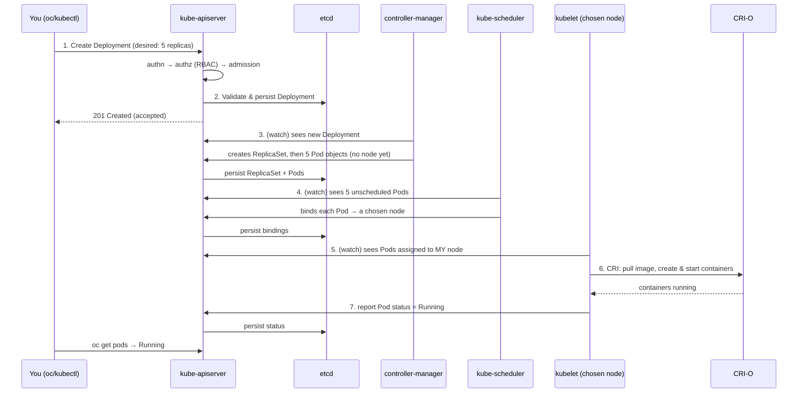

**Read it as a chain of reconciliations, each via the API server:**

1. **You** submit desired state. The API server **authenticates**, **authorizes
   (RBAC)**, runs **admission**, validates, and **persists to etcd**. Your job is
   done — you declared intent and the cluster recorded it.
2. The **Deployment/ReplicaSet controllers** (watching) notice the new object and
   create the downstream objects (ReplicaSet → 5 Pods), still **unscheduled**.
3. The **scheduler** (watching) sees pods with no node, runs filter+score, and
   **binds** each to a node.
4. Each target node's **kubelet** (watching) sees pods assigned to it and calls
   **CRI-O** via the **CRI** to pull images and run containers.
5. The kubelet **reports status** back through the API server; **kube-proxy**
   and the **endpoints controller** wire the new pods into their Service so
   traffic can reach them.

> **No component skipped a step or talked out of band.** Every arrow went through
> the API server; etcd recorded each transition; each actor did exactly one job and
> reacted to **watches**, not direct calls. That decoupling is what makes the
> system scalable, resilient, and extensible.

---

## 9. Kubernetes networking model (first look)

Networking gets a dedicated module later, but the architecture demands a first
look because it shapes how the components above cooperate. Kubernetes mandates a
few rules:

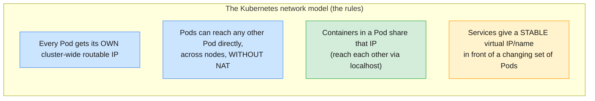

- **Flat pod network.** Unlike the single-host bridges of Module 1 (where you
  NAT'd and published ports), Kubernetes gives **every pod a unique IP** reachable
  from any other pod on any node — no port-mapping gymnastics between pods.
- **Implemented by a CNI plugin.** The actual wiring is delegated to a **CNI
  (Container Network Interface)** plugin. OpenShift's default is
  **OVN-Kubernetes**. The kubelet calls CNI when setting up a pod's network.
- **Services + kube-proxy** provide stable access and load-balancing on top of the
  ever-changing set of pod IPs (Section 6.3).
- **Pod IPs are ephemeral; Service IPs are stable.** This is precisely why DNS and
  Services exist — never hard-code a pod IP.

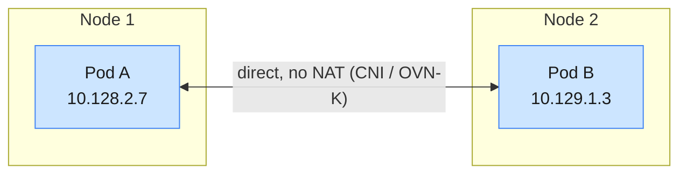

> **Where this goes next:** the Module 1 fundamentals (network namespaces, veth,
> bridges) are exactly what CNI plugins automate cluster-wide. Services, Routes,
> NodePorts, and Network Policies build on this flat model in the dedicated
> networking module.

---

## 10. Bridging to OpenShift

OpenShift **is** a Kubernetes distribution — every component in this module is
present and unchanged in principle. OpenShift's value is the **enterprise layer**
it adds on top.

```mermaid
flowchart TB
    subgraph K8S["Kubernetes core (this module)"]
        direction LR
        KA["API server"]
        KE["etcd"]
        KS["scheduler"]
        KC["controllers"]
        KK["kubelet + CRI-O + kube-proxy"]
    end
    subgraph OCP["OpenShift adds on top"]
        direction LR
        OA["OpenShift API server<br/>(Routes, Projects, Builds)"]
        OO["Operators &<br/>Operator Lifecycle Manager"]
        OS["Security: SCC, OAuth,<br/>integrated registry"]
        OW["Web console, oc CLI,<br/>monitoring, logging"]
        OR["RHCOS immutable OS<br/>+ CRI-O by default"]
    end
    K8S --> OCP
    style K8S fill:#e8f0fe,stroke:#4285f4,stroke-width:1px,color:#1a1a1a
    style OCP fill:#fce8e6,stroke:#ea4335,stroke-width:1px,color:#1a1a1a
```

| Kubernetes concept (here)     | OpenShift addition / mapping (later modules)                              |
| ----------------------------- | ------------------------------------------------------------------------- |
| Namespace                     | **Project** = namespace + extra annotations, default quotas, self-service |
| API server                    | Plus an **OpenShift API server** for Routes, Builds, ImageStreams, SCCs    |
| Controllers / control loops   | **Operators** extend the pattern to manage entire applications/platforms   |
| Container runtime             | **CRI-O** by default, on the immutable **RHCOS** node OS                   |
| Service (internal access)     | **Route / Ingress** for stable **external** access (Module 6)              |
| Pod security (implicit)       | **Security Context Constraints (SCC)** enforce pod privileges (Module 7)    |
| Cluster install/upgrade       | Driven declaratively by **cluster Operators** — the same reconciliation idea |

> **The throughline:** OpenShift takes the reconciliation pattern you learned here
> and applies it to **everything** — even the cluster's own components are managed
> by Operators (controllers) reconciling toward a declared version. "Controllers
> all the way down."

---

## 11. Key takeaways

1. **Kubernetes is a container orchestrator** — it schedules, heals, scales,
   networks, and updates containers across many machines, solving the problems
   that single-host containers (Module 1) leave open.
2. **Desired state + reconciliation is the core idea.** You declare intent (`spec`);
   controllers continuously drive actual state (`status`) to match. Every feature
   is a variation on this loop.
3. **A cluster = control plane (brain) + worker nodes (muscle).** The control
   plane decides; the nodes run pods.
4. **Everything goes through the API server**, and **etcd is the only state store.**
   Other components are stateless and rebuild their view from the API server's
   watch streams. Back up etcd = back up the cluster.
5. **Control-plane components:** **kube-apiserver** (front door: authn/authz/
   admission/persist), **etcd** (consistent state store), **kube-scheduler**
   (filter+score to place pods), **kube-controller-manager** (the reconciliation
   loops / self-healing), **cloud-controller-manager** (cloud integration), and
   **CoreDNS** (service discovery by name).
6. **Worker-node components:** **kubelet** (node agent that runs assigned pods and
   reports status), the **container runtime (CRI-O via the CRI)** (actually runs
   containers), and **kube-proxy** (programs node rules so Service IPs load-balance
   to live pods).
7. **The pod is the atom of scheduling** — one or more co-located containers sharing
   network and storage. **Labels & selectors** loosely couple objects (Services →
   pods, Deployments → pods).
8. **Networking is a flat model:** every pod gets a routable IP, pods talk without
   NAT (via a CNI plugin — OVN-Kubernetes on OpenShift), and Services + DNS provide
   stable access over an ever-changing set of pods.
9. **OpenShift is Kubernetes** with an enterprise layer (Projects, Routes,
   Operators/OLM, SCCs, RHCOS+CRI-O, console). Master this architecture and
   OpenShift becomes "Kubernetes plus convenience and guardrails."

---

## 12. Glossary

| Term                          | Definition                                                                       |
| ----------------------------- | -------------------------------------------------------------------------------- |
| **Cluster**                   | A set of machines (control plane + worker nodes) running Kubernetes together     |
| **Control plane**             | The management components that decide and store cluster state                     |
| **Worker node**               | A machine that runs pods; runs kubelet, a container runtime, and kube-proxy       |
| **Pod**                       | Smallest deployable unit: one or more co-located containers sharing net & storage |
| **ReplicaSet**                | Controller object that keeps a target number of identical pods running           |
| **Deployment**                | Higher-level object managing ReplicaSets for rollouts/rollbacks                   |
| **Service**                   | Stable virtual IP + DNS name load-balancing across a set of pods                  |
| **Namespace**                 | Virtual cluster boundary for organizing/isolating objects (OpenShift: *Project*) |
| **Label / Selector**          | Key-value tags on objects / a query over them — the loose coupling mechanism      |
| **spec / status**             | Desired state (you write `spec`) vs actual state (Kubernetes writes `status`)     |
| **kube-apiserver**            | The REST front door; only component that talks to etcd; does authn/authz/admission|
| **etcd**                      | Distributed, consistent key-value store holding all cluster state (Raft, quorum) |
| **kube-scheduler**            | Assigns unscheduled pods to nodes via filtering (predicates) + scoring            |
| **kube-controller-manager**   | Runs the reconciliation control loops (node, ReplicaSet, Deployment, endpoints…)  |
| **cloud-controller-manager**  | Isolates cloud-provider integration (LBs, volumes, node metadata)                |
| **Controller / control loop** | A process that observes state and acts to drive actual → desired, forever         |
| **Reconciliation**            | The continuous process of closing the gap between desired and actual state        |
| **kubelet**                   | Per-node agent that runs assigned pods (via CRI) and reports their status         |
| **Container runtime**         | Software that pulls images and runs containers (CRI-O on OpenShift)              |
| **CRI**                       | Container Runtime Interface — the standard gRPC plug between kubelet and runtime   |
| **kube-proxy**                | Programs node networking (iptables/IPVS) so Service IPs route to live pods         |
| **CoreDNS / kube-dns**        | In-cluster DNS providing service discovery by name                                |
| **CNI**                       | Container Network Interface — pluggable cluster pod-networking model (OVN-K on OCP)|
| **Endpoints**                 | The current set of healthy pod IPs backing a Service                              |
| **Quorum**                    | The majority of etcd members required to accept writes (hence odd member counts)  |
| **Taint / Toleration**        | Node markers that repel pods unless the pod tolerates them (a scheduling control)  |
| **Affinity / Anti-affinity**  | Rules attracting/repelling pods to/from nodes or other pods                       |

---

## 13. References

- Kubernetes Components — <https://kubernetes.io/docs/concepts/overview/components/>
- Kubernetes Architecture / Control Plane — <https://kubernetes.io/docs/concepts/architecture/>
- kube-apiserver — <https://kubernetes.io/docs/concepts/overview/components/#kube-apiserver>
- etcd — <https://etcd.io/> · Raft consensus — <https://raft.github.io/>
- kube-scheduler — <https://kubernetes.io/docs/concepts/scheduling-eviction/kube-scheduler/>
- Controllers & the reconciliation loop — <https://kubernetes.io/docs/concepts/architecture/controller/>
- kubelet — <https://kubernetes.io/docs/reference/command-line-tools-reference/kubelet/>
- Container Runtime Interface (CRI) — <https://kubernetes.io/docs/concepts/architecture/cri/>
- kube-proxy & Services — <https://kubernetes.io/docs/concepts/services-networking/service/>
- DNS for Services and Pods — <https://kubernetes.io/docs/concepts/services-networking/dns-pod-service/>
- The Kubernetes network model — <https://kubernetes.io/docs/concepts/services-networking/>
- CRI-O — <https://cri-o.io/> · OVN-Kubernetes — <https://www.ovn.org/>
- OpenShift Architecture — <https://docs.openshift.com/container-platform/latest/architecture/architecture.html>

---

> **Next module:** _Module 3 — Working with Pods & Introduction to OpenShift_,
> where the pod becomes hands-on (pod lifecycle, multi-container & init pods,
> static pods, labels/selectors/annotations) and we introduce OpenShift itself —
> what it is, its features and editions, the control plane, cluster Operators, and
> connecting to a cluster via the web console and `oc`.
