# Module 3 — Kubernetes Workloads, Storage & Networking

> **Course:** OpenShift Container Platform
> **Module objective:** Move from "what a cluster *is*" (Module 2) to "how you
> *run real applications* on it." Learn the **workload controllers** that keep
> applications alive and updated (Deployments, ReplicaSets, StatefulSets,
> DaemonSets, Jobs, CronJobs), how applications are **discovered and exposed**
> (Services, ClusterIP / NodePort, DNS, Ingress), and how they are **configured
> and made stateful** (ConfigMaps, Secrets, Volumes, PersistentVolumeClaims,
> StorageClasses). These are the objects you will use every day on OpenShift.

---

## Table of contents

1. [Why this module matters](#1-why-this-module-matters)
2. [The workload landscape: picking the right controller](#2-the-workload-landscape-picking-the-right-controller)
3. [Pods, ReplicaSets & Deployments](#3-pods-replicasets--deployments)
4. [Rolling updates & rollbacks](#4-rolling-updates--rollbacks)
5. [StatefulSets — when identity and storage matter](#5-statefulsets--when-identity-and-storage-matter)
6. [DaemonSets — one pod per node](#6-daemonsets--one-pod-per-node)
7. [Jobs & CronJobs — run-to-completion work](#7-jobs--cronjobs--run-to-completion-work)
8. [Services & service discovery](#8-services--service-discovery)
9. [DNS, and exposing apps with Ingress](#9-dns-and-exposing-apps-with-ingress)
10. [Configuration: ConfigMaps & Secrets](#10-configuration-configmaps--secrets)
11. [Storage: Volumes, PVCs & StorageClasses](#11-storage-volumes-pvcs--storageclasses)
12. [Namespaces & multi-tenancy](#12-namespaces--multi-tenancy)
13. [Key takeaways](#13-key-takeaways)
14. [Glossary](#14-glossary)
15. [References](#15-references)

> **How to read the diagrams:** Diagrams are written in [Mermaid](https://mermaid.js.org/),
> which renders automatically in GitHub, VS Code (with a Mermaid extension), and most
> modern Markdown viewers. If a diagram appears as code, install/enable a Mermaid
> preview to see the rendered version.

> **CLI note (kubectl track).** Like Module 2, this module is taught on **plain
> Kubernetes** with **`kubectl`** (minikube or any conformant cluster). Every
> command shown works **verbatim as `oc`** on OpenShift — `oc` *is* `kubectl`
> plus OpenShift verbs. OpenShift-specific conveniences (`oc new-app`,
> `oc expose`, Routes instead of Ingress) arrive in **Module 4**. Where it helps,
> the OpenShift tie-in is called out in a **⎈** note.

> **Telecom framing.** Examples model a fictional mobile operator, *Mobily*:
> a `subscriber-api`, a `tariff-catalog`, CDR (Call Detail Record) processing, an
> SMS gateway, and a self-care portal. All MSISDNs, plans, and data are invented.

---

## 1. Why this module matters

In Module 2 you saw the cluster's **architecture** — the API server, etcd, the
scheduler, controllers, the kubelet — and the one idea everything rests on:
**you declare desired state, and controllers reconcile reality toward it.**

But you never run a bare Pod in production. A Pod is mortal: delete it, and it is
gone for good, with no replacement. Real applications need answers to questions a
single Pod cannot give:

- **Keep N copies running** and heal them when they die → *Deployment / ReplicaSet*
- **Update to a new version with zero downtime, and undo a bad release** → *rolling update / rollback*
- **Give each replica a stable name and its own disk** (databases, queues) → *StatefulSet*
- **Run exactly one agent on every node** (log shipper, metrics) → *DaemonSet*
- **Run a task once, or on a schedule, then stop** (nightly billing) → *Job / CronJob*
- **Let other apps find this one** by a stable name, not a fleeting Pod IP → *Service + DNS*
- **Expose it to users** outside the cluster → *NodePort / Ingress*
- **Feed it configuration and secrets** without rebuilding the image → *ConfigMap / Secret*
- **Keep its data when the Pod is replaced** → *PersistentVolumeClaim*

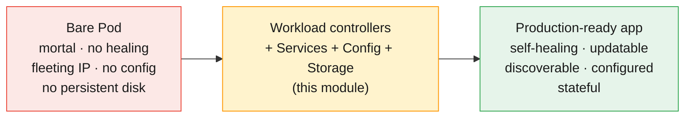

This module fills the gap between "a pod runs" and "an application is operated."
Every object here is a Kubernetes primitive that OpenShift inherits unchanged.

---

## 2. The workload landscape: picking the right controller

A **workload controller** is a controller whose job is to manage a set of Pods so
that the running set matches your declared intent. They differ in *what kind* of
intent they express. Choosing the right one is the first design decision for any
app.

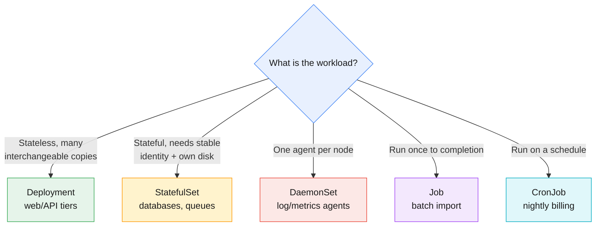

| Controller | Keeps running | Pod identity | Use it for | Telecom example |
|------------|---------------|--------------|------------|-----------------|
| **Deployment** | N interchangeable replicas | random, disposable | stateless services | `subscriber-api`, `tariff-catalog` |
| **StatefulSet** | N ordered replicas | stable (`-0`, `-1`) + own PVC | stateful clustered apps | CDR store, Kafka, Postgres |
| **DaemonSet** | one per node | tied to a node | node-level agents | log shipper, node metrics |
| **Job** | until *completions* succeed | disposable | finite batch work | monthly CDR aggregation |
| **CronJob** | a Job on a schedule | disposable | recurring batch | nightly billing rollup |

> **Rule of thumb:** default to a **Deployment**. Reach for a StatefulSet only
> when a replica's *identity* or *its own disk* must survive rescheduling. Use
> DaemonSet for "every node needs this." Use Job/CronJob for work that *finishes*.

---

## 3. Pods, ReplicaSets & Deployments

### 3.1 The three-layer ownership chain

You create a **Deployment**. It creates and owns a **ReplicaSet**. The ReplicaSet
creates and owns the **Pods**. Each layer has one job:

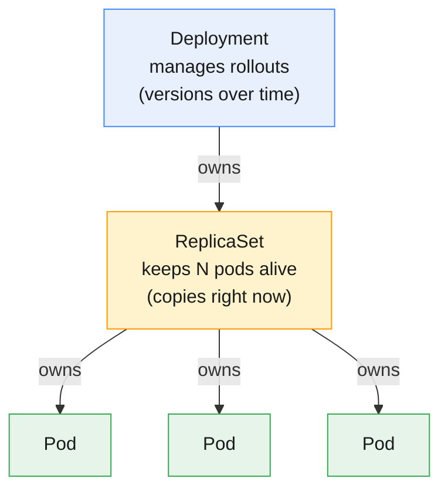

- **Pod** — the smallest deployable unit; one or more containers sharing a network
  namespace and storage. Mortal: no controller, no replacement.
- **ReplicaSet** — guarantees *"N matching Pods exist right now."* If a Pod dies,
  it makes another. It knows nothing about versions.
- **Deployment** — guarantees *"the app is at version X, and getting from old to
  new is safe."* It manages ReplicaSets — one per version — to perform rollouts
  and rollbacks.

You almost never create a ReplicaSet directly; you create a Deployment and let it
manage ReplicaSets for you.

### 3.2 Labels and selectors: the glue

Controllers don't track Pods by name — they track them by **label selector**.
A ReplicaSet's selector (`app=subscriber-api`) is a *standing query*: "any Pod
matching this label is mine." This is also how Services find their Pods (§8).
It's loose coupling by design — delete the Pod, a new one with the same labels
appears, and every selector still matches.

### 3.3 Seeing the chain (verified)

```bash
kubectl create deployment subscriber-api \
  --image=registry.access.redhat.com/ubi9/httpd-24:latest --replicas=3
kubectl get deploy,rs,pods -l app=subscriber-api
```

```
NAME                             READY   UP-TO-DATE   AVAILABLE   AGE
deployment.apps/subscriber-api   3/3     3            3           18s

NAME                                        DESIRED   CURRENT   READY   AGE
replicaset.apps/subscriber-api-59bdf46cb4   3         3         3       18s

NAME                                  READY   STATUS    RESTARTS   AGE
pod/subscriber-api-59bdf46cb4-29b8t   1/1     Running   0          18s
pod/subscriber-api-59bdf46cb4-khhhp   1/1     Running   0          18s
pod/subscriber-api-59bdf46cb4-mmtwr   1/1     Running   0          18s
```

The Pod names encode the chain: `subscriber-api` (Deployment) → `59bdf46cb4`
(ReplicaSet's pod-template hash) → `29b8t` (the Pod's unique suffix).

### 3.4 Scaling is just editing desired state

```bash
kubectl scale deployment subscriber-api --replicas=6   # peak hour
kubectl scale deployment subscriber-api --replicas=3   # back down
```

Scaling up and down are the *same* operation: change `spec.replicas`, and the
ReplicaSet controller reconciles. You cannot "win" against it by deleting Pods —
delete one and a replacement appears within seconds, because desired state still
says 3. To reduce Pods, change the **declaration**, not reality. (This is the
self-healing behaviour you proved in Module 2; here it is the *foundation* every
higher controller builds on.)

> **⎈ Same on OpenShift:** `oc create deployment`, `oc scale`, `oc get deploy,rs,pods`
> are identical. OpenShift adds **DeploymentConfig** (a legacy, OpenShift-specific
> variant with triggers and hooks), but modern OpenShift uses standard Kubernetes
> Deployments — what you learn here transfers directly.

---

## 4. Rolling updates & rollbacks

The whole reason a Deployment manages *ReplicaSets* (plural) is so it can move
from one version to another **without downtime** — and reverse the move if the new
version misbehaves.

### 4.1 How a rolling update works

When you change the Pod template (a new image, usually), the Deployment creates a
**new ReplicaSet** for the new version and gradually shifts replicas from old to
new — bounded by two knobs:

- **maxUnavailable** — how many replicas may be down during the update.
- **maxSurge** — how many *extra* replicas may run above the desired count.

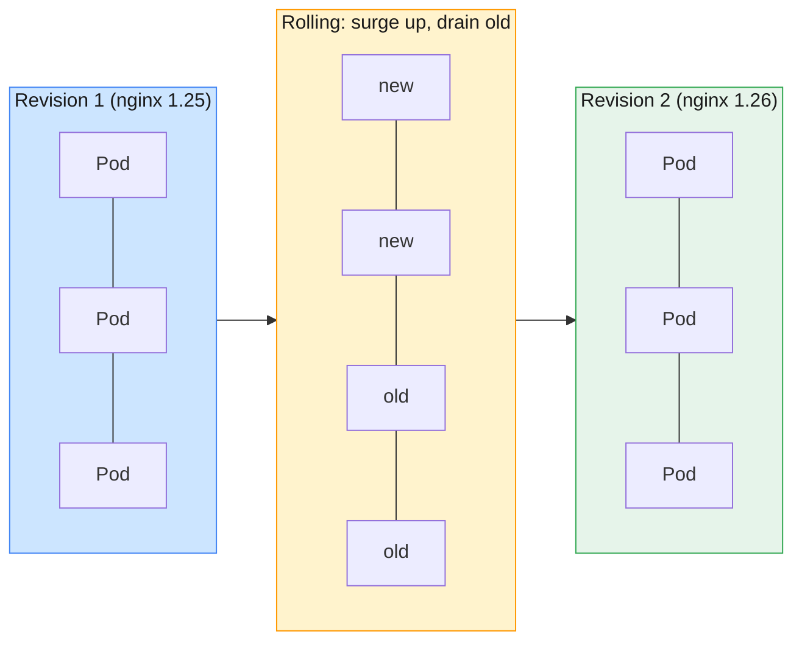

Old replicas are only removed as new ones become **Ready**, so capacity never
drops below your guarantee. The app stays available throughout.

### 4.2 Triggering and watching an update (verified)

```bash
kubectl set image deployment/tariff-catalog nginx=docker.io/library/nginx:1.26-alpine
kubectl annotate deployment/tariff-catalog \
  kubernetes.io/change-cause="upgrade nginx 1.25 -> 1.26" --overwrite
kubectl rollout status deployment/tariff-catalog
```

```
deployment.apps/tariff-catalog image updated
deployment.apps/tariff-catalog annotated
Waiting for deployment "tariff-catalog" rollout to finish: 1 out of 3 new replicas have been updated...
Waiting for deployment "tariff-catalog" rollout to finish: 2 out of 3 new replicas have been updated...
Waiting for deployment "tariff-catalog" rollout to finish: 1 old replicas are pending termination...
deployment "tariff-catalog" successfully rolled out
```

After the update, you can see the new ReplicaSet active and the old one scaled to
zero (kept for rollback):

```
NAME                        DESIRED   READY    IMAGE
tariff-catalog-5bd7bbd4bb   3         3        docker.io/library/nginx:1.26-alpine
tariff-catalog-6d99c7b5b6   0         <none>   docker.io/library/nginx:1.25-alpine
```

### 4.3 Revision history & rollback

The `kubernetes.io/change-cause` annotation populates the human-readable history:

```bash
kubectl rollout history deployment/tariff-catalog
```

```
REVISION  CHANGE-CAUSE
1         nginx 1.25 - initial release
2         upgrade nginx 1.25 -> 1.26
```

A bad release is one command away from undone:

```bash
kubectl rollout undo deployment/tariff-catalog     # back to previous revision
```

After the rollback, the history *re-numbers* — the rolled-back-to template
becomes the newest revision:

```
REVISION  CHANGE-CAUSE
2         upgrade nginx 1.25 -> 1.26
3         nginx 1.25 - initial release
```

A rollback is just another rolling update whose target template is an old one.
Verified: the running pods reverted from `nginx/1.26.3` back to `nginx/1.25.5`.

### 4.4 Pause & resume: batching changes

Pausing lets you make *several* edits and roll them out **once**, instead of
triggering a separate rollout per change:

```bash
kubectl rollout pause deployment/tariff-catalog
kubectl set image deployment/tariff-catalog nginx=docker.io/library/nginx:1.26-alpine
kubectl set resources deployment/tariff-catalog --limits=cpu=100m,memory=64Mi
kubectl rollout resume deployment/tariff-catalog   # ONE rollout applies both
```

While paused, the changes are recorded in the Deployment spec but **no new
ReplicaSet rolls out** until you resume. This is how you avoid hammering a service
with back-to-back rollouts during a multi-part change.

> **⎈ Same on OpenShift:** `oc set image`, `oc rollout status/history/undo/pause/resume`
> are identical. OpenShift's web console shows the same revision history graphically;
> the CLI is unchanged.

---

## 5. StatefulSets — when identity and storage matter

A Deployment's Pods are *cattle*: interchangeable, randomly named, sharing (or
having no) storage. That is perfect for stateless tiers and wrong for databases,
message brokers, and anything where **a replica is not interchangeable** with
another. For those you use a **StatefulSet**, which guarantees three things a
Deployment does not:

1. **Stable, ordinal names** — `cdr-store-0`, `cdr-store-1`, `cdr-store-2`. The
   name survives rescheduling; `-0` is always `-0`.
2. **Ordered, graceful lifecycle** — pods are created `0 → 1 → 2` and removed in
   reverse. A pod isn't created until its predecessor is Ready.
3. **Per-pod persistent storage** via `volumeClaimTemplates` — each pod gets *its
   own* PVC (`data-cdr-store-0`, …) that follows it across restarts.

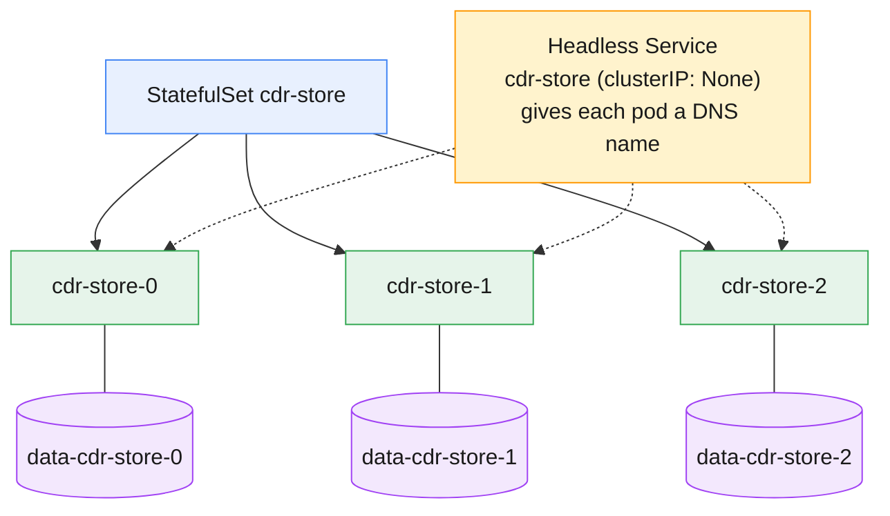

### 5.1 Stable identity in practice (verified)

```bash
kubectl get pods -l app=cdr-store
kubectl get pvc -l app=cdr-store
```

```
NAME          READY   STATUS    RESTARTS   AGE
cdr-store-0   1/1     Running   0          28s
cdr-store-1   1/1     Running   0          22s
cdr-store-2   1/1     Running   0          16s

NAME               STATUS   VOLUME                                     CAPACITY   STORAGECLASS
data-cdr-store-0   Bound    pvc-4a4dc761-...                           256Mi      standard
data-cdr-store-1   Bound    pvc-d27f0617-...                           256Mi      standard
data-cdr-store-2   Bound    pvc-4ccda487-...                           256Mi      standard
```

Note the **creation order** (ages 28s → 22s → 16s) and the **one PVC per pod**.

### 5.2 Stable DNS via a headless Service

Pair a StatefulSet with a **headless Service** (`clusterIP: None`) and each pod
gets its own DNS record `<pod>.<service>.<ns>.svc.cluster.local`:

```bash
getent hosts cdr-store-0.cdr-store
# 10.244.2.73   cdr-store-0.cdr-store.mod3-verify.svc.cluster.local
```

Clustered apps use these stable names to find their peers (e.g. a database replica
contacting its primary). A Deployment cannot give you this — its pod names change
on every reschedule.

> **When NOT to use a StatefulSet:** if your app stores its state in an *external*
> database or object store, the app tier itself is stateless — use a Deployment.
> StatefulSets add ordering and per-pod storage you don't need, and are harder to
> scale and update. Reserve them for genuinely stateful, identity-sensitive apps.

---

## 6. DaemonSets — one pod per node

A **DaemonSet** ensures **exactly one copy of a pod runs on every (eligible)
node**. As nodes join the cluster, the DaemonSet places a pod on them
automatically; as nodes leave, those pods are cleaned up. You don't set a replica
count — the count *is* the node count.

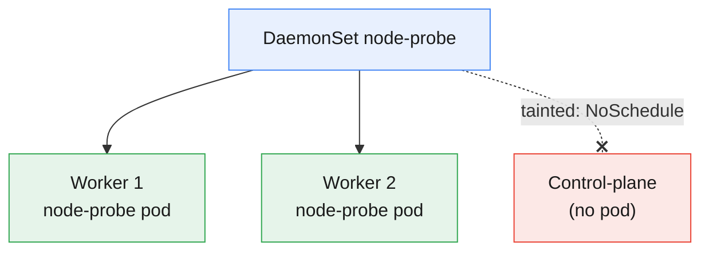

**Use DaemonSets for node-level infrastructure:** log shippers (Fluent Bit),
metrics agents (node-exporter), storage daemons, CNI plugins, security agents.
Each needs to run *where the work is*, on every machine.

### 6.1 Per-node placement (verified)

```bash
kubectl get daemonset node-probe
kubectl get pods -l app=node-probe -o wide
```

```
NAME         DESIRED   CURRENT   READY   NODE SELECTOR   AGE
node-probe   2         2         2       <none>          12s

NAME               READY   STATUS    NODE                  ...
node-probe-jjv85   1/1     Running   mod2-verify-worker
node-probe-t788b   1/1     Running   mod2-verify-worker2
```

The cluster has three nodes but the DaemonSet placed only **two** pods — because
the **control-plane node carries a `NoSchedule` taint** and the DaemonSet has no
matching toleration:

```
[{"effect":"NoSchedule","key":"node-role.kubernetes.io/control-plane"}]
```

This is the key teaching point: "one per node" means *one per node the pod is
**allowed** to run on*. System DaemonSets (like the CNI) add tolerations so they
*do* run on control-plane nodes; your app DaemonSets usually shouldn't.

> **⎈ Same on OpenShift:** OpenShift itself ships dozens of DaemonSets (SDN/OVN,
> monitoring, machine-config, image registry node CA). You rarely author your own
> unless deploying a node agent — but you'll see them constantly in `oc get ds -A`.

---

## 7. Jobs & CronJobs — run-to-completion work

Deployments, StatefulSets, and DaemonSets all keep pods running **forever**. Some
work isn't like that — a monthly CDR aggregation, a data migration, a report —
runs, *finishes*, and should stop. That's a **Job**.

### 7.1 Jobs

A Job runs pods until a specified number **succeed**, then stops. Two knobs shape
it:

- **completions** — how many successful runs you need (e.g. process 3 batches).
- **parallelism** — how many run at once.

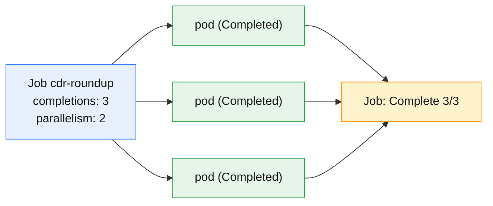

Verified — 3 completions, 2 at a time:

```
NAME          STATUS     COMPLETIONS   DURATION   AGE
cdr-roundup   Complete   3/3           15s        24s

NAME                READY   STATUS      RESTARTS   AGE
cdr-roundup-4fbng   0/1     Completed   0          16s
cdr-roundup-7rcqs   0/1     Completed   0          24s
cdr-roundup-w2x7f   0/1     Completed   0          24s
```

Completed pods are **kept** (status `Completed`, `0/1` ready) so you can read
their logs — they aren't restarted. A Job's `restartPolicy` is `Never` or
`OnFailure`, never `Always`.

### 7.2 CronJobs

A **CronJob** creates a Job on a cron schedule — the Kubernetes-native way to run
recurring batch work without an external scheduler:

```bash
kubectl create cronjob nightly-billing \
  --image=registry.access.redhat.com/ubi9/ubi-minimal:latest \
  --schedule="0 2 * * *" -- sh -c "echo running nightly billing rollup"
```

```
NAME              SCHEDULE    TIMEZONE   SUSPEND   ACTIVE   LAST SCHEDULE   AGE
nightly-billing   0 2 * * *   <none>     False     0        <none>          0s
```

The schedule `0 2 * * *` means "02:00 every day." Each firing spawns a fresh Job
(and pods); `SUSPEND=True` pauses scheduling without deleting the object.

> **Telecom fit:** Jobs and CronJobs are how you model the operator's batch world —
> nightly billing rollups, periodic CDR archival to cold storage, monthly usage
> report generation — as first-class cluster objects with logs, retries, and
> history, instead of cron on a random VM.

---

## 8. Services & service discovery

Pods are ephemeral and their IPs change on every reschedule. If `tariff-catalog`
talked to `subscriber-api` by Pod IP, every heal would break it. A **Service** is
the stable abstraction in front of a set of Pods: one durable name and virtual IP
that load-balances across whichever Pods currently match its selector.

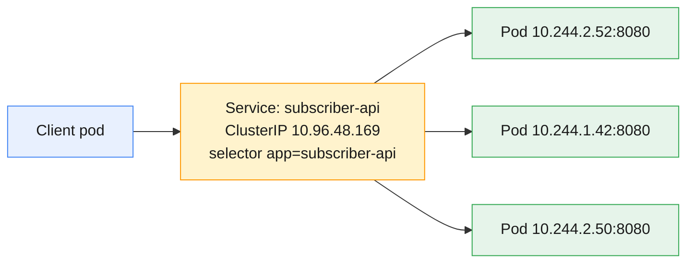

### 8.1 Endpoints — the live membership

A Service's selector is matched continuously and the result stored in an
**EndpointSlice**: the current set of ready Pod IP:port pairs. This is the Service's
"backend list," updated automatically as Pods come and go:

```bash
kubectl get endpointslices -l kubernetes.io/service-name=subscriber-api
```

```
NAME                   ADDRESSTYPE   PORTS   ENDPOINTS
subscriber-api-nthlr   IPv4          8080    10.244.2.52,10.244.1.42,10.244.2.50
```

If a selector matches **no** ready Pods, the EndpointSlice is empty and the Service
has nothing to route to — the #1 cause of "my Service returns connection refused."

### 8.2 Service types

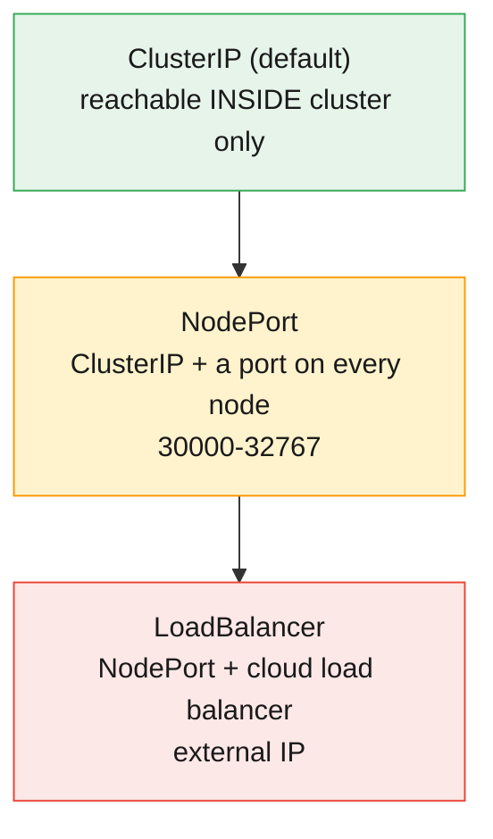

- **ClusterIP** (default) — internal-only virtual IP. The right choice for
  service-to-service traffic (`subscriber-api`, internal `tariff-catalog`).
- **NodePort** — also opens a high port (30000–32767) on *every* node, so external
  traffic to `NodeIP:nodePort` reaches the Service. Good for dev/demo; coarse for
  production.
- **LoadBalancer** — provisions a real cloud load balancer with an external IP.
  Builds on NodePort. Needs a cloud provider (or MetalLB on bare metal).
- **headless** (`clusterIP: None`) — no virtual IP at all; DNS returns the Pod IPs
  directly. Used with StatefulSets (§5) for per-pod addressing.

Verified ClusterIP and NodePort side by side:

```
NAME                TYPE        CLUSTER-IP     PORT(S)
subscriber-api      ClusterIP   10.96.48.169   80/TCP
subscriber-api-np   NodePort    10.96.97.71    80:30294/TCP
```

The NodePort line reads "the cluster-internal port 80 is also reachable on port
**30294** of every node."

> **⎈ Same on OpenShift — with a twist:** ClusterIP/NodePort/LoadBalancer all work
> on OpenShift. But the *idiomatic* way to expose HTTP apps on OpenShift is a
> **Route** (`oc expose svc/...`), not a raw NodePort or cloud LB — Routes are
> OpenShift's built-in, hostname-based ingress. You'll meet them in Module 4. The
> generic Kubernetes **Ingress** (§9) also works and OpenShift maps it onto Routes.

---

## 9. DNS, and exposing apps with Ingress

### 9.1 Cluster DNS (CoreDNS)

Every cluster runs an internal DNS server (**CoreDNS**) that gives every Service a
name. A pod can reach a Service by:

| From | Name to use |
|------|-------------|
| Same namespace | `subscriber-api` (short name) |
| Any namespace | `subscriber-api.mod3-verify` |
| Fully qualified | `subscriber-api.mod3-verify.svc.cluster.local` |

Verified from a test pod — short name and FQDN resolve to the same ClusterIP, and
a cross-namespace lookup (the cluster's own DNS service) works too:

```
subscriber-api                 -> 10.96.48.169   (short name)
subscriber-api...svc.cluster.local -> 10.96.48.169   (FQDN)
kube-dns.kube-system...        -> 10.96.0.10     (cross-namespace)
```

Pods resolve short names because their `/etc/resolv.conf` lists a **search
domain** for their own namespace. The naming pattern
`<service>.<namespace>.svc.cluster.local` is worth memorizing — it's how every
app in the cluster addresses every other.

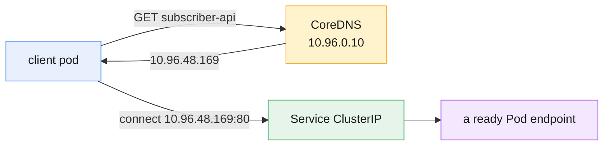

### 9.2 Ingress: HTTP routing by host & path

A NodePort per service doesn't scale — you'd hand out dozens of high ports. An
**Ingress** is a single HTTP(S) entry point that routes by **hostname and path** to
different backend Services:

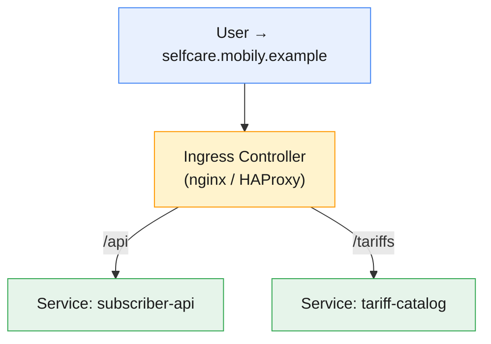

**Crucial distinction:** the **Ingress object** is just routing *rules*. Those
rules do nothing until an **Ingress Controller** (a running pod, e.g. ingress-nginx)
is installed to read them and actually proxy traffic. On a cluster *without* a
controller, you can create an Ingress and it will sit there with an empty
`ADDRESS` — which is exactly what we observe in the demo:

```
NAME       CLASS    HOSTS                     ADDRESS   PORTS   AGE
selfcare   <none>   selfcare.mobily.example             80      70m
```

`describe` still shows the routing rules and resolved backends, confirming the
object is valid — it's just waiting for a controller to give it an address:

```
Rules:
  Host                     Path       Backends
  selfcare.mobily.example  /api       subscriber-api:80 (10.244.2.52:8080,...)
                           /tariffs   tariff-catalog:80 (10.244.2.63:80,...)
```

> **⎈ Same on OpenShift:** OpenShift ships an ingress controller out of the box
> (the **OpenShift Router**, HAProxy-based) and its native **Route** object. You
> can use standard Ingress *or* Routes; OpenShift translates Ingress into Routes
> automatically. So on OpenShift the "no controller installed" gap above never
> happens — exposure works immediately. Routes are covered in Module 4.

---

## 10. Configuration: ConfigMaps & Secrets

A good image is **immutable** and **environment-agnostic**: the same
`subscriber-api` image runs in dev, staging, and prod. What differs between
environments — endpoints, feature flags, credentials — is injected at runtime. The
two objects for that are **ConfigMap** (non-sensitive) and **Secret** (sensitive).

### 10.1 ConfigMaps

A ConfigMap is a set of key/value pairs you inject into pods two ways:

- **As environment variables** (`envFrom` injects all keys; `valueFrom` picks one).
- **As files in a mounted volume** (each key becomes a file).

```bash
kubectl create configmap tariff-config \
  --from-literal=PLAN_TIER=gold \
  --from-literal=DATA_QUOTA_GB=50 \
  --from-literal=ROAMING=enabled
```

Verified — a pod consuming it via `envFrom` *and* as mounted files at once:

```
PLAN_TIER=gold QUOTA=50 ROAMING=enabled     <- environment variables
--- mounted files ---
DATA_QUOTA_GB
PLAN_TIER
ROAMING                                      <- each key is a file
--- ROAMING file ---
enabled
```

The same ConfigMap, two delivery styles: env vars for simple settings, mounted
files for whole config files (`nginx.conf`, `application.yaml`) an app reads from
disk.

### 10.2 Secrets

A **Secret** is structurally like a ConfigMap but for sensitive values, with one
critical caveat: **Secrets are base64-*encoded*, not encrypted.** Base64 is
trivially reversible — encoding is for safely carrying binary/awkward bytes, not
for protecting them:

```bash
kubectl create secret generic billing-secret \
  --from-literal=DB_USER=mobily_app --from-literal=DB_PASSWORD='S3cr3t-Pa55'
kubectl get secret billing-secret -o jsonpath='{.data.DB_PASSWORD}'
# UzNjcjN0LVBhNTU=   <- base64, decodes straight back to S3cr3t-Pa55
```

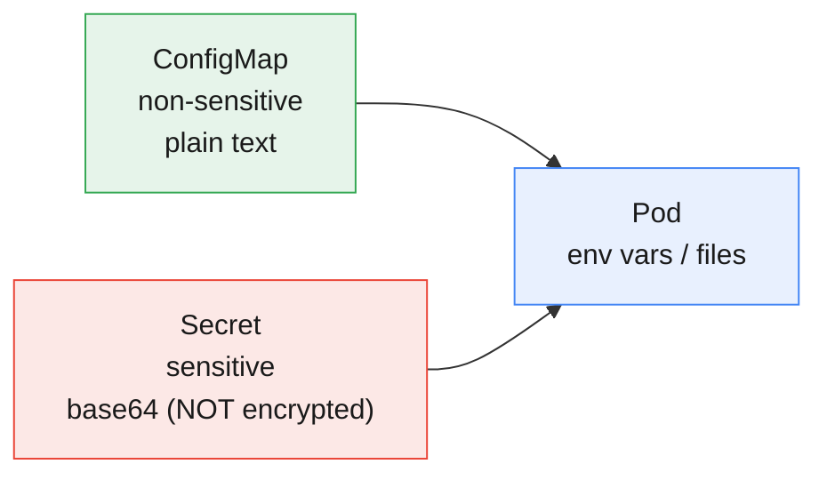

**Real protection** for Secrets comes from: RBAC limiting who can read them (next
modules), **encryption-at-rest** for etcd, and not committing them to Git. Inject
a Secret exactly like a ConfigMap — `secretKeyRef` for one key, `envFrom` for all,
or a mounted volume.

> **Why this matters:** decoupling config from image is what makes "build once,
> promote the same artifact through environments" possible. Change behaviour by
> swapping a ConfigMap, not by rebuilding. Never bake credentials into an image.

> **⎈ Same on OpenShift:** identical objects. OpenShift adds **SCCs** and tighter
> default RBAC around Secrets, plus easy integration with external secret stores
> and sealed/encrypted secrets — but `kubectl create configmap/secret` is unchanged.

---

## 11. Storage: Volumes, PVCs & StorageClasses

A container's filesystem is **ephemeral** — delete the pod and its writes vanish.
That's fine for stateless apps, fatal for anything that must remember data. Storage
in Kubernetes is built from three objects that cleanly separate *what an app wants*
from *what the infrastructure provides*.

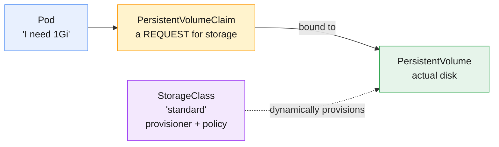

- **PersistentVolume (PV)** — a piece of actual storage (a cloud disk, an NFS
  share, a local path). Cluster-scoped.
- **PersistentVolumeClaim (PVC)** — a *request* ("I need 1Gi, ReadWriteOnce"). Pods
  reference the **PVC**, not the PV — the indirection is the point.
- **StorageClass** — describes a *kind* of storage and its **provisioner**, so PVs
  are created **dynamically** on demand. No admin pre-provisioning needed.

### 11.1 Dynamic provisioning (verified)

The cluster has a default StorageClass with a key property:

```
NAME                 PROVISIONER             RECLAIMPOLICY   VOLUMEBINDINGMODE
standard (default)   rancher.io/local-path   Delete          WaitForFirstConsumer
```

`WaitForFirstConsumer` means a new PVC stays **Pending** until a pod actually uses
it — so the volume is created on the right node for that pod:

```bash
kubectl apply -f cdr-archive-pvc.yaml
kubectl get pvc cdr-archive
# cdr-archive   Pending   ...   standard   ...   (waiting for a consumer)
```

The moment a pod mounts it, the provisioner creates a PV and binds the claim:

```
NAME          STATUS   VOLUME              CAPACITY   ACCESS MODES   STORAGECLASS
cdr-archive   Bound    pvc-6b9b5044-...    1Gi        RWO            standard
```

### 11.2 Data persists across pod deletion (the whole point)

A writer pod appends a CDR, we **delete the pod**, then a *brand-new* reader pod
mounts the **same PVC** — and the data is still there:

```
# writer pod:
WROTE:
8821001234,8821005678,2026-06-25T10:00:00,180,VOICE

# pod deleted, new reader pod mounts the same PVC:
DATA SURVIVED POD DELETION:
8821001234,8821005678,2026-06-25T10:00:00,180,VOICE
```

This is the dividing line between stateless and stateful: the PVC's lifecycle is
**independent** of any pod. Pods are cattle; the PVC is the thing that remembers.

### 11.3 Access modes (know these three)

| Mode | Short | Meaning |
|------|-------|---------|
| ReadWriteOnce | RWO | mounted read-write by **one node** (most block storage) |
| ReadOnlyMany | ROX | read-only by many nodes |
| ReadWriteMany | RWX | read-write by many nodes (needs shared FS: NFS, CephFS) |

Most cloud block disks are **RWO** — a single pod/node at a time. If you need many
pods writing the same volume, you need an **RWX**-capable backend; don't assume it.

> **⎈ Same on OpenShift:** identical PVC/PV/StorageClass model. OpenShift bundles
> **OpenShift Data Foundation** (Ceph-based) for RWO/RWX/object storage and wires
> default StorageClasses per platform. Your app's PVC YAML is unchanged.

---

## 12. Namespaces & multi-tenancy

A **Namespace** is a virtual cluster inside the cluster — a scope for names and a
boundary for access control and quotas. Most objects (Pods, Services, Deployments,
ConfigMaps, Secrets, PVCs) are *namespaced*; a few (Nodes, PVs, StorageClasses,
Namespaces themselves) are cluster-scoped.

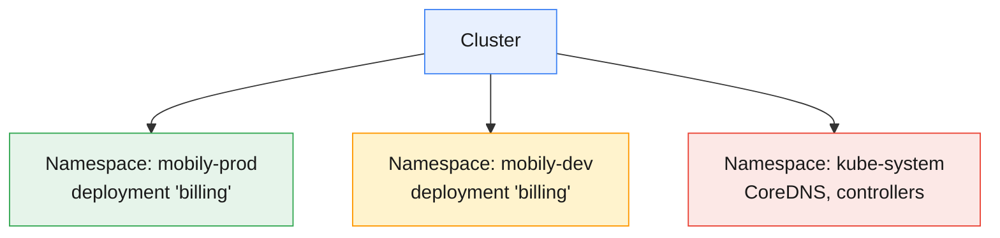

The same name lives independently in two namespaces — verified with a `billing`
deployment in both `mobily-prod` and `mobily-dev`:

```
# namespace mobily-prod          # namespace mobily-dev
billing   1/1   1   1   4s        billing   1/1   1   1   4s
```

They don't collide, can't see each other's objects by default, and are addressed
across the boundary by FQDN (`billing.mobily-dev.svc.cluster.local`). Namespaces
are where **RBAC**, **ResourceQuotas**, and **NetworkPolicies** attach — the
foundation for letting many teams share one cluster safely.

> **⎈ Same on OpenShift:** an OpenShift **Project** *is* a Namespace with extra
> metadata and self-service creation (`oc new-project`). Everything you learn about
> namespaces applies; Module 4 builds RBAC and quotas on top of them.

---

## 13. Key takeaways

1. **Never run a bare Pod.** Pick a controller: **Deployment** (stateless),
   **StatefulSet** (identity + own disk), **DaemonSet** (one per node),
   **Job/CronJob** (finite/scheduled work).
2. **Deployment → ReplicaSet → Pods.** The Deployment manages *versions*
   (rollouts/rollbacks via multiple ReplicaSets); the ReplicaSet keeps *N copies*
   alive. Scaling and updating are both just edits to desired state.
3. **Rolling updates** shift replicas old→new with no downtime; **rollback** is a
   one-command return to a prior revision; **pause/resume** batches changes into a
   single rollout.
4. **StatefulSets** give stable names, ordered lifecycle, and a per-pod PVC — use
   them only when identity/storage truly matter.
5. A **Service** is a stable name + virtual IP over a changing set of Pods;
   **EndpointSlices** are its live backend list; **CoreDNS** makes it discoverable
   as `<svc>.<ns>.svc.cluster.local`.
6. **ClusterIP** for internal, **NodePort/LoadBalancer** for external, **Ingress**
   for host/path HTTP routing — but an **Ingress needs a controller** to do
   anything.
7. **ConfigMaps/Secrets** decouple config from image (build once, promote
   everywhere). **Secrets are base64, not encrypted** — protect them with RBAC and
   encryption-at-rest.
8. **PVC → PV → StorageClass** separates "what the app wants" from "what infra
   provides"; the **PVC outlives the pod**, which is what makes data persist.
9. **Namespaces** scope names and are where RBAC/quota/network policy attach —
   the basis of multi-tenancy.
10. Every object here is **standard Kubernetes that OpenShift inherits** — `oc`
    runs the same commands; OpenShift adds Routes, SCCs, Projects, and data/ingress
    out of the box.

---

## 14. Glossary

| Term | Meaning |
|------|---------|
| **Deployment** | Controller for stateless apps; manages ReplicaSets to perform rollouts/rollbacks. |
| **ReplicaSet** | Controller that keeps N matching Pods running *right now*. |
| **StatefulSet** | Controller giving Pods stable names, ordered lifecycle, and per-pod PVCs. |
| **DaemonSet** | Controller that runs one Pod per eligible node. |
| **Job / CronJob** | Run-to-completion work / a Job on a cron schedule. |
| **Rolling update** | Gradual old→new replica replacement with no downtime. |
| **Rollback** | Returning a Deployment to a previous revision. |
| **change-cause** | `kubernetes.io/change-cause` annotation recorded in rollout history. |
| **Label / selector** | Key/value tags on objects / a query that matches them; how controllers and Services find Pods. |
| **Service** | Stable name + virtual IP load-balancing across selected Pods. |
| **ClusterIP / NodePort / LoadBalancer** | Internal-only / node-port-exposed / cloud-LB-exposed Service types. |
| **Headless Service** | `clusterIP: None`; DNS returns Pod IPs directly (used with StatefulSets). |
| **EndpointSlice** | The live set of ready Pod IP:port backing a Service. |
| **CoreDNS** | Cluster DNS; resolves `<svc>.<ns>.svc.cluster.local`. |
| **Ingress / Ingress Controller** | HTTP routing *rules* / the running proxy that enforces them. |
| **ConfigMap / Secret** | Non-sensitive / sensitive key-value config injected into Pods (Secrets are base64, not encrypted). |
| **Volume / PV / PVC** | In-pod storage / a real storage piece / a request that binds to one. |
| **StorageClass** | A kind of storage + provisioner enabling dynamic PV creation. |
| **Access mode (RWO/ROX/RWX)** | How many nodes can mount a volume and how. |
| **Namespace** | Virtual cluster: a scope for names, RBAC, quotas (OpenShift Project). |

---

## 15. References

- Kubernetes — [Workloads](https://kubernetes.io/docs/concepts/workloads/)
- Kubernetes — [Deployments](https://kubernetes.io/docs/concepts/workloads/controllers/deployment/)
- Kubernetes — [StatefulSets](https://kubernetes.io/docs/concepts/workloads/controllers/statefulset/)
- Kubernetes — [DaemonSets](https://kubernetes.io/docs/concepts/workloads/controllers/daemonset/)
- Kubernetes — [Jobs](https://kubernetes.io/docs/concepts/workloads/controllers/job/) · [CronJobs](https://kubernetes.io/docs/concepts/workloads/controllers/cron-jobs/)
- Kubernetes — [Service](https://kubernetes.io/docs/concepts/services-networking/service/) · [DNS for Services](https://kubernetes.io/docs/concepts/services-networking/dns-pod-service/) · [Ingress](https://kubernetes.io/docs/concepts/services-networking/ingress/)
- Kubernetes — [ConfigMaps](https://kubernetes.io/docs/concepts/configuration/configmap/) · [Secrets](https://kubernetes.io/docs/concepts/configuration/secret/)
- Kubernetes — [Persistent Volumes](https://kubernetes.io/docs/concepts/storage/persistent-volumes/) · [Storage Classes](https://kubernetes.io/docs/concepts/storage/storage-classes/)
- Kubernetes — [Namespaces](https://kubernetes.io/docs/concepts/overview/working-with-objects/namespaces/)
- OpenShift — [Understanding Deployments](https://docs.openshift.com/container-platform/4.18/applications/deployments/what-deployments-are.html) · [Routes](https://docs.openshift.com/container-platform/4.18/networking/routes/route-configuration.html)

---

### Companion material

- **Interactive visualizations:** [`labs/module-03/index.html`](../labs/module-03/index.html) — five browser-based, offline visualizations (workload controllers, rolling updates, services & DNS, config & storage, StatefulSets/DaemonSets/Jobs), each with a self-check quiz.
- **Demos:** [`labs/module-03/demos/`](../labs/module-03/demos/README.md) — instructor-led walkthroughs.
- **Exercises:** [`labs/module-03/exercises/`](../labs/module-03/exercises/README.md) — hands-on practice.
- Previous module: [Module 2 — Kubernetes Foundations & Architecture](module-02-kubernetes-architecture.md).

> **✅ Verified:** kubectl 1.34 · Kubernetes 1.33 (3-node kind, equivalent plain
> Kubernetes). Every command output quoted in this guide is from a live run on that
> cluster; the matching demos reproduce each one end to end.
