# Module 4 — OpenShift Architecture and Product Overview

> **Course:** OpenShift Container Platform
> **Module objective:** You have learned what containers are (Module 1), how a
> Kubernetes cluster is built (Module 2), and how to run real workloads on it
> (Module 3). Now meet the product you will actually administer: **Red Hat
> OpenShift Container Platform (OCP)**. This module explains *what OpenShift is*,
> *how it is layered on top of Kubernetes*, and *what it adds* to turn raw
> Kubernetes into a supported, opinionated, self-managing **enterprise platform** —
> its history, its stack (RHCOS + CRI-O), the **Operator** pattern that runs the
> platform itself (Cluster Operators + the Cluster Version Operator), the **Machine
> API** that manages the nodes, and the day-one tools you will live in: the **web
> console** and the **`oc`** CLI.

---

## Table of contents

1. [Why this module matters](#1-why-this-module-matters)
2. [Kubernetes vs OpenShift: the same kernel, a finished product](#2-kubernetes-vs-openshift-the-same-kernel-a-finished-product)
3. [OpenShift evolution and release history](#3-openshift-evolution-and-release-history)
4. [The OpenShift stack architecture](#4-the-openshift-stack-architecture)
5. [The OpenShift product portfolio](#5-the-openshift-product-portfolio)
6. [RHCOS — the immutable node operating system](#6-rhcos--the-immutable-node-operating-system)
7. [CRI-O — the purpose-built container runtime](#7-cri-o--the-purpose-built-container-runtime)
8. [The Operator pattern — software that operates software](#8-the-operator-pattern--software-that-operates-software)
9. [Cluster Operators and the Cluster Version Operator](#9-cluster-operators-and-the-cluster-version-operator)
10. [The Machine API — declarative infrastructure](#10-the-machine-api--declarative-infrastructure)
11. [Hands-on: the web console and `oc` CLI essentials](#11-hands-on-the-web-console-and-oc-cli-essentials)
12. [Key takeaways](#12-key-takeaways)
13. [Glossary](#13-glossary)
14. [References](#14-references)

> **How to read the diagrams:** Diagrams are written in [Mermaid](https://mermaid.js.org/),
> which renders automatically in GitHub, VS Code (with a Mermaid extension), and most
> modern Markdown viewers. If a diagram appears as code, install/enable a Mermaid
> preview to see the rendered version.

> **CLI note (oc track).** Modules 2 and 3 were taught on plain Kubernetes with
> **`kubectl`**. From **this module on we switch to OpenShift and `oc`.** `oc` is a
> superset of `kubectl`: every `kubectl` command you learned works verbatim as `oc`,
> and `oc` adds OpenShift verbs (`oc new-app`, `oc expose`, `oc login`, `oc adm`,
> Projects, Routes, BuildConfigs). Where a command has a Kubernetes equivalent, a
> **⎈** note points it out so the fundamentals keep reinforcing.

> **Telecom framing.** Examples model a fictional mobile operator, *Mobily*: a
> `subscriber-api`, a `tariff-catalog`, CDR (Call Detail Record) processing, an SMS
> gateway, and a self-care portal. All MSISDNs, plans, and data are invented.

> **Companion labs.** Work the interactive visualizations in
> [`labs/module-04/index.html`](../labs/module-04/index.html) and the hands-on
> [exercises](../labs/module-04/exercises/README.md) (`oc` on the shared OpenShift
> 4.18 cluster or the [Developer Sandbox](https://developers.redhat.com/developer-sandbox)).

---

## 1. Why this module matters

By now you can build an image, you understand the control plane, and you can roll
out a Deployment behind a Service. If Kubernetes already does all that, a fair
question is: **why does OpenShift exist at all?**

The honest answer is that **upstream Kubernetes is a kit, not a product.** It gives
you the engine and the API, but it deliberately leaves out the things an enterprise
must decide for itself: which OS the nodes run, which container runtime, how the
ingress layer works, how users log in, how images are built and stored, how the
cluster monitors and *upgrades itself*. Assemble all of that yourself and you have
built a platform — and you now own it forever.

OpenShift is Red Hat taking those decisions, integrating ~40 upstream and Red Hat
projects into one tested distribution, wrapping it in **commercial support and a
defined lifecycle**, and — crucially — making the platform **manage itself** through
Operators. You stop hand-assembling Kubernetes and start *operating a product*.

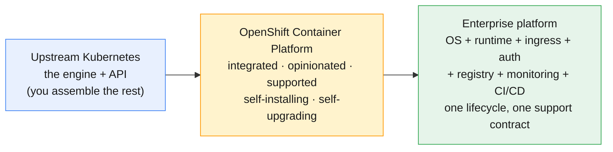

For Mobily, that difference is the whole point. A telecom platform team cannot spend
its quarters integrating ingress controllers and patching node kernels by hand. They
need a platform that **comes finished**, upgrades as one unit, and has someone to
call at 3 a.m. when an SMS-gateway rollout misbehaves. That is what this module is
about: understanding the product you are being hired to administer.

By the end you will be able to explain, to a colleague, exactly what OpenShift adds
on top of Kubernetes and *why each piece is there*.

---

## 2. Kubernetes vs OpenShift: the same kernel, a finished product

The single most important mental model in this module: **OpenShift *is*
Kubernetes** — certified, conformant Kubernetes — *plus* a curated set of layers
that make it a product. Nothing you learned about Pods, Deployments, Services,
ConfigMaps, or the reconcile loop changes. OpenShift adds; it does not replace.

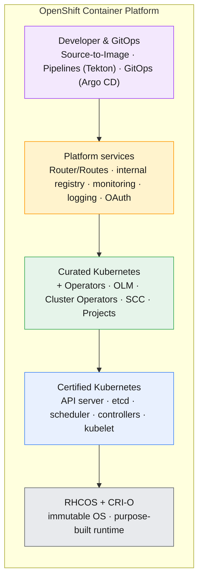

What each added layer buys you:

| Concern | Plain Kubernetes | OpenShift adds |
|---|---|---|
| **Node OS** | bring your own (any Linux) | **RHCOS** — immutable, managed by the cluster |
| **Runtime** | bring your own (containerd, etc.) | **CRI-O** — versioned with the cluster |
| **Install / upgrade** | you wire it together | **installer + Cluster Version Operator** upgrade the whole stack as one unit |
| **Ingress** | install an Ingress controller | **Routes + HAProxy Router** out of the box (Ingress also supported) |
| **Login / users** | certificates / external IAM | built-in **OAuth server**, identity providers, `oc login` |
| **Authorization** | RBAC | RBAC **+ Security Context Constraints (SCC)** — pods run non-root by default |
| **Tenancy** | Namespaces | **Projects** (Namespaces + annotations + self-service + quotas) |
| **Image registry** | external | **integrated registry** + ImageStreams |
| **Build from source** | external CI | **Source-to-Image (S2I)**, BuildConfigs |
| **Monitoring/logging** | install yourself | **Prometheus + Alertmanager + Grafana** and logging stack, preconfigured |
| **Web UI** | optional dashboard | full **admin + developer web console** |
| **Support** | community | Red Hat **commercial support + lifecycle** |

> **⎈ Kubernetes equivalent.** A *Project* is a *Namespace* with extra metadata and
> self-service semantics; a *Route* is OpenShift's richer answer to an *Ingress*; an
> *SCC* is analogous to a *PodSecurityStandard / admission policy*. The underlying
> Kubernetes object is always there underneath.

The defaults are also **safer**. On vanilla Kubernetes a container that says
`USER root` will happily run as UID 0. On OpenShift the default SCC (`restricted-v2`)
**refuses** that and assigns a high random UID — which is exactly why your
`ubi9/httpd-24` and `ubi9/nginx-120` images from Module 1 were chosen: they are built
to run rootless. The platform pushes you toward secure defaults rather than trusting
you to remember them.

**The takeaway:** if you know Kubernetes, you already know 70% of OpenShift. The
remaining 30% — the parts in this module — is what makes it a *product*.

---

## 3. OpenShift evolution and release history

Understanding where OpenShift came from explains why today's version looks the way it
does — especially the dramatic break at **version 4**.

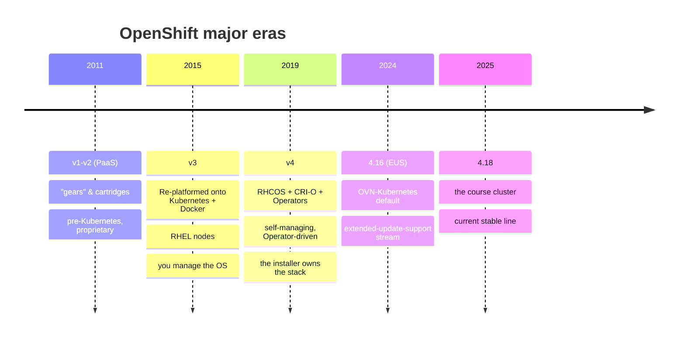

The eras in plain language:

- **OpenShift v1–v2 (≈2011):** a classic PaaS built on Red Hat's own "gear" and
  cartridge technology — *before* Docker and Kubernetes existed in their modern form.
  Historical context only; nothing carries forward.
- **OpenShift v3 (2015):** the big re-platforming onto **Kubernetes + Docker**, on
  **RHEL** nodes you installed and patched yourself. Powerful, but *you* still owned
  the OS, the runtime, and most of the day-2 wiring.
- **OpenShift v4 (2019 → today):** the philosophy shift that defines the product you
  use now. Nodes run **RHCOS**, the runtime is **CRI-O**, and the **entire platform
  is run by Operators**. The cluster **installs and upgrades itself** as one tested
  unit. This is the *self-managing* era.
- **4.x cadence:** Red Hat ships a minor release roughly every ~4 months, tracking
  upstream Kubernetes (OCP 4.18 ≈ Kubernetes 1.31). Selected releases are marked
  **EUS (Extended Update Support)** so enterprises like Mobily can stay on a stable
  line longer and hop EUS-to-EUS.

**Why it matters for you:** almost every "how do I…" answer on OpenShift 4 is *"an
Operator does it."* That is the v3→v4 inheritance. When you wonder who configures the
router, the registry, or the monitoring stack — the answer is always a Cluster
Operator (§9), driven ultimately by the version of the cluster itself.

---

## 4. The OpenShift stack architecture

Zoom into one cluster. An OpenShift cluster is the same **control plane + worker
nodes** topology you met in Module 2 — but every node runs a defined software stack,
and the control plane runs a layer of Operators that *are* the platform.

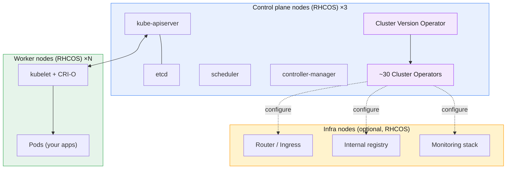

Read the stack **bottom-up on any single node** and you get the layering that the
visualizations make interactive:

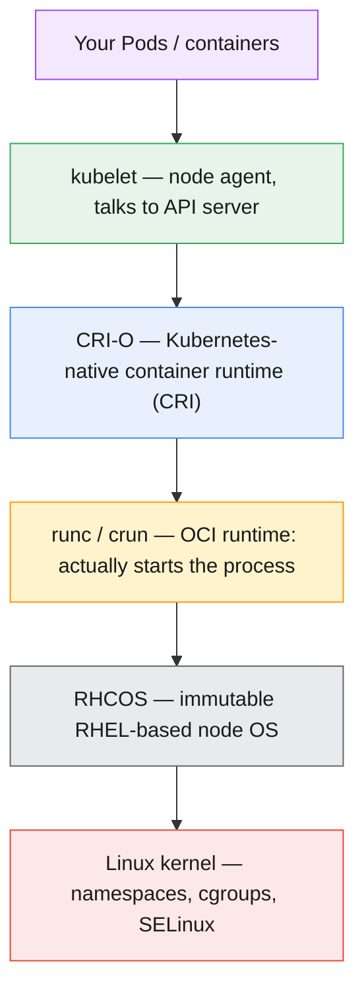

**Node roles** (you will inspect these in the labs):

- **Control plane (master) nodes** — run the API server, etcd, scheduler,
  controllers, *and* the Operator layer. OpenShift defaults to **3** for quorum/HA.
- **Worker (compute) nodes** — run your application Pods. Scale these for capacity.
- **Infra nodes** — *optional* worker nodes labelled to host platform components
  (router, registry, monitoring) so that infrastructure load is isolated from — and
  often licensed separately from — application load. For Mobily, putting the SMS
  gateway's traffic on workers while the router and Prometheus live on infra nodes
  keeps a noisy app from starving the platform.

Roles are just **labels + taints**, not different binaries: every node runs the same
RHCOS + CRI-O + kubelet stack. `node-role.kubernetes.io/master` and
`/worker` labels (plus the control-plane `NoSchedule` taint) decide what lands where.

---

## 5. The OpenShift product portfolio

"OpenShift" is a **family**, not a single SKU. Knowing the portfolio prevents the
common confusion of comparing a self-managed cluster to a fully-managed cloud
service as if they were the same thing.

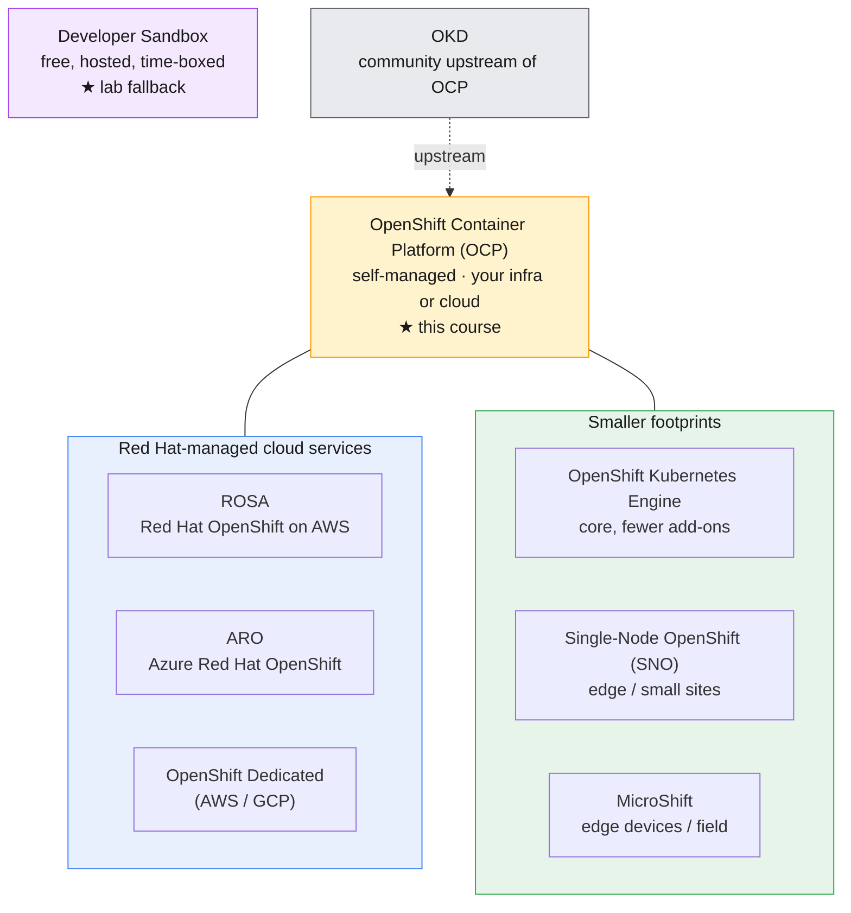

| Product | Who runs it | Where | Typical use |
|---|---|---|---|
| **OCP** (this course) | **you** | bare metal, VMware, OpenStack, any cloud | Mobily's on-prem / private-cloud platform |
| **ROSA** | AWS + Red Hat (jointly) | AWS | OpenShift without operating the control plane |
| **ARO** | Microsoft + Red Hat | Azure | same, on Azure |
| **OpenShift Dedicated** | Red Hat (SRE) | AWS / GCP | Red Hat-operated single-tenant cluster |
| **OKE** | you | anywhere | OCP minus the higher add-ons (cheaper core) |
| **SNO** | you | edge / branch sites | one node = whole cluster (cell sites!) |
| **MicroShift** | you | constrained edge devices | OpenShift footprint on field hardware |
| **Developer Sandbox** | Red Hat | hosted | **free learning** — your lab fallback |
| **OKD** | community | anywhere | upstream, unsupported community build |

For a telecom, this portfolio maps neatly onto a real estate plan: **OCP/ROSA** in
the core data centres, **SNO** or **MicroShift** at the network edge (cell sites,
regional POPs) where you might run a usage-metering collector on a single box.

> **Lab note.** The course targets a **shared OpenShift 4.18 cluster**; the **free
> [Developer Sandbox](https://developers.redhat.com/developer-sandbox)** is the
> fallback for the `oc` exercises if the shared cluster is unavailable. On the
> Sandbox you are a *project member*, not cluster-admin, so node/operator inspection
> commands are read-only or restricted — each exercise notes this.

---

## 6. RHCOS — the immutable node operating system

In OpenShift 4, the control-plane and worker nodes run **Red Hat Enterprise Linux
CoreOS (RHCOS)** — a special, *immutable* build of RHEL designed to be **managed by
the cluster, not by a human with SSH**.

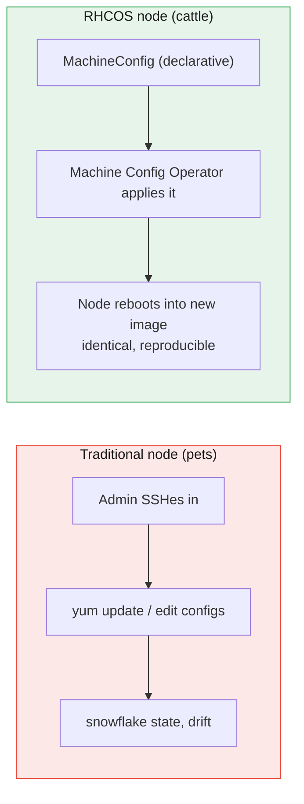

What makes RHCOS different — and why each property matters:

- **Immutable / transactional.** The OS filesystem is read-only; you do **not**
  `yum install` on a node. Updates are delivered as whole **(ostree) images** and
  applied atomically — the node either fully adopts the new image or rolls back.
  This kills configuration drift: every worker is byte-for-byte the same.
- **Configured by Ignition at first boot.** A node's identity (disks, network, the
  initial config) is set once, declaratively, by **Ignition** when it first boots —
  not by a post-install script you maintain.
- **Managed by the Machine Config Operator (MCO).** Day-2 changes (a kernel arg, an
  extra `/etc` file, a registry mirror) are expressed as a **`MachineConfig`** object.
  The MCO renders it, rolls it out node-by-node, and **cordons/drains/reboots** each
  node safely. You change the *desired state*; the cluster makes it real — the exact
  reconcile pattern from Module 2, now applied to the OS itself.
- **Tied to the cluster version.** RHCOS is upgraded *as part of* a cluster upgrade.
  You never patch the OS separately; `oc adm upgrade` moves the OS, the runtime, and
  Kubernetes together.

> **Mobily lens.** "Don't SSH into nodes" feels alien to a Linux admin used to
> `ssh node && vi`. The payoff is fleet-scale consistency: 200 worker nodes that are
> provably identical, patched in one controlled rollout, with automatic drain so the
> subscriber-api never loses all its replicas at once. Pets become cattle.

Worker nodes **can** run RHEL instead of RHCOS in some topologies, but **control
plane nodes must be RHCOS**. Treat RHCOS as the default and the supported path.

---

## 7. CRI-O — the purpose-built container runtime

Module 1 used **Podman** to build and run containers by hand. On the cluster, the
kubelet needs a runtime it can drive programmatically through the **Container Runtime
Interface (CRI)**. OpenShift's choice is **CRI-O**.

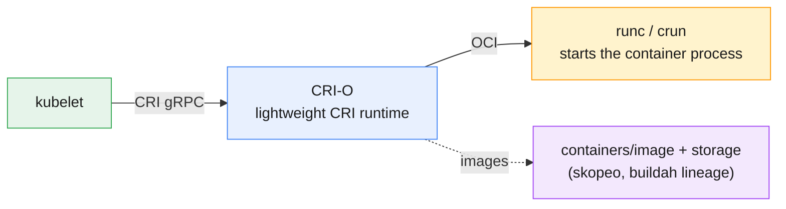

Why CRI-O instead of Docker:

- **Built for exactly one job.** CRI-O implements *only* the Kubernetes CRI — pull
  images, manage pods/containers, stream logs. No `docker build`, no client daemon,
  no swarm, no features Kubernetes will never call. Less surface area = fewer CVEs and
  a smaller blast radius.
- **Versioned *with* Kubernetes.** CRI-O's version tracks the OpenShift/Kubernetes
  minor (CRI-O 1.31 ↔ OCP 4.18). Upgrade the cluster and the runtime moves in
  lockstep — no "which Docker version is compatible?" guesswork.
- **Same OCI lineage you already know.** CRI-O shares plumbing with the
  Podman/Buildah/Skopeo family from Module 1 (the `containers/` libraries, `runc`/
  `crun`, the same image format). Skills transfer directly — your `podman build`
  images run unchanged under CRI-O.
- **No daemon.** Unlike the old Docker model there is no big central daemon that, if
  it dies, takes every container with it. CRI-O is leaner and integrates with
  **SELinux**, seccomp, and the immutable RHCOS host.

> **⎈ Where it fits.** You almost never interact with CRI-O directly — the kubelet
> does. For node-level debugging the host tool is **`crictl`** (run pods/containers
> on *one* node), analogous to `podman ps` but talking to CRI-O. Day to day you work
> at the Kubernetes layer with `oc`.

**Mental model:** *Podman is the human's container tool; CRI-O is Kubernetes'
container tool.* Same OCI foundations, different driver.

---

## 8. The Operator pattern — software that operates software

Everything self-managing about OpenShift 4 rests on one idea: the **Operator**. This
is the most important concept in the module, because it is *how the platform runs
itself* and *how you will deploy complex software* (Module 9).

An Operator is a **custom controller** that encodes the operational knowledge of a
human expert — install, configure, back up, fail over, upgrade — and runs it as a
control loop, 24/7, inside the cluster.

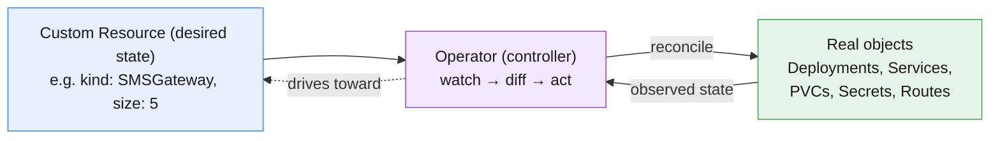

Two building blocks make this possible:

- **Custom Resource Definition (CRD)** — *extends the Kubernetes API* with a new
  object kind. After a CRD is installed, `kind: SMSGateway` is as real to the API
  server as `kind: Deployment`. You get `oc get smsgateway`, RBAC, etcd storage —
  all for free.
- **Custom Resource (CR)** — an *instance* of that kind expressing desired state
  (`size: 5`, `tlsEnabled: true`). The Operator watches CRs and reconciles.

This is the **same reconcile loop** from Module 2 — *observe → diff desired vs
actual → act → repeat* — but now applied to **whole applications** instead of just
Pods. A database Operator doesn't just keep N pods alive; it knows how to take a
backup, promote a replica, and run a version upgrade safely.

**Operator Lifecycle Manager (OLM)** is the package manager for Operators. It handles
**discovery** (the **OperatorHub** catalog in the console), **install**,
**dependency resolution**, and **automatic upgrades** via *subscriptions* and
*channels*. You will use OLM hands-on in Module 9; here, just know it is the
machinery behind the OperatorHub tile you click.

**Maturity matters.** Operators are rated on a *capability level* (1 ▸ Basic Install,
2 ▸ Seamless Upgrades, 3 ▸ Full Lifecycle, 4 ▸ Deep Insights, 5 ▸ Auto Pilot). A
level-5 database Operator effectively replaces a human DBA for routine ops — that is
the promise of the pattern.

---

## 9. Cluster Operators and the Cluster Version Operator

Here is the payoff of §8: **OpenShift runs itself using its own Operator pattern.**
The platform's own components — the router, the registry, the API server config,
monitoring, networking, authentication — are each managed by a **Cluster Operator**.

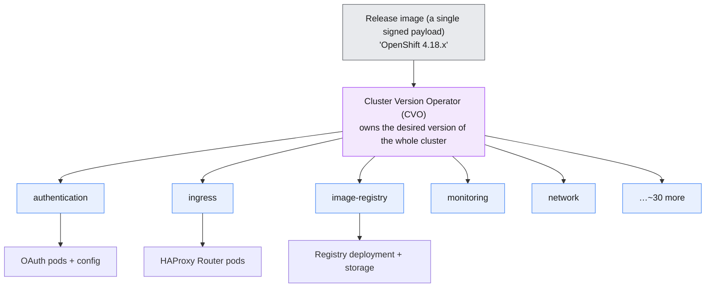

- **Cluster Operators** (`oc get clusteroperators`, alias `co`) — roughly **30**
  Operators, each owning one slice of the platform. You inspect them; you rarely edit
  their pods directly. Each reports three booleans you will learn to read at a glance:
  - **`AVAILABLE`** — the component is up and serving.
  - **`PROGRESSING`** — it is rolling out a change (e.g. during an upgrade).
  - **`DEGRADED`** — something is wrong and needs attention. **This is the first
    column to check** when triaging a sick cluster.
- **Cluster Version Operator (CVO)** — the *Operator of Operators*. It reads the
  desired **release image** (one signed payload that pins every component's version)
  and ensures every Cluster Operator matches it. `oc get clusterversion` shows the
  cluster's single version of truth.

This architecture is why an OpenShift upgrade is one command. You tell the CVO "go to
4.18.x"; it walks each Cluster Operator to the new version **in dependency order**,
each Operator rolls its own component (and the MCO rolls RHCOS on every node), and the
whole stack — OS, runtime, Kubernetes, platform services — moves together as **one
tested unit**. No more matching a dozen component versions by hand.

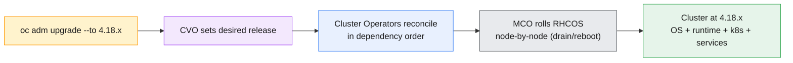

> **Triage habit.** When a Mobily operator says "the console is down," your first two
> commands are `oc get clusterversion` (is the cluster mid-upgrade or healthy?) and
> `oc get co` (which Cluster Operator is `DEGRADED`?). Those two lines point you at the
> failing subsystem before you ever look at a Pod. You will practice exactly this in
> the exercises (we dig deeper in Module 11/12).

---

## 10. The Machine API — declarative infrastructure

The Operator pattern manages *software*. The **Machine API** extends the same
declarative idea to the **infrastructure itself** — the cloud VMs (or bare-metal
hosts) that *become* your nodes. This is how an OpenShift cluster can grow and heal
its own node fleet.

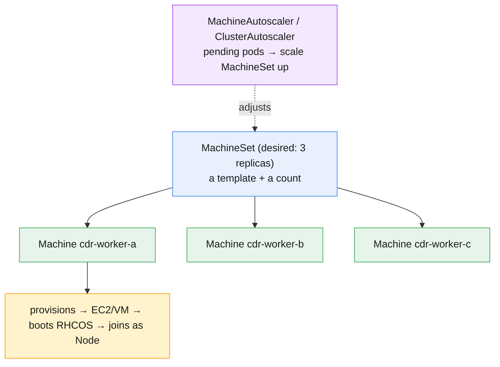

The objects, from declaration to running node:

- **`Machine`** — represents **one** host that should exist (one EC2 instance, one
  vSphere VM, one bare-metal server). It is the cluster's *declarative claim* on a
  piece of infrastructure.
- **`MachineSet`** — the **ReplicaSet for Machines**: a template plus a replica count.
  `oc scale machineset cdr-workers --replicas=6` and the cluster *provisions six VMs*,
  boots RHCOS on each (via Ignition), and joins them as worker Nodes — no console
  clicking in the cloud provider.
- **Machine API Operator** — the Cluster Operator that drives all of this, with a
  per-provider component that knows how to call AWS/Azure/vSphere/bare-metal APIs.
- **Autoscaling** — a **MachineAutoscaler** sets min/max on a MachineSet; the
  **ClusterAutoscaler** watches for **unschedulable Pods** and grows the MachineSet to
  fit, then shrinks it when demand falls.

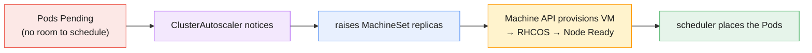

This is the **same reconcile loop again** — `Machine`/`MachineSet` are to *nodes*
what `Pod`/`ReplicaSet` are to *containers*. Delete a Machine and the MachineSet
provisions a replacement; that is how worker-node self-healing works (you will see the
deeper node-replacement story in Module 12).

> **Scope note.** The Machine API runs on **installer-provisioned infrastructure**
> (IPI) on supported clouds and integrated bare metal. On the **shared cluster** and
> the **Developer Sandbox** you will likely have *read-only* visibility into Machines
> and MachineSets (not permission to scale them) — the labs treat this as an
> inspection exercise, with scale steps marked as instructor/admin-only.

---

## 11. Hands-on: the web console and `oc` CLI essentials

You administer OpenShift through two front doors over the **same API**: the **web
console** and the **`oc`** CLI. Use whichever fits the task — the console for
discovery and dashboards, `oc` for repeatable, scriptable work.

### 11.1 The web console

A single web app with two perspectives, switched top-left:

- **Administrator perspective** — Cluster Operators, nodes/machines, the cluster
  version & update channel, projects, RBAC, monitoring/alerts, networking, storage.
  This is your home as an OpenShift admin.
- **Developer perspective** — the **Topology** view (apps as a visual graph), add
  from Git/registry, builds, Routes — app-team focused.

The console is itself served by a Cluster Operator (`console`), which is why "the
console is down" is a Cluster Operator question (§9).

### 11.2 `oc` CLI essentials

`oc` is `kubectl` + OpenShift verbs. The commands you will use constantly:

```bash
# --- Auth & context -------------------------------------------------
oc login https://api.<cluster-domain>:6443 -u <user> -p <password>   # token-based login
oc whoami                       # who am I?
oc whoami --show-server         # which cluster?
oc config current-context       # local kubeconfig context

# --- Projects (OpenShift's namespaces) ------------------------------
oc new-project mobily-mod4 --display-name="Mobily Module 4"
oc project mobily-mod4          # switch active project
oc projects                     # list projects I can see
oc status                       # high-level view of the current project

# --- Discover the cluster (this module's focus) ---------------------
oc version                      # client + server (the OCP version!)
oc get nodes -o wide            # node roles, OS image (RHCOS), runtime (CRI-O)
oc get clusterversion           # the cluster's single version of truth
oc get clusteroperators         # the ~30 platform operators + health
oc get machines -A              # Machine API: the infra behind the nodes
oc get machinesets -A
oc api-resources                # every kind the API knows (incl. CRDs)
oc explain route.spec          # field-level docs for any kind

# --- Everyday objects (verbatim kubectl) ----------------------------
oc get pods,svc,routes
oc describe node <node>
oc adm top nodes                # resource usage (needs metrics)
```

> **⎈ Kubernetes equivalents.** `oc login`/`oc project`/`oc new-project`/`oc status`/
> `oc adm` are **OpenShift-only**. Everything else (`get`, `describe`, `explain`,
> `api-resources`, `logs`, `exec`) is the **identical `kubectl`** command — `oc` simply
> ships them under one binary with OpenShift auth wired in.

The three commands that *define this module* — and your daily triage — are:

```bash
oc get clusterversion     # what version is this cluster, and is it upgrading?
oc get clusteroperators   # is every platform component AVAILABLE and not DEGRADED?
oc get nodes -o wide      # which nodes, which roles, RHCOS image, CRI-O version?
```

Master those three and you can walk up to any OpenShift cluster and read its health
and architecture in under a minute. The [exercises](../labs/module-04/exercises/README.md)
walk you through each.

---

## 12. Key takeaways

- **OpenShift *is* certified Kubernetes plus a finished product layer.** Everything
  from Modules 1–3 still applies; OpenShift adds OS, runtime, ingress, auth,
  registry, monitoring, builds, a console, and *self-management* — all supported under
  one lifecycle.
- **v3 → v4 was the self-managing leap.** RHCOS + CRI-O + Operators mean the cluster
  installs, configures, and upgrades itself as one tested unit.
- **The portfolio is a family:** self-managed **OCP** (this course), managed
  **ROSA/ARO/Dedicated**, small-footprint **SNO/MicroShift**, free **Developer
  Sandbox**, community **OKD**. Pick by *who operates it and where*.
- **RHCOS is immutable, cluster-managed RHEL** — you don't SSH-and-edit; you declare
  a `MachineConfig` and the MCO rolls it out. Drift dies.
- **CRI-O is the lean, Kubernetes-only runtime**, versioned with the cluster, sharing
  the OCI lineage of Podman/Buildah you already know.
- **The Operator pattern is the whole game:** CRD + CR + a reconcile loop = software
  that operates software. OpenShift runs *itself* this way via **Cluster Operators**,
  coordinated by the **Cluster Version Operator**.
- **The Machine API applies the same reconcile loop to infrastructure** —
  `Machine`/`MachineSet` are the `Pod`/`ReplicaSet` of cloud VMs, enabling node
  self-healing and autoscaling.
- **Your two front doors are the web console and `oc`** over one API. The three
  commands to internalize: `oc get clusterversion`, `oc get clusteroperators`,
  `oc get nodes -o wide`.

---

## 13. Glossary

| Term | Meaning |
|---|---|
| **OCP** | OpenShift Container Platform — the self-managed product this course teaches. |
| **OKD** | The community/upstream distribution that OCP is built from. |
| **ROSA / ARO / OSD** | Red Hat-managed OpenShift on AWS / Azure / (AWS·GCP). |
| **SNO** | Single-Node OpenShift — control plane + worker on one node, for edge. |
| **MicroShift** | Minimal OpenShift footprint for constrained edge devices. |
| **RHCOS** | Red Hat Enterprise Linux CoreOS — the immutable, cluster-managed node OS. |
| **Ignition** | First-boot provisioning that gives an RHCOS node its initial config. |
| **MachineConfig / MCO** | Declarative node OS config object / the Operator that applies it. |
| **CRI-O** | The lightweight, Kubernetes-only container runtime (implements the CRI). |
| **CRI** | Container Runtime Interface — the gRPC contract between kubelet and runtime. |
| **crictl** | Node-level CLI for talking to CRI-O directly (debugging). |
| **Operator** | A custom controller that encodes operational knowledge as a reconcile loop. |
| **CRD / CR** | Custom Resource Definition (new API kind) / Custom Resource (an instance). |
| **OLM** | Operator Lifecycle Manager — installs, resolves, and upgrades Operators. |
| **OperatorHub** | The in-console catalog of available Operators (front-end to OLM). |
| **Cluster Operator** | A platform Operator owning one slice of OpenShift (`oc get co`). |
| **CVO** | Cluster Version Operator — drives every Cluster Operator to the release version. |
| **Release image** | A single signed payload pinning the version of every cluster component. |
| **Machine / MachineSet** | Declarative one-host / N-host infrastructure objects (the Machine API). |
| **Machine API** | The subsystem that provisions and manages nodes declaratively. |
| **ClusterAutoscaler** | Grows/shrinks MachineSets in response to (un)schedulable pods. |
| **Project** | An OpenShift Namespace with self-service, quotas, and annotations. |
| **Route** | OpenShift's external HTTP(S) ingress object (richer than an Ingress). |
| **SCC** | Security Context Constraints — pod-security admission policy (non-root by default). |
| **S2I** | Source-to-Image — build a runnable image directly from source code. |
| **EUS** | Extended Update Support — a longer-lived OCP release stream for enterprises. |
| **oc** | The OpenShift CLI — a superset of `kubectl`. |

---

## 14. References

- OpenShift Container Platform docs — Architecture:
  <https://docs.openshift.com/container-platform/latest/architecture/architecture.html>
- About RHCOS:
  <https://docs.openshift.com/container-platform/latest/architecture/architecture-rhcos.html>
- About CRI-O — <https://cri-o.io/>
- Operators & OLM (Operator Framework) — <https://docs.openshift.com/container-platform/latest/operators/understanding/olm-what-operators-are.html>
- Cluster Operators reference — <https://docs.openshift.com/container-platform/latest/operators/operator-reference.html>
- Machine management (Machine API) — <https://docs.openshift.com/container-platform/latest/machine_management/index.html>
- `oc` CLI reference — <https://docs.openshift.com/container-platform/latest/cli_reference/openshift_cli/getting-started-cli.html>
- OpenShift product family — <https://www.redhat.com/en/technologies/cloud-computing/openshift>
- OKD (community) — <https://www.okd.io/>
- Red Hat OpenShift Developer Sandbox (free) — <https://developers.redhat.com/developer-sandbox>

---

> **Companion labs:** interactive visualizations in
> [`labs/module-04/index.html`](../labs/module-04/index.html) ·
> hands-on [exercises](../labs/module-04/exercises/README.md). This module is
> intentionally delivered as **4 focused visualizations + 4 exercises** covering all
> seven topics (OpenShift vs Kubernetes & the stack/portfolio/history · RHCOS & CRI-O ·
> Operators & Cluster Operators · Machine API & cluster architecture).
</invoke>
