# Module 5 — OpenShift Installation and Cluster Administration

> **Course:** OpenShift Container Platform
> **Module objective:** Module 4 explained *what* OpenShift is. This module is about
> *operating* it. Step into the **cluster administrator's** seat: understand how a
> cluster gets **installed** (IPI, UPI, Assisted, Agent, Hosted, and managed models),
> how its **topology** (control-plane, worker, and infra nodes) is sized and shaped,
> how you **verify cluster health** through the Cluster Operators, how the **Machine
> Config Operator** safely changes the OS across the fleet, how you run the **cluster
> lifecycle** (channels and upgrades driven by the Cluster Version Operator), and the
> day-to-day work of **managing Projects, users, groups and RBAC**. By the end you can
> walk up to a Mobily cluster and *run* it.

---

## Table of contents

1. [Why this module matters](#1-why-this-module-matters)
2. [Installation models overview](#2-installation-models-overview)
3. [Cluster topology: control plane, worker & infra nodes](#3-cluster-topology-control-plane-worker--infra-nodes)
4. [Cluster Operators & verifying cluster health](#4-cluster-operators--verifying-cluster-health)
5. [The Machine Config Operator & MachineConfigPools](#5-the-machine-config-operator--machineconfigpools)
6. [Cluster lifecycle: the CVO, channels & upgrades](#6-cluster-lifecycle-the-cvo-channels--upgrades)
7. [Managing Projects (quotas & limits)](#7-managing-projects-quotas--limits)
8. [Managing users, groups & identities](#8-managing-users-groups--identities)
9. [RBAC: roles, bindings & `oc adm policy`](#9-rbac-roles-bindings--oc-adm-policy)
10. [Day-2 node operations](#10-day-2-node-operations)
11. [Key takeaways](#11-key-takeaways)
12. [Glossary](#12-glossary)
13. [References](#13-references)

> **How to read the diagrams:** Diagrams are written in [Mermaid](https://mermaid.js.org/),
> which renders automatically in GitHub, VS Code (with a Mermaid extension), and most
> modern Markdown viewers. If a diagram appears as code, install/enable a Mermaid
> preview to see the rendered version.

> **CLI note (oc track).** Module 5 is **OpenShift + `oc`**, and most commands here are
> **`oc adm`** (administrator) verbs that plain `kubectl` does not have. Where a
> command *is* standard Kubernetes, a **⎈** note points it out. Many actions require
> **cluster-admin**; the labs mark which steps need elevated rights vs which work as an
> ordinary user or on the Developer Sandbox.

> **Telecom framing.** Examples model a fictional mobile operator, *Mobily*: a
> `subscriber-api`, a `tariff-catalog`, CDR (Call Detail Record) processing, an SMS
> gateway, and platform tenants like `team-billing` and `team-crm`. All users, MSISDNs,
> and data are invented.

> **Companion labs.** Interactive visualizations in
> [`labs/module-05/index.html`](../labs/module-05/index.html), instructor
> [demos](../labs/module-05/demos/README.md), and hands-on
> [exercises](../labs/module-05/exercises/README.md).

---

## 1. Why this module matters

In Module 4 you learned that OpenShift is a *self-managing* product. That does **not**
mean it runs with nobody at the controls — it means the controls are **declarative**.
A cluster administrator's job is not to SSH around fixing things by hand; it is to
**express desired state, verify the platform reconciled it, and keep the cluster
healthy through its lifecycle.**

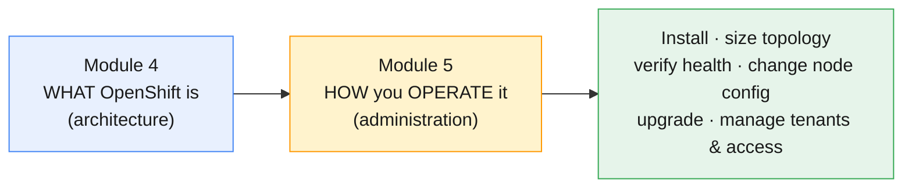

The day-2 questions this module answers for a Mobily platform team:

- **How did this cluster get here, and how would we build the next one?** → install models
- **What is it made of, and how do we add capacity for the CDR pipeline?** → topology
- **Is it healthy right now? How do I prove it before tonight's release?** → cluster health
- **A node needs a kernel tweak / extra trust cert — how, without SSH?** → the MCO
- **A CVE drops; how do we get to 4.18.21 safely with no downtime?** → lifecycle/upgrades
- **The billing and CRM teams need isolated space and the right access** → Projects, users, RBAC

Every answer is the **same reconcile loop** from Modules 2–4 — now wielded
*intentionally* by you, the admin.

---

## 2. Installation models overview

You rarely install a production cluster by clicking. OpenShift offers a spectrum of
install methods trading **automation** for **control**. Knowing them lets you choose
the right one and understand how an existing cluster was built.

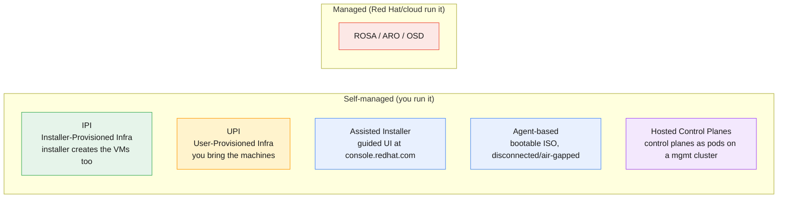

| Model | Who provisions the machines | Best for | Trade-off |
|---|---|---|---|
| **IPI** (Installer-Provisioned) | the **installer** (calls AWS/Azure/GCP/vSphere) | fastest path on supported clouds | least control over infra details |
| **UPI** (User-Provisioned) | **you** (your own VMs/bare metal, your DNS/LB) | bare metal, strict infra standards | most work; you own the plumbing |
| **Assisted Installer** | you, **guided** by a hosted UI (`console.redhat.com`) | on-prem / bare metal with hand-holding | needs connectivity to the service |
| **Agent-based** | you, via a **self-contained bootable ISO** | **disconnected / air-gapped** sites | no live Red Hat service dependency |
| **Hosted Control Planes** (HyperShift) | control planes run as **pods** on a management cluster | many small clusters, fast/cheap CP | newer; different mental model |
| **ROSA / ARO / OSD** | the cloud + Red Hat | "I don't want to run the control plane" | you give up some low-level control |

The artifact that ties IPI/UPI/Agent together is **`install-config.yaml`** — your
declarative description of the cluster (base domain, control-plane/worker counts,
network CIDRs, platform). The **`openshift-install`** binary turns it into a running
cluster and hands you the `kubeadmin` password and a kubeconfig.

> **Mobily lens.** Core data-centre clusters are often **UPI on bare metal** (strict
> standards, existing load balancers); a remote/air-gapped site uses **Agent-based**;
> a quick cloud burst uses **IPI on AWS** or **ROSA**. The course's **shared cluster**
> is a pre-built 4.18; you administer it, you don't reinstall it.

---

## 3. Cluster topology: control plane, worker & infra nodes

A cluster's **topology** is the count and role of its nodes. As an admin you size it
for HA and capacity, and you shape it by **adding and labelling nodes**.

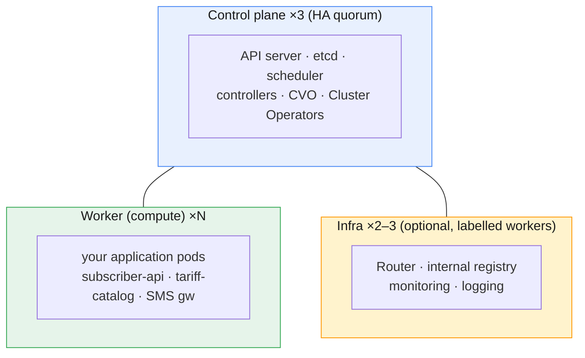

- **Control plane — always 3.** etcd needs an odd number for **quorum**; 3 tolerates
  the loss of 1. You generally don't run app workloads here (the `NoSchedule` taint
  from Module 4). Compact 3-node clusters (control plane *also* schedulable) and
  Single-Node OpenShift are special cases.
- **Workers — scale for capacity.** Add or remove them via the **Machine API**
  (Module 4) on IPI clusters, or by joining nodes on UPI. This is where Mobily's
  traffic lives.
- **Infra nodes — isolate the platform.** *Optional* worker nodes you **label**
  `node-role.kubernetes.io/infra=''` and dedicate to platform components (router,
  registry, monitoring). Two payoffs: platform load is isolated from noisy apps, and —
  importantly for licensing — **workloads on infra nodes don't count against
  subscription core counts**. You move components there by editing their Operator's
  config (e.g. the IngressController's `nodePlacement`) and adding a matching taint so
  only platform pods land.

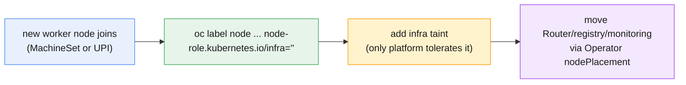

Sizing rule of thumb for Mobily: **3 control plane** + **N workers** (sized to peak
CDR/subscriber load + headroom) + **2–3 infra** if the platform footprint (monitoring
especially) is large enough to want isolation.

---

## 4. Cluster Operators & verifying cluster health

Module 4 explained *what* Cluster Operators are; here you use them as your **health
dashboard**. "Is the cluster healthy?" is a question you answer many times a day —
before an upgrade, before a release, during an incident.

The administrator's **three-command health check**:

```bash
oc get clusterversion       # one version of truth — Available? Progressing (upgrading)?
oc get clusteroperators     # ~30 operators — all AVAILABLE=True, DEGRADED=False?
oc get nodes                # all Ready? any NotReady/SchedulingDisabled?
```

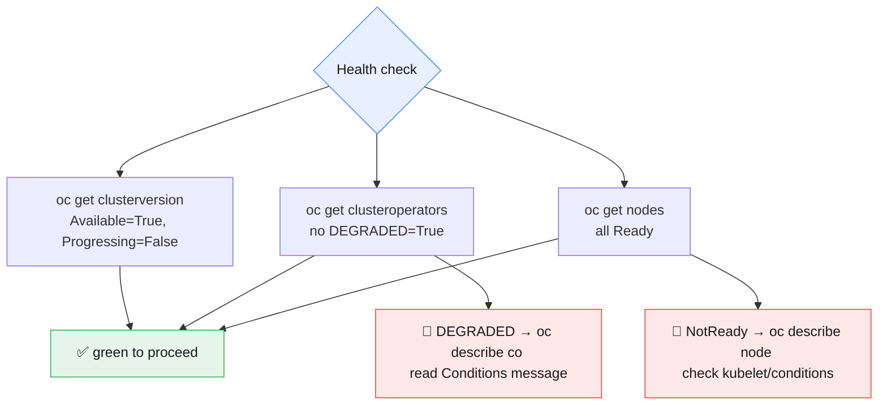

Deeper signals when something's off:

- **`oc adm top nodes` / `oc adm top pods`** — live CPU/memory; find a hot node or a
  runaway pod. *(needs the metrics stack)*
- **`oc get events -A --sort-by=.lastTimestamp`** — recent cluster activity; failures
  bubble up here.
- **`oc adm must-gather`** — bundle a full diagnostic dump for Red Hat support
  (§10). The first thing a support case will ask for.
- **The web console → Administrator → Home → Overview** and **Observe → Alerts** show
  the same data with graphs and firing alerts.

> **Habit to build:** never start an upgrade or a big change on a cluster that isn't
> *green* on all three commands. A `Progressing` clusterversion or a `Degraded`
> operator means "fix this first."

---

## 5. The Machine Config Operator & MachineConfigPools

This is the heart of node administration. RHCOS is immutable (Module 4) — so **how do
you change anything on the nodes?** You don't SSH in. You write a **`MachineConfig`**,
and the **Machine Config Operator (MCO)** rolls it out safely.

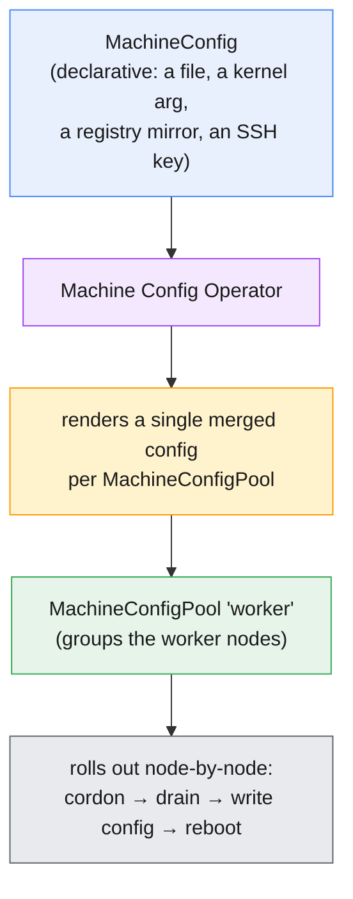

Key objects:

- **`MachineConfig`** — a declarative unit of node OS configuration (an Ignition
  snippet): a file under `/etc`, a systemd unit, a kernel argument, a registry mirror,
  an extra CA certificate, kubelet config.
- **`MachineConfigPool` (MCP)** — groups nodes that share config. Every cluster has
  **`master`** and **`worker`** pools by default; you create **custom pools** (e.g.
  `infra`) to roll config to a subset. The MCO **renders** all MachineConfigs that
  target a pool into one merged config and applies it.

How a rollout behaves (and how to control it):

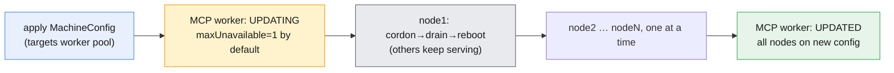

- **`maxUnavailable`** on the pool controls how many nodes update at once (default
  **1** → safest, slowest). Raise it to speed a big fleet at the cost of capacity.
- **Pause a pool** (`oc patch mcp worker --type merge -p '{"spec":{"paused":true}}'`)
  to **batch changes** or freeze worker reboots during a sensitive window — config
  accumulates and applies when you unpause. This is a real-world maintenance-window
  technique.

```bash
oc get machineconfigpool                 # master/worker: UPDATED / UPDATING / DEGRADED
oc get machineconfig                     # all MachineConfigs (rendered + source)
oc describe mcp worker                   # node counts, current rendered config
```

> **⎈ Kubernetes equivalent:** none — `MachineConfig`/`MachineConfigPool` are
> OpenShift's answer to a problem vanilla Kubernetes leaves to you (Ansible, golden
> images). The reconcile *shape* mirrors a Deployment's rolling update, applied to the
> OS.

> **Mobily lens.** Adding a corporate root CA so nodes trust the internal registry, or
> setting a kernel parameter for SMS-gateway throughput, is a `MachineConfig` — written
> once, rolled to every worker automatically, with no node ever fully down.

---

## 6. Cluster lifecycle: the CVO, channels & upgrades

Keeping the cluster patched is core administration. The **Cluster Version Operator
(CVO)** makes an upgrade a single, supervised operation — but *you* choose the channel
and the target, and *you* verify health before and after.

### Update channels

A **channel** is a stream of recommended versions with a risk/stability profile:

| Channel | Meaning | Use for |
|---|---|---|
| **`candidate-4.18`** | early builds, may be withdrawn | testing only, never prod |
| **`fast-4.18`** | fully supported as soon as released | early adopters, non-critical |
| **`stable-4.18`** | released to `fast`, then promoted after field data | **most production** |
| **`eus-4.18`** | Extended Update Support; enables EUS→EUS hops | enterprises minimizing upgrades |

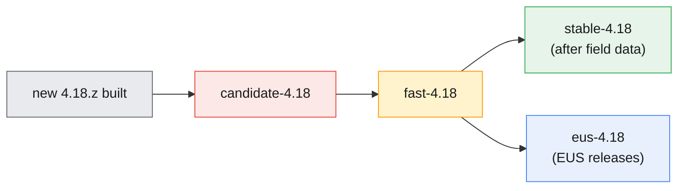

### The upgrade procedure

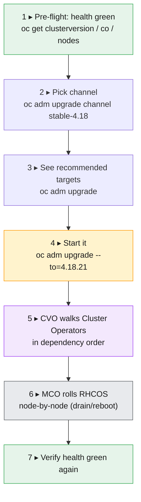

```bash
oc adm upgrade                                  # current version, channel, recommended updates
oc adm upgrade channel stable-4.18              # set/confirm the channel
oc adm upgrade --to=4.18.21                     # start the upgrade (or --to-latest)
watch oc get clusterversion                     # PROGRESSING=True until done
oc get clusteroperators                         # watch each move to the new version
```

The OS, the runtime, Kubernetes, and every platform service move together as **one
tested unit** — the whole point of OpenShift's self-managing design. Worker reboots
are **drained**, so applications with multiple replicas stay up. EUS upgrades let you
**pause worker pools** to do all control-plane reboots first and the workers in one
later window.

> **Never** upgrade a cluster that isn't health-green, and always confirm the channel
> matches your support posture. An upgrade is reversible only in narrow cases — treat
> it as forward-only and verify each stage.

---

## 7. Managing Projects (quotas & limits)

A **Project** is OpenShift's tenant boundary — a Namespace with self-service, quotas,
and annotations. Multi-tenant administration *is* project administration.

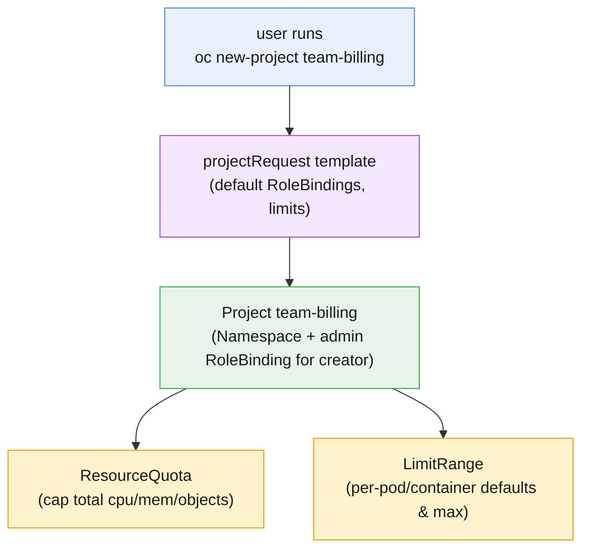

- **Create / manage:** `oc new-project`, `oc get projects`, `oc delete project`. As
  admin you can also `oc adm new-project`.
- **Self-provisioning:** by default authenticated users can create their own projects
  (the `self-provisioner` cluster role bound to `system:authenticated:oauth`). Locking
  this down — so only admins create projects — is a common hardening step.
- **`ResourceQuota`** — caps the **total** a project may consume (e.g. 20 CPU, 40Gi
  memory, 10 PVCs). Stops one team starving the cluster.
- **`LimitRange`** — sets **per-pod/container** defaults, minimums, and maximums, so a
  pod with no requests still gets sensible values.

```bash
oc new-project team-billing --display-name="Billing"      # create a tenant
oc create quota team-q --hard=cpu=20,memory=40Gi,pods=50 -n team-billing
oc get resourcequota,limitrange -n team-billing
oc describe quota team-q -n team-billing                  # used vs hard
```

> **Mobily lens.** `team-billing` and `team-crm` each get a Project with a quota sized
> to their budget and a LimitRange so a forgotten `while true` pod can't consume a
> node. The platform team owns the quota numbers; the app teams self-serve inside them.

---

## 8. Managing users, groups & identities

OpenShift has **no internal user database** for humans. Identities come from an
external **identity provider (IdP)** via the built-in **OAuth** server; OpenShift
records a **`User`** and an **`Identity`** the first time someone logs in. You manage
**groups** for scalable access control.

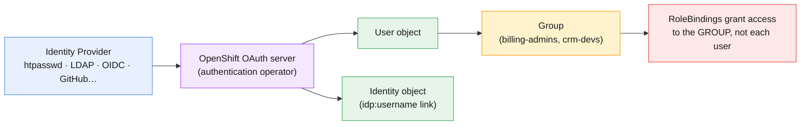

- **Identity providers** configured on the `OAuth` cluster resource: **htpasswd**
  (simple file, great for labs), **LDAP / Active Directory**, **OpenID Connect**,
  **GitHub/Google**, etc. (deep dive in Module 8). The default `kubeadmin` is a
  break-glass account you remove once a real IdP exists.
- **`User` / `Identity`** — created on first login; you rarely create Users by hand
  except with htpasswd.
- **`Group`** — the unit you should grant access to. `oc adm groups new billing-admins`
  then `oc adm groups add-users billing-admins alice bob`. Bind roles to the **group**
  so onboarding is "add to group," not "edit a dozen RoleBindings."

```bash
oc get users                                  # known users
oc get groups                                 # groups and members
oc adm groups new crm-devs                    # create a group
oc adm groups add-users crm-devs carol        # add a member
oc get identity                               # idp:username → user links
```

> **⎈ Kubernetes equivalent:** vanilla Kubernetes has **no** User/Group/Identity API —
> it trusts the authenticator and only does RBAC on the resulting names. OpenShift adds
> first-class `User`/`Group`/`Identity` objects and a built-in OAuth server.

---

## 9. RBAC: roles, bindings & `oc adm policy`

**RBAC** (Role-Based Access Control) decides *who can do what, where*. Four object
types, two scopes — get this model and access control is straightforward.

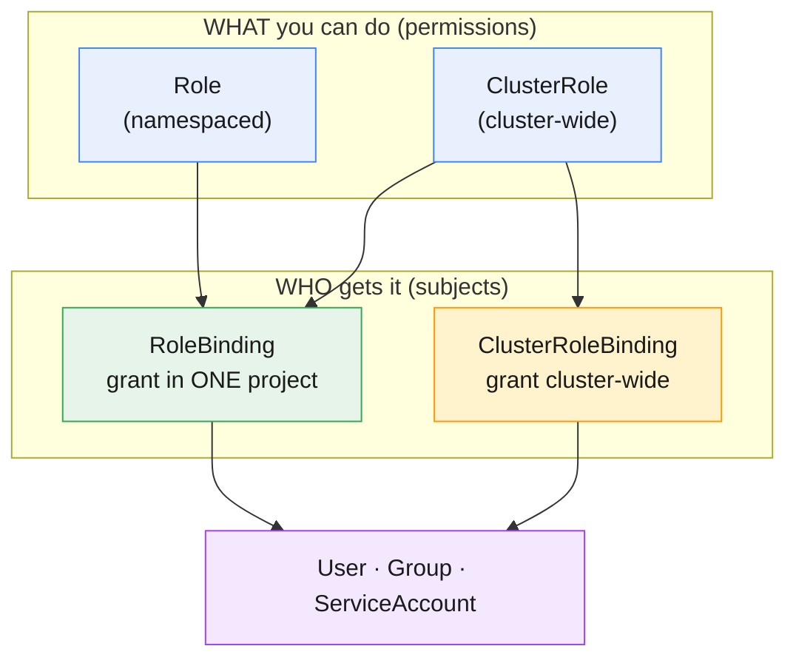

- **Role / ClusterRole** = a set of allowed verbs on resources (the *what*). A
  **ClusterRole** can be reused in any namespace via a RoleBinding, or applied
  cluster-wide via a ClusterRoleBinding.
- **RoleBinding / ClusterRoleBinding** = ties a Role to **subjects** (User, Group,
  ServiceAccount) in a project or cluster-wide (the *who* and *where*).
- **Default ClusterRoles you'll use constantly:** `admin` (full control *within* a
  project), `edit` (create/modify most objects, no RBAC), `view` (read-only),
  `cluster-admin` (everything, everywhere — hand out sparingly), `self-provisioner`.

The everyday admin shortcut is **`oc adm policy`**, which creates the right binding for
you:

```bash
# Grant the billing team admin on their project (binds to a GROUP — best practice)
oc adm policy add-role-to-group admin billing-admins -n team-billing

# One user read-only in a project
oc adm policy add-role-to-user view carol -n team-crm

# Cluster-wide read for an auditor (use cluster bindings carefully)
oc adm policy add-cluster-role-to-user cluster-reader auditor-svc

# Check effective access (great for debugging "permission denied")
oc auth can-i create deployments -n team-billing --as alice
oc adm policy who-can delete pods -n team-billing
```

> **Least privilege:** prefer `edit`/`view` over `admin`, bind to **groups** not
> users, scope to a **project** with RoleBindings rather than the cluster, and treat
> `cluster-admin` as break-glass. We design full least-privilege models in Module 8.

---

## 10. Day-2 node operations

Routine fleet maintenance every admin performs — all declarative, all safe-by-default.

- **Cordon** — mark a node unschedulable (no *new* pods land) without evicting:
  `oc adm cordon <node>`.
- **Drain** — evict the pods gracefully (respecting PodDisruptionBudgets) before
  maintenance: `oc adm drain <node> --ignore-daemonsets --delete-emptydir-data`.
- **Uncordon** — return it to service: `oc adm uncordon <node>`.

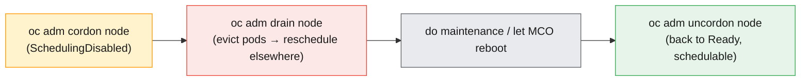

- **Labels & roles** — `oc label node <n> node-role.kubernetes.io/infra=''` to make an
  infra node; labels drive scheduling (`nodeSelector`) and pool membership.
- **Diagnostics** — `oc adm must-gather` bundles logs/state for a support case;
  `oc adm node-logs <node>` reads journal logs without SSH; `oc debug node/<node>`
  gives a debugging pod with the host filesystem at `/host`.

> The MCO already cordons/drains/reboots for config and upgrades (§5–6). You do it
> *manually* for ad-hoc hardware maintenance, troubleshooting, or replacing a node
> (the deep node-replacement story is Module 12).

---

## 11. Key takeaways

- **Administration is declarative.** You express desired state and verify the platform
  reconciled it — never SSH-and-fix. Every section here is one reconcile loop.
- **Install models trade automation for control:** IPI (installer builds infra), UPI
  (you do), Assisted/Agent (guided/air-gapped), Hosted Control Planes, and managed
  ROSA/ARO/OSD. `install-config.yaml` + `openshift-install` are the self-managed path.
- **Topology = 3 control plane (quorum) + N workers (capacity) + optional infra**
  (labelled workers isolating the platform and saving subscription cores).
- **Verify health with three commands** — `oc get clusterversion`, `oc get co`,
  `oc get nodes` — before any change; chase `DEGRADED`/`NotReady` with `describe`.
- **The MCO changes immutable nodes safely:** a `MachineConfig` targets a
  `MachineConfigPool`; the MCO renders and rolls it node-by-node (cordon→drain→reboot,
  `maxUnavailable=1`); **pause** a pool to batch or protect a window.
- **The CVO runs the lifecycle:** pick a **channel** (`stable`/`fast`/`eus`/`candidate`),
  `oc adm upgrade --to=…`, and the whole stack moves as one tested unit with drained
  reboots.
- **Tenancy = Projects + quotas + limits.** `ResourceQuota` caps the total; `LimitRange`
  sets per-pod defaults; control `self-provisioner` to govern who creates projects.
- **Identity is external; access is RBAC.** Users/Identities come from an IdP via OAuth;
  manage **groups**; grant with `oc adm policy add-role-to-group` at project scope;
  prefer least privilege.
- **Day-2 node ops are `oc adm`:** cordon/drain/uncordon, label, `must-gather`,
  `debug node/…` — all without SSH.

---

## 12. Glossary

| Term | Meaning |
|---|---|
| **IPI** | Installer-Provisioned Infrastructure — the installer also creates the machines. |
| **UPI** | User-Provisioned Infrastructure — you supply the machines, DNS, and load balancers. |
| **Assisted Installer** | A hosted, guided installer at `console.redhat.com` for on-prem/bare metal. |
| **Agent-based installer** | A self-contained bootable ISO installer for disconnected/air-gapped sites. |
| **Hosted Control Planes (HyperShift)** | Control planes run as pods on a management cluster. |
| **`install-config.yaml`** | The declarative cluster definition consumed by `openshift-install`. |
| **`openshift-install`** | The CLI that creates a self-managed cluster. |
| **kubeadmin** | The temporary break-glass admin account created at install. |
| **Infra node** | A worker labelled to host platform components; excluded from subscription core counts. |
| **MachineConfig** | A declarative unit of node OS configuration (an Ignition snippet). |
| **Machine Config Operator (MCO)** | The Operator that renders and rolls out MachineConfigs. |
| **MachineConfigPool (MCP)** | A group of nodes sharing config (`master`, `worker`, custom). |
| **`maxUnavailable`** | How many pool nodes may update at once (default 1). |
| **paused pool** | An MCP set to accumulate config without rolling out, for batching/windows. |
| **CVO** | Cluster Version Operator — drives the cluster to the desired release version. |
| **Channel** | An update stream: `candidate` / `fast` / `stable` / `eus`. |
| **EUS** | Extended Update Support — a longer-lived stream enabling EUS→EUS hops. |
| **ResourceQuota** | A per-project cap on total resource/object consumption. |
| **LimitRange** | Per-pod/container default, min, and max resource settings in a project. |
| **self-provisioner** | The cluster role letting authenticated users create their own projects. |
| **User / Group / Identity** | OpenShift's first-class auth objects (Identity links an IdP login to a User). |
| **Identity Provider (IdP)** | The external system (htpasswd/LDAP/OIDC/…) the OAuth server trusts. |
| **RBAC** | Role-Based Access Control — Roles/ClusterRoles bound to subjects. |
| **Role / ClusterRole** | A set of allowed verbs on resources (namespaced / cluster-wide). |
| **RoleBinding / ClusterRoleBinding** | Binds a (Cluster)Role to subjects in a project / cluster-wide. |
| **`oc adm policy`** | Admin convenience for creating role bindings. |
| **cordon / drain / uncordon** | Mark unschedulable / evict pods / return to service. |
| **must-gather** | A full diagnostic bundle for Red Hat support. |

---

## 13. References

- OpenShift docs — Installation overview:
  <https://docs.openshift.com/container-platform/latest/installing/index.html>
- Installation methods (IPI/UPI/Assisted/Agent):
  <https://docs.openshift.com/container-platform/latest/installing/installing-preparing.html>
- Machine Config Operator & MachineConfigPools:
  <https://docs.openshift.com/container-platform/latest/machine_configuration/index.html>
- Updating clusters (channels & upgrades):
  <https://docs.openshift.com/container-platform/latest/updating/understanding_updates/intro-to-updates.html>
- Projects, quotas & limit ranges:
  <https://docs.openshift.com/container-platform/latest/applications/projects/working-with-projects.html>
- Understanding authentication & identity providers:
  <https://docs.openshift.com/container-platform/latest/authentication/understanding-authentication.html>
- Using RBAC to define and apply permissions:
  <https://docs.openshift.com/container-platform/latest/authentication/using-rbac.html>
- Nodes — working with nodes (cordon/drain/labels):
  <https://docs.openshift.com/container-platform/latest/nodes/nodes/nodes-nodes-working.html>
- Gathering data about your cluster (`must-gather`):
  <https://docs.openshift.com/container-platform/latest/support/gathering-cluster-data.html>

---

> **Companion labs:** interactive visualizations in
> [`labs/module-05/index.html`](../labs/module-05/index.html) · instructor
> [demos](../labs/module-05/demos/README.md) · hands-on
> [exercises](../labs/module-05/exercises/README.md). Delivered as **4 focused
> visualizations + 4 demos + 4 exercises** covering all six topics (installation models
> & topology · cluster health · the MCO & MachineConfigPools · lifecycle/upgrades ·
> Projects/quotas · users/groups/RBAC).
</content>
