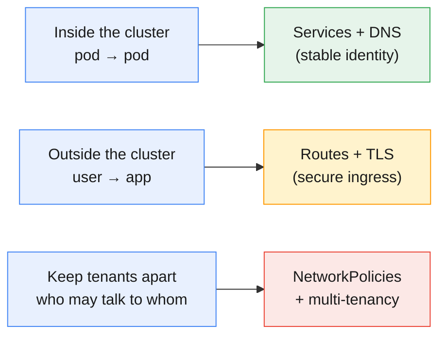
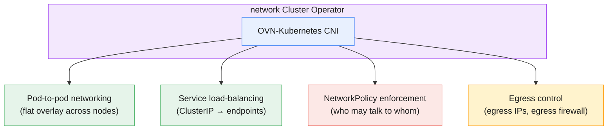
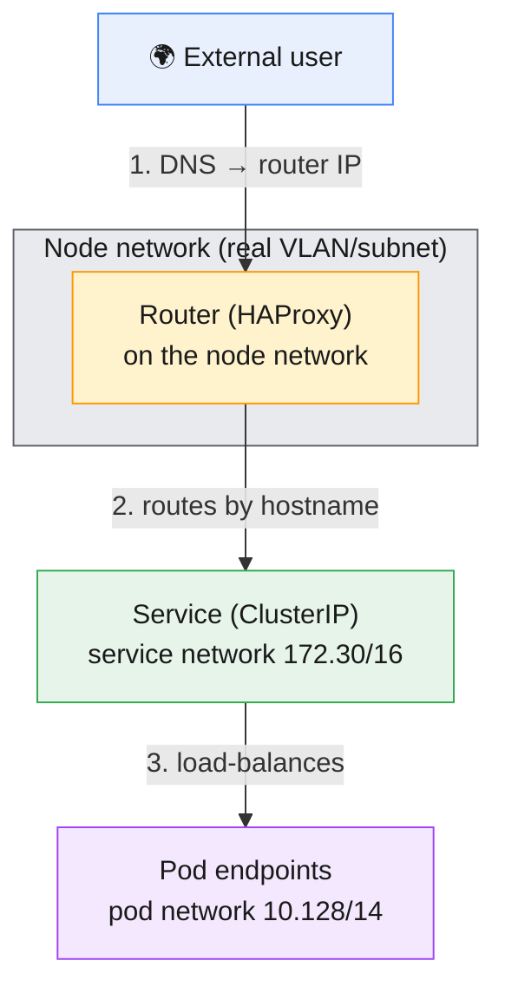
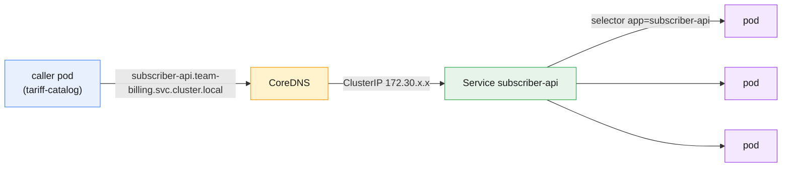
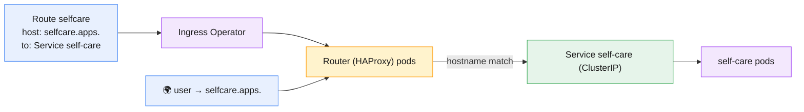
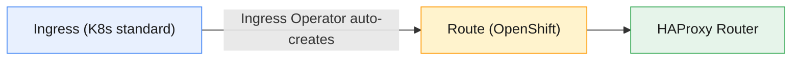
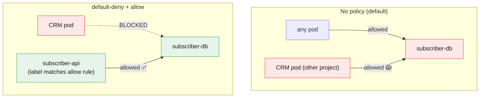
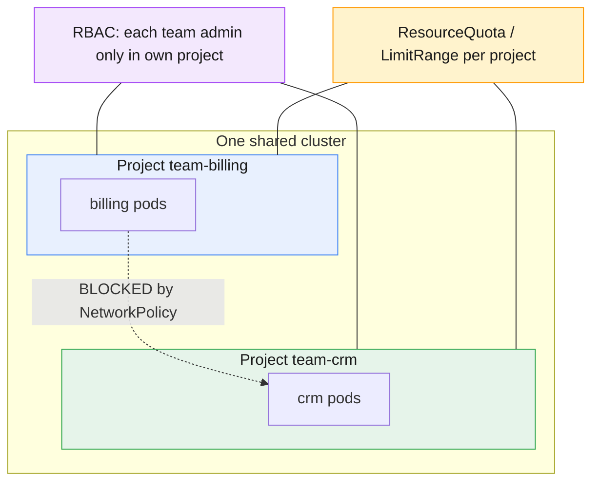
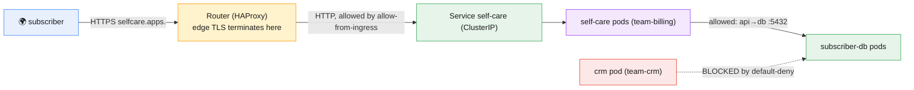

# Module 6 — OpenShift Networking, Routes and Multi-Tenancy

> **Course:** OpenShift Container Platform
> **Module objective:** Make applications on OpenShift **reachable** — from other pods,
> from other projects, and from the outside world — and make that reachability
> **safe** on a shared cluster. You'll learn the cluster network (OVN-Kubernetes), how
> **Services and DNS** give pods stable identity, how **Routes** expose apps externally
> with **edge / passthrough / re-encrypt** TLS (and how Routes compare to Kubernetes
> **Ingress**), how **NetworkPolicies** turn a wide-open pod network into a locked-down
> one, and the **multi-tenancy patterns** that let Mobily's teams share one cluster
> without stepping on each other.

---

## Table of contents

1. [Why this module matters](#1-why-this-module-matters)
2. [OpenShift networking architecture & OVN-Kubernetes](#2-openshift-networking-architecture--ovn-kubernetes)
3. [The four networks & how a packet flows](#3-the-four-networks--how-a-packet-flows)
4. [Services & DNS in OpenShift](#4-services--dns-in-openshift)
5. [Routes: exposing apps to the outside world](#5-routes-exposing-apps-to-the-outside-world)
6. [TLS termination: edge, passthrough & re-encrypt](#6-tls-termination-edge-passthrough--re-encrypt)
7. [Routes vs Kubernetes Ingress](#7-routes-vs-kubernetes-ingress)
8. [Network Policies fundamentals](#8-network-policies-fundamentals)
9. [Multi-tenancy patterns for shared clusters](#9-multi-tenancy-patterns-for-shared-clusters)
10. [Putting it together: a secured multi-tenant topology](#10-putting-it-together-a-secured-multi-tenant-topology)
11. [Key takeaways](#11-key-takeaways)
12. [Glossary](#12-glossary)
13. [References](#13-references)

> **How to read the diagrams:** Diagrams are written in [Mermaid](https://mermaid.js.org/),
> which renders automatically in GitHub, VS Code (with a Mermaid extension), and most
> modern Markdown viewers. If a diagram appears as code, install/enable a Mermaid
> preview to see the rendered version.

> **CLI note (oc track).** This module is **OpenShift + `oc`**. Services, DNS, and
> NetworkPolicies are standard Kubernetes objects (`oc` == `kubectl` for those);
> **Routes** are OpenShift-specific. A **⎈** note flags the Kubernetes equivalent where
> it helps.

> **Telecom framing.** Examples model a fictional mobile operator, *Mobily*: a
> `subscriber-api`, a `tariff-catalog`, an SMS gateway, a `self-care` portal, and shared
> tenants `team-billing` and `team-crm`. All hostnames, MSISDNs, and data are invented.

> **Companion labs.** Interactive visualizations in
> [`labs/module-06/index.html`](../labs/module-06/index.html), instructor
> [demos](../labs/module-06/demos/README.md), and hands-on
> [exercises](../labs/module-06/exercises/README.md).

---

## 1. Why this module matters

A pod with no way to reach it is useless, and a pod that *anything* can reach is
dangerous. Networking is where "it runs" becomes "it serves — securely." Three
questions define this module:

- **How do apps find each other inside the cluster?** → Services + DNS
- **How do users on the internet reach an app?** → Routes (+ TLS)
- **How do we stop the CRM team's pods from talking to the billing database?** →
  NetworkPolicies + multi-tenancy



You met Services, DNS, and Ingress on plain Kubernetes in Module 3. Here they return in
their **OpenShift** form — with Routes and the HAProxy router replacing raw Ingress,
and the platform's default networking (OVN-Kubernetes) underneath. For a shared Mobily
cluster, this module is what makes it **safe to put billing and CRM side by side**.

---

## 2. OpenShift networking architecture & OVN-Kubernetes

OpenShift's default network plugin is **OVN-Kubernetes** — a CNI (Container Network
Interface) implementation built on **OVN** (Open Virtual Network) and Open vSwitch. It
provides the pod network, Services, NetworkPolicies, and more, as a **Cluster Operator**
(the `network` operator from Modules 4–5).



Why it matters to you as an admin:

- **It's the default and the strategic choice.** OVN-Kubernetes replaced the older
  OpenShift SDN plugin; on OpenShift 4.18 it's the default and supports features SDN
  never did (IPv6/dual-stack, egress firewall, hybrid networking, better scale).
- **It's declarative and Operator-managed.** You don't configure switches; the network
  operator reconciles the desired state. You interact through **Services**, **Routes**,
  and **NetworkPolicies** — not OVS flows.
- **The pod network is flat by default.** Every pod can reach every other pod across all
  nodes, in any namespace — *until you add NetworkPolicies* (§8). That default is
  convenient and **dangerous on a shared cluster**, which is the whole reason §8–9 exist.

> **⎈ Kubernetes tie-in.** OVN-Kubernetes is a CNI plugin like Calico or Cilium on
> vanilla Kubernetes. The *objects* you use (Service, NetworkPolicy) are standard
> Kubernetes; OVN-Kubernetes is the engine that implements them, plus OpenShift extras.

---

## 3. The four networks & how a packet flows

An OpenShift cluster juggles **four** distinct address spaces. Keeping them straight
demystifies almost every networking question.



| Network | Example range | Who lives here | Reachable from |
|---|---|---|---|
| **Node network** | your VLAN (e.g. 10.0.0.0/24) | the RHCOS hosts, the router | your data-centre network |
| **Pod network** (cluster) | 10.128.0.0/14 | every pod gets an IP | inside the cluster only |
| **Service network** | 172.30.0.0/16 | Service ClusterIPs (virtual) | inside the cluster only |
| **External** | public/corp DNS + LB | users, other systems | the internet / corp LAN |

**The end-to-end path for a subscriber hitting the self-care portal:**

1. **DNS** resolves `selfcare.apps.<cluster-domain>` to the **router's** address (node
   network).
2. The **Router (HAProxy)** matches the **Route** by hostname and forwards to the
   backing **Service** (service network).
3. The **Service** load-balances across healthy **pod endpoints** (pod network).

Every hop is one of the four networks. When something's unreachable, ask *which network
is the break on?* — DNS (external), router/Route (node), Service/endpoints (service/pod).

---

## 4. Services & DNS in OpenShift

A **Service** gives a set of pods one stable virtual IP and name, so callers never chase
ephemeral pod IPs. This is identical to Module 3 — it's pure Kubernetes — but now in the
`oc` world.



- **Service types:** `ClusterIP` (default, internal-only — the norm on OpenShift because
  external access uses **Routes**), `NodePort` and `LoadBalancer` (rarely needed
  directly on OpenShift), and **headless** (`clusterIP: None`, for direct pod DNS, e.g.
  StatefulSets).
- **DNS naming:** every Service gets `svc-name.namespace.svc.cluster.local`. Inside the
  *same* project you can use just `subscriber-api`; across projects use
  `subscriber-api.team-billing`. This cross-namespace name is exactly what a
  NetworkPolicy will later govern.
- **Endpoints / EndpointSlices** track which pods currently back the Service — updated
  live as pods come and go (readiness gates them in).

```bash
oc expose deployment subscriber-api --port=8080        # create a ClusterIP Service
oc get svc,endpointslices -l app=subscriber-api
oc run tmp --rm -it --image=registry.access.redhat.com/ubi9/ubi-minimal -- \
  curl -s subscriber-api.team-billing.svc.cluster.local:8080/healthz
```

> **⎈ Kubernetes equivalent:** all of this is standard Kubernetes — `oc expose` here is
> the same as `kubectl expose`. OpenShift adds `oc expose svc/... ` to create a **Route**
> on top (next section).

---

## 5. Routes: exposing apps to the outside world

A **Route** is OpenShift's object for publishing a Service at a **public hostname**. The
**Ingress Operator** runs an **HAProxy-based Router** (usually on infra nodes) that
watches Routes and configures itself to forward external traffic to the right Service.



- **The wildcard apps domain.** Every cluster has an ingress domain like
  `*.apps.<cluster-domain>`. Routes get a hostname under it automatically (e.g.
  `selfcare-team-billing.apps.<cluster-domain>`) unless you specify a custom host.
- **Create one two ways:**
  - `oc expose service self-care` → an **unsecured** (HTTP) Route with an auto hostname.
  - `oc create route edge|passthrough|reencrypt …` → a **secured** (HTTPS) Route.
- **Router lives on infra/worker nodes** (Module 5) and is itself a Cluster Operator
  (`ingress`) — "the app is down externally" is often a Route/router question, checked
  with `oc get route` and `oc get co ingress`.

```bash
oc expose service self-care                       # quick HTTP route, auto hostname
oc get route self-care -o wide                    # shows HOST, SERVICE, TLS, PORT
curl -s http://$(oc get route self-care -o jsonpath='{.spec.host}')/
```

> **Router sharding (advanced).** Large clusters run multiple router replicas/shards
> (e.g. an *internal* router for corp-only apps and an *external* one for public apps),
> selected by Route labels. This is a key multi-tenancy lever (§9).

---

## 6. TLS termination: edge, passthrough & re-encrypt

The most exam-worthy topic in the module: **where does TLS get decrypted?** OpenShift
Routes offer three modes, and choosing correctly is a security decision.

```mermaid
flowchart TB
    subgraph EDGE["Edge — TLS ends at the router"]
        E1["🌍 user"] -->|HTTPS| E2["Router (decrypts)"]
        E2 -->|HTTP cleartext| E3["Service/pod"]
    end
    subgraph PASS["Passthrough — router never decrypts"]
        P1["🌍 user"] -->|HTTPS| P2["Router (forwards bytes)"]
        P2 -->|HTTPS| P3["pod (decrypts; owns cert)"]
    end
    subgraph REENC["Re-encrypt — decrypt then re-encrypt"]
        R1["🌍 user"] -->|HTTPS| R2["Router (decrypts, re-encrypts)"]
        R2 -->|HTTPS internal cert| R3["pod (decrypts)"]
    end
    style E2 fill:#fff3cd,stroke:#ff9800,stroke-width:1px,color:#1a1a1a
    style E3 fill:#fce8e6,stroke:#ea4335,stroke-width:1px,color:#1a1a1a
    style P2 fill:#e6f4ea,stroke:#34a853,stroke-width:1px,color:#1a1a1a
    style P3 fill:#e6f4ea,stroke:#34a853,stroke-width:1px,color:#1a1a1a
    style R2 fill:#e8f0fe,stroke:#4285f4,stroke-width:1px,color:#1a1a1a
    style R3 fill:#e6f4ea,stroke:#34a853,stroke-width:1px,color:#1a1a1a
```



| Mode | Router decrypts? | Router→pod traffic | Cert lives at | Use when |
|---|---|---|---|---|
| **edge** | ✅ yes | **cleartext HTTP** | the Route (router) | simplest HTTPS; pod speaks HTTP; trusted internal network |
| **passthrough** | ❌ no | encrypted (opaque) | the **pod** | the app must terminate TLS itself (mTLS, or cert pinning) |
| **re-encrypt** | ✅ yes, then re-encrypts | encrypted (internal cert) | Route **and** pod | end-to-end encryption *and* the router needs to see/route L7 |

```bash
# Edge: router holds the cert, talks HTTP to the pod
oc create route edge selfcare --service=self-care \
  --cert=tls.crt --key=tls.key --hostname=selfcare.apps.<domain>

# Passthrough: the pod owns TLS; router just forwards
oc create route passthrough sms-gw --service=sms-gateway --port=8443

# Re-encrypt: TLS to router, new TLS to pod (needs the pod's CA)
oc create route reencrypt billing --service=billing-api \
  --cert=tls.crt --key=tls.key --dest-ca-cert=service-ca.crt
```

- **edge** — the common case. HTTPS to users, HTTP inside; the Route carries the server
  certificate. If you supply nothing, the router's default wildcard cert is used.
- **passthrough** — the *only* mode where the router never sees plaintext; mandatory for
  **client-cert / mutual TLS** or apps that pin their own certificate (an SMS gateway
  peering with a carrier, say). You cannot do L7 path routing here.
- **re-encrypt** — best of both for compliance: encrypted end-to-end **and** the router
  can do hostname/path routing. Needs `--dest-ca-cert` so the router trusts the pod.

> **Mobily lens.** The public self-care portal uses **edge** (simple, HTTPS to users).
> The SMS gateway that does mutual TLS with a carrier uses **passthrough**. The billing
> API under PCI-style rules uses **re-encrypt** so traffic is encrypted every hop yet
> still routable.

---

## 7. Routes vs Kubernetes Ingress

Both expose HTTP(S) apps externally. On OpenShift they're related — Routes came first,
Ingress is the later Kubernetes standard, and OpenShift bridges them.



| | **Route (OpenShift)** | **Ingress (Kubernetes)** |
|---|---|---|
| Origin | OpenShift-native, mature | Kubernetes standard |
| TLS modes | edge, **passthrough**, re-encrypt | edge-style TLS (no native passthrough) |
| Portability | OpenShift-only | portable across any cluster |
| Under the hood | HAProxy router | on OpenShift, **becomes a Route** |
| Advanced | sharding, per-route timeouts, traffic split | depends on the ingress controller |

- **They're not rivals on OpenShift** — when you create an **Ingress**, the Ingress
  Operator **generates a Route** to fulfil it. Same HAProxy router underneath.
- **Prefer Routes** for OpenShift-specific power (passthrough, re-encrypt, sharding,
  route-level annotations). **Use Ingress** when you want manifests that also run on
  vanilla Kubernetes (GitOps repos targeting multiple platforms).

> **⎈ Rule of thumb:** portability → Ingress; OpenShift features (esp. passthrough &
> re-encrypt) → Route. Either way, the HAProxy router does the work.

---

## 8. Network Policies fundamentals

By default the pod network is **wide open**: any pod can talk to any pod in any project.
**NetworkPolicies** change that — they are the firewall rules of the pod network, and
the foundation of tenant isolation.



Core rules of how NetworkPolicy behaves — internalize these:

- **Additive, allow-only.** There is no "deny" rule. You *allow* traffic; anything not
  allowed by *some* policy is denied — but **only once a policy selects the pod**.
- **A pod with no policy = allow all.** Policies are opt-in per pod (via
  `podSelector`). Until a policy selects a pod, it stays wide open.
- **Selecting a pod flips it to default-deny for that direction.** An empty
  `podSelector: {}` with `policyTypes: [Ingress]` and no rules = **deny all ingress** to
  every pod in the namespace. This is the classic **default-deny** baseline.
- **Directions are independent.** `Ingress` (who may connect *to* me) and `Egress` (who
  I may connect *to*) are separate.

```yaml
# 1) Default-deny all ingress in this project (the baseline)
apiVersion: networking.k8s.io/v1
kind: NetworkPolicy
metadata: { name: default-deny-ingress }
spec:
  podSelector: {}            # selects every pod
  policyTypes: [Ingress]     # no ingress rules => nothing may connect in
---
# 2) Then allow ONLY subscriber-api → subscriber-db on 5432
apiVersion: networking.k8s.io/v1
kind: NetworkPolicy
metadata: { name: allow-api-to-db }
spec:
  podSelector: { matchLabels: { app: subscriber-db } }
  policyTypes: [Ingress]
  ingress:
    - from:
        - podSelector: { matchLabels: { app: subscriber-api } }
      ports:
        - { protocol: TCP, port: 5432 }
```

- **Cross-namespace allows** use `namespaceSelector` (match by namespace label) — the
  mechanism for "only the `team-billing` project may reach this API."
- **Allow the router in.** A default-deny will also block the HAProxy router, so an app
  with a Route needs a policy allowing ingress from the ingress namespace
  (`policy-group.network.openshift.io/ingress` label) — a common gotcha.

> **⎈ Kubernetes equivalent:** `NetworkPolicy` is 100% standard Kubernetes — but it only
> does anything if the CNI enforces it. OVN-Kubernetes does, so on OpenShift these
> policies are real.

---

## 9. Multi-tenancy patterns for shared clusters

Mobily runs `team-billing` and `team-crm` on one cluster. Multi-tenancy is combining the
tools from Modules 5–6 into **isolation that holds**.



The layers of a real tenant boundary:

| Layer | Tool | Isolates |
|---|---|---|
| **Namespace/Project** | Projects (Module 5) | objects, names, scope |
| **Access** | RBAC (Module 5) | *who* can act in each project |
| **Compute** | ResourceQuota + LimitRange (Module 5) | *how much* each may consume |
| **Network** | **NetworkPolicy** (this module) | *who may talk to whom* |
| **Ingress** | **Route sharding / hostnames** | *how each is exposed externally* |
| **Nodes (strong)** | node labels + taints / dedicated pools | *where* tenants run |

- **Baseline pattern:** every tenant project starts with a **default-deny** NetworkPolicy
  plus an **allow-same-namespace** and an **allow-from-ingress** policy. Teams then open
  specific cross-project paths deliberately. OpenShift can apply this automatically via a
  **default project template** (so new projects are isolated from birth).
- **Soft vs hard multi-tenancy.** *Soft* = trusted internal teams sharing nodes with
  NetworkPolicy/RBAC/quota (the usual Mobily case). *Hard* = untrusted tenants needing
  dedicated nodes (taints/labels), separate router shards, and possibly separate
  clusters. Know which you're building.

> **Mobily lens.** Billing and CRM get separate Projects, project-scoped RBAC (Module
> 5), quotas, and a default-deny network baseline. CRM cannot reach the billing DB unless
> billing explicitly allows a labelled path — isolation by default, sharing by exception.

---

## 10. Putting it together: a secured multi-tenant topology

The whole module in one picture — an external user reaching an isolated tenant app over
TLS:



Trace it: **DNS → router (edge TLS) → Route match → Service → pod**, with
**NetworkPolicy** allowing the router and the api→db path while blocking the CRM tenant.
Every concept from §2–§9 in one request.

---

## 11. Key takeaways

- **OVN-Kubernetes is the default network**, managed by the `network` Cluster Operator;
  you work through Services/Routes/NetworkPolicies, not switches. The pod network is
  **flat and open by default**.
- **Four networks:** node, pod (10.128/14), service (172.30/16), external. Most
  connectivity bugs are "which network is the break on?"
- **Services + DNS** give pods stable identity (`svc.namespace.svc.cluster.local`);
  `ClusterIP` is the norm because external access uses Routes.
- **Routes expose apps externally** via the HAProxy **Router** (the `ingress` operator);
  `oc expose` (HTTP) or `oc create route` (HTTPS).
- **TLS termination has three modes** — **edge** (decrypt at router), **passthrough**
  (pod owns TLS; required for mTLS), **re-encrypt** (end-to-end *and* routable). Choosing
  is a security decision.
- **Routes vs Ingress:** Ingress is portable and *becomes a Route* on OpenShift; Routes
  add passthrough/re-encrypt/sharding. Portability → Ingress; power → Route.
- **NetworkPolicies are additive allow-only**; a pod with no policy is open; selecting a
  pod flips it to default-deny for that direction. Baseline = **default-deny +
  allow-same-namespace + allow-from-ingress**.
- **Multi-tenancy = layers:** Project + RBAC + quota/limits + **NetworkPolicy** + route
  sharding (+ dedicated nodes for hard tenancy). Isolate by default, share by exception.

---

## 12. Glossary

| Term | Meaning |
|---|---|
| **CNI** | Container Network Interface — the plugin API that wires pod networking. |
| **OVN-Kubernetes** | OpenShift's default CNI (OVN + Open vSwitch); the `network` operator. |
| **Pod network** | The cluster-internal address space where every pod gets an IP (e.g. 10.128/14). |
| **Service network** | The virtual range for Service ClusterIPs (e.g. 172.30/16). |
| **Node network** | The real subnet the RHCOS hosts and router sit on. |
| **Service** | Stable virtual IP/name load-balancing to a set of pods (ClusterIP by default). |
| **ClusterIP / headless** | Internal virtual IP / no IP (direct pod DNS). |
| **CoreDNS** | The in-cluster DNS serving `*.svc.cluster.local` names. |
| **EndpointSlice** | The live list of pod IPs backing a Service. |
| **Route** | OpenShift object exposing a Service at an external hostname. |
| **Ingress Operator / Router** | The Cluster Operator and HAProxy pods that serve Routes/Ingress. |
| **apps domain** | The wildcard ingress domain (`*.apps.<cluster-domain>`) Routes live under. |
| **edge / passthrough / re-encrypt** | TLS terminates at router / at pod / at router-then-re-encrypted. |
| **Ingress** | Kubernetes-standard external HTTP(S) object; on OpenShift it generates a Route. |
| **NetworkPolicy** | Allow-only pod firewall rules (Ingress/Egress) enforced by the CNI. |
| **default-deny** | An empty-rule policy selecting pods, blocking all traffic in a direction. |
| **podSelector / namespaceSelector** | Match pods by label / namespaces by label in a policy. |
| **Router sharding** | Multiple router shards selecting Routes by label (e.g. internal vs external). |
| **Multi-tenancy (soft/hard)** | Trusted teams sharing nodes / untrusted tenants needing dedicated isolation. |
| **Project template** | A default template so new Projects start with baseline policies. |

---

## 13. References

- OpenShift docs — Understanding networking:
  <https://docs.openshift.com/container-platform/latest/networking/understanding-networking.html>
- About OVN-Kubernetes:
  <https://docs.openshift.com/container-platform/latest/networking/ovn_kubernetes_network_provider/about-ovn-kubernetes.html>
- Configuring Routes:
  <https://docs.openshift.com/container-platform/latest/networking/routes/route-configuration.html>
- Secured routes (edge/passthrough/re-encrypt):
  <https://docs.openshift.com/container-platform/latest/networking/routes/secured-routes.html>
- Ingress vs Route (Ingress Operator):
  <https://docs.openshift.com/container-platform/latest/networking/ingress-operator.html>
- About Network Policy:
  <https://docs.openshift.com/container-platform/latest/networking/network_policy/about-network-policy.html>
- Multi-tenant isolation with NetworkPolicy:
  <https://docs.openshift.com/container-platform/latest/networking/network_policy/multitenant-network-policy.html>
- `oc create route` reference:
  <https://docs.openshift.com/container-platform/latest/cli_reference/openshift_cli/developer-cli-commands.html#oc-create-route-edge>

---

> **Companion labs:** interactive visualizations in
> [`labs/module-06/index.html`](../labs/module-06/index.html) · instructor
> [demos](../labs/module-06/demos/README.md) · hands-on
> [exercises](../labs/module-06/exercises/README.md). Delivered as **3 focused
> visualizations + 3 demos + 3 exercises** covering all six topics (networking &
> Services/DNS · Routes & TLS termination vs Ingress · Network Policies & multi-tenancy).
