# Module 7 — OpenShift Storage and Security Fundamentals

> **Course:** OpenShift Container Platform
> **Module objective:** Give applications **durable storage** and a **secure identity**.
> You'll learn how OpenShift decouples storage from pods with **PersistentVolumes** and
> **PersistentVolumeClaims**, how **StorageClasses** provision disks on demand, and where
> **OpenShift Data Foundation** fits; then the security half — how **Security Context
> Constraints** keep pods from running as root, how **ServiceAccounts** give pods an
> identity, and how **Secrets** deliver passwords and keys without baking them into
> images. These are the platform services every real Mobily workload depends on.

---

## Table of contents

1. [Why this module matters](#1-why-this-module-matters)
2. [The storage problem: ephemeral vs persistent](#2-the-storage-problem-ephemeral-vs-persistent)
3. [PersistentVolumes & PersistentVolumeClaims](#3-persistentvolumes--persistentvolumeclaims)
4. [StorageClasses & dynamic provisioning](#4-storageclasses--dynamic-provisioning)
5. [Access modes, reclaim policy & the volume lifecycle](#5-access-modes-reclaim-policy--the-volume-lifecycle)
6. [OpenShift Data Foundation (ODF) overview](#6-openshift-data-foundation-odf-overview)
7. [The security model: authentication & authorization](#7-the-security-model-authentication--authorization)
8. [Security Context Constraints (SCC)](#8-security-context-constraints-scc)
9. [ServiceAccounts — identity for pods](#9-serviceaccounts--identity-for-pods)
10. [Secrets — managing sensitive data](#10-secrets--managing-sensitive-data)
11. [Putting it together: a stateful, secure app](#11-putting-it-together-a-stateful-secure-app)
12. [Key takeaways](#12-key-takeaways)
13. [Glossary](#13-glossary)
14. [References](#14-references)

> **How to read the diagrams:** Diagrams are written in [Mermaid](https://mermaid.js.org/),
> which renders automatically in GitHub, VS Code (with a Mermaid extension), and most
> modern Markdown viewers. If a diagram appears as code, install/enable a Mermaid
> preview to see the rendered version.

> **CLI note (oc track).** This module is **OpenShift + `oc`**. PV/PVC/StorageClass,
> ServiceAccounts, and Secrets are standard Kubernetes objects (`oc` == `kubectl` for
> those); **Security Context Constraints (SCC)** are OpenShift-specific. A **⎈** note
> flags the Kubernetes equivalent where it helps.

> **Telecom framing.** Examples model a fictional mobile operator, *Mobily*: a
> `subscriber-db`, a **CDR archive** (Call Detail Records that must persist), an SMS
> gateway with a carrier **API key**, and a billing app that needs a **DB password**.
> All data and credentials are invented placeholders.

> **Companion labs.** Interactive visualizations in
> [`labs/module-07/index.html`](../labs/module-07/index.html), instructor
> [demos](../labs/module-07/demos/README.md), and hands-on
> [exercises](../labs/module-07/exercises/README.md).

---

## 1. Why this module matters

Two questions decide whether a workload is production-ready on OpenShift:

- **Does its data survive?** A pod is disposable; its filesystem dies with it. A
  subscriber database or a CDR archive that vanishes on restart is worthless. →
  **storage**
- **Is it allowed to do only what it should?** A container that runs as root, reads any
  secret, or acts with cluster powers is a breach waiting to happen. → **security**

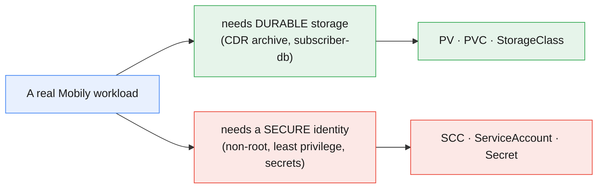

You met Volumes, PVCs, ConfigMaps and Secrets briefly on plain Kubernetes in Module 3.
Here they return in their **OpenShift** form and are joined by the security machinery
that makes OpenShift *safer by default* than vanilla Kubernetes: **SCCs** that refuse
root containers, and per-pod **ServiceAccount** identities. This is the "storage +
security" half of the core platform-services objective.

---

## 2. The storage problem: ephemeral vs persistent

A container's writable layer is **ephemeral** — deleted when the pod is removed or
rescheduled. That's fine for scratch space, fatal for data you must keep.

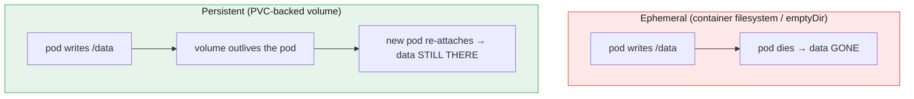

OpenShift's answer is to **decouple** the storage from the pod: the pod asks for a
volume by *claim*, the platform supplies real storage behind it, and the two have
independent lifecycles. A pod restart re-attaches the same data.

- **`emptyDir`** — scratch space that shares the pod's lifetime (cache, temp files).
- **`configMap` / `secret` volumes** — inject config/credentials (not for app data).
- **`persistentVolumeClaim`** — the real answer for **durable** data. Everything below
  is about making PVCs work.

---

## 3. PersistentVolumes & PersistentVolumeClaims

The PV/PVC split is the heart of Kubernetes storage — a **supply-and-demand** contract
that separates the *admin's* concern (real storage) from the *developer's* concern (I
need X GB).

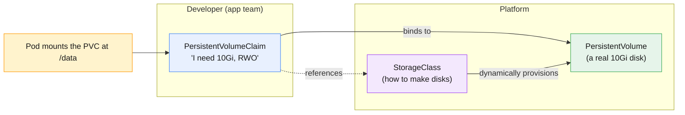

- **PersistentVolume (PV)** — a piece of *real* storage in the cluster (a cloud disk, an
  NFS export, a Ceph volume). Cluster-scoped; usually created **automatically** by a
  StorageClass (§4), not by hand.
- **PersistentVolumeClaim (PVC)** — a *request* for storage in a project: size, access
  mode, and (optionally) a StorageClass. This is the object **you** write.
- **Binding** — the control plane matches a PVC to a suitable PV (or provisions a new
  one) and **binds** them one-to-one. A bound PVC is then mounted into a pod.

```yaml
# The developer writes just this — the platform does the rest
apiVersion: v1
kind: PersistentVolumeClaim
metadata: { name: cdr-archive }
spec:
  accessModes: [ReadWriteOnce]
  resources: { requests: { storage: 10Gi } }
  # storageClassName omitted => the cluster's DEFAULT StorageClass is used
```

```bash
oc apply -f cdr-archive-pvc.yaml
oc get pvc cdr-archive           # STATUS: Pending → Bound
oc get pv                        # the auto-provisioned PV backing it
```

> **⎈ Kubernetes equivalent:** PV/PVC are pure Kubernetes — identical to `kubectl`.
> OpenShift adds no new object here; it *does* add SCC rules (§8) that affect how a
> mounted volume's files are owned (fsGroup).

---

## 4. StorageClasses & dynamic provisioning

Creating PVs by hand doesn't scale. A **StorageClass** is a *recipe* that lets the
cluster **provision a PV on demand** the instant a PVC asks — this is **dynamic
provisioning**, the normal path on OpenShift.

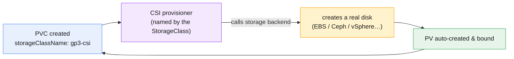

- **Provisioner** — the **CSI** (Container Storage Interface) driver that actually talks
  to the backend (`ebs.csi.aws.com`, `openshift-storage.rbd.csi.ceph.com`, …).
- **Default StorageClass** — the one used when a PVC omits `storageClassName` (marked
  `storageclass.kubernetes.io/is-default-class=true`). Most PVCs rely on it.
- **Parameters** — type, IOPS, encryption, filesystem — baked into the class so
  developers don't specify low-level details.

```bash
oc get storageclass                       # note which has (default)
oc get sc -o custom-columns=NAME:.metadata.name,PROVISIONER:.provisioner,DEFAULT:'.metadata.annotations.storageclass\.kubernetes\.io/is-default-class'
```

- **`volumeBindingMode`** matters: `Immediate` binds/provisions as soon as the PVC is
  created; **`WaitForFirstConsumer`** waits until a pod is scheduled, so the disk is
  created in the *same zone* as the pod (avoids cross-zone attach failures). Cloud
  StorageClasses usually use `WaitForFirstConsumer`.

> **Mobily lens.** The platform team defines StorageClasses once (e.g. `fast-ssd` for
> the subscriber-db, `standard` for the CDR archive). App teams just say
> `storageClassName: fast-ssd` (or nothing, to get the default) and get a disk in
> seconds — no ticket to storage ops.

---

## 5. Access modes, reclaim policy & the volume lifecycle

Two properties trip people up in the exam and in production: **access modes** and
**reclaim policy**.

**Access modes** — how many nodes may mount the volume, and how:

| Mode | Short | Meaning | Typical backend |
|---|---|---|---|
| **ReadWriteOnce** | RWO | read-write by **one node** | block storage (EBS, Ceph RBD) |
| **ReadOnlyMany** | ROX | read-only by **many nodes** | shared/exported storage |
| **ReadWriteMany** | RWX | read-write by **many nodes** | file storage (NFS, CephFS) |
| **ReadWriteOncePod** | RWOP | read-write by **one pod** only | strict single-writer |

> **Gotcha:** RWO is per-**node**, not per-pod — two pods on the *same* node can both use
> an RWO volume, but pods spread across nodes cannot. For a shared, multi-writer volume
> you need **RWX** (file storage), which block storage cannot provide.

**Reclaim policy** — what happens to the PV when the PVC is deleted:

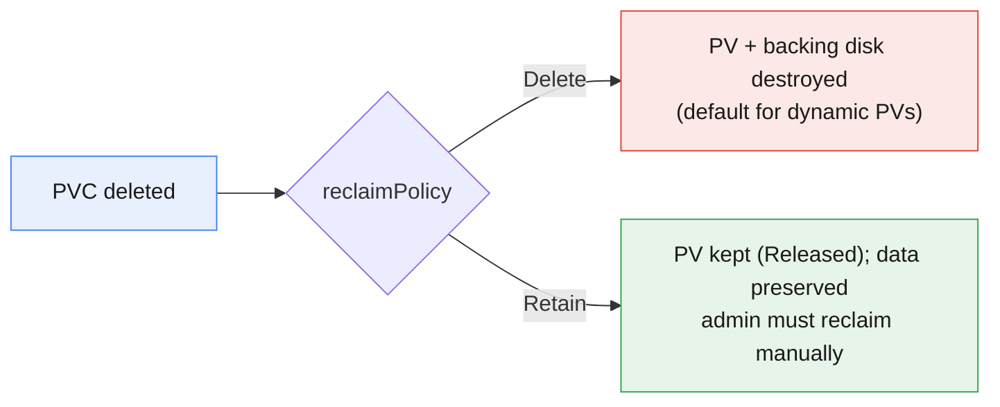

- **`Delete`** (default for dynamically-provisioned PVs) — deleting the PVC destroys the
  disk. Convenient, but **a deleted PVC = lost data**. Guard important claims.
- **`Retain`** — the PV survives and holds the data (status `Released`); an admin
  reclaims it deliberately. Use for anything you can't afford to lose by accident.

The full lifecycle: **Provision → Bind → Use (mounted) → Release (PVC deleted) →
Reclaim (Delete or Retain)**. You can also **expand** a PVC (grow, never shrink) if the
StorageClass has `allowVolumeExpansion: true`.

---

## 6. OpenShift Data Foundation (ODF) overview

Clusters often need **software-defined storage** that runs *inside* the cluster —
especially for **RWX** file storage, object (S3) buckets, and on-prem/bare-metal where
there's no cloud disk service. That's **OpenShift Data Foundation (ODF)**.

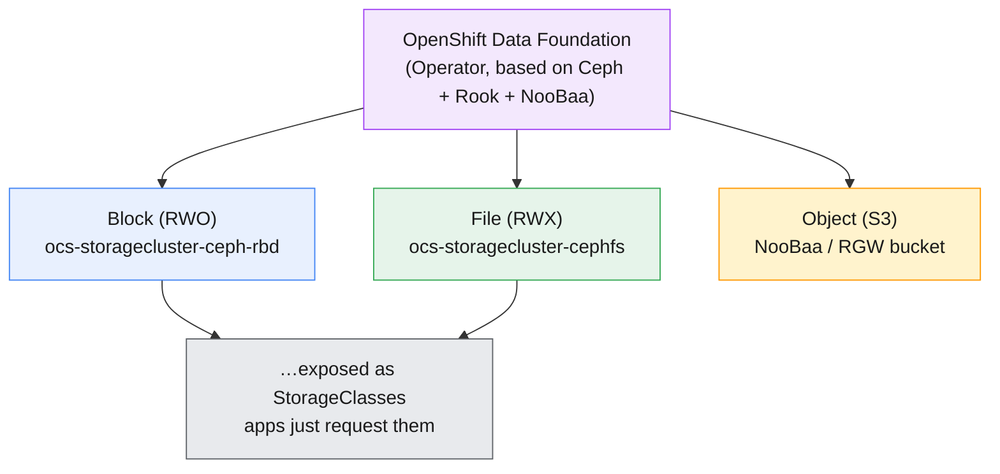

- **What it is** — an Operator-managed storage platform (Ceph under the hood via Rook,
  plus NooBaa for S3-compatible object storage) that turns raw disks on your nodes into
  cluster storage.
- **What it gives you** — **block** (RWO), **file** (RWX — the big reason to deploy it),
  and **object** (S3) storage, all surfaced as ordinary **StorageClasses**. Apps don't
  know it's Ceph; they just claim a PVC.
- **When to use it** — bare metal / on-prem, RWX workloads, S3 buckets in-cluster, or
  when you want one storage layer across clouds. Installed from **OperatorHub** (Module
  9 covers Operators); day-to-day you interact with its **StorageClasses**, not Ceph.

> **Mobily lens.** An on-prem Mobily cluster with no cloud disk service installs ODF to
> provide `fast-ssd`-style block for the subscriber-db and an **RWX** class for a shared
> CDR-ingest area several pods write to at once — plus an S3 bucket for archived CDRs.

---

## 7. The security model: authentication & authorization

Before SCCs, get the two words straight — they're constantly confused.

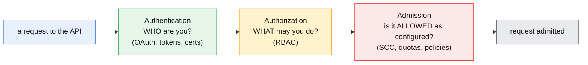

- **Authentication (authn)** — *who are you?* Handled by the OAuth server and identity
  providers (Module 8 goes deep); results in a `User` or a `ServiceAccount` identity.
- **Authorization (authz)** — *what are you allowed to do?* **RBAC** (Module 5) — Roles
  and RoleBindings on the identity.
- **Admission control** — even if RBAC lets you *create a pod*, an **admission** step
  decides whether that pod's *settings* are permitted. For pod security that gate is the
  **Security Context Constraint** — the subject of §8.

The mental model: **authn = identity, authz = permissions, admission (SCC) = what a
workload is allowed to *be*.** All three must pass.

---

## 8. Security Context Constraints (SCC)

This is the defining OpenShift security feature. A **Security Context Constraint**
controls what a pod may do at the host/kernel level — run as root? use host networking?
add Linux capabilities? mount host paths? — and it's why **OpenShift is secure by
default**.

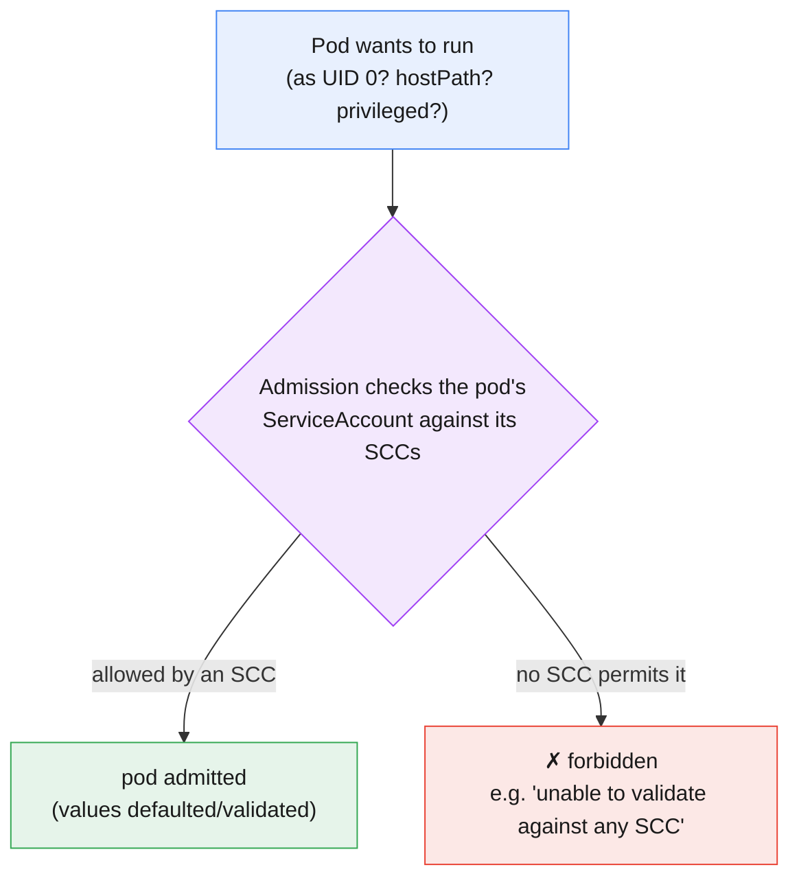

**The default that surprises everyone:** the standard SCC is **`restricted-v2`**, and
it **refuses to run a container as root**. Instead it assigns a **random high UID** from
the project's range and drops privileges. A container image with `USER root` (or no
`USER`) that *needs* UID 0 will fail with a permission error.

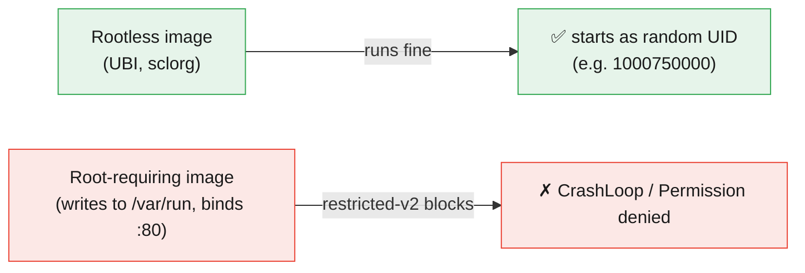

This is exactly why the course uses **Red Hat UBI** and **sclorg** images (Module 1):
they're built to run as an **arbitrary non-root UID** (group-writable dirs, ports
>1024). Your `ubi9/httpd-24` listening on 8080 works under `restricted-v2`; a stock
`nginx` binding to :80 as root does not.

**The built-in SCCs, least → most privileged:**

| SCC | Grants | Use for |
|---|---|---|
| **restricted-v2** | non-root, no privesc, drops caps | **default** — almost everything |
| **nonroot-v2** | any non-root UID the image asks for | images with a fixed non-root UID |
| **hostmount-anyuid** | mount host paths + any UID | storage/backup agents |
| **anyuid** | run as any UID incl. **root** | legacy images that need root |
| **privileged** | everything (host, root, caps) | node agents, CNI, monitoring — *rarely* |

You **don't** loosen a pod's security by editing the pod — you grant its
**ServiceAccount** access to a more permissive SCC (admin action):

```bash
oc get scc                                   # list SCCs (least→most privileged)
oc adm policy add-scc-to-user anyuid -z legacy-billing-sa   # SA gets 'anyuid' (admin)
oc get pod <pod> -o jsonpath='{.metadata.annotations.openshift\.io/scc}{"\n"}'  # which SCC ran it
```

> **⎈ Kubernetes equivalent:** SCC is OpenShift-specific. Upstream Kubernetes uses **Pod
> Security Admission** (the `restricted`/`baseline`/`privileged` standards) — a similar
> idea, coarser. On OpenShift, **SCC is the enforcing gate**; prefer fixing the image to
> be rootless over granting `anyuid`.

> **Least privilege:** grant the *narrowest* SCC that works, to a *dedicated*
> ServiceAccount, never `privileged` unless a node-level agent truly needs it.

---

## 9. ServiceAccounts — identity for pods

Users are for humans; **ServiceAccounts (SAs)** are the identity for **pods and
processes**. Every pod runs as an SA (the project's `default` SA if you don't specify),
and that SA is what RBAC and SCC decisions attach to.

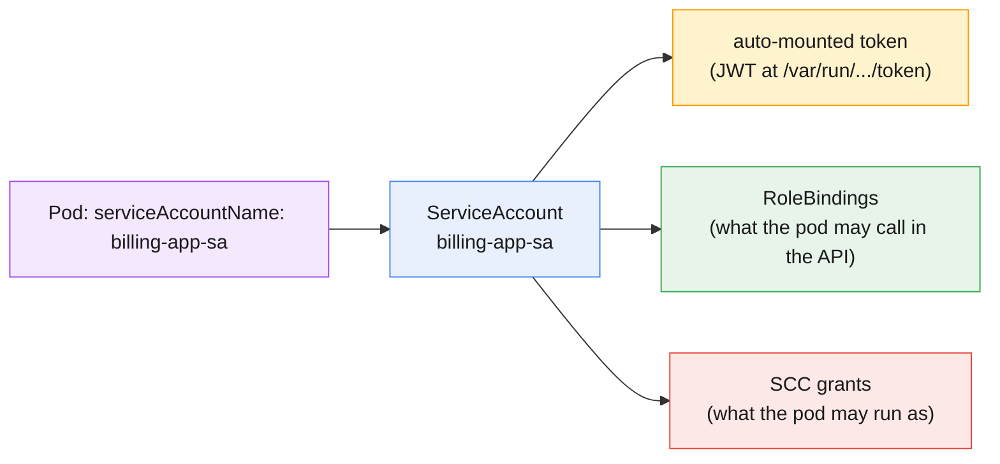

- **Why a dedicated SA?** The `default` SA is shared and easy to over-grant. Give each
  app its **own** SA so RBAC and SCC grants are scoped to *that* app (least privilege,
  clean audit).
- **The token** — OpenShift auto-mounts a short-lived, auto-rotated **projected**
  service-account token into the pod (`/var/run/secrets/kubernetes.io/serviceaccount/`).
  A pod that calls the OpenShift API uses this to authenticate as its SA.
- **Image pull secrets** — an SA can carry a `imagePullSecrets` entry so pods pull from a
  private registry (Module 1's registry auth, wired to the SA).

```bash
oc create serviceaccount billing-app-sa
oc set serviceaccount deployment/billing-app billing-app-sa   # run the app as that SA
oc adm policy add-role-to-user view -z billing-app-sa         # grant the SA API rights (-z = SA)
oc describe sa billing-app-sa                                 # tokens + pull secrets
```

> **⎈ Kubernetes equivalent:** ServiceAccounts are standard Kubernetes. OpenShift adds
> the SCC linkage (§8) and, historically, long-lived SA token secrets — modern OpenShift
> uses **bound, projected tokens** by default (short-lived, auto-rotated).

---

## 10. Secrets — managing sensitive data

Passwords, API keys, and TLS certs must **not** live in an image or a ConfigMap. A
**Secret** holds them and delivers them to pods as **files** or **environment
variables** — decoupled from the image, scoped to a project.

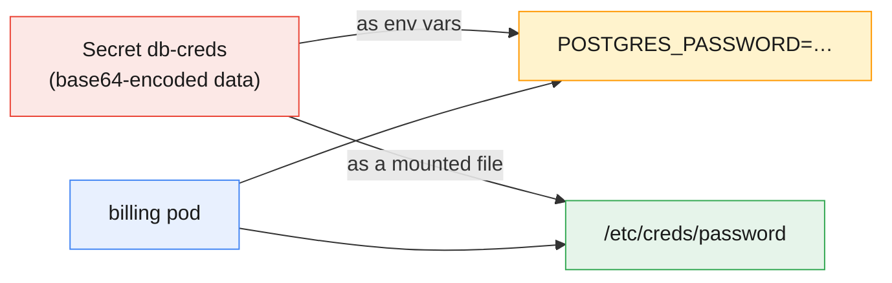

- **⚠️ base64 is encoding, NOT encryption.** `oc get secret -o yaml` shows base64 that
  *anyone with read access can decode*. Secrets protect data via **RBAC** (who can read
  them) and, optionally, **etcd encryption at rest** — not by obfuscation. Treat a
  Secret's *value* as plaintext to anyone who can `oc get` it.
- **Common types:** `Opaque` (generic), `kubernetes.io/dockerconfigjson` (registry
  pull), `kubernetes.io/tls` (cert+key — feeds Routes in Module 6), `kubernetes.io/basic-auth`.
- **Two ways to consume:** as **env vars** (`envFrom`/`valueFrom.secretKeyRef`) or as a
  **mounted volume** (files that *update* when the Secret changes — env vars don't).

```bash
# Create from literals (values are placeholders — never commit real ones)
oc create secret generic db-creds \
  --from-literal=username=billing \
  --from-literal=password='<your-password>'

# Consume as env vars in a deployment
oc set env deployment/billing-app --from=secret/db-creds

# Or mount as files
oc set volume deployment/billing-app --add --type=secret \
  --secret-name=db-creds --mount-path=/etc/creds
```

> **Best practice:** keep real secrets out of Git; use a **secrets manager** (External
> Secrets Operator / Vault) for production, and enable **etcd encryption at rest**. In
> labs, use placeholders and RBAC to limit who can read the Secret.

---

## 11. Putting it together: a stateful, secure app

The whole module in one picture — a billing app that **persists** data and runs
**securely**:

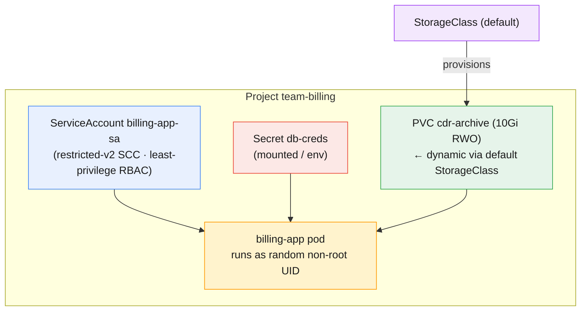

Every element from §3–§10: a **PVC** (dynamically provisioned by a **StorageClass**)
for durable CDRs, a **Secret** for the DB password, a dedicated **ServiceAccount**, and
the **restricted-v2 SCC** ensuring the pod runs non-root. Durable *and* secure — that's
a production-ready workload.

---

## 12. Key takeaways

- **Pods are ephemeral; use a PVC for durable data.** A PVC (developer's request) binds
  to a PV (real storage); a StorageClass **dynamically provisions** the PV on demand.
- **The default StorageClass** serves PVCs that omit `storageClassName`;
  `WaitForFirstConsumer` provisions the disk in the pod's zone.
- **Access modes:** RWO (one node — block), RWX (many nodes — file/NFS/CephFS), ROX,
  RWOP. **Reclaim policy:** `Delete` (default for dynamic — deleting the PVC destroys
  data) vs `Retain` (keep it).
- **ODF** provides in-cluster block/file/object storage (Ceph+NooBaa), surfaced as
  StorageClasses — the usual way to get **RWX** and S3 on-prem.
- **authn (who) → authz/RBAC (what) → admission/SCC (what a workload may *be*)** — all
  three gate every request.
- **SCC is OpenShift's secure-by-default gate:** `restricted-v2` refuses root and assigns
  a random UID — which is why rootless **UBI/sclorg** images "just work." Loosen by
  granting a **ServiceAccount** a broader SCC (`anyuid`/`privileged`), never by editing
  the pod; prefer fixing the image.
- **ServiceAccounts are pod identities** — give each app its own; RBAC and SCC attach to
  the SA; tokens are bound/projected and auto-rotated.
- **Secrets** decouple credentials from images (env or mounted files). **base64 ≠
  encryption** — protect with RBAC and etcd-at-rest encryption; keep real secrets out of
  Git.

---

## 13. Glossary

| Term | Meaning |
|---|---|
| **PersistentVolume (PV)** | A piece of real cluster storage; usually auto-provisioned. |
| **PersistentVolumeClaim (PVC)** | A namespaced request for storage (size, access mode, class). |
| **Binding** | The one-to-one match of a PVC to a PV. |
| **StorageClass** | A recipe for dynamically provisioning PVs via a CSI provisioner. |
| **Dynamic provisioning** | Auto-creating a PV when a PVC asks — the normal path. |
| **Default StorageClass** | The class used when a PVC omits `storageClassName`. |
| **CSI** | Container Storage Interface — the driver API to storage backends. |
| **volumeBindingMode** | `Immediate` vs `WaitForFirstConsumer` (bind when a pod schedules). |
| **Access mode** | RWO / RWX / ROX / RWOP — how many nodes/pods may mount, and how. |
| **Reclaim policy** | `Delete` (destroy PV with PVC) or `Retain` (keep it). |
| **allowVolumeExpansion** | Whether a PVC can be grown. |
| **ODF** | OpenShift Data Foundation — in-cluster Ceph/NooBaa storage (block/file/object). |
| **Authentication (authn)** | Establishing *who* the caller is. |
| **Authorization (authz)** | Deciding *what* the caller may do (RBAC). |
| **Admission control** | Post-authz check on the object's settings (SCC, quota). |
| **Security Context Constraint (SCC)** | OpenShift policy for what a pod may run as/do. |
| **restricted-v2** | The default SCC — non-root, random UID, dropped capabilities. |
| **anyuid / privileged** | Permissive SCCs (root / full host access) — grant sparingly. |
| **Pod Security Admission** | Upstream Kubernetes' coarser equivalent of SCC. |
| **ServiceAccount (SA)** | The identity a pod/process runs as. |
| **Projected/bound token** | Short-lived, auto-rotated SA token mounted into pods. |
| **Secret** | Namespaced object holding sensitive data (base64-encoded, not encrypted). |
| **imagePullSecret** | Registry credential attached to an SA/pod for private pulls. |
| **etcd encryption at rest** | Cluster option to encrypt Secrets (and more) stored in etcd. |

---

## 14. References

- OpenShift docs — Understanding persistent storage:
  <https://docs.openshift.com/container-platform/latest/storage/understanding-persistent-storage.html>
- Dynamic provisioning & StorageClasses:
  <https://docs.openshift.com/container-platform/latest/storage/dynamic-provisioning.html>
- OpenShift Data Foundation:
  <https://docs.redhat.com/en/documentation/red_hat_openshift_data_foundation>
- Managing Security Context Constraints:
  <https://docs.openshift.com/container-platform/latest/authentication/managing-security-context-constraints.html>
- Understanding and creating ServiceAccounts:
  <https://docs.openshift.com/container-platform/latest/authentication/understanding-and-creating-service-accounts.html>
- Providing sensitive data to pods (Secrets):
  <https://docs.openshift.com/container-platform/latest/nodes/pods/nodes-pods-secrets.html>
- Pod security standards (upstream):
  <https://kubernetes.io/docs/concepts/security/pod-security-standards/>

---

> **Companion labs:** interactive visualizations in
> [`labs/module-07/index.html`](../labs/module-07/index.html) · instructor
> [demos](../labs/module-07/demos/README.md) · hands-on
> [exercises](../labs/module-07/exercises/README.md). Delivered as **3 focused
> visualizations + 3 demos + 3 exercises** covering all six topics (persistent storage &
> StorageClasses/ODF · Security Context Constraints · ServiceAccounts & Secrets).
