# Module 8 — OpenShift Authentication, RBAC and Identity Integration

> **Course:** OpenShift Container Platform
> **Module objective:** Control **who can log in** and **what they can do**. You'll go
> deep on **RBAC** — the Role / ClusterRole / RoleBinding / ClusterRoleBinding model, how
> to author **custom Roles** rule-by-rule, and how to **design least-privilege access** —
> then on **authentication**: the OpenShift **OAuth server**, configuring **identity
> providers** (htpasswd for labs; **LDAP**, **Active Directory**, and **OpenID Connect**
> for the enterprise), and syncing **groups** so access maps cleanly onto your corporate
> directory. This is how Mobily turns a cluster into a governed, auditable platform.

---

## Table of contents

1. [Why this module matters](#1-why-this-module-matters)
2. [Authentication vs authorization — the chain](#2-authentication-vs-authorization--the-chain)
3. [RBAC objects: Roles, ClusterRoles & their bindings](#3-rbac-objects-roles-clusterroles--their-bindings)
4. [Anatomy of a Role rule (and custom Roles)](#4-anatomy-of-a-role-rule-and-custom-roles)
5. [Default & aggregated ClusterRoles](#5-default--aggregated-clusterroles)
6. [Designing least-privilege access models](#6-designing-least-privilege-access-models)
7. [Verifying access: `can-i`, `who-can`, `--as`](#7-verifying-access-can-i-who-can---as)
8. [Authentication: the OAuth server & identity providers](#8-authentication-the-oauth-server--identity-providers)
9. [The htpasswd identity provider (lab-friendly)](#9-the-htpasswd-identity-provider-lab-friendly)
10. [LDAP & Active Directory integration](#10-ldap--active-directory-integration)
11. [OpenID Connect (OIDC) integration](#11-openid-connect-oidc-integration)
12. [Groups, LDAP group sync & mapping to RBAC](#12-groups-ldap-group-sync--mapping-to-rbac)
13. [Key takeaways](#13-key-takeaways)
14. [Glossary](#14-glossary)
15. [References](#15-references)

> **How to read the diagrams:** Diagrams are written in [Mermaid](https://mermaid.js.org/),
> which renders automatically in GitHub, VS Code (with a Mermaid extension), and most
> modern Markdown viewers. If a diagram appears as code, install/enable a Mermaid
> preview to see the rendered version.

> **CLI note (oc track).** This module is **OpenShift + `oc`**. RBAC objects
> (Role/ClusterRole/RoleBinding/ClusterRoleBinding) are standard Kubernetes; the **OAuth**
> resource, identity providers, `User`/`Group`/`Identity`, `oc adm policy`, and
> `oc adm groups sync` are **OpenShift-specific**. A **⎈** note flags Kubernetes
> equivalents.

> **Telecom framing.** Examples model a fictional mobile operator, *Mobily*: projects
> `team-billing` and `team-crm`, a NOC (network operations centre), on-call SREs, and
> auditors — backed by a corporate **LDAP/Active Directory** with groups like
> `billing-admins`, `crm-devs`, and `noc-viewers`. All users and directories are invented.

> **Builds on Modules 5 & 7.** Module 5 introduced RBAC basics and users/groups; Module 7
> covered the authn → authz → admission chain and SCC. This module goes **deep** on RBAC
> (custom roles, least privilege) and adds **enterprise identity integration**.

> **Companion labs.** Interactive visualizations in
> [`labs/module-08/index.html`](../labs/module-08/index.html), instructor
> [demos](../labs/module-08/demos/README.md), and hands-on
> [exercises](../labs/module-08/exercises/README.md).

---

## 1. Why this module matters

A cluster without governed access is a liability: shared logins, everyone a
cluster-admin, no audit trail. Two capabilities fix that, and they're separate:

- **Authentication** — prove *who* a person is, ideally against your **existing
  corporate directory** so there's no second password to manage.
- **Authorization (RBAC)** — grant each identity *exactly* the permissions they need,
  no more.

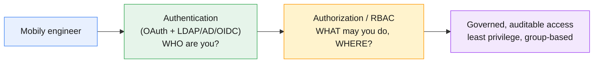

For Mobily the goal is concrete: a NOC viewer logs in with their **AD** account and can
*read* everything but *change* nothing; a billing developer can deploy in
`team-billing` only; an auditor has cluster-wide read-only; and nobody shares the
break-glass `kubeadmin`. This module builds exactly that.

---

## 2. Authentication vs authorization — the chain

Keep the three gates straight (introduced in Module 7, deepened here):

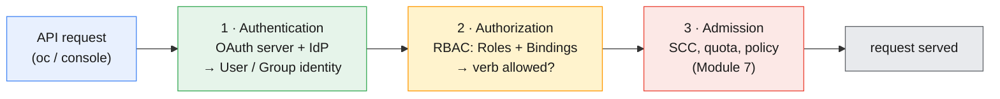

- **§8–§12** are about gate **1** (authentication): who you are, sourced from an identity
  provider.
- **§3–§7** are about gate **2** (authorization/RBAC): what that identity may do.
- Gate **3** (admission/SCC) was Module 7.

All three must pass. RBAC decides *verbs on resources*; it never authenticates and never
looks at pod security — those are the other two gates.

---

## 3. RBAC objects: Roles, ClusterRoles & their bindings

RBAC has exactly **four** object types along **two axes**: *what* (a set of permissions)
vs *who/where* (a binding of those permissions to subjects).

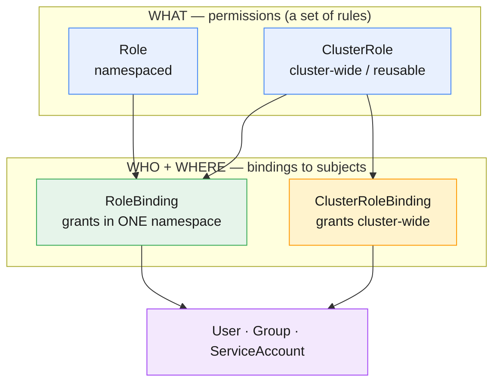

| Object | Scope | Holds | Grants access… |
|---|---|---|---|
| **Role** | one namespace | rules (verbs on resources) | within that namespace |
| **ClusterRole** | cluster-wide | rules — *reusable* | anywhere (via a binding) |
| **RoleBinding** | one namespace | ties a Role **or** ClusterRole → subjects | in that namespace |
| **ClusterRoleBinding** | cluster-wide | ties a ClusterRole → subjects | in **every** namespace |

The combinations that matter:

- **Role + RoleBinding** — custom, project-scoped permission (e.g. "read secrets in
  `team-billing`").
- **ClusterRole + RoleBinding** — reuse a *cluster-defined* permission set in **one**
  namespace (this is how `admin`/`edit`/`view` are granted per-project — they're
  ClusterRoles bound with a RoleBinding).
- **ClusterRole + ClusterRoleBinding** — grant cluster-wide (e.g. an auditor's
  read-everywhere). Use sparingly.
- ⚠️ **A RoleBinding referencing a Role only works in that Role's namespace.** You can't
  point a RoleBinding at a Role in another namespace — for reuse, use a ClusterRole.

> **⎈ Kubernetes equivalent:** all four are **standard Kubernetes RBAC** — identical to
> `kubectl`. OpenShift adds `oc adm policy` convenience verbs and the `User`/`Group`
> subjects sourced from its OAuth layer.

---

## 4. Anatomy of a Role rule (and custom Roles)

A Role/ClusterRole is a list of **rules**, each answering: *which verbs* on *which
resources* in *which API groups*.

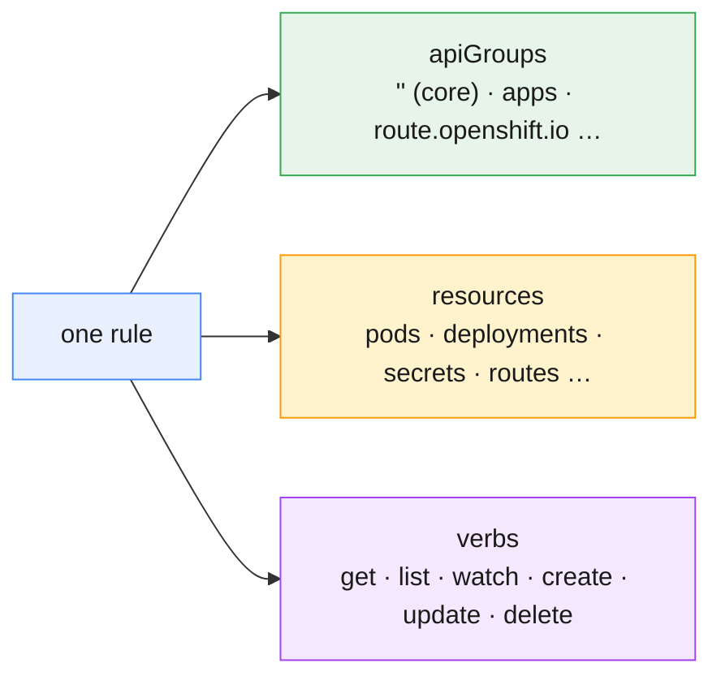

A custom Role for a **CDR log reader** — may read pods and their logs in a project, and
nothing else:

```yaml
apiVersion: rbac.authorization.k8s.io/v1
kind: Role
metadata:
  namespace: team-billing
  name: cdr-log-reader
rules:
  - apiGroups: [""]                       # "" = the core API group
    resources: ["pods", "pods/log"]
    verbs: ["get", "list", "watch"]        # read-only — no create/delete
```

```bash
# Imperative shortcut for a single-rule Role:
oc create role cdr-log-reader \
  --verb=get,list,watch --resource=pods,pods/log -n team-billing

# Bind it to a group:
oc create rolebinding cdr-log-reader-binding \
  --role=cdr-log-reader --group=billing-viewers -n team-billing
```

Key points about rules:

- **`apiGroups`**: `""` (empty string) is the **core** group (pods, services,
  configmaps, secrets, PVCs). Named groups: `apps` (deployments), `route.openshift.io`
  (routes), `rbac.authorization.k8s.io` (roles), etc. Get it wrong and the rule silently
  grants nothing.
- **`resources`**: plural names; subresources use a slash (`pods/log`, `pods/exec`,
  `deployments/scale`).
- **`verbs`**: `get`/`list`/`watch` = read; `create`/`update`/`patch`/`delete` = write;
  `*` = all (avoid). `list` without `get` is a common mistake — the console needs both.
- **Rules are purely additive** — there is **no deny**. Access = the union of every rule
  in every Role bound to you. You reduce access by *removing* grants, never by adding a
  "deny".

---

## 5. Default & aggregated ClusterRoles

You rarely start from scratch — OpenShift ships well-known ClusterRoles. Know these
cold:

| ClusterRole | Grants | Typical subject |
|---|---|---|
| **view** | read most objects (not secrets) in a project | read-only stakeholders |
| **edit** | create/modify most objects (not RBAC) in a project | developers |
| **admin** | full control of a project incl. RBAC (not quota) | project owners |
| **cluster-reader** | read **everything** cluster-wide | auditors, monitoring |
| **cluster-admin** | do **anything, anywhere** | platform admins (break-glass) |
| **self-provisioner** | create new projects | authenticated users (often restricted) |

**Aggregated ClusterRoles** — `admin`, `edit`, and `view` are *aggregations*: they
automatically absorb any ClusterRole labelled
`rbac.authorization.k8s.io/aggregate-to-edit: "true"` (etc.). So when an Operator adds a
new CRD, it ships a small ClusterRole with that label and *existing* project admins
instantly gain rights over the new kind — no edit to `admin` required.

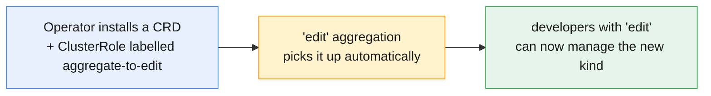

> **Rule of thumb:** reach for `view`/`edit`/`admin` bound per-project first. Write a
> **custom Role** only when the defaults are too broad or too narrow for a real need.

---

## 6. Designing least-privilege access models

Least privilege is a *design activity*, not a command. The method:

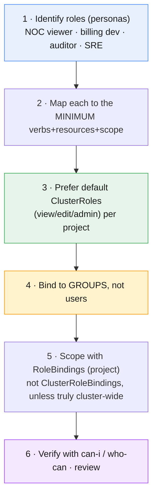

A worked Mobily model:

| Persona | Group | ClusterRole | Bound with | Scope |
|---|---|---|---|---|
| Billing developer | `billing-devs` | `edit` | RoleBinding | `team-billing` |
| Billing owner | `billing-admins` | `admin` | RoleBinding | `team-billing` |
| NOC viewer | `noc-viewers` | `view` | RoleBinding | each app project |
| Security auditor | `auditors` | `cluster-reader` | ClusterRoleBinding | cluster-wide (read) |
| Platform admin | `platform-sre` | `cluster-admin` | ClusterRoleBinding | cluster-wide (break-glass) |

The four disciplines that keep it least-privilege:

- **Bind to groups, not users** — onboarding = add to the group; offboarding = remove.
  No binding churn.
- **Prefer project scope** (RoleBinding) over cluster scope (ClusterRoleBinding). Ask:
  "does this really need to be cluster-wide?"
- **Smallest role that works** — `view` before `edit`, `edit` before `admin`, `admin`
  before `cluster-admin`.
- **Restrict self-provisioning** if you want central control of who creates projects
  (remove the `self-provisioner` grant from `system:authenticated:oauth`).

> **Mobily lens.** Because grants target **groups** that mirror **AD groups** (§12), HR
> adding an engineer to `billing-devs` in Active Directory *is* the OpenShift access
> grant — one source of truth, fully auditable.

---

## 7. Verifying access: `can-i`, `who-can`, `--as`

Never assume an access model works — **prove it**. Three tools:

```bash
# "Can I …?" — as yourself
oc auth can-i create deployments -n team-billing            # yes / no

# "Can SOMEONE ELSE …?" — impersonate (needs elevated rights)
oc auth can-i delete pods -n team-billing --as alice
oc auth can-i get nodes --as alice                          # expect: no (cluster scope)

# "WHO can do X here?" — the inverse lookup
oc adm policy who-can delete pods -n team-billing

# What roles are bound in this project?
oc get rolebindings -n team-billing
oc describe rolebinding.rbac admin -n team-billing
```

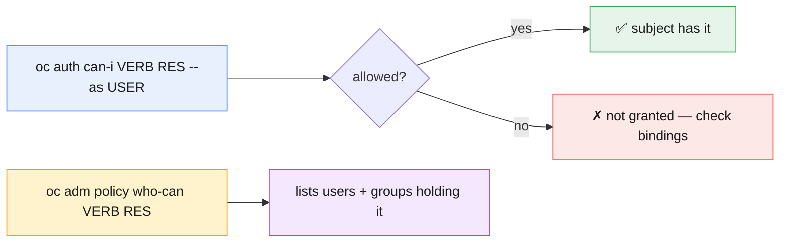

`oc auth can-i ... --as` is the single best RBAC debugging tool — it answers "can *this
subject* do *this* *here*?" directly. `who-can` is the audit inverse. Use both when a
user reports "permission denied" or when reviewing an access model.

---

## 8. Authentication: the OAuth server & identity providers

OpenShift has **no built-in user database for humans**. It runs an internal **OAuth
server** (the `authentication` Cluster Operator, Module 4) that delegates the actual
password/identity check to one or more configured **identity providers (IdPs)**.

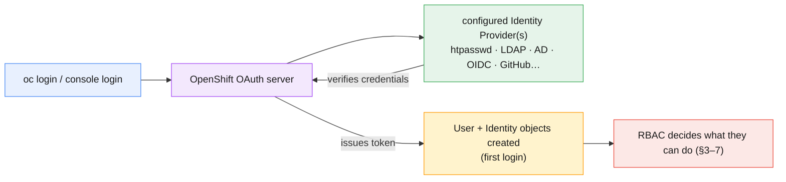

- **One cluster-wide config object:** the **`OAuth`** custom resource named `cluster`
  (`oc edit oauth cluster`) lists the identity providers. It's cluster-scoped — editing
  it needs cluster-admin.
- **Multiple IdPs** can coexist (e.g. htpasswd for break-glass + LDAP for staff); users
  pick at login.
- **`User` / `Identity`** objects are created on first successful login. `Identity`
  records the `idp-name:remote-username` link; `User` is the OpenShift-side account RBAC
  targets.
- **kubeadmin** is the temporary bootstrap admin. Once a real IdP + an admin group are
  in place, **remove `kubeadmin`** — it's a shared password and a standing risk.

Supported provider types: **htpasswd**, **LDAP**, **Keystone**, **GitHub / GitLab /
Google**, **OpenID Connect (OIDC)**, and request-header/basic-auth. The next sections
cover the ones on the Mobily menu.

---

## 9. The htpasswd identity provider (lab-friendly)

**htpasswd** authenticates against a flat file of usernames + bcrypt-hashed passwords,
stored in a Secret. It needs no external system, so it's ideal for **labs, small
clusters, and break-glass** accounts.

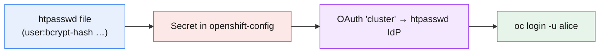

```bash
# 1. Build the file (bcrypt). -B = bcrypt, -c = create
htpasswd -c -B -b users.htpasswd alice '<password>'
htpasswd    -B -b users.htpasswd bob   '<password>'

# 2. Store it as a Secret in openshift-config (cluster-admin)
oc create secret generic mobily-htpasswd \
  --from-file=htpasswd=users.htpasswd -n openshift-config

# 3. Wire it into the OAuth CR (add an htpasswd IdP entry) — cluster-admin
oc edit oauth cluster          # add spec.identityProviders[].htpasswd.fileData.name

# 4. To add/remove users later: extract the Secret, edit, re-apply
oc extract secret/mobily-htpasswd -n openshift-config --to=- > users.htpasswd
oc set data secret/mobily-htpasswd --from-file=htpasswd=users.htpasswd -n openshift-config
```

- After the OAuth Operator rolls out (a minute or two), `oc login -u alice` works.
- **New users have no permissions** until you bind a Role — authn ≠ authz.
- htpasswd doesn't scale to an org and has no group source; for enterprise use LDAP/AD or
  OIDC (§10–§12). Keep one htpasswd admin as break-glass even after wiring LDAP.

> **⎈ Kubernetes equivalent:** none — upstream Kubernetes has no built-in login server;
> you bring your own OIDC or certs. The OAuth server + htpasswd IdP is an OpenShift
> convenience.

---

## 10. LDAP & Active Directory integration

For real staff, authenticate against the **corporate directory**. OpenShift's **LDAP**
identity provider binds to an LDAP server (OpenLDAP, 389/Red Hat DS) — and **Active
Directory speaks LDAP**, so AD uses the same provider with AD-specific attributes.

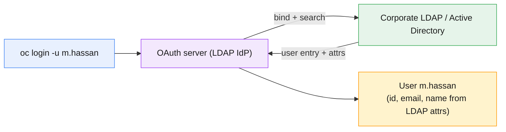

The LDAP IdP config (in the `OAuth` CR) has four essentials:

- **`url`** — an RFC-2255 LDAP query URL:
  `ldaps://ad.mobily.example:636/OU=Users,DC=mobily,DC=example?sAMAccountName?sub?(objectClass=user)`
  — host, **base DN**, the **attribute to match the username** (AD: `sAMAccountName`;
  OpenLDAP: `uid`), scope, and a filter.
- **`bindDN` / `bindPassword`** — a service account that may search the directory
  (password stored as a Secret).
- **`attributes`** — which LDAP attributes map to `id`, `preferredUsername`, `name`,
  `email` (AD commonly: `sAMAccountName`, `mail`, `displayName`).
- **`ca`** — a ConfigMap with the directory's CA cert (use **`ldaps://`** — never send
  corporate passwords in cleartext).

```bash
oc create secret generic ldap-bind-password \
  --from-literal=bindPassword='<svc-account-pw>' -n openshift-config
oc create configmap ldap-ca --from-file=ca.crt=corp-ca.crt -n openshift-config
oc edit oauth cluster        # add an ldap identityProvider referencing both
```

- **AD specifics:** match on `sAMAccountName` (or `userPrincipalName`); AD group
  membership lives on the user's `memberOf` attribute — relevant for group sync (§12).
- The LDAP IdP authenticates **users**; it does **not** by itself create OpenShift
  **groups** — that's the separate **group sync** step (§12).

---

## 11. OpenID Connect (OIDC) integration

**OpenID Connect** is the modern standard — authenticate against an external **identity
provider that issues ID tokens** (Microsoft Entra ID / Azure AD, Okta, Keycloak/Red Hat
SSO, Ping, Google). It enables **SSO** and **MFA** handled by the IdP.

```mermaid
flowchart LR
    LOGIN["console login → redirect"] --> OIDC["OIDC provider<br/>(Entra ID · Okta · Keycloak)"]
    OIDC -->|user authenticates + MFA| OIDC
    OIDC -->|ID token (JWT w/ claims)| OAUTH["OpenShift OAuth server"]
    OAUTH --> U["User + groups from token claims"]
    style LOGIN fill:#e8f0fe,stroke:#4285f4,stroke-width:1px,color:#1a1a1a
    style OIDC fill:#e6f4ea,stroke:#34a853,stroke-width:1px,color:#1a1a1a
    style OAUTH fill:#f3e8fd,stroke:#a142f4,stroke-width:1px,color:#1a1a1a
    style U fill:#fff3cd,stroke:#ff9800,stroke-width:1px,color:#1a1a1a
```

Configuring an OIDC IdP (in the `OAuth` CR):

- **`clientID` / `clientSecret`** — register OpenShift as an app in the IdP; the secret
  is stored in `openshift-config`.
- **`issuer`** — the provider's OIDC issuer URL (must serve `/.well-known/openid-configuration`).
- **`claims`** — map token claims to OpenShift identity: `preferredUsername`, `name`,
  `email`, and crucially **`groups`** — OIDC can deliver **group membership in the token
  itself**, so no separate sync is needed (unlike LDAP).

```bash
oc create secret generic entra-client-secret \
  --from-literal=clientSecret='<oidc-client-secret>' -n openshift-config
oc edit oauth cluster        # add an openID identityProvider (issuer, clientID, claims)
```

- **LDAP vs OIDC:** LDAP = OpenShift searches your directory (and you sync groups
  separately); OIDC = the provider hands OpenShift a signed token *with claims* (groups
  can ride along). OIDC is the direction of travel for SSO/MFA.
- The redirect URL you register in the IdP is the cluster's OAuth callback
  (`https://oauth-openshift.apps.<cluster-domain>/oauth2callback/<idp-name>`).

---

## 12. Groups, LDAP group sync & mapping to RBAC

The payoff of enterprise identity: **map corporate groups onto OpenShift RBAC** so
directory membership drives cluster access.

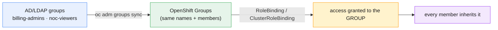

- **Manual groups** — `oc adm groups new noc-viewers` then `oc adm groups add-users …`.
  Fine for a few; doesn't scale or stay in sync with the directory.
- **LDAP group sync** — `oc adm groups sync` reads group membership from LDAP/AD (via a
  **sync config** YAML that maps the directory schema) and creates/updates matching
  **OpenShift Groups** automatically. Run it on a **schedule** (a CronJob) so joiners/
  leavers propagate.
- **Then bind once:** grant the *group* a role (`oc adm policy add-role-to-group edit
  billing-devs -n team-billing`). Membership changes in AD now flow to access with no
  OpenShift edits.

```bash
# Sync specific groups from AD using a sync-config file (scheduled via CronJob)
oc adm groups sync --sync-config=ldap-group-sync.yaml --confirm
oc get groups                                   # synced groups + members
oc adm policy add-role-to-group edit billing-devs -n team-billing   # bind the group
```

> **This closes the loop.** IdP (§8–11) says *who you are* using the corporate directory;
> group sync (§12) says *which teams you're in*; RBAC (§3–7) says *what each team may
> do*. Add someone to `billing-devs` in AD and — after the next sync — they can deploy in
> `team-billing`, with a full audit trail and no shared credentials.

---

## 13. Key takeaways

- **Authentication ≠ authorization.** The OAuth server + an IdP prove *who* you are; RBAC
  decides *what* you may do. A brand-new user has **zero** permissions until bound.
- **RBAC = four objects, two axes.** Role/ClusterRole (permissions) × RoleBinding/
  ClusterRoleBinding (subjects + scope). `admin`/`edit`/`view` are **ClusterRoles bound
  per-project** with a RoleBinding.
- **A rule = apiGroups × resources × verbs.** `""` is the core group; rules are
  **additive, no deny**; access is the union of all bound rules.
- **`admin`/`edit`/`view` aggregate** — Operators add labelled ClusterRoles and existing
  roles pick up new CRDs automatically.
- **Least privilege is a design method:** personas → minimum rights → default roles →
  **bind to groups** → **project scope** → verify with `can-i`/`who-can`.
- **The OAuth CR (`cluster`) lists IdPs.** htpasswd for labs/break-glass; **LDAP/AD**
  (OpenShift searches the directory; match `sAMAccountName` for AD; use `ldaps://`);
  **OIDC** (external token with claims, SSO/MFA, groups can ride in the token). Remove
  **kubeadmin** once a real admin path exists.
- **Group sync maps the directory to RBAC.** `oc adm groups sync` (scheduled) keeps
  OpenShift Groups in step with AD/LDAP; bind roles to those groups so directory
  membership *is* cluster access.

---

## 14. Glossary

| Term | Meaning |
|---|---|
| **Authentication (authn)** | Establishing *who* the caller is (OAuth + IdP). |
| **Authorization (authz)** | Deciding *what* the caller may do (RBAC). |
| **RBAC** | Role-Based Access Control. |
| **Role** | Namespaced set of permission rules. |
| **ClusterRole** | Cluster-wide/reusable set of permission rules. |
| **RoleBinding** | Binds a Role or ClusterRole to subjects in one namespace. |
| **ClusterRoleBinding** | Binds a ClusterRole to subjects cluster-wide. |
| **Rule** | `apiGroups` × `resources` × `verbs` (with optional resourceNames). |
| **verb** | An action: get/list/watch/create/update/patch/delete. |
| **aggregated ClusterRole** | A ClusterRole (admin/edit/view) that absorbs labelled roles. |
| **view / edit / admin** | Default per-project ClusterRoles (read / write / owner). |
| **cluster-reader / cluster-admin** | Cluster-wide read-only / full control. |
| **self-provisioner** | ClusterRole letting authenticated users create projects. |
| **OAuth server** | OpenShift's internal login server (authentication operator). |
| **`OAuth` CR (`cluster`)** | The cluster-wide object listing identity providers. |
| **Identity Provider (IdP)** | External system the OAuth server trusts (htpasswd/LDAP/OIDC…). |
| **htpasswd** | File-based IdP (bcrypt hashes in a Secret) — labs/break-glass. |
| **LDAP IdP** | Authenticates against an LDAP/AD directory via a bind + search. |
| **bindDN / bindPassword** | Service account credentials used to search the directory. |
| **sAMAccountName** | The AD attribute commonly matched as the username. |
| **OIDC** | OpenID Connect — token-based IdP (Entra ID/Okta/Keycloak), SSO/MFA. |
| **issuer / clientID / clientSecret** | OIDC registration + discovery parameters. |
| **claims** | Token fields mapped to OpenShift identity (username, email, **groups**). |
| **User / Identity** | OpenShift account / the idp:username link, created on first login. |
| **Group** | A named set of users; the preferred RBAC subject. |
| **group sync** | `oc adm groups sync` — mirror LDAP/AD groups into OpenShift Groups. |
| **kubeadmin** | Temporary break-glass admin created at install; remove after IdP setup. |

---

## 15. References

- Understanding authentication:
  <https://docs.openshift.com/container-platform/latest/authentication/understanding-authentication.html>
- Using RBAC to define and apply permissions:
  <https://docs.openshift.com/container-platform/latest/authentication/using-rbac.html>
- Configuring the internal OAuth server:
  <https://docs.openshift.com/container-platform/latest/authentication/configuring-internal-oauth.html>
- htpasswd identity provider:
  <https://docs.openshift.com/container-platform/latest/authentication/identity_providers/configuring-htpasswd-identity-provider.html>
- LDAP identity provider:
  <https://docs.openshift.com/container-platform/latest/authentication/identity_providers/configuring-ldap-identity-provider.html>
- OpenID Connect identity provider:
  <https://docs.openshift.com/container-platform/latest/authentication/identity_providers/configuring-oidc-identity-provider.html>
- Syncing LDAP groups:
  <https://docs.openshift.com/container-platform/latest/authentication/ldap-syncing.html>
- Removing the kubeadmin user:
  <https://docs.openshift.com/container-platform/latest/authentication/remove-kubeadmin.html>

---

> **Companion labs:** interactive visualizations in
> [`labs/module-08/index.html`](../labs/module-08/index.html) · instructor
> [demos](../labs/module-08/demos/README.md) · hands-on
> [exercises](../labs/module-08/exercises/README.md). Delivered as **3 focused
> visualizations + 3 demos + 3 exercises** covering all six topics (RBAC & least
> privilege · authentication & OAuth/htpasswd · LDAP/AD/OIDC integration & group sync).
