# Module 9 — Operators, Helm and Application Deployment

> **Course:** OpenShift Container Platform
> **Module objective:** Deploy applications on OpenShift the three ways real teams do it —
> plain **Kubernetes manifests** (declarative YAML), **Helm** (the package manager for
> Kubernetes: charts, values, releases), and **Operators** installed through the **Operator
> Lifecycle Manager (OLM)** from **OperatorHub**. You'll learn what each method is for, how
> to install and manage an Operator, deploy an app from manifests, and package/customize an
> app as a Helm chart — and how to choose between them.

---

## Table of contents

1. [Why this module matters](#1-why-this-module-matters)
2. [The deployment spectrum: manifests → Helm → Operators](#2-the-deployment-spectrum-manifests--helm--operators)
3. [Kubernetes manifests: declarative YAML](#3-kubernetes-manifests-declarative-yaml)
4. [Organizing manifests with Kustomize](#4-organizing-manifests-with-kustomize)
5. [Helm: charts, values & releases](#5-helm-charts-values--releases)
6. [Helm templating & values override](#6-helm-templating--values-override)
7. [Helm lifecycle: install, upgrade, rollback](#7-helm-lifecycle-install-upgrade-rollback)
8. [The Operator pattern & why OLM](#8-the-operator-pattern--why-olm)
9. [OLM: Subscriptions, channels, install modes & CSVs](#9-olm-subscriptions-channels-install-modes--csvs)
10. [OperatorHub: discovering & installing Operators](#10-operatorhub-discovering--installing-operators)
11. [Using an Operator via Custom Resources](#11-using-an-operator-via-custom-resources)
12. [Choosing: manifests vs Helm vs Operators](#12-choosing-manifests-vs-helm-vs-operators)
13. [Key takeaways](#13-key-takeaways)
14. [Glossary](#14-glossary)
15. [References](#15-references)

> **How to read the diagrams:** Diagrams are written in [Mermaid](https://mermaid.js.org/),
> which renders automatically in GitHub, VS Code (with a Mermaid extension), and most
> modern Markdown viewers. If a diagram appears as code, install/enable a Mermaid
> preview to see the rendered version.

> **CLI note (oc track).** This module is **OpenShift + `oc`**, plus the **`helm`** CLI.
> Manifests and Helm are standard Kubernetes; **OLM/OperatorHub/Subscription/CSV** are
> OpenShift's packaging of the upstream Operator Framework. A **⎈** note flags Kubernetes
> equivalents.

> **Telecom framing.** Examples model a fictional mobile operator, *Mobily*: a
> `subscriber-api` and `self-care` portal deployed by manifests/Helm, and a **PostgreSQL
> Operator** managing the CDR datastore. All data is invented.

> **Builds on Module 4.** Module 4 introduced the Operator *pattern* (CRD + CR + reconcile,
> Cluster Operators, the CVO). This module is the *practical* side: installing third-party
> Operators via **OLM/OperatorHub**, and the two other deployment methods (manifests, Helm).

> **Companion labs.** Interactive visualizations in
> [`labs/module-09/index.html`](../labs/module-09/index.html), instructor
> [demos](../labs/module-09/demos/README.md), and hands-on
> [exercises](../labs/module-09/exercises/README.md).

---

## 1. Why this module matters

"Deploy the app" has three answers on OpenShift, and a good engineer knows when to use
each:

- **Manifests** — hand-written YAML you `oc apply`. Maximum control, zero abstraction.
- **Helm** — package an app as a reusable, parameterized **chart**; install many
  configurations of the same app from one template.
- **Operators** — for complex, stateful software (databases, queues, monitoring) that
  needs *ongoing* operational logic (backup, failover, upgrade), install an **Operator**
  that runs that expertise for you.

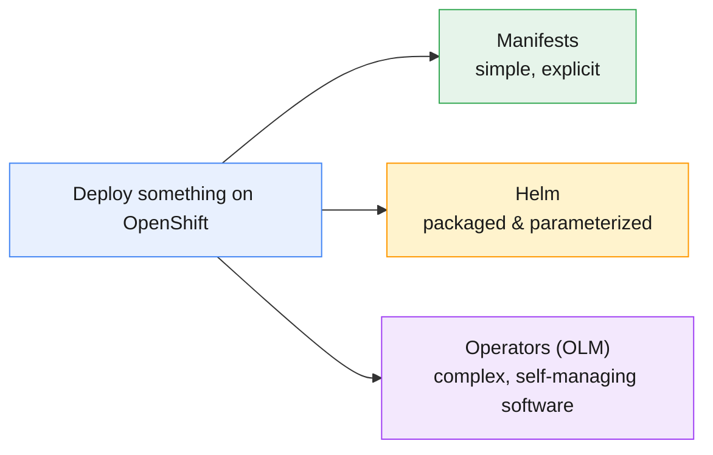

For Mobily: the `subscriber-api` is a plain Deployment (manifest or Helm); the `self-care`
portal ships to many environments (Helm shines); the CDR **database** wants backups and
failover (an Operator earns its keep). This module makes each concrete — and it's the
foundation for GitOps/CI-CD in Module 10.

---

## 2. The deployment spectrum: manifests → Helm → Operators

Think of the three as increasing **abstraction** and **operational intelligence**:

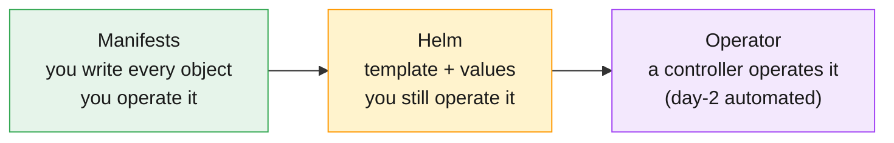

| | Manifests | Helm | Operators |
|---|---|---|---|
| **What you provide** | full YAML | a chart + values | a Custom Resource |
| **Reuse / parameterize** | copy & edit | **values.yaml** | CR spec fields |
| **Who operates day-2** | you | you | **the Operator** |
| **Best for** | simple/bespoke apps | apps deployed many ways | complex/stateful software |
| **Rollback** | `oc rollout undo` / re-apply | `helm rollback` | Operator-managed |

The key distinction: manifests and Helm are **installation** tools — they create objects
and stop. An **Operator keeps working** after install, reconciling the software's state
(the Module 4 loop, now for *your* apps).

---

## 3. Kubernetes manifests: declarative YAML

The foundation. A **manifest** is a YAML file describing desired objects; `oc apply`
reconciles the cluster to match. Everything else (Helm, Operators) ultimately produces
manifests.

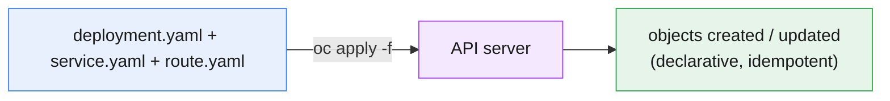

```yaml
# subscriber-api-deploy.yaml
apiVersion: apps/v1
kind: Deployment
metadata: { name: subscriber-api, labels: { app: subscriber-api } }
spec:
  replicas: 3
  selector: { matchLabels: { app: subscriber-api } }
  template:
    metadata: { labels: { app: subscriber-api } }
    spec:
      containers:
        - name: web
          image: registry.access.redhat.com/ubi9/httpd-24:latest
          ports: [ { containerPort: 8080 } ]
```

```bash
oc apply -f subscriber-api-deploy.yaml       # create or update — idempotent
oc apply -f ./manifests/                      # a whole directory at once
oc create deployment subscriber-api \
  --image=registry.access.redhat.com/ubi9/httpd-24:latest \
  --dry-run=client -o yaml > deploy.yaml       # scaffold YAML to edit (works offline)
oc diff -f subscriber-api-deploy.yaml          # preview what apply would change
```

- **`apply` vs `create`:** `create` fails if the object exists; **`apply`** creates *or*
  updates and is **idempotent** — the GitOps-friendly verb. `oc apply` records the applied
  config so it can compute diffs and prune.
- **Scaffold, don't hand-type:** `oc create ... --dry-run=client -o yaml` prints a valid
  manifest you edit and commit — offline, no cluster needed.
- **Downside:** many near-identical files across environments (dev/stage/prod) → drift and
  copy-paste. That's the problem Kustomize and Helm solve.

> **⎈ Kubernetes equivalent:** identical to `kubectl apply`. OpenShift adds `oc new-app`
> (scaffolds Deployment+Service+Route from an image/source) as a shortcut.

---

## 4. Organizing manifests with Kustomize

**Kustomize** (built into `oc`/`kubectl` via `-k`) removes copy-paste without templating:
a **base** set of manifests plus per-environment **overlays** that patch it.

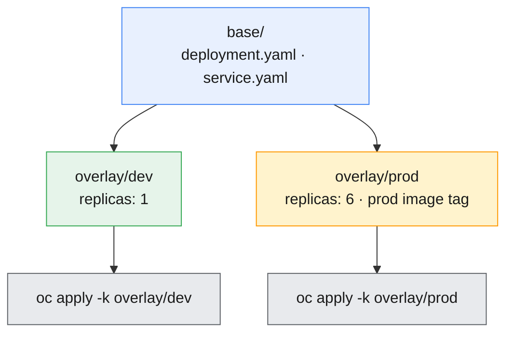

```bash
oc apply -k overlays/prod        # -k = build the kustomization then apply
oc kustomize overlays/prod       # just render (preview) the result
```

- **Base + overlays** — one source of truth; each environment is a small patch
  (`replicas`, image tag, a ConfigMap value). No `{{ templating }}`.
- **Kustomize vs Helm:** Kustomize *patches* plain YAML (no template language, great for
  GitOps and small differences); Helm *templates* with a values file and packages a
  distributable chart. Many teams use both. Kustomize is central to GitOps (Module 10).

---

## 5. Helm: charts, values & releases

**Helm** is the package manager for Kubernetes. A **chart** is a templated, versioned
package of manifests; **values** parameterize it; installing a chart creates a named
**release**.

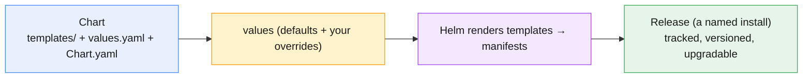

A chart's anatomy (from `helm create subscriber-api`):

```
subscriber-api/
├── Chart.yaml            # name, version, appVersion (chart metadata)
├── values.yaml           # DEFAULT values (replicaCount, image, service, …)
├── templates/            # Go-templated manifests
│   ├── deployment.yaml   #   uses {{ .Values.* }} and {{ .Release.* }}
│   ├── service.yaml
│   ├── serviceaccount.yaml
│   ├── _helpers.tpl      #   reusable template snippets
│   └── NOTES.txt         #   post-install message
└── charts/               # subchart dependencies (if any)
```

- **Chart** = the package (reusable, versioned via `Chart.yaml`).
- **values.yaml** = the knobs, with sensible **defaults**; users override a few.
- **Release** = one install of a chart with a name (`self-care-prod`) — Helm tracks its
  revision history so you can upgrade and roll back.
- **Repositories** — charts are shared via repos (`helm repo add …`), like container
  registries for charts.

> **⎈ Kubernetes equivalent:** Helm is a client tool (Helm 3 has **no server-side
> Tiller**) that renders templates and applies the result. It runs the same on any
> Kubernetes; on OpenShift the console's **Developer → Helm** view lists releases too.

---

## 6. Helm templating & values override

The power of Helm is **one template, many configurations**. Templates reference
`.Values.*` (from values.yaml + overrides) and `.Release.*` (install metadata).

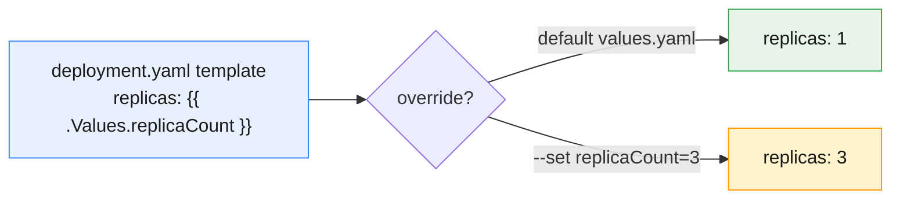

```bash
helm show values ./subscriber-api            # the chart's default values
helm template subscriber-api ./subscriber-api          # render with defaults (replicas: 1)
helm template subscriber-api ./subscriber-api \
  --set replicaCount=3 \
  --set image.repository=registry.access.redhat.com/ubi9/httpd-24 \
  --set image.tag=latest                     # render overridden (replicas: 3, UBI image)
helm lint ./subscriber-api                    # validate chart structure
```

- **Override precedence:** command-line `--set` beats a `-f my-values.yaml` file, which
  beats the chart's `values.yaml` defaults. Later/more-specific wins.
- **`helm template`** renders locally *without a cluster* — perfect for review, diffing,
  and CI. **`helm lint`** checks the chart is well-formed.
- **`_helpers.tpl`** holds reusable snippets (names, labels) so templates stay DRY.

> **Tip:** in GitOps you often commit the chart + a values file and let Argo CD render it
> (Module 10) — `helm template` is how you preview exactly what will be applied.

---

## 7. Helm lifecycle: install, upgrade, rollback

A release has a **revision history**; Helm makes upgrades and rollbacks first-class.

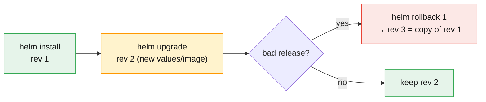

```bash
helm install self-care ./subscriber-api --set replicaCount=2   # create release "self-care"
helm list                                                       # releases + revision + status
helm upgrade self-care ./subscriber-api --set replicaCount=5    # revision 2
helm history self-care                                          # revision log
helm rollback self-care 1                                       # revert to revision 1 (creates rev 3)
helm uninstall self-care                                        # remove the release
```

- **`install`** creates a release; **`upgrade`** bumps the revision with new values/chart;
  **`rollback N`** returns to a prior revision (recorded as a *new* revision).
- **`--atomic`** on install/upgrade auto-rolls-back if the release fails — safer CI/CD.
- **`helm list`/`helm history`** are your audit trail; Helm stores release state as Secrets
  in the namespace.

---

## 8. The Operator pattern & why OLM

For **complex, stateful** software, installation isn't the hard part — *operating* it is
(backups, failover, version upgrades). An **Operator** encodes that expertise as a
controller (Module 4's reconcile loop, for *your* software). **OLM** is how you install and
manage Operators on OpenShift.

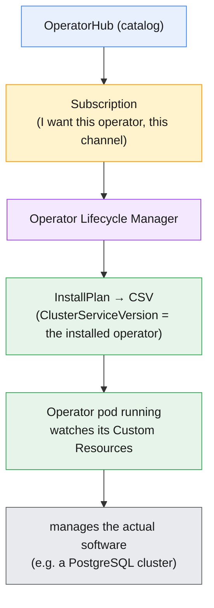

- **Why not just Helm for a database?** Helm installs it once. An Operator keeps *running*
  — it takes backups, fails over, and upgrades the database safely. That ongoing logic is
  the difference (recall Operator capability levels from Module 4).
- **OLM** is the package manager *for Operators*: discovery, install, dependency
  resolution, and **automatic upgrades** — the machinery behind every OperatorHub tile.

---

## 9. OLM: Subscriptions, channels, install modes & CSVs

Installing an Operator via OLM creates a few objects. Know them:

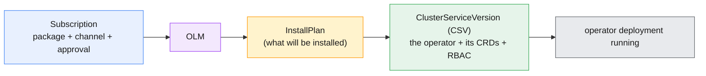

- **Subscription** — your *request* for an Operator: which **package**, which **channel**,
  and the **approval** mode.
- **Channel** — a stream of the Operator's versions (`stable`, `fast`, …), like the
  cluster channels in Module 5.
- **Approval** — **Automatic** (OLM upgrades as new versions land in the channel) or
  **Manual** (an admin approves each InstallPlan — safer for production).
- **InstallPlan** — the concrete plan OLM executes (and what you approve in Manual mode).
- **CSV (ClusterServiceVersion)** — the installed Operator's manifest: its version,
  deployment, the **CRDs** it owns, and the RBAC it needs. `oc get csv` shows what's
  installed and its `PHASE` (`Succeeded` = healthy).
- **Install mode / scope** — an Operator is installed to **all namespaces** (cluster-wide,
  via `openshift-operators`) or a **single/selected namespace** (an OperatorGroup defines
  the scope).

```bash
oc get subscription -A                 # what's subscribed
oc get installplan -A                   # pending/approved plans
oc get csv -A                           # installed operators + PHASE (Succeeded)
oc get operatorgroup -A                 # install scope
```

---

## 10. OperatorHub: discovering & installing Operators

**OperatorHub** is the in-console catalog (Red Hat, certified, community, and marketplace
Operators). It's the front door to OLM.

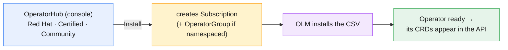

- **Console path:** *Operators → OperatorHub* → pick an Operator → choose **channel**,
  **install mode** (all/single namespace), and **approval** → Install. The console writes
  the Subscription (and OperatorGroup) for you.
- **CLI equivalent:** browse with `oc get packagemanifests -n openshift-marketplace`, then
  apply a `Subscription` (+ `OperatorGroup`) YAML.
- **Sources:** *Red Hat* (supported), *Certified* (partner), *Community* (unsupported),
  *Marketplace* (paid). Choose by support needs — mirror the catalog for disconnected
  clusters.

```bash
oc get packagemanifests -n openshift-marketplace | grep -i postgres   # find an operator
oc describe packagemanifest <name> -n openshift-marketplace           # channels + install modes
```

---

## 11. Using an Operator via Custom Resources

Once installed, an Operator adds **CRDs** to the API. You use it by creating a **Custom
Resource** — a small YAML declaring *what you want*; the Operator makes it real (Module 4's
loop).

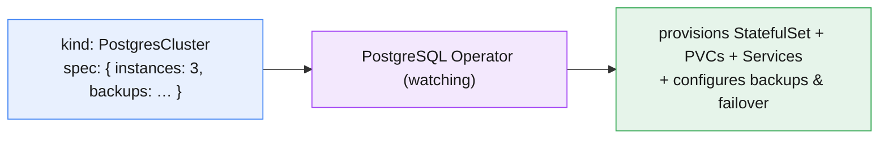

```bash
oc get crd | grep -i postgres         # CRDs the operator added
oc explain postgrescluster.spec       # field docs for the CR
oc apply -f cdr-postgres.yaml         # create a CR → operator provisions the DB
oc get postgrescluster                 # your instances, managed by the operator
```

- You write a **CR** (e.g. `kind: PostgresCluster, spec.instances: 3`), not a StatefulSet.
  The Operator translates it into the dozens of objects a production database needs — and
  keeps them healthy.
- **This is the payoff:** for the Mobily CDR store you declare "I want a 3-instance
  Postgres with nightly backups" and the Operator runs the DBA toil forever.

---

## 12. Choosing: manifests vs Helm vs Operators

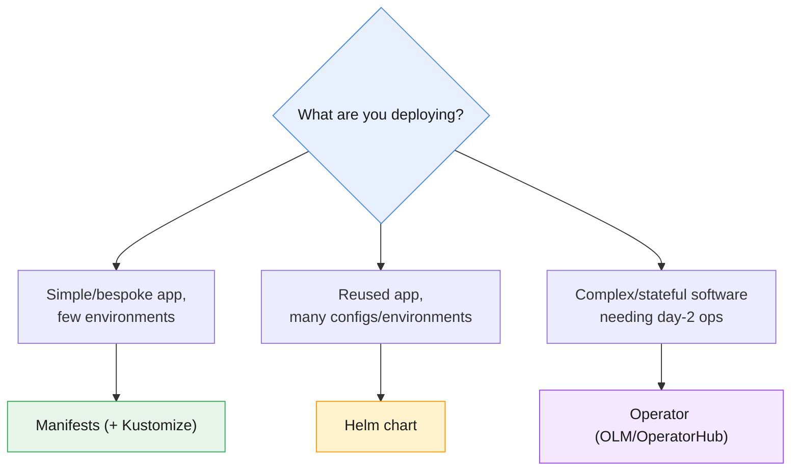

- **Manifests (+ Kustomize)** — your own stateless apps; full control; great with GitOps.
- **Helm** — you deploy the same app many ways (per env/tenant), or you're consuming a
  vendor chart; you want parameterization + release history.
- **Operators** — databases, message brokers, monitoring, anything needing *ongoing*
  operational automation. Don't hand-roll a StatefulSet for Postgres if a mature Operator
  exists.
- They **compose**: a Helm chart can deploy your app *and* a CR for an Operator-managed
  dependency; GitOps (Module 10) applies all three.

---

## 13. Key takeaways

- **Three deployment methods, increasing abstraction:** **manifests** (you write & operate
  YAML), **Helm** (template + values + releases; you still operate), **Operators** (a
  controller operates complex software for you).
- **`oc apply` is idempotent** (create-or-update) — the GitOps verb; scaffold YAML offline
  with `oc create --dry-run=client -o yaml`. **Kustomize** (`-k`) patches a base with
  per-env overlays — no templating.
- **Helm:** a **chart** (templates + `values.yaml`) installs as a named **release**.
  `helm template`/`lint` run **without a cluster**; **`--set`** overrides beat files beat
  defaults; `helm upgrade`/`rollback`/`history` give versioned lifecycle (`--atomic` for
  safety).
- **OLM** is the package manager for **Operators**: a **Subscription** (package + channel +
  Automatic/Manual approval) → **InstallPlan** → **CSV** (the installed Operator + its
  CRDs + RBAC), scoped by an **OperatorGroup**.
- **OperatorHub** is the catalog; installing writes the Subscription for you. Once ready,
  the Operator's **CRDs** appear and you deploy by creating a **Custom Resource**.
- **Choose by need:** bespoke → manifests; reused/parameterized → Helm; complex/stateful
  day-2 → Operator. They compose, and all feed GitOps (Module 10).

---

## 14. Glossary

| Term | Meaning |
|---|---|
| **Manifest** | A YAML file describing desired Kubernetes objects. |
| **`oc apply`** | Idempotent create-or-update from manifests (GitOps-friendly). |
| **Kustomize** | Built-in base+overlay patching of manifests (`oc apply -k`). |
| **Helm** | The package manager for Kubernetes (client-side in Helm 3). |
| **Chart** | A versioned, templated package of manifests + default values. |
| **values.yaml** | A chart's default parameters; overridden by `-f`/`--set`. |
| **Release** | A named installation of a chart, with revision history. |
| **`helm template`** | Render a chart to manifests locally (no cluster). |
| **`helm lint`** | Validate a chart's structure. |
| **`helm rollback`** | Revert a release to a prior revision. |
| **`--atomic`** | Auto-rollback an install/upgrade that fails. |
| **Operator** | A controller that encodes operational logic for software (CRD+CR+loop). |
| **OLM** | Operator Lifecycle Manager — installs/updates Operators. |
| **OperatorHub** | The in-console catalog of installable Operators. |
| **Subscription** | The request to install an Operator (package, channel, approval). |
| **Channel** | A version stream of an Operator (stable/fast/…). |
| **Approval (Automatic/Manual)** | Whether OLM auto-upgrades or waits for admin approval. |
| **InstallPlan** | The concrete plan OLM executes to install/upgrade an Operator. |
| **CSV (ClusterServiceVersion)** | The installed Operator's manifest (version, CRDs, RBAC, PHASE). |
| **OperatorGroup** | Defines the namespace scope an Operator watches. |
| **PackageManifest** | A catalog entry describing an available Operator (channels/modes). |
| **Custom Resource (CR)** | An instance of an Operator's CRD — how you use the Operator. |

---

## 15. References

- Understanding Operators (OLM):
  <https://docs.openshift.com/container-platform/latest/operators/understanding/olm-what-operators-are.html>
- Adding Operators to a cluster (OperatorHub):
  <https://docs.openshift.com/container-platform/latest/operators/admin/olm-adding-operators-to-cluster.html>
- Operator Lifecycle Manager concepts:
  <https://docs.openshift.com/container-platform/latest/operators/understanding/olm/olm-understanding-olm.html>
- Helm on OpenShift:
  <https://docs.openshift.com/container-platform/latest/applications/working_with_helm_charts/understanding-helm.html>
- Helm documentation (charts):
  <https://helm.sh/docs/topics/charts/>
- Declarative management with Kustomize:
  <https://kubectl.docs.kubernetes.io/references/kustomize/>
- Managing applications with `oc apply`:
  <https://docs.openshift.com/container-platform/latest/applications/deployments/what-deployments-are.html>

---

> **Companion labs:** interactive visualizations in
> [`labs/module-09/index.html`](../labs/module-09/index.html) · instructor
> [demos](../labs/module-09/demos/README.md) · hands-on
> [exercises](../labs/module-09/exercises/README.md). Delivered as **3 focused
> visualizations + 3 demos + 3 exercises** covering all four topics (Operators & OLM/
> OperatorHub · Kubernetes manifests · Helm charts/values/releases).
