# Module 10 — GitOps, CI/CD and Service Mesh

> **Course:** OpenShift Container Platform
> **Module objective:** Automate *how software gets to the cluster* and *how it talks once
> it's there*. You'll learn **GitOps** (Git as the single source of truth, reconciled by
> **OpenShift GitOps / Argo CD**), **CI/CD** (build-and-test pipelines with **Jenkins** and
> **OpenShift Pipelines / Tekton**, and the **Jenkins → GitOps** hand-off), and **Service
> Mesh** (the **sidecar** model, mTLS, and traffic management like canary releases). This is
> how Mobily ships changes safely, repeatably, and observably.

---

## Table of contents

1. [Why this module matters](#1-why-this-module-matters)
2. [GitOps principles](#2-gitops-principles)
3. [OpenShift GitOps (Argo CD) architecture](#3-openshift-gitops-argo-cd-architecture)
4. [Argo CD Applications: sync, drift & self-heal](#4-argo-cd-applications-sync-drift--self-heal)
5. [CI vs CD vs GitOps](#5-ci-vs-cd-vs-gitops)
6. [Pipelines: Jenkins & OpenShift Pipelines (Tekton)](#6-pipelines-jenkins--openshift-pipelines-tekton)
7. [The Jenkins → GitOps deployment flow](#7-the-jenkins--gitops-deployment-flow)
8. [Service Mesh fundamentals & use cases](#8-service-mesh-fundamentals--use-cases)
9. [The sidecar proxy model](#9-the-sidecar-proxy-model)
10. [Traffic management & observability](#10-traffic-management--observability)
11. [Putting it together: build → GitOps → mesh](#11-putting-it-together-build--gitops--mesh)
12. [Key takeaways](#12-key-takeaways)
13. [Glossary](#13-glossary)
14. [References](#14-references)

> **How to read the diagrams:** Diagrams are written in [Mermaid](https://mermaid.js.org/),
> which renders automatically in GitHub, VS Code (with a Mermaid extension), and most
> modern Markdown viewers. If a diagram appears as code, install/enable a Mermaid
> preview to see the rendered version.

> **CLI note (oc track).** This module is **OpenShift + `oc`**, plus **Argo CD** (console
> or `argocd`), **Tekton** (`tkn`) / Jenkins, and **Service Mesh** (Istio/OSSM). Argo CD,
> Pipelines, and Service Mesh are all installed as **Operators** (Module 9's OLM). Manifest/
> Helm/Kustomize rendering is standard Kubernetes.

> **Telecom framing.** Examples model a fictional mobile operator, *Mobily*: a `self-care`
> portal delivered by **GitOps**, a `subscriber-api` built by a **CI pipeline**, and a
> `tariff-catalog` **canary-released** through the mesh. All data is invented.

> **Builds on Module 9.** Module 9 taught the deployment *methods* (manifests, Helm,
> Operators). GitOps *applies* those from Git automatically; Argo CD/Pipelines/Mesh are
> themselves installed via **Operators** (Module 9).

> **Companion labs.** Interactive visualizations in
> [`labs/module-10/index.html`](../labs/module-10/index.html), instructor
> [demos](../labs/module-10/demos/README.md), and hands-on
> [exercises](../labs/module-10/exercises/README.md).

---

## 1. Why this module matters

Modules 1–9 got software *onto* the cluster by hand. At Mobily's scale that doesn't hold:
dozens of apps, many environments, frequent releases, auditors asking "who changed what,
when?" Three practices answer that:

- **GitOps** — the cluster's desired state lives in **Git**; a controller continuously makes
  the cluster match. Git is the audit log, the review gate, and the rollback button.
- **CI/CD** — **pipelines** build, test, and package every change automatically, then hand
  off to GitOps to deploy.
- **Service Mesh** — a transparent layer that secures (mTLS), routes (canary/blue-green),
  and observes service-to-service traffic — *without* changing app code.

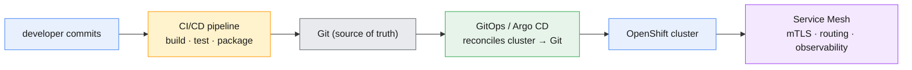

This is the capstone of *application delivery* — and it sets up Module 11 (monitoring the
result) and Module 12 (the full end-to-end capstone).

---

## 2. GitOps principles

**GitOps** is a way to do continuous delivery where **Git is the single source of truth**
for the desired state of the cluster, and an in-cluster **agent continuously reconciles**
reality to match Git.

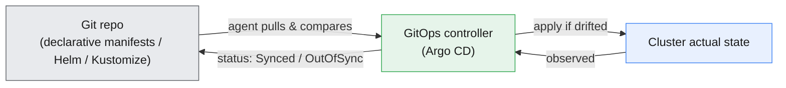

The four principles:

- **Declarative** — the whole system is described declaratively (manifests, Helm, Kustomize
  — Module 9), not imperative scripts.
- **Versioned & immutable** — that description lives in **Git**: every change is a commit,
  reviewed via pull request, and revertible (`git revert` = rollback).
- **Pulled automatically** — an **agent inside the cluster** pulls the desired state and
  applies it (pull-based), rather than a CI job pushing `oc apply` with cluster credentials.
- **Continuously reconciled** — the agent constantly compares Git vs cluster and corrects
  **drift** (someone `oc edit`s a Deployment → GitOps reverts it to match Git).

Why it's better than "CI runs `oc apply`":

| | CI push (`oc apply` from a job) | GitOps (pull) |
|---|---|---|
| Source of truth | the pipeline's moment-in-time | **Git, always** |
| Drift | undetected | **detected & corrected** |
| Cluster creds | held by CI (broad) | stay **inside** the cluster |
| Audit / rollback | pipeline logs | **git log / git revert** |

> **Mobily lens.** The `self-care` portal's manifests live in a Git repo. A merge to
> `main` is the deploy; a `git revert` is the rollback; an accidental `oc scale` is undone
> automatically. Ops changes happen through **pull requests**, not consoles.

---

## 3. OpenShift GitOps (Argo CD) architecture

**OpenShift GitOps** is Red Hat's supported **Argo CD**, installed as an **Operator**
(Module 9). Argo CD is the controller that implements the GitOps loop.

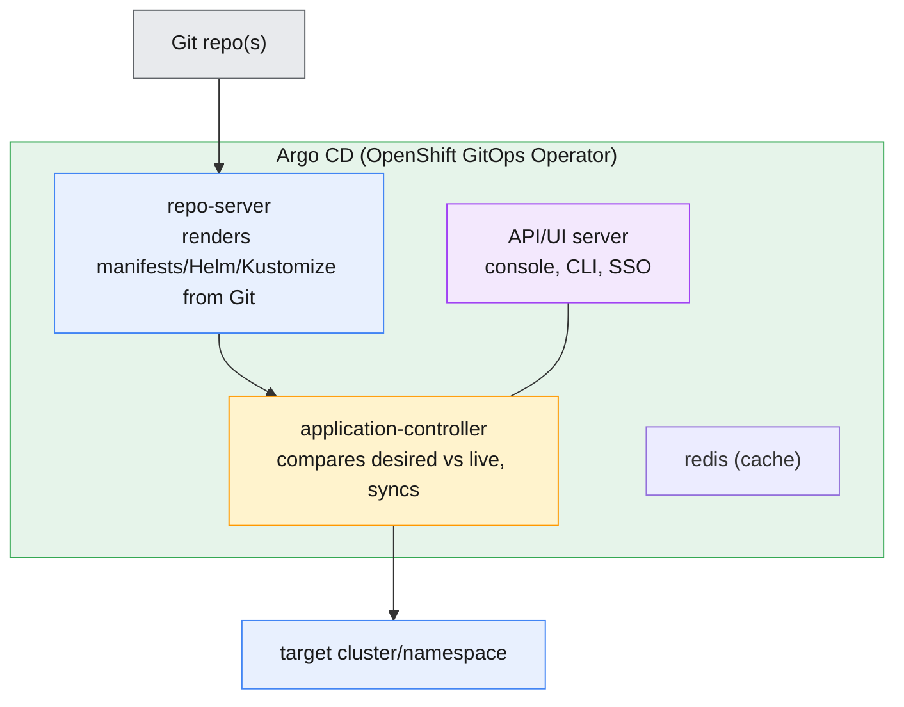

- **repo-server** — clones the Git repo and **renders** the manifests (plain YAML, Helm
  `template`, or Kustomize `build` — Module 9).
- **application-controller** — the reconcile engine: diffs the rendered desired state
  against the live cluster and **syncs**.
- **API/UI server** — the web console (a great topology/health view), CLI (`argocd`), and
  SSO integration (Module 8).
- **ApplicationSet** (advanced) — templates many Applications from one definition (per
  environment/cluster/team).

Install is via **OperatorHub** (`openshift-gitops-operator`); it creates an `openshift-gitops`
namespace with Argo CD running.

---

## 4. Argo CD Applications: sync, drift & self-heal

The core object is an **Application** — it points at a **Git repo/path/revision** (the
*source*) and a **cluster/namespace** (the *destination*), and Argo CD keeps them in sync.

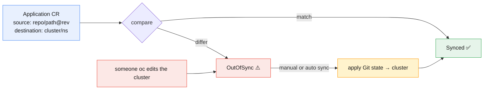

```yaml
apiVersion: argoproj.io/v1alpha1
kind: Application
metadata: { name: self-care, namespace: openshift-gitops }
spec:
  project: default
  source:
    repoURL: https://git.mobily.example/self-care.git
    targetRevision: main
    path: overlays/prod            # plain YAML, or a Helm/Kustomize dir
  destination:
    server: https://kubernetes.default.svc
    namespace: self-care-prod
  syncPolicy:
    automated: { prune: true, selfHeal: true }    # auto-sync + drift correction
```

- **Sync status:** **Synced** (cluster matches Git) or **OutOfSync** (differs) — plus a
  **Health** status (Healthy/Progressing/Degraded).
- **Manual vs automated sync:** manual = you click *Sync*; **`automated`** = Argo applies
  changes as they land in Git.
- **`selfHeal: true`** — if someone changes the cluster directly (drift), Argo reverts it to
  Git. **`prune: true`** — objects removed from Git are deleted from the cluster.
- **Rollback** = point `targetRevision` at an earlier commit, or `git revert` and let Argo
  sync.

> **⎈ Note:** the Application/AppProject CRDs are Argo CD's (`argoproj.io`), added by the
> GitOps Operator — a concrete example of Module 9's "Operator adds CRDs, you create a CR."

---

## 5. CI vs CD vs GitOps

These terms blur together — separate them cleanly:

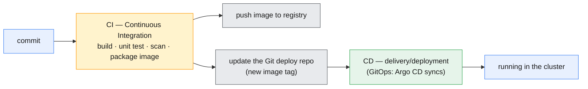

- **CI (Continuous Integration)** — on each commit: **build, test, scan, and package** a
  container image; push it to a registry. The output is a tested artifact.
- **CD (Continuous Delivery/Deployment)** — get that artifact **running** in target
  environments. **GitOps is a way to do CD**: instead of the pipeline pushing to the
  cluster, CI **updates Git** and Argo CD deploys.
- **The clean split:** **CI = code → image (a pipeline). CD/GitOps = image → running
  (Argo CD from Git).** Keeping them separate means the pipeline never holds cluster
  credentials, and every deploy is a reviewable Git change.

---

## 6. Pipelines: Jenkins & OpenShift Pipelines (Tekton)

CI runs as a **pipeline** — an ordered set of build/test/package steps. Two common choices
on OpenShift:

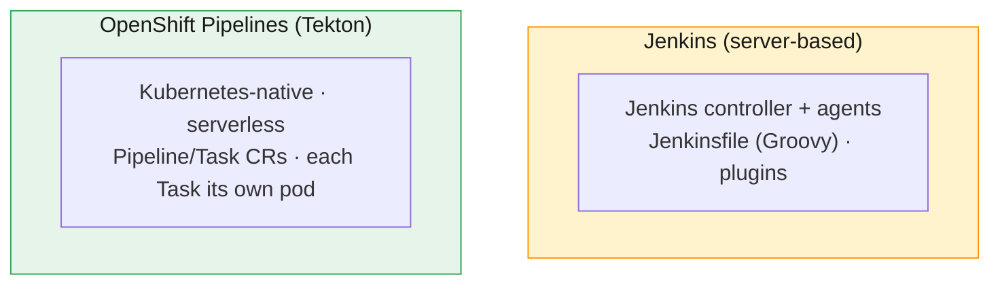

- **Jenkins** — the incumbent CI server: a **Jenkinsfile** (Groovy) defines stages
  (checkout → build → test → image → push); rich plugin ecosystem; a long-running
  controller + agents. Mobily likely already runs Jenkins.
- **OpenShift Pipelines (Tekton)** — the **Kubernetes-native**, **serverless** option:
  **Pipeline** and **Task** are CRDs; each **Task** runs as its **own pod** (its steps run
  sequentially as containers *inside* that one pod), nothing runs when idle. Installed via
  the **OpenShift Pipelines Operator**; drive with `tkn` or the console.
- **Building images in-cluster:** use **Buildah**/**S2I** (Module 1's rootless build
  lineage) as a pipeline task — no Docker daemon.
- **Choosing:** keep **Jenkins** where teams have investment/plugins; prefer **Tekton** for
  new, cloud-native, pay-per-use pipelines. Both can feed the same GitOps CD.

> **Triggers:** a Git webhook (push/PR) starts the pipeline — `EventListener`/`Trigger` in
> Tekton, or the Jenkins Git plugin.

---

## 7. The Jenkins → GitOps deployment flow

The canonical end-to-end: **CI (Jenkins) builds and tests, then updates the GitOps repo;
Argo CD deploys.** CI and CD stay separated.

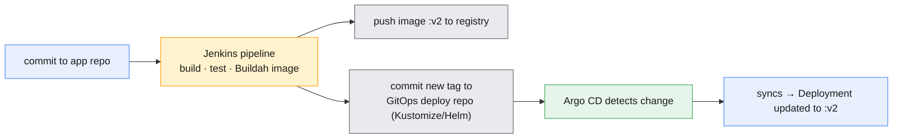

1. Developer merges a change to the **app repo**.
2. **Jenkins** (or Tekton) checks out, **builds & tests**, and builds a container **image**
   (Buildah/S2I), pushing `subscriber-api:v2` to the registry.
3. The pipeline's final stage **updates the GitOps repo** — bumps the image tag in the
   Kustomize/Helm manifests and commits (often via PR).
4. **Argo CD** sees the deploy repo change and **syncs** — the Deployment rolls to `:v2`.

- **Why the two repos?** The **app repo** (source code) and the **deploy repo** (manifests)
  are separate so deployment history is clean and auditable, and the pipeline needs **no
  cluster credentials** — it only pushes to Git.
- **Rollback** = revert the deploy-repo commit; Argo CD syncs back to the old tag.
- This is the pattern the Module 12 capstone assembles end-to-end.

---

## 8. Service Mesh fundamentals & use cases

A **Service Mesh** adds a dedicated infrastructure layer for **service-to-service**
communication — security, traffic control, and observability — *without changing
application code*. OpenShift's is **OpenShift Service Mesh (OSSM)**, based on **Istio**.

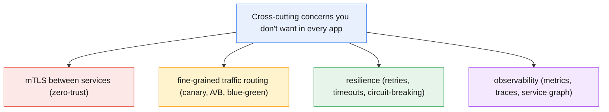

- **The problem it solves:** every microservice otherwise re-implements TLS, retries,
  routing rules, and tracing. A mesh provides these **uniformly** at the platform layer.
- **When you need it:** many microservices, zero-trust security (mTLS everywhere), advanced
  release strategies (canary), or deep traffic observability. **When you don't:** a handful
  of services — the mesh's complexity may outweigh the benefit; Routes + NetworkPolicies
  (Module 6) may suffice.
- **On OpenShift:** OSSM is installed via Operators (Service Mesh + Kiali + distributed
  tracing). **Two generations exist and shape the mesh differently:** classic **OSSM 2.x**
  defines the mesh with a `ServiceMeshControlPlane` and lists member namespaces in a
  `ServiceMeshMemberRoll`; the current **OSSM 3.x** (Sail-operator-based) drops both —
  the mesh is a plain `Istio` CR, and a namespace joins simply by carrying the
  `istio-injection: enabled` label, same as vanilla upstream Istio. Confirm which your
  cluster runs (`oc get csv -A | grep -i servicemesh`) before assuming either shape — the
  Module 10 demos/exercises are written for **3.x**.

---

## 9. The sidecar proxy model

The mesh works by injecting a **sidecar proxy** (Envoy) into every pod. The app talks to
its local proxy; the proxies form the **data plane**, configured by the **control plane**.

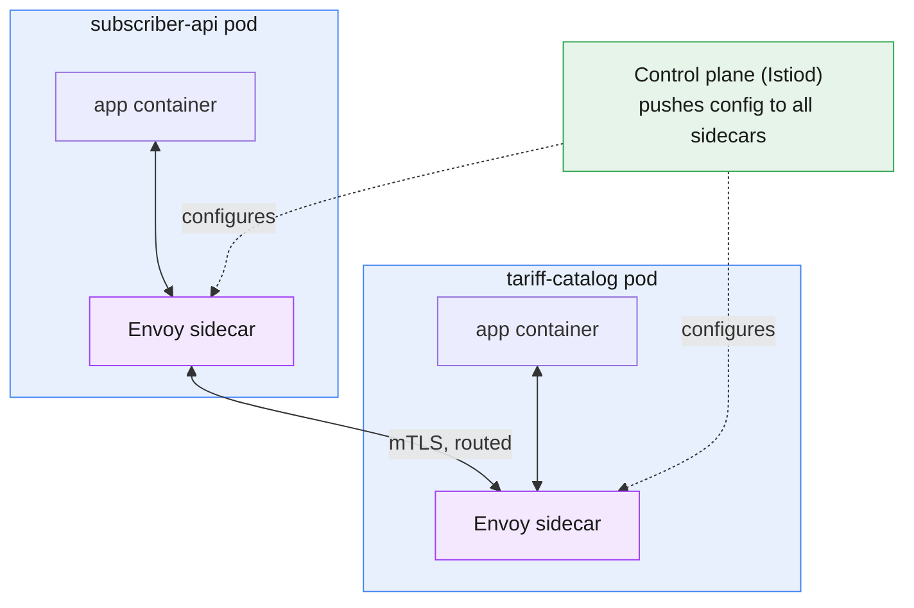

- **Data plane** — the **Envoy sidecars** in each pod. All traffic in/out of the app flows
  through its sidecar, which enforces mTLS, routing, retries, and emits telemetry. The app
  is unaware.
- **Control plane** — **Istiod** — takes your high-level intent (routing rules, mTLS
  policy) and programs every sidecar.
- **Sidecar injection** — label a namespace (`istio-injection: enabled`, OSSM 3.x/vanilla
  Istio — or annotate a pod on OSSM 2.x) and the mesh **auto-injects** the Envoy container.
  `oc get pod` then shows **2/2 READY** (app + sidecar). **Existing** pods only pick up
  injection on their next rollout — label first, then create/restart the Deployment.
- **Cost:** a proxy per pod adds memory/latency and operational complexity — the trade for
  uniform security/routing/observability.

---

## 10. Traffic management & observability

With sidecars in place, you control traffic **declaratively** — the headline feature being
progressive delivery like **canary** releases.

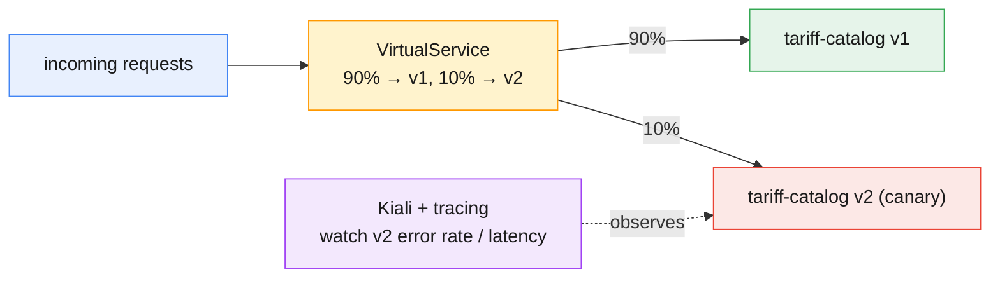

- **Routing objects:** a **VirtualService** defines routing rules (weights, header/path
  matches); a **DestinationRule** defines the **subsets** (v1/v2) and policies (load
  balancing, connection pools).
- **Canary / blue-green / A-B:** shift a small **weight** (e.g. 10%) to a new version, watch
  it, then ramp to 100% — or roll back to 0% instantly. No app change, no new Route.
- **Resilience:** timeouts, retries, and circuit-breaking configured per route.
- **Security:** a **PeerAuthentication** can require **STRICT mTLS** mesh-wide (zero-trust).
- **Observability:** **Kiali** draws the live service graph; **distributed tracing**
  (Jaeger/Tempo) follows a request across services; metrics feed Module 11's monitoring.

> **Mobily lens.** Release `tariff-catalog v2` to **10%** of subscribers, watch its error
> rate in **Kiali**, ramp to 100% over an hour — or dial back to 0% in one edit if it
> misbehaves. Safe progressive delivery, no code change.

---

## 11. Putting it together: build → GitOps → mesh

The full delivery pipeline, end to end:

```mermaid
flowchart LR
    C["commit"] --> CI["CI pipeline (Jenkins/Tekton)<br/>build · test · image :v2"]
    CI --> GIT["update GitOps repo (tag :v2)"]
    GIT --> ARGO["Argo CD syncs"]
    ARGO --> DEP["Deployment v2 (with Envoy sidecar)"]
    DEP --> MESH["mesh: canary 10% → v2, mTLS, traced"]
    MESH --> OBS["Kiali/metrics → Module 11"]
    style C fill:#e8f0fe,stroke:#4285f4,stroke-width:1px,color:#1a1a1a
    style CI fill:#fff3cd,stroke:#ff9800,stroke-width:1px,color:#1a1a1a
    style GIT fill:#e8eaed,stroke:#5f6368,stroke-width:1px,color:#1a1a1a
    style ARGO fill:#e6f4ea,stroke:#34a853,stroke-width:1px,color:#1a1a1a
    style DEP fill:#e8f0fe,stroke:#4285f4,stroke-width:1px,color:#1a1a1a
    style MESH fill:#f3e8fd,stroke:#a142f4,stroke-width:1px,color:#1a1a1a
    style OBS fill:#fce8e6,stroke:#ea4335,stroke-width:1px,color:#1a1a1a
```

Every layer of this module in one flow: **CI** produces a tested image, **GitOps** deploys
it from Git, the **mesh** releases it safely and observably. That's modern application
delivery on OpenShift — and the backbone of the Module 12 capstone.

---

## 12. Key takeaways

- **GitOps = Git as the single source of truth**, reconciled by an in-cluster agent:
  declarative, versioned, **pull-based**, continuously reconciled (drift is corrected). Beats
  "CI runs `oc apply`" on audit, drift, and credential safety.
- **OpenShift GitOps = Argo CD** (an Operator): **repo-server** renders manifests/Helm/
  Kustomize, **application-controller** syncs. The **Application** CR maps a Git source to a
  cluster/namespace; `selfHeal`+`prune` keep it honest; rollback = `git revert`.
- **CI ≠ CD.** CI builds/tests/packages an image (Jenkins or **Tekton/OpenShift Pipelines**,
  serverless CRDs, in-cluster Buildah/S2I). CD delivers it — **GitOps is the CD half**.
- **Jenkins → GitOps flow:** CI builds the image and **updates the GitOps deploy repo**;
  Argo CD syncs. Separate app/deploy repos → clean audit, no cluster creds in CI.
- **Service Mesh (OSSM/Istio)** adds mTLS, traffic management, resilience, and observability
  **without code changes**, via an **Envoy sidecar** per pod (**data plane**) programmed by
  **Istiod** (**control plane**) — pods show **2/2**.
- **Traffic management** (VirtualService + DestinationRule) enables **canary/blue-green** by
  weight; **Kiali** + tracing observe it. Use a mesh when microservice count/security/
  release-sophistication justifies its complexity.

---

## 13. Glossary

| Term | Meaning |
|---|---|
| **GitOps** | Continuous delivery with Git as the source of truth, reconciled by an in-cluster agent. |
| **Argo CD / OpenShift GitOps** | The GitOps controller (Red Hat's supported Argo CD Operator). |
| **Application (Argo)** | CR mapping a Git source (repo/path/rev) to a cluster/namespace destination. |
| **Synced / OutOfSync** | Whether the cluster matches Git. |
| **selfHeal / prune** | Auto-correct drift / delete objects removed from Git. |
| **repo-server / application-controller** | Argo components that render Git / reconcile state. |
| **ApplicationSet** | Templates many Applications from one definition. |
| **CI** | Continuous Integration — build, test, scan, package an image. |
| **CD** | Continuous Delivery/Deployment — get the artifact running (GitOps is one way). |
| **Jenkins / Jenkinsfile** | Server-based CI; pipeline defined in Groovy. |
| **OpenShift Pipelines / Tekton** | Kubernetes-native, serverless pipelines (Pipeline/Task CRDs). |
| **Task / Pipeline (Tekton)** | A step / an ordered set of steps; each runs in a pod. |
| **Trigger / EventListener** | Starts a pipeline from a Git webhook. |
| **Buildah / S2I** | In-cluster, daemonless image build (from Module 1). |
| **Service Mesh / OSSM / Istio** | Infra layer for service-to-service security/routing/observability. |
| **Sidecar (Envoy)** | Per-pod proxy carrying all app traffic (the data plane). |
| **Data plane / Control plane** | The sidecars / Istiod that configures them. |
| **Sidecar injection** | Auto-adding the Envoy container (pod shows 2/2). |
| **VirtualService** | Istio routing rules (weights, matches) for a service. |
| **DestinationRule** | Defines subsets (v1/v2) and traffic policies. |
| **PeerAuthentication** | mTLS policy (e.g. STRICT) between services. |
| **Kiali** | The mesh's service-graph / observability console. |
| **Canary / blue-green** | Progressive release strategies via traffic weighting. |
| **ServiceMeshControlPlane / MemberRoll** | OSSM **2.x** only: CRs that define the mesh / list its member namespaces. |
| **Istio (CR)** | OSSM **3.x** (Sail operator): the control-plane-defining CR, replacing SMCP — no MemberRoll; membership is a namespace label. |

---

## 14. References

- Understanding OpenShift GitOps (Argo CD):
  <https://docs.openshift.com/gitops/latest/understanding_openshift_gitops/about-redhat-openshift-gitops.html>
- Argo CD Applications:
  <https://argo-cd.readthedocs.io/en/stable/operator-manual/declarative-setup/>
- OpenShift Pipelines (Tekton):
  <https://docs.openshift.com/pipelines/latest/about/understanding-openshift-pipelines.html>
- GitOps principles (OpenGitOps):
  <https://opengitops.dev/>
- OpenShift Service Mesh (2.x docs — check the docs site's version switcher for the 3.x
  equivalent, since this module's demos/exercises target 3.x):
  <https://docs.openshift.com/container-platform/latest/service_mesh/v2x/ossm-about.html>
- Istio traffic management:
  <https://istio.io/latest/docs/concepts/traffic-management/>
- Kiali (mesh observability):
  <https://kiali.io/docs/>

---

> **Companion labs:** interactive visualizations in
> [`labs/module-10/index.html`](../labs/module-10/index.html) · instructor
> [demos](../labs/module-10/demos/README.md) · hands-on
> [exercises](../labs/module-10/exercises/README.md). Delivered as **3 focused
> visualizations + 3 demos + 3 exercises** covering all six topics (GitOps & Argo CD ·
> CI/CD pipelines & the Jenkins→GitOps flow · Service Mesh).
