# Module 11 — Monitoring, Logging and etcd Administration

> **Course:** OpenShift Container Platform
> **Module objective:** Keep the platform *healthy and observable*. You'll learn the
> **cluster monitoring** stack (**Prometheus** scraping metrics, **Alertmanager** routing
> alerts, **Grafana**/console **dashboards**), the **logging** architecture (collector →
> store → visualize, and how to **query and filter** logs), and **etcd** administration —
> its **Raft/quorum** architecture and the **health & performance** signals that tell you
> the cluster's brain is sound. This is the day-2 "are we OK, and how do we know?" module
> for Mobily's platform team.

---

## Table of contents

1. [Why this module matters](#1-why-this-module-matters)
2. [The three pillars: metrics, logs, traces](#2-the-three-pillars-metrics-logs-traces)
3. [Cluster monitoring architecture](#3-cluster-monitoring-architecture)
4. [Prometheus: scraping & the metrics data model](#4-prometheus-scraping--the-metrics-data-model)
5. [Alerting: rules, `for`, and Alertmanager](#5-alerting-rules-for-and-alertmanager)
6. [Dashboards: the console & Grafana](#6-dashboards-the-console--grafana)
7. [Monitoring your own apps (user workload monitoring)](#7-monitoring-your-own-apps-user-workload-monitoring)
8. [Logging architecture overview](#8-logging-architecture-overview)
9. [Querying & filtering platform logs](#9-querying--filtering-platform-logs)
10. [etcd architecture: Raft & quorum](#10-etcd-architecture-raft--quorum)
11. [etcd health & performance monitoring](#11-etcd-health--performance-monitoring)
12. [Putting it together: an incident walkthrough](#12-putting-it-together-an-incident-walkthrough)
13. [Key takeaways](#13-key-takeaways)
14. [Glossary](#14-glossary)
15. [References](#15-references)

> **How to read the diagrams:** Diagrams are written in [Mermaid](https://mermaid.js.org/),
> which renders automatically in GitHub, VS Code (with a Mermaid extension), and most
> modern Markdown viewers. If a diagram appears as code, install/enable a Mermaid
> preview to see the rendered version.

> **CLI note (oc track).** This module is **OpenShift + `oc`**. The monitoring stack is a
> **built-in, admin-managed** part of OpenShift (the Cluster Monitoring Operator); logging
> is an **add-on Operator** (Module 9's OLM); etcd runs as **static pods** on the control
> plane. Most *read* actions (view dashboards, query metrics/logs, check etcd health) are
> things a platform operator does daily; installs and config edits are **cluster-admin**.

> **Telecom framing.** Examples model a fictional mobile operator, *Mobily*: alerting on a
> `subscriber-api` error rate, watching `sms-gateway` memory, filtering `self-care` portal
> logs by namespace, and confirming `etcd` quorum on a 3-master control plane. All data is
> invented.

> **Builds on the whole course.** Everything you've deployed (Modules 3–10) emits metrics
> and logs; this module is how you *watch* it. Monitoring/Logging are themselves installed
> and run as **Operators** (Module 9), and etcd is the store behind every `oc get` you've
> ever run.

> **Companion labs.** Interactive visualizations in
> [`labs/module-11/index.html`](../labs/module-11/index.html), instructor
> [demos](../labs/module-11/demos/README.md), and hands-on
> [exercises](../labs/module-11/exercises/README.md).

---

## 1. Why this module matters

Everything up to now was about *getting software onto the cluster and shaping how it runs*.
This module is about the opposite direction of information flow: **the cluster telling you
how it's doing.** At 3 a.m., when a Mobily customer can't top up their balance, three
questions decide how fast you recover:

1. **Is something wrong, and did we find out before the customer did?** → *alerting*
2. **What is the symptom, quantitatively, and when did it start?** → *metrics / dashboards*
3. **Why — what did the failing component actually say?** → *logs*

And underneath all of it sits one question that, if answered wrong, makes the whole cluster
unavailable: **is etcd healthy?** etcd is the single source of truth for every object in the
cluster; if it loses **quorum** or gets slow, the API server stumbles and *nothing* you've
learned in Modules 1–10 works.

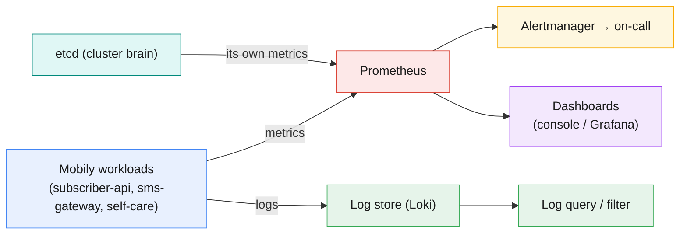

The good news: **OpenShift ships a complete, opinionated monitoring stack out of the box** —
you don't install Prometheus, you *use* it. Logging is a one-Operator add-on. etcd is
already running; you just need to know how to read its vital signs.

---

## 2. The three pillars: metrics, logs, traces

Observability is usually described as three complementary data types. This module focuses on
the first two (OpenShift's built-ins); tracing (Module 10's Kiali/Jaeger) is the third.

| Pillar | Question it answers | Shape of the data | OpenShift tool |
|--------|--------------------|-------------------|----------------|
| **Metrics** | *How much / how fast / how many?* | Numbers over time (time series) | **Prometheus** (built-in) |
| **Logs** | *What exactly happened, in words?* | Timestamped text lines | **Loki** + collector (add-on) |
| **Traces** | *Where did this one request spend its time?* | Spans across services | **Jaeger / Tempo** (mesh) |

The mental model: **metrics tell you *that* something is wrong and *roughly where*; logs
tell you *why*.** You alert on metrics (they're cheap and numeric), then pivot to logs of the
implicated component to read the actual error. Getting this division of labour right is the
single biggest lever on how fast you resolve incidents.

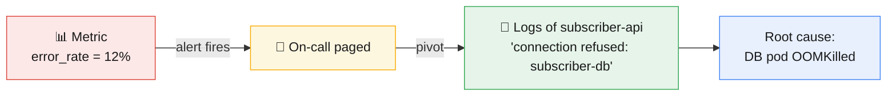

---

## 3. Cluster monitoring architecture

OpenShift's monitoring is managed by the **Cluster Monitoring Operator (CMO)**. You never run
`helm install prometheus`; the CMO deploys and continuously reconciles the whole stack in the
`openshift-monitoring` namespace. There are actually **two** monitoring stacks:

- **Platform monitoring** (`openshift-monitoring`) — watches OpenShift itself: nodes, the API
  server, etcd, operators, kubelet. **Admin-owned; you don't edit its rules.**
- **User workload monitoring** (`openshift-user-workload-monitoring`) — an *opt-in* second
  Prometheus for **your** application metrics and alerts (see §7).

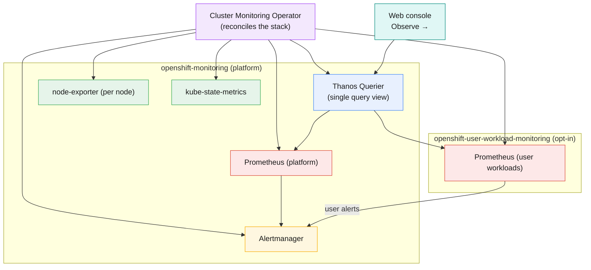

Key supporting components:

- **node-exporter** — a DaemonSet that exposes each node's CPU/memory/disk/network metrics.
- **kube-state-metrics** — turns Kubernetes object state (deployments, pods, PVCs) into
  metrics like `kube_pod_status_phase`.
- **Thanos Querier** — a single endpoint that queries *both* Prometheus instances, so the
  console's **Observe** view shows platform and user metrics together.

You configure platform monitoring (retention, storage, resources) through **one ConfigMap**:
`cluster-monitoring-config` in `openshift-monitoring`. You enable user workload monitoring by
flipping `enableUserWorkload: true` in that same ConfigMap.

---

## 4. Prometheus: scraping & the metrics data model

Prometheus is a **pull-based** metrics system: it periodically **scrapes** an HTTP `/metrics`
endpoint on each target and stores what it finds as **time series**. This "pull" model is the
opposite of push-based systems, and it matters: Prometheus decides *who* to scrape and *how
often*, so a flood of app instances can't overwhelm it, and a target that goes silent is
itself a signal (`up == 0`).

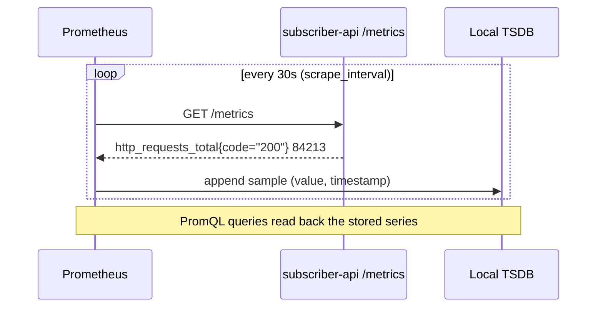

**The data model.** Every metric is a named time series identified by its **labels**:

```
http_requests_total{job="subscriber-api", code="500", instance="10.128.2.14:8080"}
└──── metric name ───┘└──────────────────── labels (key/value) ────────────────────┘
```

The **four metric types** you'll meet:

| Type | Meaning | Example | Typical query |
|------|---------|---------|---------------|
| **Counter** | Only goes up (resets on restart) | `http_requests_total` | `rate(...[5m])` → per-second rate |
| **Gauge** | Goes up and down | `container_memory_working_set_bytes` | value directly, `max_over_time` |
| **Histogram** | Bucketed observations | `http_request_duration_seconds_bucket` | `histogram_quantile(0.99, ...)` |
| **Summary** | Pre-computed quantiles | `..._sum` / `..._count` | `rate(sum)/rate(count)` = avg |

**PromQL in one breath.** You rarely read a raw counter — you read *rates* and *aggregations*:

```promql
# per-second request rate for subscriber-api, summed across all pods
sum(rate(http_requests_total{job="subscriber-api"}[5m]))

# 5xx error ratio (the classic SLO alert expression)
sum(rate(http_requests_total{job="subscriber-api", code=~"5.."}[5m]))
  / sum(rate(http_requests_total{job="subscriber-api"}[5m]))

# is the target even being scraped?
up{job="subscriber-api"}
```

`rate(counter[5m])` = average per-second increase over the last 5 minutes; `sum(...)`
collapses the per-pod series into one number; `code=~"5.."` is a regex label match. These
three moves cover most day-to-day queries.

---

## 5. Alerting: rules, `for`, and Alertmanager

A metric on a graph doesn't wake anyone up. An **alerting rule** does. A rule is a PromQL
expression plus a duration: *"if this expression is true continuously for `for:`, fire an
alert."* The `for:` clause is what separates a real incident from a one-scrape blip.

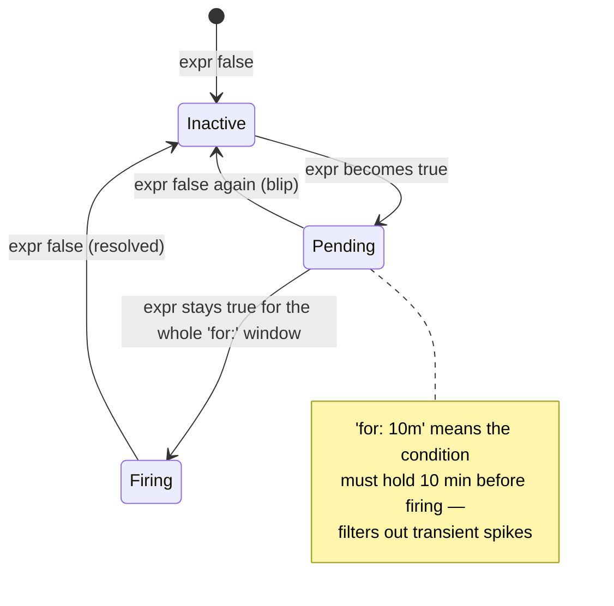

A **PrometheusRule** custom resource holds your alerts (this is exactly what you author in
the demo/exercise):

```yaml
apiVersion: monitoring.coreos.com/v1
kind: PrometheusRule
metadata:
  name: subscriber-api-alerts
  namespace: mobily-apps            # a user namespace (needs user workload monitoring)
spec:
  groups:
    - name: subscriber-api.rules
      rules:
        - alert: SubscriberAPIHighErrorRate
          expr: |
            sum(rate(http_requests_total{job="subscriber-api", code=~"5.."}[5m]))
              / sum(rate(http_requests_total{job="subscriber-api"}[5m])) > 0.05
          for: 10m                  # must hold 10 minutes before firing
          labels:
            severity: warning       # drives routing in Alertmanager
          annotations:
            summary: "subscriber-api 5xx error rate above 5% for 10 minutes"
```

**Alertmanager** takes firing alerts from Prometheus and decides **what to do with them** —
it is *not* the thing that evaluates the expression (Prometheus does that). Alertmanager
handles the human-facing concerns:

- **Grouping** — bundle related alerts (all `subscriber-api` alerts) into one notification.
- **Routing** — send `severity: critical` to PagerDuty, `warning` to Slack, by label.
- **Inhibition** — if "cluster down" fires, suppress the 200 downstream "pod unreachable"
  alerts it would cause.
- **Silencing** — mute known/maintenance alerts for a window.

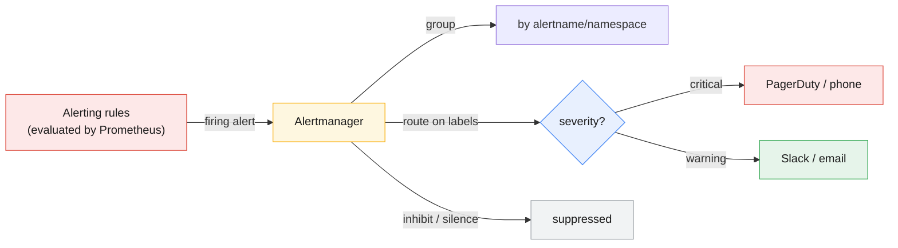

You browse firing/pending alerts in the console under **Observe → Alerting**, or via
`oc get prometheusrule` and the Thanos/Prometheus API.

---

## 6. Dashboards: the console & Grafana

A **dashboard** is a saved set of PromQL queries drawn as graphs. OpenShift gives you
dashboards at two levels:

- **Built-in console dashboards** — **Observe → Dashboards** ships curated views (etcd,
  API server, cluster resources, per-namespace compute). **Observe → Metrics** lets you run
  ad-hoc PromQL and graph it. For most operators this is enough and needs no setup.
- **Grafana** — the classic dashboarding tool. OpenShift's *platform* Grafana is read-only
  and locked down; for custom, editable dashboards you deploy your own Grafana (often via the
  **community Grafana Operator**) pointed at Thanos Querier as a datasource.

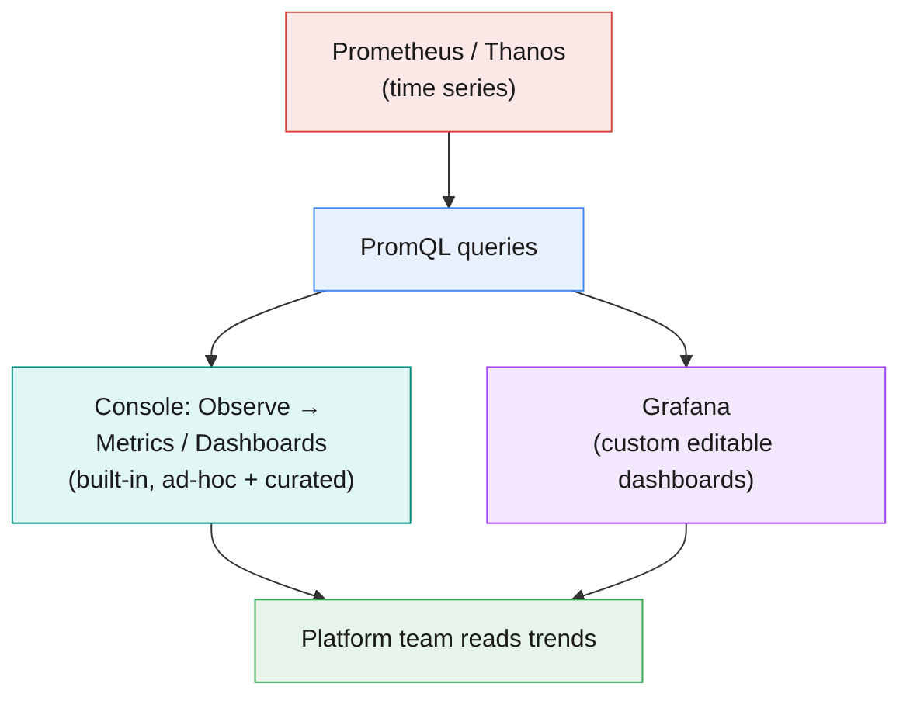

**Guidance:** reach for the built-in console dashboards first — they're maintained by Red Hat
and always match your cluster version. Stand up your own Grafana only when you need
*editable*, team-specific dashboards (e.g. a Mobily NOC wallboard combining `subscriber-api`
latency, `sms-gateway` throughput, and node saturation on one screen).

---

## 7. Monitoring your own apps (user workload monitoring)

Platform monitoring watches OpenShift; it does **not** scrape your apps by default. To alert
on `subscriber-api`'s error rate, you enable **user workload monitoring** and tell Prometheus
where your app's `/metrics` endpoint is with a **ServiceMonitor**.

Three moves:

1. **Admin enables it once** — set `enableUserWorkload: true` in `cluster-monitoring-config`.
   This spins up the second Prometheus in `openshift-user-workload-monitoring`.
2. **Your app exposes `/metrics`** — instrument it (Prometheus client library) so it serves
   metrics like `http_requests_total` on a port behind a Service.
3. **You add a ServiceMonitor** — a CR that says "scrape the Service with label `app:
   subscriber-api` on port `web`, path `/metrics`, every 30s." Now *your* metrics flow, and
   you can write **PrometheusRules** (§5) in *your* namespace.

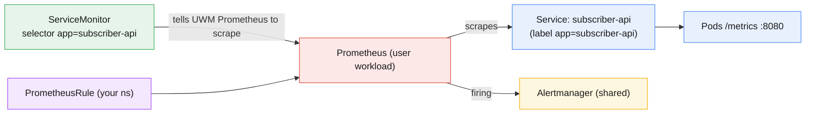

This is the boundary that matters for RBAC: enabling UWM is **admin**, but once it's on, a
project user can create **ServiceMonitors** and **PrometheusRules** in their own namespace and
own their app's alerting — no cluster-admin needed.

---

## 8. Logging architecture overview

Metrics are numbers; **logs are the words**. OpenShift's logging is an **add-on** (the
**Red Hat OpenShift Logging** Operator + the **Loki Operator**), following a classic
three-stage pipeline: **collect → store → visualize**.

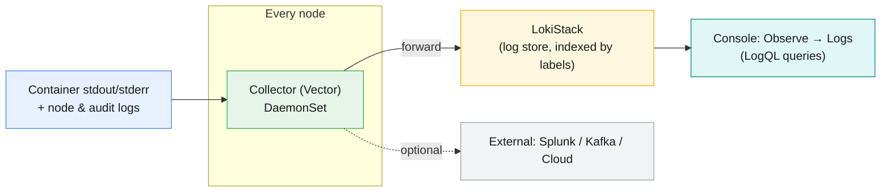

**Collector — Vector.** A DaemonSet on every node reads each container's stdout/stderr (plus
node and audit logs), enriches lines with Kubernetes metadata (namespace, pod, container),
and forwards them. (Vector is the current collector; older docs mention Fluentd.)

**Store — LokiStack.** **Loki** is "Prometheus for logs": instead of full-text indexing every
word (expensive, like Elasticsearch), it indexes only a small set of **labels**
(namespace, pod, log type) and stores the raw log lines in object storage. Cheap to run,
fast to filter by label.

**The three log types** — logging separates streams so RBAC and retention can differ:

| Log type | What it contains | Who typically reads it |
|----------|------------------|------------------------|
| **application** | Your workloads' container stdout/stderr | Developers / app teams |
| **infrastructure** | Node logs + `openshift-*`/`kube-*` namespace pods | Platform / SRE |
| **audit** | Who did what via the API server (security trail) | Security / compliance |

**Routing — ClusterLogForwarder.** A CR that says "send *these* log types to *these*
outputs." The default sends all three to the in-cluster LokiStack; you can additionally fan
`audit` logs out to a SIEM, or ship `application` logs to Splunk, without touching the apps.

---

## 9. Querying & filtering platform logs

Because Loki indexes by label, you query logs with **LogQL** — deliberately close to PromQL.
A LogQL query has two parts: a **stream selector** (labels, in `{}`) that narrows *which*
streams, then optional **line filters** (`|=`, `!=`, `|~`) that grep *within* them.

```logql
# all self-care portal logs (stream selector only)
{ kubernetes_namespace_name="self-care" }

# self-care errors only — selector + line filter
{ kubernetes_namespace_name="self-care" } |= "ERROR"

# subscriber-api 5xx, excluding health-check noise, last hits
{ kubernetes_namespace_name="mobily-apps", kubernetes_container_name="subscriber-api" }
  |= "HTTP 5" != "/healthz"

# regex line filter: any timeout/refused connection
{ kubernetes_namespace_name="mobily-apps" } |~ "timeout|connection refused"
```

```mermaid
flowchart LR
  ALL["All log streams in Loki"] -->|stream selector<br/>{namespace=self-care}| S1["self-care streams"]
  S1 -->|line filter<br/>|= ERROR| S2["only lines containing ERROR"]
  S2 -->|line filter<br/>!= /healthz| S3["…minus health-check noise"]
  S3 --> OUT["Result rows (console / CLI)"]
  style ALL fill:#f1f3f4,stroke:#9aa0a6,stroke-width:1px,color:#1a1a1a
  style S1 fill:#e8f0fe,stroke:#4285f4,stroke-width:1px,color:#1a1a1a
  style S2 fill:#fef7e0,stroke:#f9ab00,stroke-width:1px,color:#1a1a1a
  style S3 fill:#e6f4ea,stroke:#34a853,stroke-width:1px,color:#1a1a1a
  style OUT fill:#e0f7f5,stroke:#00897b,stroke-width:1px,color:#1a1a1a
```

Where you run it:

- **Console → Observe → Logs** — pick a namespace, type a LogQL filter, scope the time range.
  This is the everyday path and respects your RBAC (you see logs for namespaces you can read).
- **`oc logs`** — the *unindexed* fallback: `oc logs deploy/subscriber-api -n mobily-apps`
  reads one pod's current log directly from the node (no store, no history after the pod
  dies). Great for "right now," useless for "what happened last Tuesday" — that's what Loki
  is for.

**Filter first, then read.** The discipline is identical to metrics: narrow by label
(namespace/container) *before* you grep for text, so you're searching kilobytes, not
terabytes.

---

## 10. etcd architecture: Raft & quorum

Every object you've ever created — Deployments, Routes, Secrets, the very RBAC that let you
create them — lives in **etcd**, a distributed key-value store. The API server is the only
thing that talks to etcd; etcd is the cluster's **brain and single source of truth**. If it's
unhealthy, the cluster is unhealthy, full stop. So a platform operator must be able to read
its vital signs.

etcd runs as **static pods** on the control-plane (master) nodes — one etcd member per master,
so a standard cluster has **three** members. They stay consistent using the **Raft** consensus
algorithm: one member is the **leader** (handles all writes), the others are **followers**;
every write must be acknowledged by a **majority** before it's committed.

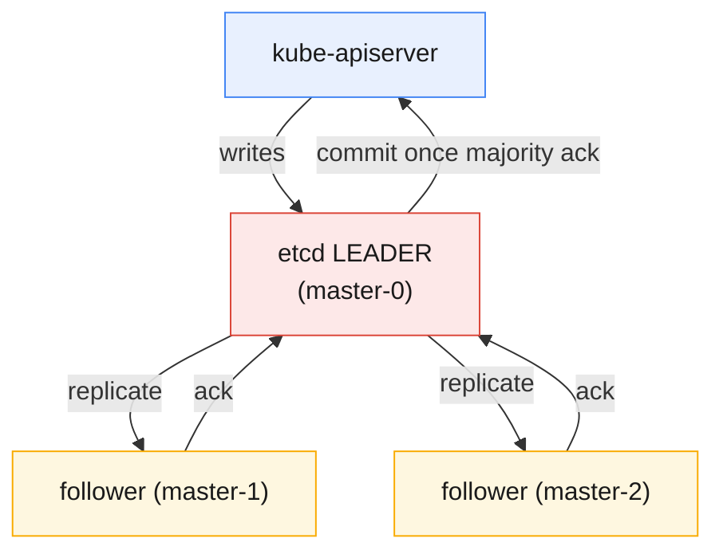

**Quorum** is the concept that governs everything. Quorum = a **majority** of members
(`floor(N/2) + 1`). With writes needing majority agreement, the cluster survives losing a
**minority** but freezes if it loses a majority:

| Members | Quorum needed | Can lose | If you lose more |
|---------|---------------|----------|------------------|
| **1** | 1 | 0 | any loss = down (dev only) |
| **3** | 2 | **1** | 2 lost → read-only/unavailable |
| **5** | 3 | **2** | 3 lost → unavailable |

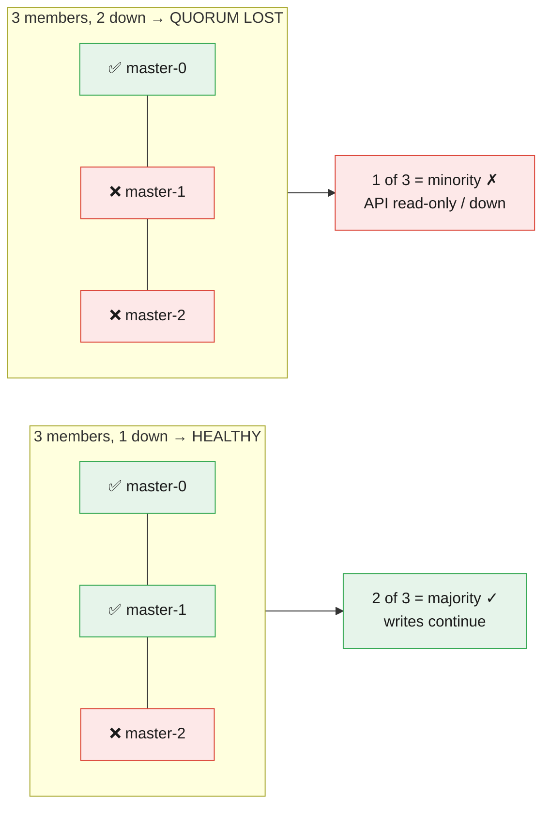

This is *why* control planes have **3 (or 5) masters, always an odd number**: odd counts give
the best fault tolerance per node (4 members tolerate the same 1 failure as 3, but cost more
and make quorum harder). It's also why a **stopped-then-restarted cluster** can be fragile —
if members come back at different times, quorum is briefly lost until a majority is up.

---

## 11. etcd health & performance monitoring

Two questions: **is etcd healthy (quorum + members up)?** and **is etcd *fast enough*?** —
because a slow etcd degrades the whole API even while technically "healthy."

**Health — members & quorum.** etcd exposes `etcdctl endpoint health/status` (run inside an
etcd pod), and OpenShift surfaces it through the **etcd Operator** and ships alerts.

```bash
# from inside an etcd static pod (see the demo for the exact rsh)
etcdctl endpoint health --cluster        # each endpoint: healthy + response time
etcdctl endpoint status --write-out=table # leader flag, DB size, raft term per member
```

**Performance — the two signals that matter most.** etcd's speed is dominated by **disk** and
**network**, and Prometheus tracks both:

| Metric | What it measures | Why it matters | Healthy-ish |
|--------|------------------|----------------|-------------|
| `etcd_disk_wal_fsync_duration_seconds` (p99) | Time to fsync the write-ahead log to disk | etcd commits nothing until fsync returns → **disk latency is etcd latency** | p99 < ~10 ms |
| `etcd_disk_backend_commit_duration_seconds` (p99) | Time to commit to the backend DB | Backend write speed | p99 < ~25 ms |
| `etcd_network_peer_round_trip_time_seconds` (p99) | Leader↔follower RTT | Slow network stalls Raft consensus | low, stable |
| `etcd_server_leader_changes_seen_total` | Leader elections | Frequent changes = instability (I/O starvation, network flaps) | rare |
| `etcd_mvcc_db_total_size_in_bytes` | DB on-disk size | Grows with churn; big DB slows everything | watch vs quota (default 8 GiB) |

**The golden rule: etcd wants fast, low-latency disks.** The single most common cause of a
sick cluster is putting etcd on slow storage — high `fsync` latency causes leader elections,
which cause API timeouts, which cause cascading alerts. OpenShift ships alerts like
`etcdHighFsyncDurations` and `etcdMembersDown` in platform monitoring so you're told before it
gets bad.

**Defragmentation.** etcd keeps historical revisions; after heavy churn the DB file can be
larger on disk than the live data ("fragmentation"). etcd **auto-compacts** history and
**auto-defragments** in modern OpenShift, but a very large, fragmented DB may need attention —
you watch `db_total_size` vs the quota and, if needed, defrag (a maintenance action) to
reclaim space.

```mermaid
flowchart LR
  DISK["Slow disk<br/>(high fsync latency)"] --> LE["Leader elections<br/>(leader can't keep up)"]
  LE --> STALL["Raft stalls → API timeouts"]
  STALL --> ALERTS["Cascading alerts /<br/>cluster feels 'slow'"]
  ALERTS -.fix.-> FAST["Fast local SSD/NVMe<br/>for etcd"]
  FAST -.->|p99 fsync < 10ms| HEALTHY["Stable leader, healthy API"]
  style DISK fill:#fde8e8,stroke:#db4437,stroke-width:1px,color:#1a1a1a
  style LE fill:#fef7e0,stroke:#f9ab00,stroke-width:1px,color:#1a1a1a
  style STALL fill:#fef7e0,stroke:#f9ab00,stroke-width:1px,color:#1a1a1a
  style ALERTS fill:#fde8e8,stroke:#db4437,stroke-width:1px,color:#1a1a1a
  style FAST fill:#e6f4ea,stroke:#34a853,stroke-width:1px,color:#1a1a1a
  style HEALTHY fill:#e6f4ea,stroke:#34a853,stroke-width:1px,color:#1a1a1a
```

> **Backup** — the other half of etcd administration (`cluster-backup.sh`, snapshot save,
> disaster recovery) is **Module 12's** territory. Here we only *watch* etcd; there we *back
> it up and restore it*.

---

## 12. Putting it together: an incident walkthrough

One thread pulling metrics, alerts, logs, and etcd into a single Mobily story:

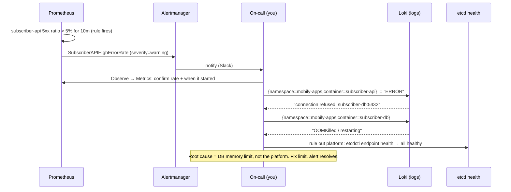

The takeaway: **alert on metrics, diagnose in logs, and always be able to rule etcd in or
out.** That loop — and the tools that make each step fast — is the whole point of this module.

---

## 13. Key takeaways

- **OpenShift ships monitoring built-in.** The Cluster Monitoring Operator runs Prometheus,
  Alertmanager, and Thanos in `openshift-monitoring`; you *use* it, you don't install it.
- **Metrics vs logs division of labour.** Alert on metrics (cheap numbers); pivot to logs
  (words) for the *why*. Traces are the third pillar (Module 10's mesh).
- **Prometheus pulls.** It scrapes `/metrics` endpoints into labelled time series; PromQL's
  `rate()`, `sum()`, and regex label matches cover most queries; `up` tells you if a target
  is even reachable.
- **Alerts = expression + `for:`.** The `for:` window filters blips; **Prometheus evaluates**,
  **Alertmanager routes/groups/silences**. Your alerts live in **PrometheusRule** CRs.
- **Your apps need opt-in.** Enable **user workload monitoring** (admin, once), add a
  **ServiceMonitor** (user) to scrape your app, then own your **PrometheusRules**.
- **Logging is collect → store → visualize.** Vector collects, **LokiStack** stores (indexed
  by labels, cheap), console/LogQL queries. Three log types: **application / infrastructure /
  audit**, routed by **ClusterLogForwarder**.
- **LogQL = select then filter.** Narrow by labels `{namespace=…}` first, then grep lines with
  `|=` / `!=` / `|~`. `oc logs` is the live, unstored fallback.
- **etcd is the cluster's brain.** 3 (odd) members, **Raft** consensus, writes need a
  **majority** — lose a minority and survive, lose a majority and lose the cluster
  (**quorum**).
- **etcd health *and* speed.** Check members/quorum (`etcdctl endpoint health/status`); watch
  **fsync/backend commit latency** and **leader changes** — etcd demands **fast disks**.
- **Backup/restore is Module 12.** Here you *watch* etcd; there you protect it.

---

## 14. Glossary

| Term | Meaning |
|------|---------|
| **Cluster Monitoring Operator (CMO)** | Operator that deploys/reconciles the built-in monitoring stack. |
| **Prometheus** | Pull-based metrics store; scrapes `/metrics`, stores time series, evaluates rules. |
| **Time series** | A metric name + label set, sampled over time (`http_requests_total{code="500"}`). |
| **Counter / Gauge / Histogram / Summary** | The four Prometheus metric types (up-only / up-down / bucketed / quantile). |
| **PromQL** | Prometheus query language (`rate()`, `sum()`, `histogram_quantile()`). |
| **`rate(x[5m])`** | Average per-second increase of a counter over 5 minutes. |
| **`up`** | Built-in metric: 1 if a target was scraped successfully, 0 if not. |
| **Alerting rule** | PromQL expression + `for:` duration that fires an alert. |
| **`for:`** | How long the expression must stay true before the alert fires (blip filter). |
| **PrometheusRule** | CR holding alerting/recording rules. |
| **Alertmanager** | Groups, routes, inhibits, and silences firing alerts → notifications. |
| **Thanos Querier** | Single query endpoint over platform + user Prometheus. |
| **node-exporter / kube-state-metrics** | Node hardware metrics / Kubernetes object-state metrics. |
| **User workload monitoring (UWM)** | Opt-in second Prometheus for user apps. |
| **ServiceMonitor** | CR telling Prometheus which Service/port/path to scrape. |
| **Dashboard** | Saved PromQL queries drawn as graphs (console **Observe** or Grafana). |
| **Vector** | The current log **collector** DaemonSet (formerly Fluentd). |
| **Loki / LokiStack** | Log **store** that indexes by labels (not full text); the CR is LokiStack. |
| **LogQL** | Loki's query language: stream selector `{}` + line filters `|=` `!=` `|~`. |
| **Log types** | **application / infrastructure / audit** — separated streams. |
| **ClusterLogForwarder** | CR routing log types to outputs (LokiStack, Splunk, Kafka…). |
| **etcd** | Distributed key-value store; the cluster's single source of truth. |
| **Raft** | Consensus algorithm etcd uses (leader + followers, majority commit). |
| **Quorum** | Majority of members (`floor(N/2)+1`) needed to accept writes. |
| **Leader / follower** | The etcd member handling writes / the replicas that ack them. |
| **fsync latency** | Time to flush etcd's write-ahead log to disk — etcd's dominant cost. |
| **Defragmentation** | Reclaiming on-disk space after history compaction. |

---

## 15. References

- OpenShift monitoring overview:
  <https://docs.openshift.com/container-platform/latest/observability/monitoring/monitoring-overview.html>
- Enabling monitoring for user-defined projects:
  <https://docs.openshift.com/container-platform/latest/observability/monitoring/enabling-monitoring-for-user-defined-projects.html>
- Managing alerts (PrometheusRule / Alertmanager):
  <https://docs.openshift.com/container-platform/latest/observability/monitoring/managing-alerts.html>
- PromQL basics (Prometheus docs):
  <https://prometheus.io/docs/prometheus/latest/querying/basics/>
- OpenShift Logging (about + LokiStack):
  <https://docs.openshift.com/container-platform/latest/observability/logging/logging-6.1/log6x-about.html>
- LogQL (Grafana Loki):
  <https://grafana.com/docs/loki/latest/query/>
- etcd Raft / consensus:
  <https://etcd.io/docs/latest/learning/why/>
- Backing up and restoring etcd (Module 12 territory):
  <https://docs.openshift.com/container-platform/latest/backup_and_restore/control_plane_backup_and_restore/backing-up-etcd.html>

---

> **Companion labs:** interactive visualizations in
> [`labs/module-11/index.html`](../labs/module-11/index.html) · instructor
> [demos](../labs/module-11/demos/README.md) · hands-on
> [exercises](../labs/module-11/exercises/README.md). Delivered as **3 focused
> visualizations + 3 demos + 3 exercises** covering all five topics (monitoring architecture
> · Prometheus & Alertmanager · Grafana/console dashboards · logging architecture & querying
> · etcd architecture, health & performance).
