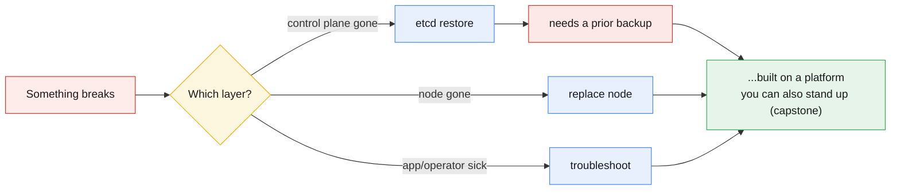
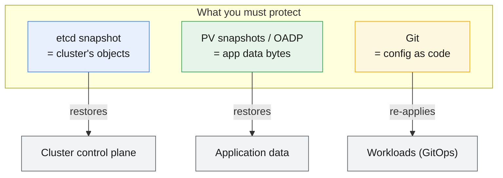
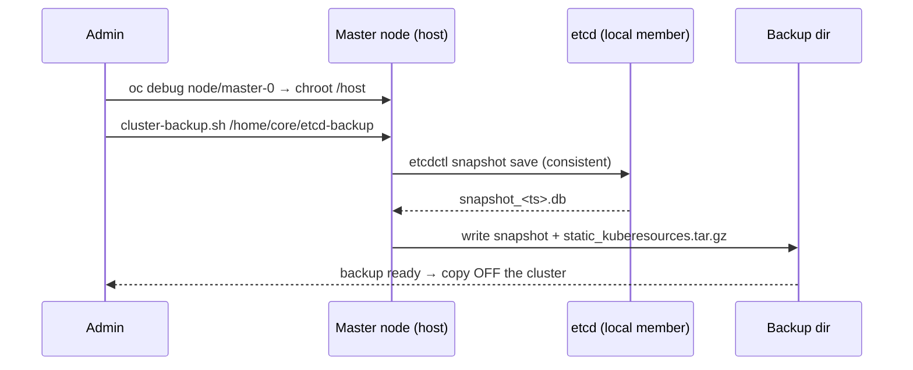
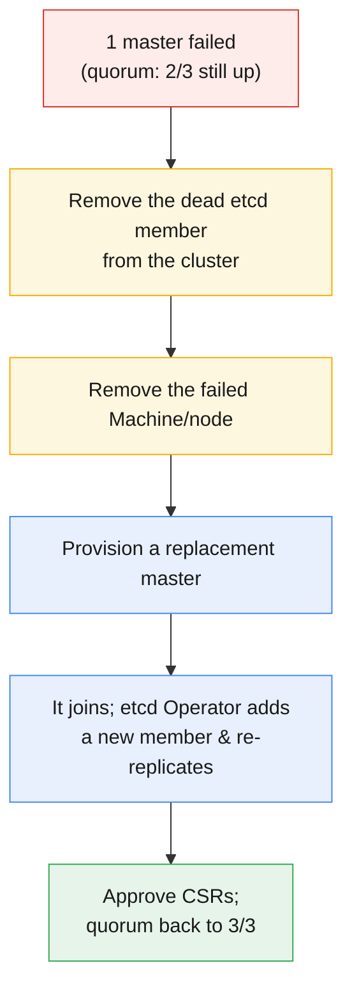
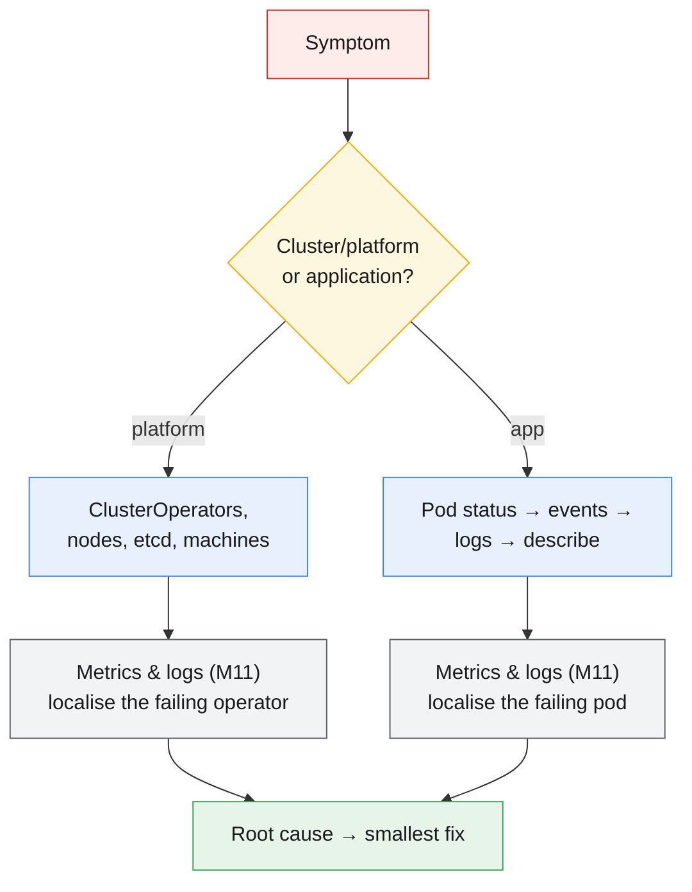
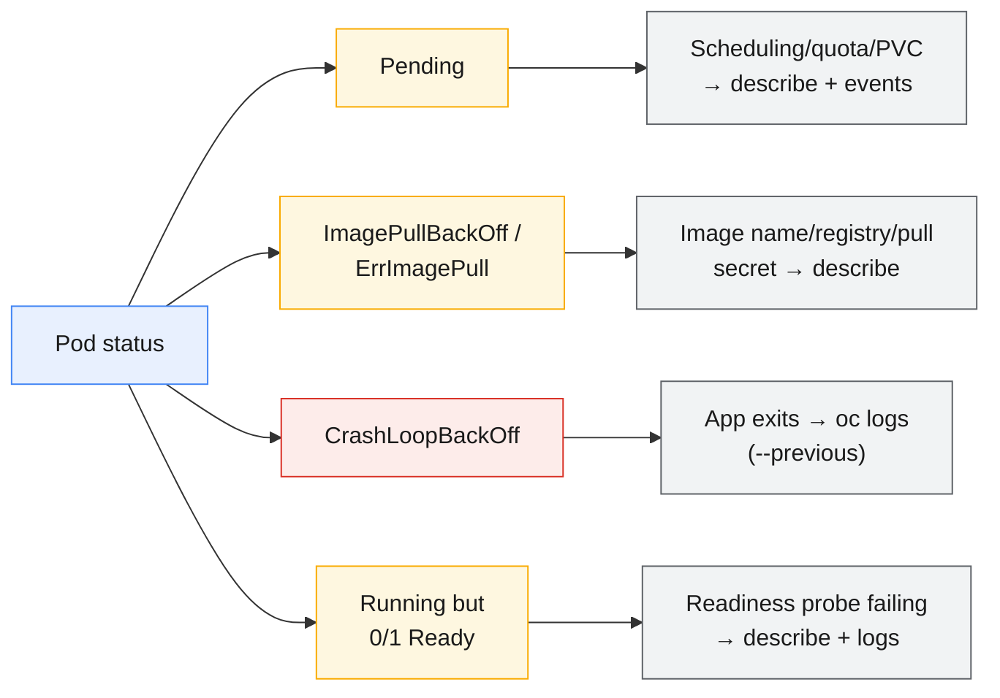
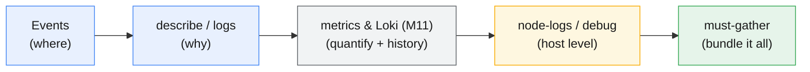
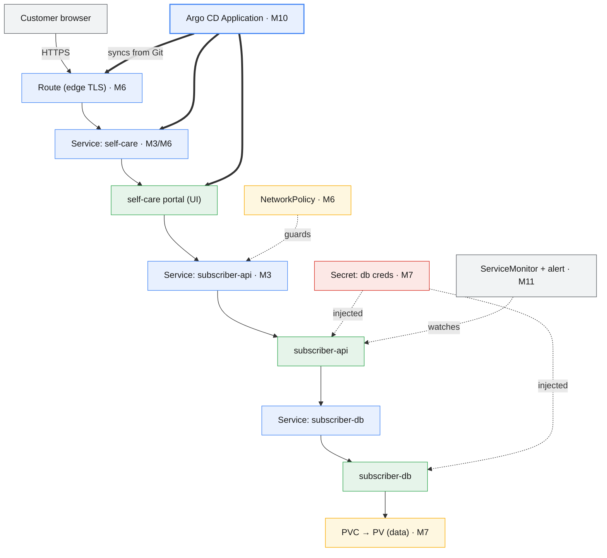

# Module 12 — Backup, Recovery, Troubleshooting and Capstone

> **Course:** OpenShift Container Platform
> **Module objective:** Keep the platform *survivable and diagnosable*, then prove you can
> build on it end to end. You'll learn **etcd backup & restore** (the one backup that can
> resurrect a dead control plane), the **node lifecycle** (replacing a failed worker, and
> what control-plane replacement involves), a repeatable **troubleshooting methodology** for
> both **cluster/platform** and **application** faults, and finally a **capstone** that wires
> together everything from Modules 3–11 — Route, PVC, Secret, and a GitOps-managed pipeline —
> into one running multi-tier service. This is the day-2 "when it breaks, and when you have to
> rebuild it" module for Mobily's platform team.

---

## Table of contents

1. [Why this module matters](#1-why-this-module-matters)
2. [Backup strategy: what actually needs backing up](#2-backup-strategy-what-actually-needs-backing-up)
3. [etcd backup: taking the snapshot](#3-etcd-backup-taking-the-snapshot)
4. [etcd restore: bringing a cluster back from the dead](#4-etcd-restore-bringing-a-cluster-back-from-the-dead)
5. [Node lifecycle: replacing a failed worker](#5-node-lifecycle-replacing-a-failed-worker)
6. [Control-plane replacement (overview)](#6-control-plane-replacement-overview)
7. [A troubleshooting methodology](#7-a-troubleshooting-methodology)
8. [Cluster & platform troubleshooting](#8-cluster--platform-troubleshooting)
9. [Application troubleshooting](#9-application-troubleshooting)
10. [must-gather & the diagnostic toolbox](#10-must-gather--the-diagnostic-toolbox)
11. [The capstone: an end-to-end deployment](#11-the-capstone-an-end-to-end-deployment)
12. [Key takeaways](#12-key-takeaways)
13. [Glossary](#13-glossary)
14. [References](#14-references)

> **How to read the diagrams:** Diagrams are written in [Mermaid](https://mermaid.js.org/),
> which renders automatically in GitHub, VS Code (with a Mermaid extension), and most
> modern Markdown viewers. If a diagram appears as code, install/enable a Mermaid
> preview to see the rendered version.

> **CLI note (oc track).** This module is **OpenShift + `oc`**. Backup/restore and node
> replacement are **cluster-admin, control-plane** operations run from a master's host shell
> or via `oc debug node/…`; troubleshooting spans admin (cluster operators, nodes, etcd) and
> project-user (your app's pods, events, logs) actions; the capstone is mostly project-user
> once the platform is healthy.

> **Telecom framing.** Examples model a fictional mobile operator, *Mobily*: snapshotting the
> control plane before a risky change, replacing a worker that hosts `sms-gateway`, diagnosing
> why `subscriber-api` `CrashLoopBackOff`s, and standing up a full **self-care portal → api →
> db** stack under Argo CD for the capstone. All data is invented.

> **The capstone of the whole course.** This module reuses every earlier module: containers
> (M1), Kubernetes objects (M2–3), OpenShift architecture & install (M4–5), Routes &
> multitenancy (M6), storage & security (M7), RBAC (M8), Operators/Helm (M9), GitOps/CI-CD
> (M10), and monitoring/logging/etcd (M11). Troubleshooting *is* knowing all of those layers
> well enough to tell which one broke.

> **Companion labs.** Interactive visualizations in
> [`labs/module-12/index.html`](../labs/module-12/index.html), instructor
> [demos](../labs/module-12/demos/README.md), and hands-on
> [exercises](../labs/module-12/exercises/README.md).

---

## 1. Why this module matters

Modules 1–11 taught you to *build and run* things on OpenShift. This module is about the two
moments that decide whether a platform team is trusted: **when it breaks**, and **when you
have to bring it back**.

Three questions frame the whole module:

1. **If the control plane dies, can I rebuild it?** → *etcd backup & restore*
2. **If a node dies, can I replace it without an outage?** → *node lifecycle*
3. **When something is broken, can I find the actual cause fast — and know which layer it's
   in?** → *troubleshooting methodology*

And then one final question that proves you've internalised the course:

4. **Can I stand up a real, multi-tier service that uses networking, storage, secrets, and
   GitOps — correctly, from scratch?** → *the capstone*

The through-line is **etcd**. Module 11 taught you to *watch* etcd's health; this module
teaches you to *protect* it. etcd is the single source of truth for every object in the
cluster — if you lose it and have no backup, you don't recover the cluster, you *rebuild* it
and lose every workload definition. An etcd snapshot is the one backup that turns a
catastrophe into an inconvenience.



---

## 2. Backup strategy: what actually needs backing up

Before any tool, decide **what** you're protecting. A common mistake is to back up the wrong
thing — or to assume a full VM snapshot of a master is a substitute for an etcd snapshot (it
isn't; etcd needs its own consistent snapshot).

There are three distinct things to protect, and they have different owners and tools:

| What | Contains | Backed up by | If you lose it |
|------|----------|--------------|----------------|
| **etcd** | *Every* cluster object — nodes, namespaces, deployments, secrets, RBAC, routes | `cluster-backup.sh` (etcd snapshot) | Cluster identity gone; rebuild from scratch without it |
| **Persistent volumes** (app data) | Your databases, uploads, CDRs | Storage-layer snapshots / **OADP** (Velero) | App data lost — etcd can't bring back a PV's bytes |
| **Cluster config as code** | Manifests, Helm charts, Argo CD apps | **Git** (you already do this) | Re-apply from Git; the GitOps safety net |

The key mental model: **etcd backup ≠ application data backup.** etcd holds the *definition*
of a PersistentVolumeClaim; it does **not** hold the bytes inside the PersistentVolume. A full
disaster-recovery plan needs both, plus Git for the declarative config.



> **OADP** (OpenShift API for Data Protection) is the Operator that wraps **Velero** to back up
> namespaces + PV data to object storage. It's the tool for *application* backup/restore and
> migration; etcd's `cluster-backup.sh` is the tool for the *control plane*. This module focuses
> on the etcd path (the outline's scope); OADP is the natural follow-on for PV data.

---

## 3. etcd backup: taking the snapshot

OpenShift ships a script, **`cluster-backup.sh`**, on every control-plane node. It takes a
consistent **etcd snapshot** plus a copy of the static-pod resources needed to restore, and
writes them to a directory you choose. You run it from *inside* a master, typically via
`oc debug node/<master>`.

```bash
# 1. pick a healthy master
oc get nodes -l node-role.kubernetes.io/master

# 2. open a root debug shell on it, then chroot to the host filesystem
oc debug node/<master-0>
chroot /host

# 3. run the backup script (writes snapshot + resources to the target dir)
sudo /usr/local/bin/cluster-backup.sh /home/core/etcd-backup
```

What lands in the directory:

| File | What it is |
|------|-----------|
| `snapshot_<timestamp>.db` | The etcd point-in-time snapshot (the crown jewels) |
| `static_kuberesources_<timestamp>.tar.gz` | Static-pod manifests + certs needed to restore |



**Rules that matter:**

- **Run it on a healthy master with a healthy etcd** — a snapshot from a sick member is a sick
  snapshot. (`oc get etcd`/endpoint health first — that's Module 11.)
- **Take it regularly and before risky changes** — an upgrade, a cert rotation, a large RBAC
  change. The freshest snapshot is the least data lost on restore.
- **Copy the files *off* the cluster immediately.** A backup that only exists on the node you're
  about to lose is not a backup. Ship it to object storage / another host.
- **One snapshot restores the *whole* cluster** — you don't back up each master; etcd is
  replicated, so one consistent snapshot is the cluster's state.

> **How much data is at stake?** Whatever changed between your last snapshot and the disaster.
> That's your **RPO** (recovery point objective). Hourly snapshots → at most an hour of object
> changes lost. This is why cadence, not just existence, of backups matters.

---

## 4. etcd restore: bringing a cluster back from the dead

Restore is the **break-glass** procedure: you use it when the control plane is unrecoverable —
quorum permanently lost (Module 11: more than half the etcd members gone), or etcd data
corrupted. It is disruptive and rewinds the *entire cluster* to the snapshot's moment in time.

The core idea: pick one surviving (or rebuilt) master, restore etcd there as a **new
single-member cluster** from the snapshot, bring its static pods back, then let the other
masters **rejoin and re-replicate** from it.

```bash
# On the chosen recovery master (via oc debug node / SSH), as root:
sudo /usr/local/bin/cluster-restore.sh /home/core/etcd-backup
```



```mermaid
flowchart LR
  DIS["Quorum lost /<br/>etcd corrupted"] --> PICK["Pick 1 recovery master"]
  PICK --> RES["cluster-restore.sh<br/>restore snapshot →<br/>new single-member etcd"]
  RES --> UP["Static pods come up<br/>API server back (1 member)"]
  UP --> REJOIN["Other masters rejoin<br/>& re-replicate"]
  REJOIN --> CSR["Approve pending CSRs<br/>revalidate operators"]
  CSR --> OK["Quorum restored (3 members)"]
  style DIS fill:#fdecea,stroke:#d93025,stroke-width:1px,color:#1a1a1a
  style PICK fill:#fef7e0,stroke:#f9ab00,stroke-width:1px,color:#1a1a1a
  style RES fill:#e8f0fe,stroke:#4285f4,stroke-width:1px,color:#1a1a1a
  style UP fill:#e8f0fe,stroke:#4285f4,stroke-width:1px,color:#1a1a1a
  style REJOIN fill:#e8f0fe,stroke:#4285f4,stroke-width:1px,color:#1a1a1a
  style CSR fill:#fef7e0,stroke:#f9ab00,stroke-width:1px,color:#1a1a1a
  style OK fill:#e6f4ea,stroke:#34a853,stroke-width:1px,color:#1a1a1a
```

**What restore costs you — understand these before you ever run it:**

- **The cluster is rewound to the snapshot.** Any object created *after* the snapshot (a new
  Deployment, a Secret, a namespace) is **gone**. Anything deleted after it **comes back**.
- **Nodes may need CSRs re-approved** and **certificates revalidated** — a restored cluster
  often has pending `oc get csr` to approve (you saw this exact symptom in Module 11's
  stop/start note: a stale control plane needs CSR approval + apiserver bounce).
- **It is a last resort, not routine.** Restore only when the control plane is genuinely
  unrecoverable. For a single failed master you *replace the member*, you don't restore the
  whole cluster.
- **Practice it before you need it.** The first time you run `cluster-restore.sh` should not be
  during a real outage at 3 a.m.

> **Restore vs. replace — the decision that matters most.** Lost **one** master (still have
> quorum with 2/3)? → **replace that member**, don't restore. Lost **quorum permanently** (2+
> masters, unrecoverable)? → **restore** from snapshot on one master and rebuild out. Restoring
> when you didn't have to is how a recoverable incident becomes a full rewind.

---

## 5. Node lifecycle: replacing a failed worker

Workers are **cattle, not pets** — designed to be replaced. Because pods are scheduled by the
control plane, replacing a worker is routine and, done right, causes no outage: you drain the
work off it first, delete it, and let a new node take its place.

The lifecycle of removing a failed/old worker:

```mermaid
flowchart LR
  A["Node NotReady /<br/>degrading"] --> B["oc adm cordon<br/>(no new pods)"]
  B --> C["oc adm drain<br/>(evict pods → reschedule)"]
  C --> D["oc delete node<br/>(remove from cluster)"]
  D --> E["Provision replacement"]
  E --> F["New node joins,<br/>approve its CSRs"]
  F --> G["Ready — pods reschedule on"]
  style A fill:#fdecea,stroke:#d93025,stroke-width:1px,color:#1a1a1a
  style B fill:#fef7e0,stroke:#f9ab00,stroke-width:1px,color:#1a1a1a
  style C fill:#fef7e0,stroke:#f9ab00,stroke-width:1px,color:#1a1a1a
  style D fill:#e8f0fe,stroke:#4285f4,stroke-width:1px,color:#1a1a1a
  style E fill:#e8f0fe,stroke:#4285f4,stroke-width:1px,color:#1a1a1a
  style F fill:#fef7e0,stroke:#f9ab00,stroke-width:1px,color:#1a1a1a
  style G fill:#e6f4ea,stroke:#34a853,stroke-width:1px,color:#1a1a1a
```



```bash
# 1. stop scheduling new pods onto it
oc adm cordon <worker>

# 2. evict running pods so they reschedule elsewhere (respects PodDisruptionBudgets)
oc adm drain <worker> --ignore-daemonsets --delete-emptydir-data

# 3. remove the (now empty) node from the cluster
oc delete node <worker>
```

**The two verbs to keep straight:**

- **`cordon`** = *mark unschedulable*. Existing pods keep running; **no new** pods land. Fully
  reversible with `oc adm uncordon`.
- **`drain`** = *cordon + evict*. Moves the running pods off (honouring **PodDisruptionBudgets**
  so you don't take an app below its minimum replicas). This is why a well-configured app
  survives a node replacement with zero downtime — its replicas reschedule onto other nodes.

**How the replacement appears depends on your install:**

- **IPI / MachineSets (cloud, like this course's cluster):** workers are backed by a
  **MachineSet**. Delete the `Machine` and the MachineSet provisions a fresh one automatically —
  the cloud-native, self-healing path.
  ```bash
  oc -n openshift-machine-api get machines
  oc -n openshift-machine-api delete machine <machine-name>   # MachineSet makes a new one
  ```
- **UPI / bare metal:** you provision the replacement host yourself; it boots, joins, and you
  **approve its CSRs** (`oc get csr` → `oc adm certificate approve`) before it goes `Ready`.

> **DaemonSet pods don't drain** (they're one-per-node by design) — hence
> `--ignore-daemonsets`. And `--delete-emptydir-data` acknowledges you'll lose any `emptyDir`
> scratch data on that node (it's ephemeral by definition). Real app data lives on **PVs**, which
> detach and reattach to wherever the pod reschedules.

---

## 6. Control-plane replacement (overview)

Replacing a **master** is a bigger deal than a worker, because masters run **etcd**. You're not
just moving pods — you're changing the membership of the quorum group. The high-level flow when
one master fails but quorum survives (2 of 3 still up):



**The key differences from worker replacement:**

- You must **remove the failed etcd member** first (so the Operator can add a clean one) —
  otherwise the quorum group has a phantom member.
- The **etcd Operator** does the heavy lifting: once a healthy replacement master joins, it grows
  etcd back to three members and re-replicates the data automatically.
- If you lose **too many** masters at once (quorum gone, §4), you're in **restore** territory, not
  replacement — that's the line between §5/§6 and §4.

> **Why odd numbers, again (Module 11 callback):** 3 masters tolerate **1** loss and keep quorum;
> that's the window in which "replace a master" works. Lose 2 of 3 and there's no majority to
> serve or to admit a new member — you must restore. This is the whole reason control planes are
> 3 (or 5), never 2 or 4.

---

## 7. A troubleshooting methodology

Troubleshooting is not guessing — it's a **repeatable narrowing**. The single most useful skill
is knowing **which layer** a symptom lives in, because OpenShift is layered and each layer has
its own commands. Work **outside-in** or **top-down**, but always answer *where* before *why*.



**The universal loop (works at every layer):**

1. **Observe** — what's the exact symptom? (An alert? A `CrashLoopBackOff`? A degraded
   operator?) Get the precise status, not a paraphrase.
2. **Localise** — which layer/object owns it? `oc get co` (platform) vs `oc get pods` (app).
   Read **events** (`oc get events` / `oc describe`) — OpenShift narrates its own failures there.
3. **Explain** — *why*? Logs (`oc logs`, M11's LokiStack), `describe`, metrics. The event or log
   line usually names the cause verbatim.
4. **Fix the smallest thing** — change one variable, re-observe. Don't shotgun five changes.
5. **Confirm & capture** — the symptom is gone *and* you can explain it. For platform issues,
   `must-gather` (§10) so support/you have the evidence.

> **The golden habit:** `oc get events -n <ns> --sort-by=.lastTimestamp`. OpenShift writes the
> reason for most failures — `FailedScheduling`, `ImagePullBackOff`, `Unhealthy`, `FailedMount`
> — into events *before* you have to read logs. Events tell you *where*; logs tell you *why*.

---

## 8. Cluster & platform troubleshooting

Platform problems live above your namespace: **ClusterOperators**, **nodes**, **etcd**,
**machines**, **certificates**. The entry point is almost always the ClusterOperator list —
OpenShift's own self-report of whether each platform capability is healthy.

```bash
# 1. the platform's self-diagnosis — every core capability, one line each
oc get clusteroperators                 # a.k.a. oc get co

# 2. a degraded operator explains itself in its conditions
oc get co <name> -o jsonpath='{.status.conditions}' | jq
oc describe co <name>

# 3. nodes healthy? (NotReady is the platform-side of "my pods won't schedule")
oc get nodes
oc adm top nodes                        # resource pressure
oc describe node <node>                 # conditions: MemoryPressure, DiskPressure...

# 4. etcd (Module 11) — the brain
oc get co etcd
```

**Reading the ClusterOperator columns** (the platform's vital signs):

| Column | Healthy | What it means when not |
|--------|---------|------------------------|
| `AVAILABLE` | `True` | `False` → this capability is **down** right now |
| `PROGRESSING` | `False` | `True` for long → stuck rolling out a change |
| `DEGRADED` | `False` | `True` → **degraded**; read its condition message for the reason |

Common platform culprits and their tells:

- **A node `NotReady`** → kubelet/CRI-O down, disk/memory pressure, or network. `oc describe node`
  conditions + `oc adm node-logs <node>` (journal).
- **An operator `Degraded`** → its condition `message` almost always names the cause (a failing
  dependency, a bad config, an unavailable resource).
- **Certificate expiry / stale control plane** → pending CSRs (`oc get csr`) and apiserver churn —
  exactly the Module 11 stop/start scenario: approve CSRs, bounce the apiserver operator, wait
  for rollout.
- **Machines stuck** → `oc -n openshift-machine-api get machines` in `Failed`/`Provisioning`.

> **`oc adm node-logs`** reads a node's **systemd journal** through the API — no SSH needed. It's
> how you read `kubelet`/`crio` logs on a `NotReady` node you can't reach directly:
> `oc adm node-logs <node> -u kubelet`.

---

## 9. Application troubleshooting

Application problems live **inside your namespace** — and 90% of them are diagnosed with the same
four commands in the same order. The pod's **status string** already tells you which class of
problem it is:



**The four-command loop:**

```bash
oc get pods -n <ns>                         # 1. status string = the class of problem
oc describe pod <pod> -n <ns>               # 2. events at the bottom = the reason
oc logs <pod> -n <ns>                       # 3. what the app itself said
oc logs <pod> -n <ns> --previous            #    ...and what it said before it crashed
```

**The status → cause cheat sheet:**

| Status | Almost always means | First thing to check |
|--------|--------------------|----------------------|
| `Pending` | Can't schedule | `describe` → events: quota, PVC unbound, no node fits, taints |
| `ImagePullBackOff` | Can't get the image | Image name/tag typo, private registry, missing pull secret |
| `CrashLoopBackOff` | App starts then exits | `oc logs --previous` — the app's own error (bad config/secret/DB down) |
| `Running`, `0/1 Ready` | Readiness probe fails | Probe path/port wrong, or app genuinely not ready (dependency down) |
| `CreateContainerConfigError` | Bad env/secret ref | A `Secret`/`ConfigMap` key referenced but missing |
| `OOMKilled` (in `describe`) | Over memory limit | Raise limit or fix leak (Module 11's capstone root cause) |

**Two more that trip people up:**

- **`FailedMount`** in events → a **PVC** isn't binding (no matching StorageClass/PV) or a
  **Secret**/**ConfigMap** volume doesn't exist. Storage + config, back to Module 7.
- **A 503 through a Route but the pod is healthy** → the **Service** selector doesn't match the
  pod labels (no endpoints), or the Route targets the wrong port. `oc get endpoints <svc>` — empty
  endpoints is the tell. Networking, back to Module 6.

> **`oc debug` — the copy-of-a-broken-pod trick.** When a pod won't even start, `oc debug` makes
> a **carbon copy** with the command replaced by a shell and probes disabled, so you can poke at
> the image interactively (`oc debug deploy/subscriber-api`). For a whole node,
> `oc debug node/<node>` + `chroot /host` gives you the host — the same entry point as the etcd
> backup in §3.

---

## 10. must-gather & the diagnostic toolbox

When the problem is platform-level or you need to hand evidence to Red Hat support (or your
future self), **`oc adm must-gather`** collects a comprehensive, structured dump of cluster
state — operators, nodes, events, pod logs, config — into a local directory.

```bash
# default collection (into ./must-gather.local.<random>/)
oc adm must-gather

# scope it (e.g. only etcd or only a specific operator's image)
oc adm must-gather -- /usr/bin/gather_etcd
```

The broader toolbox, mapped to where each fits:

| Tool | Layer | Use it to… |
|------|-------|-----------|
| `oc get co` / `describe co` | Platform | See which capability is degraded and why |
| `oc get events --sort-by=.lastTimestamp` | Both | Read OpenShift's own narration of failures |
| `oc describe <obj>` | Both | Get an object's events + full spec/status |
| `oc logs [--previous] [-f]` | App | Read the container's own output (M11: + LokiStack for history) |
| `oc adm node-logs <node> -u kubelet` | Platform | Read a node's journal (kubelet/crio) via the API |
| `oc debug node/<node>` + `chroot /host` | Platform | Get a root host shell (backup, disk, journal) |
| `oc debug deploy/<app>` | App | Interactively poke a copy of a pod that won't start |
| `oc adm top nodes/pods` | Both | Spot resource pressure (CPU/mem) |
| `oc adm must-gather` | Platform | Bundle everything for support / offline analysis |
| `oc get csr` + `oc adm certificate approve` | Platform | Fix pending node/cert approvals (restore, new node) |



> **Escalation etiquette:** if you open a Red Hat support case, attach the **`must-gather`**. It's
> the single artifact that lets support see the whole cluster's state at the time of the problem,
> so you skip a day of "please run this and send output" round-trips.

---

## 11. The capstone: an end-to-end deployment

The capstone integrates the whole course. You stand up Mobily's **self-care stack** — a
three-tier service — using, in one deployment, the objects from every prior module. This is the
proof that the pieces fit together, not just individually.

**The architecture — one service, every layer:**



**The build order (each step is a module you've done):**

| Step | Object | Module | Why |
|------|--------|--------|-----|
| 1 | `Project`/`Namespace` | M4/M6 | Your tenant boundary |
| 2 | `Secret` (db creds) | M7 | Never hard-code credentials |
| 3 | `PersistentVolumeClaim` | M7 | The db needs durable storage |
| 4 | `Deployment` ×3 (db, api, portal) | M3 | The three tiers |
| 5 | `Service` ×3 | M3/M6 | Stable in-cluster addresses |
| 6 | `Route` (edge TLS) | M6 | Expose the portal to customers |
| 7 | `NetworkPolicy` | M6 | Only the portal may reach the api |
| 8 | `ServiceMonitor` + `PrometheusRule` | M11 | Watch it and alert on errors |
| 9 | Argo CD `Application` | M10 | Git is the source of truth; sync it all |

**The GitOps finish line:** rather than `oc apply` the nine objects by hand, you commit them to
Git and point an **Argo CD `Application`** at the repo. Argo CD syncs the desired state, shows the
tree **Healthy/Synced**, and self-heals drift. That's the Module 10 payoff — the whole stack is
now **declarative, versioned, and auditable**.

**Then close the loop with day-2 (this module):** take an etcd snapshot before a change (§3),
break something on purpose and diagnose it with the §7 methodology (kill the db → watch the api
`CrashLoop`/5xx → follow it to `subscriber-db` OOMKilled — the same chain as Module 11's
capstone), fix it, and confirm Argo CD reports the tree **Healthy** again.

> **Why this is the whole course in one exercise:** a customer request enters through a **Route**
> (M6), hits a **Service** load-balancing a **Deployment** (M3), which reads a **Secret** (M7) to
> talk to a database backed by a **PVC/PV** (M7), all inside an RBAC-scoped **Project** (M8),
> guarded by a **NetworkPolicy** (M6), watched by **Prometheus** (M11), delivered by **GitOps**
> (M10) — and recoverable via **etcd backup** and **troubleshooting** (M12). If you can build,
> observe, and recover this, you can run OpenShift.

---

## 12. Key takeaways

- **etcd backup is the one backup that matters most for the control plane** — `cluster-backup.sh`
  on a healthy master, taken regularly and **copied off-cluster**. It's the difference between
  *restore* and *rebuild*.
- **etcd backup ≠ app-data backup.** etcd holds object *definitions*; **PV data** needs its own
  snapshots / **OADP**; **Git** holds config as code. A DR plan needs all three.
- **Restore is break-glass** — only when quorum is permanently lost/corrupted, and it **rewinds
  the whole cluster** to the snapshot. Lost one master? **Replace the member**, don't restore.
- **Workers are cattle:** `cordon` (no new pods) → `drain` (evict, honouring PDBs) → `delete` →
  replace. IPI MachineSets self-heal; UPI needs CSR approval.
- **Control-plane replacement** = remove the dead etcd member first, let the etcd Operator grow
  quorum back to 3. Odd-numbered masters exist precisely to make this survivable.
- **Troubleshooting = narrowing by layer.** Answer **where** (platform via `oc get co`/nodes/etcd,
  or app via pod status) before **why** (events → logs → metrics). Events narrate failures.
- **The pod status string is a diagnosis:** `Pending`/`ImagePullBackOff`/`CrashLoopBackOff`/
  `0/1 Ready` each point at a different layer — learn the status→cause map.
- **`must-gather` bundles everything** for support/analysis; `oc debug` + `chroot /host` and
  `oc adm node-logs` reach the host when a node is unreachable.
- **The capstone proves the course fits together:** Route + Service + Deployment + Secret + PVC +
  NetworkPolicy + monitoring, delivered by **GitOps** and made recoverable by **backup +
  troubleshooting**.

---

## 13. Glossary

| Term | Meaning |
|------|---------|
| **etcd snapshot** | A consistent point-in-time copy of etcd's key-value store — the cluster's entire object state |
| **`cluster-backup.sh`** | The on-master script that takes the etcd snapshot + static-pod resources |
| **`cluster-restore.sh`** | The on-master script that restores etcd from a snapshot as a new single-member cluster |
| **RPO** | Recovery Point Objective — how much data (time) you can afford to lose; set by backup cadence |
| **RTO** | Recovery Time Objective — how long recovery is allowed to take |
| **OADP** | OpenShift API for Data Protection — Operator wrapping **Velero** to back up namespaces + PV data |
| **quorum** | Majority of etcd members needed to serve; `floor(N/2)+1`. Lose it → restore territory |
| **cordon** | Mark a node unschedulable — existing pods stay, no new pods land |
| **drain** | Cordon + evict running pods (honouring PodDisruptionBudgets) so a node can be removed |
| **PodDisruptionBudget (PDB)** | Minimum available replicas an app must keep during voluntary disruption (like drain) |
| **Machine / MachineSet** | The IPI objects backing a node; a MachineSet re-provisions deleted Machines automatically |
| **CSR** | Certificate Signing Request — a joining/renewing node needs its CSR approved to go `Ready` |
| **ClusterOperator (`co`)** | An operator that manages a core platform capability and self-reports Available/Progressing/Degraded |
| **`CrashLoopBackOff`** | Pod starts then exits repeatedly; kubelet backs off restarts — read `oc logs --previous` |
| **`ImagePullBackOff`** | Pod can't pull its image (bad name/tag, registry, or missing pull secret) |
| **`must-gather`** | `oc adm` command that bundles cluster diagnostics into a directory for support/analysis |
| **`oc debug`** | Launches a shell copy of a pod (probes disabled) or a host shell for a node (`node/<n>` + `chroot /host`) |
| **capstone** | The end-to-end integration exercise combining networking, storage, security, monitoring, and GitOps |

---

## 14. References

- OpenShift 4.18 Docs — **Backing up etcd**:
  <https://docs.redhat.com/en/documentation/openshift_container_platform/4.18/html/backup_and_restore/backing-up-etcd>
- OpenShift 4.18 Docs — **Restoring to a previous cluster state** (etcd restore):
  <https://docs.redhat.com/en/documentation/openshift_container_platform/4.18/html/backup_and_restore/dr-restoring-cluster-state>
- OpenShift 4.18 Docs — **Replacing an unhealthy etcd member** / control-plane machines:
  <https://docs.redhat.com/en/documentation/openshift_container_platform/4.18/html/backup_and_restore/replacing-unhealthy-etcd-member>
- OpenShift 4.18 Docs — **Working with nodes** (cordon, drain, delete):
  <https://docs.redhat.com/en/documentation/openshift_container_platform/4.18/html/nodes/working-with-nodes>
- OpenShift 4.18 Docs — **Troubleshooting** (installation, nodes, operators, must-gather):
  <https://docs.redhat.com/en/documentation/openshift_container_platform/4.18/html/support/troubleshooting>
- OpenShift 4.18 Docs — **Gathering data about your cluster (`must-gather`)**:
  <https://docs.redhat.com/en/documentation/openshift_container_platform/4.18/html/support/gathering-cluster-data>
- OpenShift 4.18 Docs — **OADP / application backup & restore**:
  <https://docs.redhat.com/en/documentation/openshift_container_platform/4.18/html/backup_and_restore/application-backup-and-restore>
- `oc adm must-gather`, `oc debug`, `oc adm node-logs`, `oc adm drain` — `oc adm <cmd> -h`
- Companion Module 12 labs:
  [visualizations](../labs/module-12/index.html) ·
  [demos](../labs/module-12/demos/README.md) ·
  [exercises](../labs/module-12/exercises/README.md)
- Builds on Module 11 (etcd health & monitoring):
  [`guides/module-11-monitoring-logging-etcd.md`](module-11-monitoring-logging-etcd.md)
